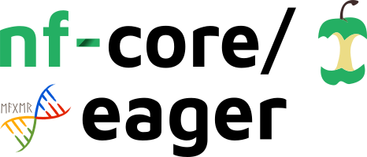
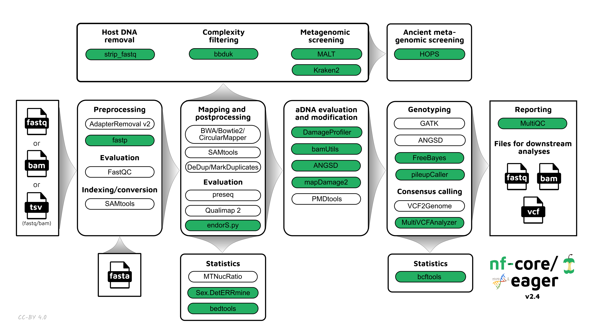

# 

**A fully reproducible and state-of-the-art ancient DNA analysis pipeline**.

[](https://github.com/nf-core/eager/actions)
[](https://github.com/nf-core/eager/actions)
[](https://www.nextflow.io/)
[](https://nf-co.re/)
[](https://zenodo.org/badge/latestdoi/135918251)

[](https://bioconda.github.io/)
[](https://hub.docker.com/r/nfcore/eager)


[](https://nfcore.slack.com/channels/eager)

## Introduction

<!-- nf-core: Write a 1-2 sentence summary of what data the pipeline is for and what it does -->
**nf-core/eager** is a bioinformatics best-practise analysis pipeline for NGS sequencing based ancient DNA (aDNA) data analysis.

The pipeline is built using [Nextflow](https://www.nextflow.io), a workflow tool to run tasks across multiple compute infrastructures in a very portable manner. It comes with docker containers making installation trivial and results highly reproducible. The pipeline pre-processes raw data from FASTQ inputs, or preprocessed BAM inputs. It can align reads and performs extensive general NGS and aDNA specific quality-control on the results. It comes with docker, singularity or conda containers making installation trivial and results highly reproducible.

<p align="center">
    

## Quick Start

1. Install [`nextflow`](https://nf-co.re/usage/installation) (version >= 20.04.0)

2. Install any of [`Docker`](https://docs.docker.com/engine/installation/), [`Singularity`](https://www.sylabs.io/guides/3.0/user-guide/), [`Podman`](https://podman.io/), [`Shifter`](https://nersc.gitlab.io/development/shifter/how-to-use/) or [`Charliecloud`](https://hpc.github.io/charliecloud/) for full pipeline reproducibility _(please only use [`Conda`](https://conda.io/miniconda.html) as a last resort; see [docs](https://nf-co.re/usage/configuration#basic-configuration-profiles))_

3. Download the pipeline and test it on a minimal dataset with a single command:

    ```bash
    nextflow run nf-core/eager -profile test_tsv,<docker/singularity/podman/shifter/charliecloud/conda/institute>
    ```

    > Please check [nf-core/configs](https://github.com/nf-core/configs#documentation) to see if a custom config file to run nf-core pipelines already exists for your Institute. If so, you can simply use `-profile <institute>` in your command. This will enable either `docker` or `singularity` and set the appropriate execution settings for your local compute environment.

4. Start running your own analysis!

    ```bash
    nextflow run nf-core/eager -profile <docker/singularity/podman/conda/institute> --input '*_R{1,2}.fastq.gz' --fasta '<your_reference>.fasta'
    ```

5. Once your run has completed successfully, clean up the intermediate files.

    ```bash
    nextflow clean -f -k
    ```

See [usage docs](https://nf-co.re/eager/docs/usage.md) for all of the available options when running the pipeline.

**N.B.** You can see an overview of the run in the MultiQC report located at `./results/MultiQC/multiqc_report.html`

Modifications to the default pipeline are easily made using various options as described in the documentation.

## Pipeline Summary

### Default Steps

By default the pipeline currently performs the following:

* Create reference genome indices for mapping (`bwa`, `samtools`, and `picard`)
* Sequencing quality control (`FastQC`)
* Sequencing adapter removal and for paired end data merging (`AdapterRemoval`)
* Read mapping to reference using (`bwa aln`, `bwa mem`, `CircularMapper`, or `bowtie2`)
* Post-mapping processing, statistics and conversion to bam (`samtools`)
* Ancient DNA C-to-T damage pattern visualisation (`DamageProfiler`)
* PCR duplicate removal (`DeDup` or `MarkDuplicates`)
* Post-mapping statistics and BAM quality control (`Qualimap`)
* Library Complexity Estimation (`preseq`)
* Overall pipeline statistics summaries (`MultiQC`)

### Additional Steps

Additional functionality contained by the pipeline currently includes:

#### Input

* Automatic merging of complex sequencing setups (e.g. multiple lanes, sequencing configurations, library types)

#### Preprocessing

* Illumina two-coloured sequencer poly-G tail removal (`fastp`)
* Automatic conversion of unmapped reads to FASTQ (`samtools`)
* Host DNA (mapped reads) stripping from input FASTQ files (for sensitive samples)

#### aDNA Damage manipulation

* Damage removal/clipping for UDG+/UDG-half treatment protocols (`BamUtil`)
* Damaged reads extraction and assessment (`PMDTools`)
* Nuclear DNA contamination estimation of human samples (`angsd`)

#### Genotyping

* Creation of VCF genotyping files (`GATK UnifiedGenotyper`, `GATK HaplotypeCaller` and `FreeBayes`)
* Creation of EIGENSTRAT genotyping files (`pileupCaller`)
* Creation of Genotype Likelihood files (`angsd`)
* Consensus sequence FASTA creation (`VCF2Genome`)
* SNP Table generation (`MultiVCFAnalyzer`)

#### Biological Information

* Mitochondrial to Nuclear read ratio calculation (`MtNucRatioCalculator`)
* Statistical sex determination of human individuals (`Sex.DetERRmine`)

#### Metagenomic Screening

* Low-sequenced complexity filtering (`BBduk`)
* Taxonomic binner with alignment (`MALT`)
* Taxonomic binner without alignment (`Kraken2`)
* aDNA characteristic screening of taxonomically binned data from MALT (`MaltExtract`)

#### Functionality Overview

A graphical overview of suggested routes through the pipeline depending on context can be seen below.

<p align="center">
    

## Documentation

The nf-core/eager pipeline comes with documentation about the pipeline: [usage](https://nf-co.re/eager/usage) and [output](https://nf-co.re/eager/output).

1. [Nextflow installation](https://nf-co.re/usage/installation)
2. Pipeline configuration
    * [Pipeline installation](https://nf-co.re/usage/local_installation)
    * [Adding your own system config](https://nf-co.re/usage/adding_own_config)
    * [Reference genomes](https://nf-co.re/usage/reference_genomes)
3. [Running the pipeline](https://nf-co.re/eager/docs/usage.md)
   * This includes tutorials, FAQs, and troubleshooting instructions
4. [Output and how to interpret the results](https://nf-co.re/eager/docs/output.md)

## Credits

This pipeline was mostly written by Alexander Peltzer ([apeltzer](https://github.com/apeltzer)) and [James A. Fellows Yates](https://github.com/jfy133), with contributions from [Stephen Clayton](https://github.com/sc13-bioinf), [Thiseas C. Lamnidis](https://github.com/TCLamnidis), [Maxime Borry](https://github.com/maxibor), [Zandra Fagernäs](https://github.com/ZandraFagernas), [Aida Andrades Valtueña](https://github.com/aidaanva) and [Maxime Garcia](https://github.com/MaxUlysse) and the nf-core community.

We thank the following people for their extensive assistance in the development
of this pipeline:

## Authors (alphabetical)

* [Aida Andrades Valtueña](https://github.com/aidaanva)
* [Alexander Peltzer](https://github.com/apeltzer)
* [James A. Fellows Yates](https://github.com/jfy133)
* [Judith Neukamm](https://github.com/JudithNeukamm)
* [Maxime Borry](https://github.com/maxibor)
* [Maxime Garcia](https://github.com/MaxUlysse)
* [Stephen Clayton](https://github.com/sc13-bioinf)
* [Thiseas C. Lamnidis](https://github.com/TCLamnidis)
* [Zandra Fagernäs](https://github.com/ZandraFagernas)

## Additional Contributors (alphabetical)

Those who have provided conceptual guidance, suggestions, bug reports etc.

* [Alexandre Gilardet](https://github.com/alexandregilardet)
* Arielle Munters
* [Charles Plessy](https://github.com/charles-plessy)
* [Åshild Vågene](https://github.com/ashildv)
* [Hester van Schalkwyk](https://github.com/hesterjvs)
* [Ido Bar](https://github.com/IdoBar)
* [Irina Velsko](https://github.com/ivelsko)
* [Katerine Eaton](https://github.com/ktmeaton)
* [Luc Venturini](https://github.com/lucventurini)
* [Marcel Keller](https://github.com/marcel-keller)
* [Pierre Lindenbaum](https://github.com/lindenb)
* [Pontus Skoglund](https://github.com/pontussk)
* [Raphael Eisenhofer](https://github.com/EisenRa)
* [Torsten Günter](https://bitbucket.org/tguenther/)
* [Kevin Lord](https://github.com/lordkev)
* [He Yu](https://github.com/paulayu)
* [Selina Carlhoff](https://github.com/scarlhoff)

If you've contributed and you're missing in here, please let us know and we will add you in of course!

## Contributions and Support

If you would like to contribute to this pipeline, please see the [contributing guidelines](.github/CONTRIBUTING.md).

For further information or help, don't hesitate to get in touch on the [Slack `#eager` channel](https://nfcore.slack.com/channels/eager) (you can join with [this invite](https://nf-co.re/join/slack)).

## Citations

If you use `nf-core/eager` for your analysis, please cite the `eager` preprint as follows:

> Fellows Yates JA, Lamnidis TC, Borry M, Valtueña Andrades A, Fagernäs Z, Clayton S, Garcia MU, Neukamm J, Peltzer A. 2021. Reproducible, portable, and efficient ancient genome reconstruction with nf-core/eager. PeerJ 9:e10947. DOI: [10.7717/peerj.10947](https://doi.org/10.7717/peerj.10947).

You can cite the eager zenodo record for a specific version using the following [doi: 10.5281/zenodo.3698082](https://zenodo.org/badge/latestdoi/135918251)

You can cite the `nf-core` publication as follows:

> **The nf-core framework for community-curated bioinformatics pipelines.**
>
> Philip Ewels, Alexander Peltzer, Sven Fillinger, Harshil Patel, Johannes Alneberg, Andreas Wilm, Maxime Ulysse Garcia, Paolo Di Tommaso & Sven Nahnsen.
>
> _Nat Biotechnol._ 2020 Feb 13. doi: [10.1038/s41587-020-0439-x](https://dx.doi.org/10.1038/s41587-020-0439-x).

In addition, references of tools and data used in this pipeline are as follows:

* **EAGER v1**, CircularMapper, DeDup* Peltzer, A., Jäger, G., Herbig, A., Seitz, A., Kniep, C., Krause, J., & Nieselt, K. (2016). EAGER: efficient ancient genome reconstruction. Genome Biology, 17(1), 1–14. [https://doi.org/10.1186/s13059-016-0918-z](https://doi.org/10.1186/s13059-016-0918-z).  Download: [https://github.com/apeltzer/EAGER-GUI](https://github.com/apeltzer/EAGER-GUI) and [https://github.com/apeltzer/EAGER-CLI](https://github.com/apeltzer/EAGER-CLI)
* **FastQC** Download: [https://www.bioinformatics.babraham.ac.uk/projects/fastqc/](https://www.bioinformatics.babraham.ac.uk/projects/fastqc/)
* **AdapterRemoval v2** Schubert, M., Lindgreen, S., & Orlando, L. (2016). AdapterRemoval v2: rapid adapter trimming, identification, and read merging. BMC Research Notes, 9, 88. [https://doi.org/10.1186/s13104-016-1900-2](https://doi.org/10.1186/s13104-016-1900-2). Download: [https://github.com/MikkelSchubert/adapterremoval](https://github.com/MikkelSchubert/adapterremoval)
* **bwa** Li, H., & Durbin, R. (2009). Fast and accurate short read alignment with Burrows-Wheeler transform. Bioinformatics , 25(14), 1754–1760. [https://doi.org/10.1093/bioinformatics/btp324](https://doi.org/10.1093/bioinformatics/btp324). Download: [http://bio-bwa.sourceforge.net/bwa.shtml](http://bio-bwa.sourceforge.net/bwa.shtml)
* **SAMtools** Li, H., Handsaker, B., Wysoker, A., Fennell, T., Ruan, J., Homer, N., … 1000 Genome Project Data Processing Subgroup. (2009). The Sequence Alignment/Map format and SAMtools. Bioinformatics , 25(16), 2078–2079. [https://doi.org/10.1093/bioinformatics/btp352](https://doi.org/10.1093/bioinformatics/btp352). Download: [http://www.htslib.org/](http://www.htslib.org/)
* **DamageProfiler** Neukamm, J., Peltzer, A., & Nieselt, K. (2020). DamageProfiler: Fast damage pattern calculation for ancient DNA. In Bioinformatics (btab190). [https://doi.org/10.1093/bioinformatics/btab190](https://doi.org/10.1093/bioinformatics/btab190). Download: [https://github.com/Integrative-Transcriptomics/DamageProfiler](https://github.com/Integrative-Transcriptomics/DamageProfiler)
* **QualiMap** Okonechnikov, K., Conesa, A., & García-Alcalde, F. (2016). Qualimap 2: advanced multi-sample quality control for high-throughput sequencing data. Bioinformatics , 32(2), 292–294. [https://doi.org/10.1093/bioinformatics/btv566](https://doi.org/10.1093/bioinformatics/btv566). Download: [http://qualimap.bioinfo.cipf.es/](http://qualimap.bioinfo.cipf.es/)
* **preseq** Daley, T., & Smith, A. D. (2013). Predicting the molecular complexity of sequencing libraries. Nature Methods, 10(4), 325–327. [https://doi.org/10.1038/nmeth.2375](https://doi.org/10.1038/nmeth.2375). Download: [http://smithlabresearch.org/software/preseq/](http://smithlabresearch.org/software/preseq/)
* **PMDTools** Skoglund, P., Northoff, B. H., Shunkov, M. V., Derevianko, A. P., Pääbo, S., Krause, J., & Jakobsson, M. (2014). Separating endogenous ancient DNA from modern day contamination in a Siberian Neandertal. Proceedings of the National Academy of Sciences of the United States of America, 111(6), 2229–2234. [https://doi.org/10.1073/pnas.1318934111](https://doi.org/10.1073/pnas.1318934111). Download: [https://github.com/pontussk/PMDtools](https://github.com/pontussk/PMDtools)
* **MultiQC** Ewels, P., Magnusson, M., Lundin, S., & Käller, M. (2016). MultiQC: summarize analysis results for multiple tools and samples in a single report. Bioinformatics , 32(19), 3047–3048. [https://doi.org/10.1093/bioinformatics/btw354](https://doi.org/10.1093/bioinformatics/btw354). Download: [https://multiqc.info/](https://multiqc.info/)
* **BamUtils** Jun, G., Wing, M. K., Abecasis, G. R., & Kang, H. M. (2015). An efficient and scalable analysis framework for variant extraction and refinement from population-scale DNA sequence data. Genome Research, 25(6), 918–925. [https://doi.org/10.1101/gr.176552.114](https://doi.org/10.1101/gr.176552.114). Download: [https://genome.sph.umich.edu/wiki/BamUtil](https://genome.sph.umich.edu/wiki/BamUtil)
* **FastP** Chen, S., Zhou, Y., Chen, Y., & Gu, J. (2018). fastp: an ultra-fast all-in-one FASTQ preprocessor. Bioinformatics , 34(17), i884–i890. [https://doi.org/10.1093/bioinformatics/bty560](https://doi.org/10.1093/bioinformatics/bty560). Download: [https://github.com/OpenGene/fastp](https://github.com/OpenGene/fastp)
* **GATK 3.5** DePristo, M. A., Banks, E., Poplin, R., Garimella, K. V., Maguire, J. R., Hartl, C., … Daly, M. J. (2011). A framework for variation discovery and genotyping using next-generation DNA sequencing data. Nature Genetics, 43(5), 491–498. [https://doi.org/10.1038/ng.806](https://doi.org/10.1038/ng.806.).Download: [https://console.cloud.google.com/storage/browser/gatk](https://console.cloud.google.com/storage/browser/gatk)
* **GATK 4.X** - no citation available yet. Download: [https://github.com/broadinstitute/gatk/releases](https://github.com/broadinstitute/gatk/releases)
* **VCF2Genome** - Alexander Herbig and Alex Peltzer (unpublished). Download: [https://github.com/apeltzer/VCF2Genome](https://github.com/apeltzer/VCF2Genome)
* **MultiVCFAnalyzer** Bos, K.I. et al., 2014. Pre-Columbian mycobacterial genomes reveal seals as a source of New World human tuberculosis. Nature, 514(7523), pp.494–497. Available at: [http://dx.doi.org/10.1038/nature13591](http://dx.doi.org/10.1038/nature13591). Download: [https://github.com/alexherbig/MultiVCFAnalyzer](https://github.com/alexherbig/MultiVCFAnalyzer)
* **MTNucRatioCalculator** Alex Peltzter (Unpublished). Download: [https://github.com/apeltzer/MTNucRatioCalculator](https://github.com/apeltzer/MTNucRatioCalculator)
* **Sex.DetERRmine.py** Lamnidis, T.C. et al., 2018. Ancient Fennoscandian genomes reveal origin and spread of Siberian ancestry in Europe. Nature communications, 9(1), p.5018. Available at: [http://dx.doi.org/10.1038/s41467-018-07483-5](http://dx.doi.org/10.1038/s41467-018-07483-5). Download: [https://github.com/TCLamnidis/Sex.DetERRmine.git](https://github.com/TCLamnidis/Sex.DetERRmine.git)
* **ANGSD** Korneliussen, T.S., Albrechtsen, A. & Nielsen, R., 2014. ANGSD: Analysis of Next Generation Sequencing Data. BMC bioinformatics, 15, p.356. Available at: [http://dx.doi.org/10.1186/s12859-014-0356-4](http://dx.doi.org/10.1186/s12859-014-0356-4). Download: [https://github.com/ANGSD/angsd](https://github.com/ANGSD/angsd)
* **bedtools** Quinlan, A.R. & Hall, I.M., 2010. BEDTools: a flexible suite of utilities for comparing genomic features. Bioinformatics , 26(6), pp.841–842. Available at: [http://dx.doi.org/10.1093/bioinformatics/btq033](http://dx.doi.org/10.1093/bioinformatics/btq033). Download: [https://github.com/arq5x/bedtools2/releases](https://github.com/arq5x/bedtools2/)
* **MALT**. Download: [https://software-ab.informatik.uni-tuebingen.de/download/malt/welcome.html](https://software-ab.informatik.uni-tuebingen.de/download/malt/welcome.html)
  * Vågene, Å.J. et al., 2018. Salmonella enterica genomes from victims of a major sixteenth-century epidemic in Mexico. Nature ecology & evolution, 2(3), pp.520–528. Available at: [http://dx.doi.org/10.1038/s41559-017-0446-6](http://dx.doi.org/10.1038/s41559-017-0446-6).
  * Herbig, A. et al., 2016. MALT: Fast alignment and analysis of metagenomic DNA sequence data applied to the Tyrolean Iceman. bioRxiv, p.050559. Available at: [http://biorxiv.org/content/early/2016/04/27/050559](http://biorxiv.org/content/early/2016/04/27/050559).
* **MaltExtract** Huebler, R. et al., 2019. HOPS: Automated detection and authentication of pathogen DNA in archaeological remains. bioRxiv, p.534198. Available at: [https://www.biorxiv.org/content/10.1101/534198v1?rss=1](https://www.biorxiv.org/content/10.1101/534198v1?rss=1). Download: [https://github.com/rhuebler/MaltExtract](https://github.com/rhuebler/MaltExtract)
* **Kraken2** Wood, D et al., 2019. Improved metagenomic analysis with Kraken 2. Genome Biology volume 20, Article number: 257. Available at: [https://doi.org/10.1186/s13059-019-1891-0](https://doi.org/10.1186/s13059-019-1891-0). Download: [https://ccb.jhu.edu/software/kraken2/](https://ccb.jhu.edu/software/kraken2/)
* **endorS.py** Aida Andrades Valtueña (Unpublished). Download: [https://github.com/aidaanva/endorS.py](https://github.com/aidaanva/endorS.py)
* **Bowtie2**  Langmead, B. and Salzberg, S. L. 2012 Fast gapped-read alignment with Bowtie 2. Nature methods, 9(4), p. 357–359. doi: [10.1038/nmeth.1923](https:/dx.doi.org/10.1038/nmeth.1923).
* **sequenceTools** Stephan Schiffels (Unpublished). Download: [https://github.com/stschiff/sequenceTools](https://github.com/stschiff/sequenceTools)
* **EigenstratDatabaseTools** Thiseas C. Lamnidis (Unpublished). Download: [https://github.com/TCLamnidis/EigenStratDatabaseTools.git](https://github.com/TCLamnidis/EigenStratDatabaseTools.git)
* **mapDamage2** Jónsson, H., et al 2013. mapDamage2.0: fast approximate Bayesian estimates of ancient DNA damage parameters. Bioinformatics , 29(13), 1682–1684. [https://doi.org/10.1093/bioinformatics/btt193](https://doi.org/10.1093/bioinformatics/btt193)
* **BBduk** Brian Bushnell (Unpublished). Download: [https://sourceforge.net/projects/bbmap/](sourceforge.net/projects/bbmap/)

## Data References

This repository uses test data from the following studies:

* Fellows Yates, J. A. et al. (2017) ‘Central European Woolly Mammoth Population Dynamics: Insights from Late Pleistocene Mitochondrial Genomes’, Scientific reports, 7(1), p. 17714. [doi: 10.1038/s41598-017-17723-1](https://doi.org/10.1038/s41598-017-17723-1).
* Gamba, C. et al. (2014) ‘Genome flux and stasis in a five millennium transect of European prehistory’, Nature communications, 5, p. 5257. [doi: 10.1038/ncomms6257](https://doi.org/10.1038/ncomms6257).
* Star, B. et al. (2017) ‘Ancient DNA reveals the Arctic origin of Viking Age cod from Haithabu, Germany’, Proceedings of the National Academy of Sciences of the United States of America, 114(34), pp. 9152–9157. [doi: 10.1073/pnas.1710186114](https://doi.org/10.1073/pnas.1710186114).
* de Barros Damgaard, P. et al. (2018). '137 ancient human genomes from across the Eurasian steppes.', Nature, 557(7705), 369–374. [doi: 10.1038/s41586-018-0094-2](https://doi.org/10.1038/s41586-018-0094-2)
