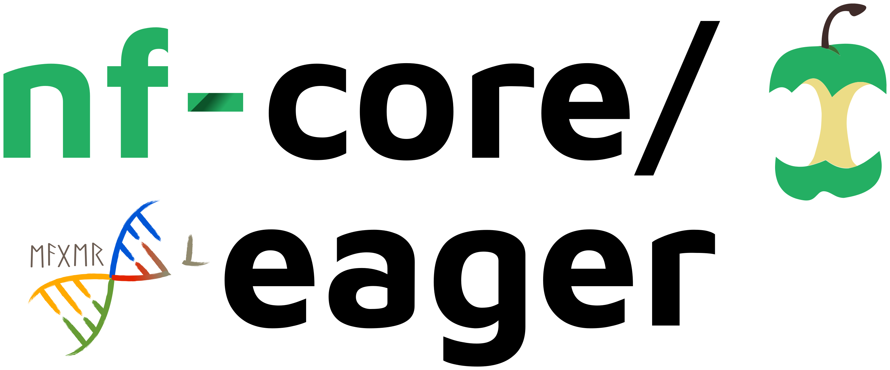

<h1>
  <picture>
    <source media="(prefers-color-scheme: dark)" srcset="docs/images/nf-core_eager_logo_outline_drop.png">
    
  </picture>
</h1>

[](https://github.com/nf-core/eager/actions/workflows/ci.yml)
[](https://github.com/nf-core/eager/actions/workflows/linting.yml)[](https://nf-co.re/eager/results)[](https://doi.org/10.5281/zenodo.XXXXXXX)
[](https://www.nf-test.com)

[](https://www.nextflow.io/)
[](https://docs.conda.io/en/latest/)
[](https://www.docker.com/)
[](https://sylabs.io/docs/)
[](https://cloud.seqera.io/launch?pipeline=https://github.com/nf-core/eager)

[](https://nfcore.slack.com/channels/eager)[](https://twitter.com/nf_core)[](https://mstdn.science/@nf_core)[](https://www.youtube.com/c/nf-core)

## Introduction

**nf-core/eager** is a scalable and reproducible bioinformatics best-practise processing pipeline for genomic NGS sequencing data, with a focus on ancient DNA (aDNA) data. It is ideal for the (palaeo)genomic analysis of humans, animals, plants, microbes and even microbiomes.

## Pipeline summary

<!-- TODO nf-core: Include a figure that guides the user through the major workflow steps. Many nf-core
     workflows use the "tube map" design for that. See https://nf-co.re/docs/contributing/design_guidelines#examples for examples.   -->
<!-- TODO nf-core: Fill in short bullet-pointed list of the default steps in the pipeline -->

- (Optionally) create reference genome indices for mapping (`bwa`, `samtools`, and `picard`)
- Sequencing quality control (`FastQC`, `Falco`)
- Sequencing adapter removal, paired-end data merging (`AdapterRemoval`)
- Read mapping to reference using (`bwa aln`, `bwa mem`, `CircularMapper`, `bowtie2`, or `mapAD`)
- Post-mapping processing, statistics and conversion to bam (`samtools`, and `preseq`)
- Ancient DNA C-to-T damage pattern visualisation (`DamageProfiler`)
- PCR duplicate removal (`DeDup` or `MarkDuplicates`)
- Post-mapping statistics and BAM quality control (`Qualimap`)
- Library Complexity Estimation (`preseq`)
- Overall pipeline statistics summaries (`MultiQC`)

### Additional Steps

Additional functionality contained by the pipeline currently includes:

#### Input

- Automatic merging of complex sequencing setups (e.g. multiple lanes, sequencing configurations, library types)

#### Preprocessing

- Illumina two-coloured sequencer poly-G tail removal (`fastp`)
- Post-AdapterRemoval trimming of FASTQ files prior mapping (`fastp`)
- Automatic conversion of unmapped reads to FASTQ (`samtools`)
- Host DNA (mapped reads) stripping from input FASTQ files (for sensitive samples)

#### aDNA Damage manipulation

- Damage removal/clipping for UDG+/UDG-half treatment protocols (`BamUtil`)
- Damaged reads extraction and assessment (`PMDTools`)
- Nuclear DNA contamination estimation of human samples (`angsd`)

#### Genotyping

- Creation of VCF genotyping files (`GATK UnifiedGenotyper`, `GATK HaplotypeCaller` and `FreeBayes`)
- Creation of EIGENSTRAT genotyping files (`pileupCaller`)
- Creation of Genotype Likelihood files (`angsd`)
- Consensus sequence FASTA creation (`VCF2Genome`)
- SNP Table generation (`MultiVCFAnalyzer`)

#### Biological Information

- Mitochondrial to Nuclear read ratio calculation (`MtNucRatioCalculator`)
- Statistical sex determination of human individuals (`Sex.DetERRmine`)

#### Metagenomic Screening

- Low-sequenced complexity filtering (`BBduk` or `PRINSEQ++`)
- Taxonomic binner with alignment (`MALT` or `MetaPhlAn 4`)
- Taxonomic binner without alignment (`Kraken2`,`KrakenUniq`)
- aDNA characteristic screening of taxonomically binned data from MALT (`MaltExtract`)

#### Functionality Overview

A graphical overview of suggested routes through the pipeline depending on context can be seen below.

<p align="center">
    

## Usage

> [!NOTE]
> If you are new to Nextflow and nf-core, please refer to [this page](https://nf-co.re/docs/usage/installation) on how to set-up Nextflow. Make sure to [test your setup](https://nf-co.re/docs/usage/introduction#how-to-run-a-pipeline) with `-profile test` before running the workflow on actual data.

First, prepare a samplesheet with your input data that looks as follows:

`samplesheet.tsv`:

```csv
ample_id	library_id	lane	colour_chemistry	pairment	strandedness	damage_treatment	r1	r2	bam	bam_reference_id
sample1	sample1_a	1	4	paired	double	none	/<path>/<to>/sample1_a_l1_r1.fq.gz /<path>/<to>/sample1_a_l1_r2.fq.gz	NA	NA
sample2	sample2_a	2	2	single	double	full	/<path>/<to>/sample2_a_l1_r1.fq.gz	NA	NA	NA
sample3	sample3_a	8	4	single	double	half	NA	NA	/<path>/<to>/sample31_a.bam	Mammoth_MT_Krause
```

Each row represents a fastq file (single-end), pair of fastq files (paired end), and/or a bam file.

Now, you can run the pipeline using:

```bash
nextflow run nf-core/eager \
   -profile <docker/singularity/.../institute> \
   --input samplesheet.csv \
   --fasta  '<your_reference>.fasta' \
   --outdir <OUTDIR>
```

> [!WARNING]
> Please provide pipeline parameters via the CLI or Nextflow `-params-file` option. Custom config files including those provided by the `-c` Nextflow option can be used to provide any configuration _**except for parameters**_; see [docs](https://nf-co.re/docs/usage/getting_started/configuration#custom-configuration-files).

For more details and further functionality, please refer to the [usage documentation](https://nf-co.re/eager/usage) and the [parameter documentation](https://nf-co.re/eager/parameters).

## Pipeline output

To see the results of an example test run with a full size dataset refer to the [results](https://nf-co.re/eager/results) tab on the nf-core website pipeline page.
For more details about the output files and reports, please refer to the
[output documentation](https://nf-co.re/eager/output).

## Credits

This pipeline was established by Alexander Peltzer ([apeltzer](https://github.com/apeltzer)) and [James A. Fellows Yates](https://github.com/jfy133). Version two had major contributions from [Stephen Clayton](https://github.com/sc13-bioinf), [Thiseas C. Lamnidis](https://github.com/TCLamnidis), [Maxime Borry](https://github.com/maxibor), [Zandra Fagernäs](https://github.com/ZandraFagernas), [Aida Andrades Valtueña](https://github.com/aidaanva) and [Maxime Garcia](https://github.com/MaxUlysse) and the nf-core community.

We thank the following people for their extensive assistance in the development of this pipeline:

- [Alex Hübner](https://github.com/alexhbnr)
- [Alexandre Gilardet](https://github.com/alexandregilardet)
- Arielle Munters
- [Åshild Vågene](https://github.com/ashildv)
- [Charles Plessy](https://github.com/charles-plessy)
- [Elina Salmela](https://github.com/esalmela)
- [Fabian Lehmann](https://github.com/Lehmann-Fabian)
- [He Yu](https://github.com/paulayu)
- [Hester van Schalkwyk](https://github.com/hesterjvs)
- [Ian Light-Máka](https://github.com/ilight1542)
- [Ido Bar](https://github.com/IdoBar)
- [Irina Velsko](https://github.com/ivelsko)
- [Işın Altınkaya](https://github.com/isinaltinkaya)
- [Johan Nylander](https://github.com/nylander)
- [Jonas Niemann](https://github.com/NiemannJ)
- [Katerine Eaton](https://github.com/ktmeaton)
- [Kathrin Nägele](https://github.com/KathrinNaegele)
- [Kevin Lord](https://github.com/lordkev)
- [Luc Venturini](https://github.com/lucventurini)
- [Mahesh Binzer-Panchal](https://github.com/mahesh-panchal)
- [Marcel Keller](https://github.com/marcel-keller)
- [Megan Michel](https://github.com/meganemichel)
- [Merlin Szymanski](https://github.com/merszym)
- [Pierre Lindenbaum](https://github.com/lindenb)
- [Pontus Skoglund](https://github.com/pontussk)
- [Raphael Eisenhofer](https://github.com/EisenRa)
- [Roberta Davidson](https://github.com/roberta-davidson)
- [Rodrigo Barquera](https://github.com/RodrigoBarquera)
- [Selina Carlhoff](https://github.com/scarlhoff)
- [Torsten Günter](https://bitbucket.org/tguenther)

## Contributions and Support

If you would like to contribute to this pipeline, please see the [contributing guidelines](.github/CONTRIBUTING.md).

For further information or help, don't hesitate to get in touch on the [Slack `#eager` channel](https://nfcore.slack.com/channels/eager) (you can join with [this invite](https://nf-co.re/join/slack)).

## Citations

If you use nf-core/eager for your analysis, please cite it using the following doi:

> Fellows Yates JA, Lamnidis TC, Borry M, Valtueña Andrades A, Fagernäs Z, Clayton S, Garcia MU, Neukamm J, Peltzer A. 2021. Reproducible, portable, and efficient ancient genome reconstruction with nf-core/eager. PeerJ 9:e10947. DOI: [10.7717/peerj.10947](https://doi.org/10.7717/peerj.10947).

An extensive list of references for the tools used by the pipeline can be found in the [`CITATIONS.md`](CITATIONS.md) file.

You can cite the `nf-core` publication as follows:

> **The nf-core framework for community-curated bioinformatics pipelines.**
>
> Philip Ewels, Alexander Peltzer, Sven Fillinger, Harshil Patel, Johannes Alneberg, Andreas Wilm, Maxime Ulysse Garcia, Paolo Di Tommaso & Sven Nahnsen.
>
> _Nat Biotechnol._ 2020 Feb 13. doi: [10.1038/s41587-020-0439-x](https://dx.doi.org/10.1038/s41587-020-0439-x).
