# nf-core/eager: Output

## Table of contents

* [Introduction](#introduction)
* [Directory Structure](#directory-structure)
* [MultiQC Report](#multiqc-report)
  * [General Stats Table](#general-stats-table)
  * [FastQC](#fastqc)
  * [FastP](#fastp)
  * [AdapterRemoval](#adapterremoval)
  * [Samtools](#samtools)
  * [DeDup](#dedup)
  * [Preseq](#preseq)
  * [QualiMap](#qualimap)
  * [DamageProfiler](#damageprofiler)
* [Output Files](#output-files)

## Introduction

The output of EAGER2 consists of two main components: output files (e.g. BAM or FASTQ files), and summary statistics of the whole run presented in a [`MultiQC`](https://multiqc.info) report. (Some) intermediate files and module-specific statstics files are also retained.

## Directory Structure

The directory structure of EAGER2 is as follows

```bash
results/
├── MultiQC/
├── <MODULE_1>/
├── <MODULE_2>/
├── <MODULE_3>/
├── pipeline_info/
└── reference_genome/
work/
```

* The parent directory `<RUN_OUTPUT_DIRECTORY` is the parent directory of the run, either the directory the pipeline was run from or as specified by the `--outdir` flag. The default name of the output directory (unless otherwise specified) will be `./results/`.

### Primary Output Directories

These directories are the ones you will use on a day-to-day basis and are those which you should familiarise yourself with.

* The `MultiQC` directory is the most important directory and contains the main summary report of the run in HTML format, which can be viewed in a web-browser of your choice. The sub-diectory contains the MultiQC collected data used to build the HTML report. The Report allows you to get an overview of the sequencing and mapping quality as well as aDNA metrics (see the [MultiQC Report](#multiqc-report) section for more detail).
* A `<MODULE>` directory contains the (cleaned-up) output from a particular software module. This is the second most important set of directories. This contains output files such as FASTQ, BAM, statistics, and/or plot files of a specific module (see the [Output Files](#output-files) section for more detail). The latter two are only needed when you need finer detail about that particular module.

### Secondary Output Directories

These are less important directories which are used less often, normally in the context of bug-reporting.

* `pipeline_info` contains back-end reporting of the pipeline itself such as run times and computational statistics. You rarely need this information other than for curiosity or when bug-reporting.
* `reference_genome` contains either text files describing the location of specified reference genomes, and if not already supplied when running the pipeline, auxilary indexing files. This is often useful when re-running other samples using the same reference genome, but is otherwise often not otherwise important.

* The `work` directory contains all the `nextflow` processing directories. This is where `nextflow` actually does all the work, but in an efficient programmatic procedure that is not intuitive to human-readers. Due to this, the directory is often not important to a user as all the useful output files are linked to the module directories (see above). Otherwise, this directory maybe useful when a bug-reporting. 

> :warning: Note that `work/` will be created wherever you are running the `nextflow run` command from, unless you specify the location with `-w`, i.e. it will not by default be in `outdir`!.

## MultiQC Report

In this section we will run through the output of each module as reported in a MultiQC output. This can be viewed by opening the HTML file in your `<RUN_OUTPUT_DIRECTORY>/MultiQC/` directory in a web browser. The section will also provide some basic tips on how to interpret the plots and values, although we highly recommend reading the READMEs or original papers of the tools used in the pipeline. A list of references can be seen on the [EAGER2 github repository](https://github.com/nf-core/eager/)

For more information about how to use MultiQC reports, see [http://multiqc.info](http://multiqc.info)

### General Stats Table

#### Background

This is the main summary table produced by MultiQC that the report begins with. This section of the Report is generated by MultiQC itself rather than stats produced by a specific module. It shows whatever each module considers to be as the 'most important' values to be displayed - however the EAGER2 version has been somewhat customised to make it as close to the EAGER1 ReportTable format as possible.

#### Table

This table will report values per-file (or rather per module log-file). It will try to collapse as far as possible, if the log files have the same name - however particularly for pre-AdapterRemoval FastQC, you will likely get duplicate lines for the same sample - i.e. R1 and R2 for each library.

Each column name is supplied by the module, so you may see similar column names. When unsure, hovering over the column name will allow you see which module it is derived from.

The default columns are as follows:

* **Sample Name** This is the log file name without the file suffix. This will depend on the module outputs.
* **Seqs** This is from Pre-AdapterRemoval FastQC. Represents the number of raw reads in your untrimmed and (paired end) unmerged FASTQ file. Each row should be approximately equal to the number of reads you requested to be sequenced, divided by the number of FASTQ files you received for that library.
* **Length** This is from Pre-AdapterRemoval FastQC. This is the average read length in your untrimmed and (paired end) unmerged FASTQ file and should represent the number of cycles of your sequencing chemistry.
* **%GC** This is from Pre-AdapterRemoval FastQC. This is the average GC content in percent of all the reads in your untrimmed and (paired end) unmerged FASTQ file.
* **GC content** This is from FastP. This is the average GC of all reads in your untrimmed and unmerged FASTSQ file after poly-G tail trimming. If you have lots of tails, this value should drop from the pre-AadapterRemoval FastQC  %GC column.
* **% Trimmed** This is from AdapterRemoval. It is the percentage of reads which had an adapter sequence removed from the end of the read.
* **Seqs** This is from Post-AdapterRemoval FastQC. Represents the number of preprocessed reads in your adapter trimmed (paired end) merged FASTQ file. The loss between this number and the Pre-AdapterRemoval FastQC can give you an idea of the quality of trimming and merging.
* **%GC** This is from Post-AdapterRemoval FastQC. Represents the average GC of all preprocessed reads in your adapter trimmed (paired end) merged FASTQ file.
* **Reads Mapped** This is from Samtools. This is the raw number of preprocessed reads mapped to your reference genome _prior_ map quality filtering and deduplication.
* **Reads Mapped** This is from Samtools. This is the raw number of preprocessed reads mapped to your reference genome _after_ map quality filtering and deduplication (note the column name does not distinguish itself from prior-map quality filtering, but the post-filter column is always second)
* **Endogenous DNA (%)** This is from the endorS.py tool. It displays a percentage of mapped reads over total reads that went into mapped (i.e. the percentage DNA content of the library that matches the reference). Assuming a perfect ancient sample with no modern contamination, this would be the the amount of true ancient DNA in the sample. However this value _most likely_ include contamination and will not entirely be the true 'endogenous' content.
* **Endogenous DNA Post (%)** This is from the endorS.py tool. It displays a percentage of mapped reads _after_ BAM filtering (e.g. for mapping quality) over total reads that went into mapped (i.e. the percentage DNA content of the library that matches the reference). This column will only be displayed if BAM filtering is turned on and is based on the original mapping for total reads, and mapped reads as calculated from the post-filtering BAM.
* **Duplication Rate** This is from DeDup. This is the percentage of overall number of mapped reads that were an exact duplicate of another read. The number of reads removed by DeDup can be calculating this number by mapped reads (if no map quality filtering was applied!)
* **Coverage** This is from Qualimap. This is the median number of times a base on your reference genome was covered by a read (i.e. depth coverage).. This average includes bases with 0 reads covering that position.
* **>= 1X** to **>= 5X** These are from Qualimap. This is the percentage of the genome covered at that particular depth coverage.
* **% GC** This is the mean GC content in percent of all mapped reads post-deduplication. This should normally be close to the GC content of your refernece genome.
* **% MTNUC** This is actually a ratio of the number of mitochondrial reads to the number of reads hitting autosomal chromosomes.
* **X Prime Y>Z N base** These columns are from DamageProfiler. The prime numbers represent which end of the reads the damage is referring to. The Y>Z is the type of substitution (C>T is the true damage, G>A is the complementary). You should see for no- and half- UDG treatment a decrease in frequency from the 1st to 2nd base.
* **Mean Read Length** This is from DamageProfiler. This is the mean length of all de-duplicated mapped reads. Ancient DNA normally will have a mean between 30-75, however this can vary.
* **Median Read Length** This is from DamageProfiler. This is the median length of all de-duplicated mapped reads. Ancient DNA normally will have a mean between 30-75, however this can vary.

### FastQC

#### Background

[FastQC](http://www.bioinformatics.babraham.ac.uk/projects/fastqc/) gives general quality metrics about your raw reads. It provides information about the quality score distribution across your reads, the per base sequence content (%T/A/G/C) as sequenced. You also get information about adapter contamination and other overrepresented sequences.

When dealing with ancient DNA data the MultiQC plots for FastQC will often show lots of 'warning' or 'failed' samples. You generally can discard this sort of information as we are dealing with very degraded and metagenomic samples which have artefacts that violate the FastQC 'quality definitions', while still being valid data for aDNA researchers. Instead you will _normally_ be looking for 'global' patterns across all samples of a sequencing run to check for library construction or sequencing failures. Decision on whether a individual sample has 'failed' or not should be made by the user after checking all the plots themselves (e.g. if the sample is consistently an outlier to all others in the run).

For further reading and documentation see the [FastQC help](http://www.bioinformatics.babraham.ac.uk/projects/fastqc/Help/).

> **NB:** The FastQC (pre-AdapterRemoval) plots displayed in the MultiQC report shows _untrimmed_ reads. They may contain adapter sequence and potentially regions with low quality. To see how your reads look after trimming, look at the FastQC reports in the FastQC (post-AdapterRemoval). You should expect after AdapterRemoval, that most of the artefacts are removed.

#### Sequence Counts

This shows a barplot with the overall number of sequences (x axis) in your raw library after demultiplexing, **per file** (y-axis).  If you have paired end data, you will have one bar for Read 1 (or forward), and a second bar for Read 2 (or reverse). Each entire bar should represent approximately what you requested from the sequencer itself - unless you have your library sequenced over multiple lanes, where it should be what you request divided by the number of lanes it was split over.

A section of the bar will also show an approximate estimation of the fraction of the total number of reads that are duplicates of another. This can derive from over-amplifcation of the library, or lots of single adapters. This can be later checked with the Deduplication check. A good library and sequencing run should have very low amounts of duplicates reads.

<p align="center">
  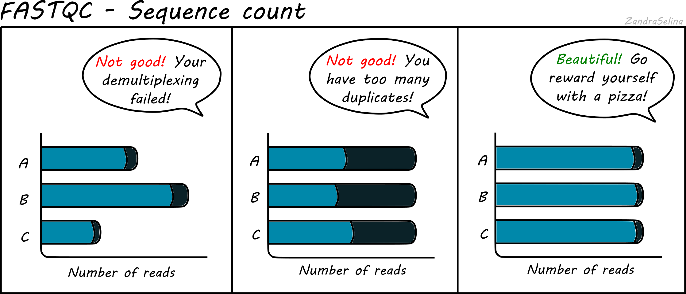
</p>

#### Sequence Quality Histograms

This line plot represents the Phred scores across each base pair of all the reads. The x-axis is the base position across each read, and the y-axis is the average base-calling score (Phred-scaled) of the nucleotides across all reads. Again, this is per FASTQ file (i.e. forward/reverse and/or lanes separately). The background colours represent approximate ranges of quality, with green section being acceptable quality, orange is dubious and red is bad.

You will often see that the first 5 or so bases have slightly lower quality than the rest of the read as this the calibration steps of the machine. The bulk of the read should then stay ~35. Do not worry if you see the last 10-20 bases of reads do often have lower quality base calls that the middle of the read, as the sequencing reagents start to deplete during these cycles (e.g. making nucleotide flourescence weaker). Furthermore, the reverse reads of sequencing data will often be even lower at ends than forward reads for the same reason.

<p align="center">
  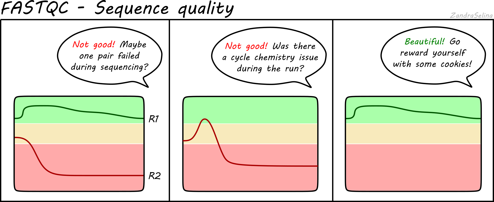
</p>

Things to watch out for:

* all positions having Phred scores less than 27
* a sharp drop-off of quality early in the read
* for paired-end data, if either R1 or R2 is significantly lower quality across the whole read compared to the complementary read.
  
#### Per Sequence Quality Scores

This is a further summary of the previous plot. This is a histogram of the _overall_ read quality (compared to per-base, above). The x axis is the mean read-quality score (summarising all the bases of the read in a single value), and the y-axis is the number of reads with this Phred score. You should see a peak with the majority of your reads between 27-35.

<p align="center">
  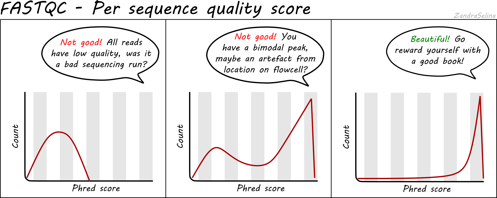
</p>

Things to watch out for:

* bi-modal peaks which suggests artefacts in some of the sequencing cycles
* all peaks being in orange or red sections which suggests an overall bad sequencing run (possibly due to a faulty flow-cell).
  
#### Per Base Sequencing Content

This is a heatmap which shows the average percentage of C, G, T, and A nucleotides across ~4bp bins across all reads.

You expect to see whole heatmap to be a relatively equal block of colour (normally black), representing an equal mix of A, C, T, G colors (see legend).

<p align="center">
  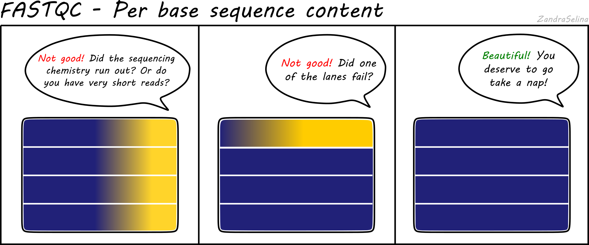
</p>

Things to watch out for:

* If you see a particular colour becoming more prominent this suggests there is an overrepresenation of those bases at that base-pair range across all reads (e.g. 20-24bp). This could happen if you have lots of PCR duplicates, or poly-G tails from Illumina NextSeq/NovaSeq 2-colour chemistry data (where no flouresence can mean both G or 'no-call').

> If you see Poly-G tails, we recommend to turn on FastP poly-G trimming with EAGER. See the 'running' documentation page for details.

#### Per Sequence GC Content

This line graph shows the number percentage reads (y-axis) with an average percent GC content (y-axis). In 'isolate' samples (i.e. majority of the reads should be from the host species of the sample), this should be represented by a sharp peak around the average percent GC content of the reference genome. In metagenomic contexts this should be a wide flat distribution with a mean around 50%, however this can be highly different for other types of data.

<p align="center">
  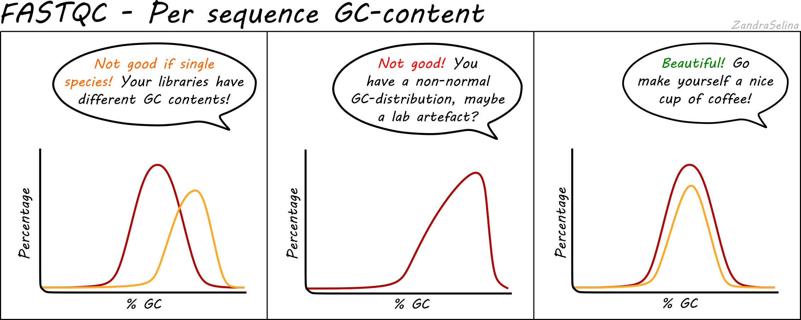
</p>

Things to watch out for:

* If you see particularly high percent GC content peak with NextSeq/NovaSeq data, you may have lots of PCR duplicates, or poly-G tails from Illumina NextSeq/NovaSeq 2-colour chemistry data (where no flouresence can mean both G or 'no-call'). Consider re-running EAGER2 using the poly-G trimming option from `fastp` See the 'running' documentation page for details.

#### Per Base N Content

This line graph shows you the average numbers of Ns found across all reads of a sample. Ns can be caused for a variety of reasons such as low-confidence base call, or the base has been masked. The lines should be very low (as close to 0 as possible) and generally be flat across the whole read. Increases in Ns may reflect in HiSeq data issues of the last cycles running out of chemistry.

<p align="center">
  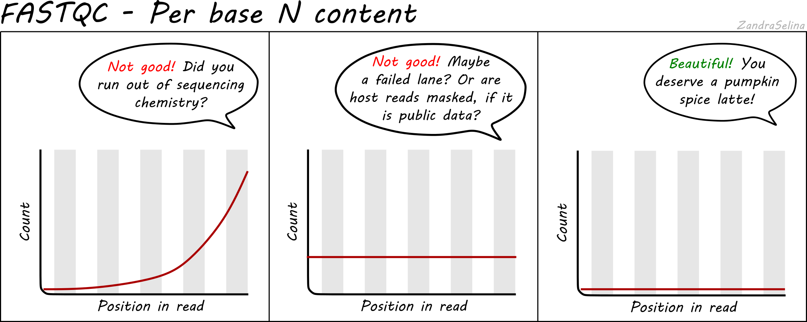
</p>

> **NB:** Publicly downloaded data may have extremely high N contents across all reads. These normally come from 'masked' reads that may have originally be, for example, from a human sample for microbial analysis where the consent for publishing of the host DNA was not given. In these cases you do not need to worry about this plot.

#### Sequence Duplication Levels

This plot is some-what similar to looking at duplication rate or 'cluster factor' of mapped reads. In this case however FastQC takes the sequences of the first 100 thousand reads of a library, and looks to see how often a read sequence is repeated in the rest of the library.

<p align="center">
  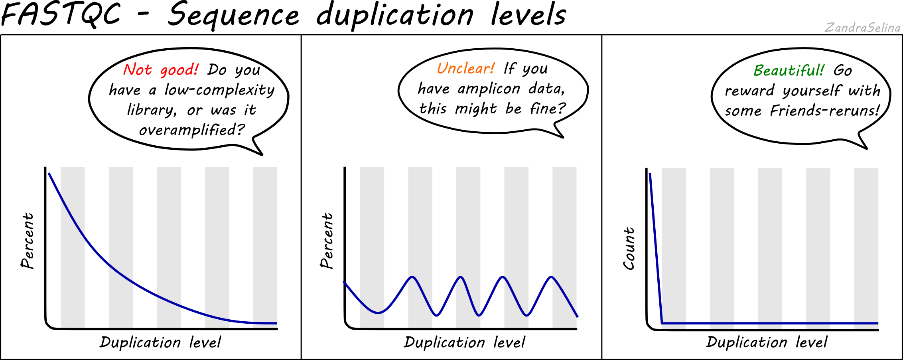
</p>

A good library should have very low rates of duplication (vast majority of reads having a duplication rate of 1) - suggesting 'high complexity' or lots of unique reads and useful data. This is represented as a steep drop in the line plot and possible a very small curve at about a duplication rate of 2 or 3 and then remaining at ~0 for higher duplication rates.

Note that good libraries may sometimes have small peaks at high duplication levels. This maybe due to free-adapters (with no inserts), or mono-nucleotide reads (e.g. GGGGG in NextSeq/NovaSeq data).

Bad libraries which have extremely low input DNA (so during amplification the same molecules been amplified repeatly), or a good library that has been erroneously over-amplified will show very high duplication levels - so a very slowly decreasing curve. Alternatively, if your library construction failed and many adapters were not ligated to insert molecules, a high duplication rate may be caused by these free-adapters (see 'Overrepresnted sequences' for more information).

> **NB:** Amplicon librares such as for 16S rRNA analysis may appear here as having high duplication rates and these peaks can be ignored. This can be verified if no contaminants are found in the 'Overrepresented sequences' section.

#### Overrepresented sequences

After identifying duplicates (see the previous section), a table will be displayed in the 'Overrepresented sequences' section of the report. This is an attempt by FastQC to check to see if the duplicates identified match common contaminants such as free adapters or mono-nucleotide reads.

You can then use this table help inform you in identification where the problem occured in the construction and sequencing of this library. E.g. if you have high duplication rates but no identified contaminants, this suggests over-amplification of reads rather than left over adapters.

#### Adapter Content

This plot shows the percentage of reads (y-axis), which has an adapter starting at a particular position along a read (x-axis). There can be muliple lines per sample as each line represents a particular adapter.

It is common in aDNA libraries to see very rapid increases in the proportion of reads with an adapter 'early on' in the read, as by nature aDNA molecules are fragmented and very short. Palaeolithic samples can have reads as short as 25bp, so sequences can already start having adapters 25bp into a read.

This can already give you an indication on the authenticity of your library - as if you see very low proportions of reads with adapters this suggests long insert molecules that are less likely to derive from a 'true' aDNA library. On the flipside, if you are working with modern DNA - it can give an indication of over-sonication if you have artificially fragmented your reads to lower than your target molecule length.

<p align="center">
  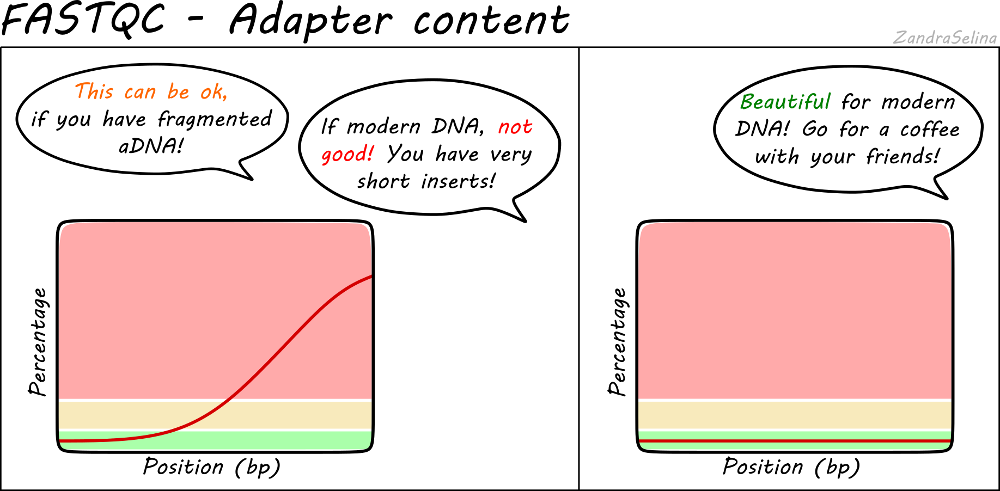
</p>

### FastP

#### Background

FastP is a general pre-processing toolkit for Illumina sequencing data. In EAGER2 we currently only use the 'poly-G' trimming function. Poly-G tails occur at ends of reads when using two-colour chemistry kits (i.e. in NextSeq and NovaSeq). This occurs as 'no fluorescence' is interpreted by the machine; however if the chemistry runs or the read is shorter than the number of cycles in the kit, you will get at the ends of reads lots of cycles with no nucleotides and these are then recorded as Gs.

While the machine should detect a reduction in base-calling quality, this is not always the case and you will retain these tails in your FASTQ files. This can cause skews in GC content and false positive SNP calls when the reference genome has long mono-nucleotide stretches (typically in larger eukaryotic genomes).

In the case of dual-indexed paired-end sequencing, it is likely poly-G tails are less of an issue as during your adaperRemoval step, anything passed the adapter will be clipped off anyway. However you can check this under the 'Per Sequence GC Content' plot in FastQC.

> **NB:** As you are more likely to see this at the end of the run, in paired-end data you should see all 'Read 2' data having a higher GC content distribution than the 'Read 1'

While the MultiQC report has multiple plots for FastP, we will only look at GC content as that's the functionality we use currently.

#### GC Content

This line plot shows the average GC content (Y axis) across each nucleotide of the reads (X-axis). There are two buttons per read (i.e. 2 for single-end, and 4 for paired-end) representing before and after the poly-G tail trimming.

Before filtering, if you have poly-G tails, you should see the lines going up  at the end of the right-hand side of the plot.

After filtering, you should see that the average GC content along the reads is now reduced to around the general trend of the entire read.

Things to look out for:

* If you see a distinct GC content increase at the end of the reads, but are not removed after filtering, check to see where along the read the increase seems to start. If it is less than 10 base pairs from the end, consider reducing the overlap parameter `--complexity_filter_poly_g_min`, which tells FastP how far in the read the Gs need to go before removing them.

### AdapterRemoval

#### Background

AdapterRemoval a tool that does the post-sequencing clean up of your sequencing reads. It performs the following functions

* 'Merges' (or 'collapses') forward and reverse reads of Paired End data
* Removes remaining library indexing adapters
* Trims low quality base tails from ends of reads
* Removes too-short reads

In more detail merging is where the same read from the forward and reverse files of a single library (based on the flowcell coordinates), are compared to find a stretch of sequence that are the same. If this overlap reaches certain quality thresholds, the two reads are 'collapsed' into a single read, with the base quality scores are updated accordingly accounting for the increase quality call precision.

Adapter removal involves finding overlaps at the 5' and 3' end of reads for the artificial NGS library adapters (which connect the DNA molecule insert, and the index), and stretches that match each other are then removed from the read itself.  Note, by default AdapterRemoval does _not_ remove 'internal barcodes' (between insert and the adapter), so these statistics are not considered.

Quality trimming (or 'truncating') involves looking at ends of reads for low-confidence bases (i.e. where the FASTQ Phred score is below a certain threshold). These are then removed remove the read.

Length filtering involves removing any read that does not reach the number of bases specified by a particular value.

#### Retained and Discarded Reads Plot

These stacked bars plots are unfortunately a little confusing, when displayed in MultiQC. However are relatively straight-forward once you understand each category. They can be displayed as counts of reads per AdapterRemoval read-category, or as percentages of the same values. Each forward(/reverse) file combination are displayed once.

The most important value is the **Retained Read Pairs** which gives you the final number of reads output into the file that goes into mapping. Note, however, this section of the stack bar _includes_ the other categories displayed (see below) in the calculation.

Other Categories:

* If paired-end, the **Singleton [mate] R1(/R2)** cateogries represent reads which were unable to be collapsed, possibly due to the reads being too long to overlap.
* If paired-end, **Full-length collapsed pairs** are reads which were collapsed and did not require low-quality bases at end of reads to be removed.
* If paired-end, **Truncated collapsed pairs** are paired-end that were collapsed but did required the removal of low quality bases at the end of reads.
* **Discarded [mate] R1/R2** represent reads which were a part of a pair, but one member of the pair did not reach other quality criteria and weas discarded. However the other member of the pair is still retained in the output file as it still reached other quality criteria.

<p align="center">
  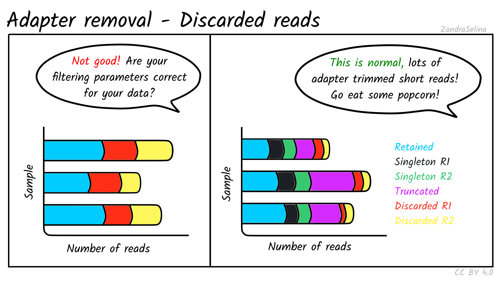
</p>
  
For ancient DNA, assuming a good quality run, you expect to see a the vast majority of your reads overlapping because we have such fragmented molecules. Large numbers of singletons suggest your molecules are too long and may not represent true ancient DNA.

If you see high numbers of discarded or truncated reads, you should check your FastQC results for low sequencing quality of that particular run.

#### Length Distribution Plot

The length distribution plots show the number of reads at each read-length. You can change the plot to display different cateogories.

* All represent the overall distribution of reads. In the case of paired-end sequencing You may see a peak at the turn around from forward to reverse cycles.
* **Mate 1** and **Mate 2** represents the length of the forward and reverse read respectively prior collapsing
* **Singleton** represent those reads that had a one member of a pair discarded
* **Collapsed** and **Collapsed Truncated** represent reads that overlapped and able to merge into a single read, with the latter including base-quality trimming off ends of reads. These plots will start with a vertical rise representing where you are above the minimum-read threshold you set.
* **Discarded** here represents the number of reads that did not each the read length filter. You will likely see a vertical drop at what your threshold was set to.

<p align="center">
  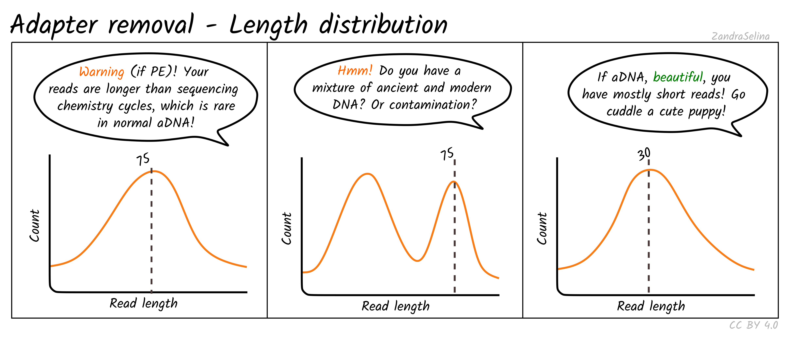
</p>

With paired-end ancient DNA sequencing runs You expect to see a slight increase in shorter fragments in the reverse (R2) read, as our fragments are so short we often don't reach the maximum number of cycles of that particular sequencing run.

### Samtools

#### Background

This module provides numbers in raw counts of the mapping of your DNA reads to your reference genome.

#### Flagstat Plot

This dot plot shows different statistics, and the number of reads (typically as an multiple e.g. million, or thousands), are represented by dots on the X axis.

In most cases the first two rows, 'Total Reads' and 'Total Passed QC' will be the same as EAGER does not do quality control of reads with samtools. This number should normally be the same the number of (clipped, and if paired-end, merged) retained reads coming out of AdapterRemoval.

The third row 'Mapped' represents the number of reads that found a place that could be aligned on your reference genome. This is the raw number of mapped reads, prior PCR duplication.

The remaining rows will be 0 when running `bwa aln` as these characteristucs of the data are not considered by the algorithm by default.

<p align="center">
  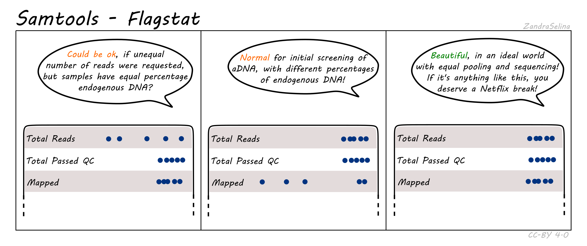
</p>

> **NB:** The Samtools (pre-samtools filter) plots displayed in the MultiQC report shows mapped reads without mapping quality filtering. This will contain reads that can map to multiple places on your reference genome with equal or slightly less mapping quality score. To see how your reads look after mapping quality, look at the FastQC reports in the Samtools (pre-samtools filter). You should expect after mapping quality filtering, that you will have less reads.

### DeDup

#### Background

DeDup is a duplicate removal tool which searchs for PCR duplicates and removes them from your BAM file. We remove these duplicates because otherwise you would be artificially increasing your coverage and subsequently confidence in genotyping, by considering these lab artefacts which are not biologically meaningful. DeDup looks for reads with the same start and end coordinates, and whether they have exactly the same sequence. The main difference of DeDup versus e.g. `samtools markduplicates` is that DeDup considers _both_ ends of a read, not just the start position, so it is more precise in removing actual duplicates without penalising often already low aDNA data.

#### DeDup Plot

This stacked bar plot shows as a whole the total number of reads in the BAM file going into DeDup. The different sections of a given bar represents the following:

* **Not Removed** - the overall number of reads remaining after duplicate removal. These may have had a duplicate (see below).
* **Reverse Removed** - the number of reads that found to be a duplicate of another and removed that were un-collapsed reverse reads (from the earlier read merging step).
* **Forward Removed** - the number of reads that found to be a duplicate of another and removed that were an un-collapsed forward reads (from the earlier read merging step).
* **Merged Removed** - the number of reads that were found to be a duplicate and removed that were a collapsed read (from the earlier read merging step).
  
Exceptions to the above:

* If you do not have paired end data, you will not have sections for 'Merged removed' or 'Reverse removed'.
* If you use the `--dedup_all_merged` flag, you will not have the 'Forward removed' or 'Reverse removed' sections.

<p align="center">
  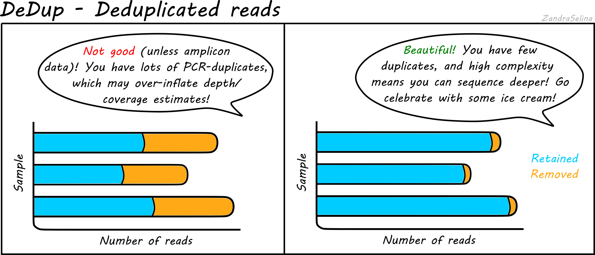
</p>

Things to look out for:

* The smaller the number of the duplicates removed the better. If you have a smaller number of duplicates, and wish to sequence deeper, you can use the preseq module (see below) to make an estimate on how much deeper to sequence.
* If you have a very large number of duplicates that were removed this may suggest you have an over amplified library, or a lot of left-over adapters that were able to map to your genome.

### Preseq

#### Background

Preseq is a collection of tools that allow assessment of the complexity of the library, where complexity means the number of unique molecules in your library (i.e. not molecules with the exact same length and sequence).

There are two algorithms from the tools we use: `c_curve` and `lc_extrap`. The former gives you the expected number of unique reads if you were to repeated sequencing but with fewer reads than your first sequencing run. The latter tries to extrapolate the decay in the number of unique reads you would get with re-sequencing but with more reads than your initial sequencing run.

Due to endogenous DNA being so low when doing initial screening, the maths behind `lc_extrap` often fails as there is not enough data. Therefore EAGER2 sticks with `c_curve` which gives a similar approximation of the library complexity, but is more robust to smaller datasets..

#### Complexity Curve

Using the de-duplication information from DeDup, the calculated curve (a solid line) allows you to estimate: at this sequencing depth (on the X axis), how many unique molecules would you have sequenced (along the Y axs). When you start getting DNA sequences that are the mostly same as ones you've sequenced before, it is often not cost effective to continue sequencing and is a good point to stop.

The dashed line represents a 'perfect' library containing only unique molecules and no duplicates. You are looking for your library stay as close to this line as possible. Plateauing of your curve shows that at that point you would not be getting any more unique molecules and you shouldn't sequence further than this.

<p align="center">
  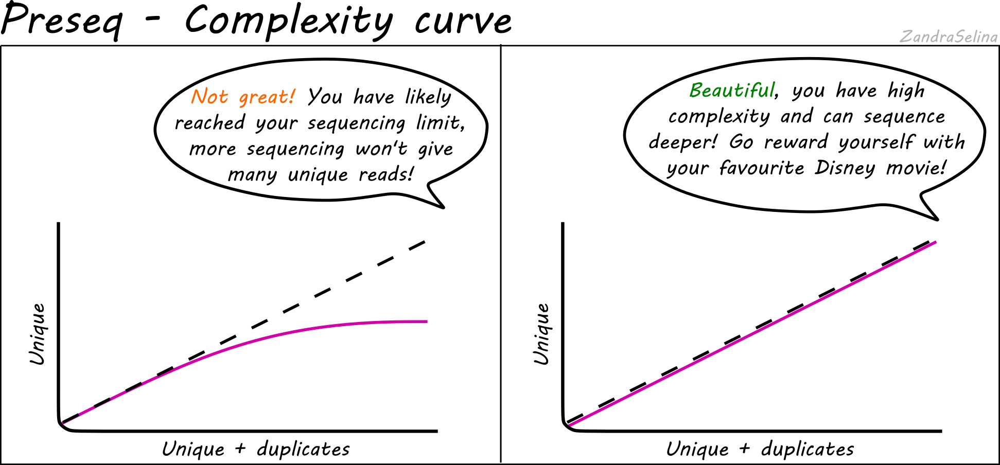
</p>

Plateauing can be caused by a number of reasons:

* You have simply sequenced your library to exhaustion
* You have an over-amplified library with many PCR duplicates. You should consider rebuilding the library to maximise data to cost ratio
* You have a low quality library made up of mappable seuqencing artefacts that were able to pass filtering (e.g. adapters)

### QualiMap

#### QualiMap

Qualimap is a tool which provides statistics on the quality of the mapping of your reads to your reference genome. It allows you to assess how well covered your reference genome is by your data, both in 'fold' depth (average number of times a given base on the ference is covered by a read) and 'percentage' (the percentage of all bases on the reference genome that is covered at a given fold depth). These outputs allow you to make decision if you have enough quality data for downstream applications like genotyping, and how to adjust the parameters for those tools accordingly.

> NB: Neither fold coverage nor percent coverage on there own is sufficient enough to asssess whether you have a high quality mapping. Abnormally high fold coverages of a smaller region such as highly conserved genes or unremoved-adapter-containing reference genomes can artifically inflate the mean coverage, yet a high percent coverage is not useful if all bases of the genome are covered at just 1x coverage.

Note that many of the statistics from this module are displayed in the General Stats table (see above), as they represent single values that are not plottable.

#### Coverage Histogram

This plot shows on the Y axis the range of fold coverages that the bases of the reference genome are possibly covered by. The Y axis shows the number of bases that were covered at the given fold coverage depth as indicated on the Y axis.

The greater the number of bases covered at as high as possible fold coverage, the better.

<p align="center">
  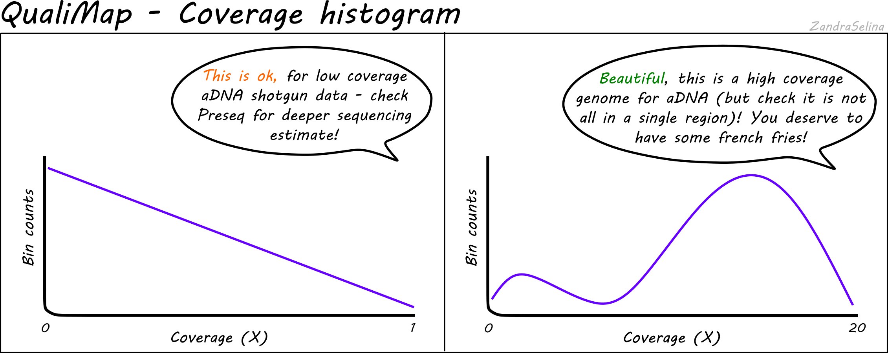
</p>

Things to watch out for:

* You will typically see a direct decay from the lowest coverage to higher. A large range of coverages along the X axis is potentially suspicious.
* If you have stacking of reads i.e. a small region with an abnormally large amount of reads despite the rest of the reference being quite shallowly covered, this will artifically increase your coverage. This would be represented by a small peak that is a much further along the X axis away from the main distribution of reads.
  
#### Cumulative Genome Coverage

This plot shows how much of the genome in percentage (X axis) is covered by a given fold depth coverage (Y axis).

An ideal plot for this is to see an increasing curve, representing larger greater fractions of the genome being increasingly covered at higher depth. However, for low-coverage ancient DNA data, it will be more likely to see decreasing curves starting at a large percentage of the genome being covered at 0 fold coverage.

<p align="center">
  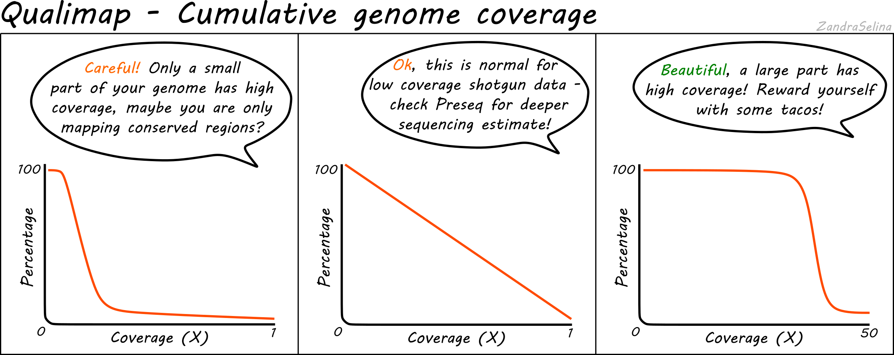
</p>

#### GC Content Distribution

This plot shows the distirbution of th frequency of reads at different GC contents. The X axis represents the GC content (i.e the percentage of Gs and Cs nucleotides in a given read), the Y axis represents a frequency.

<p align="center">
  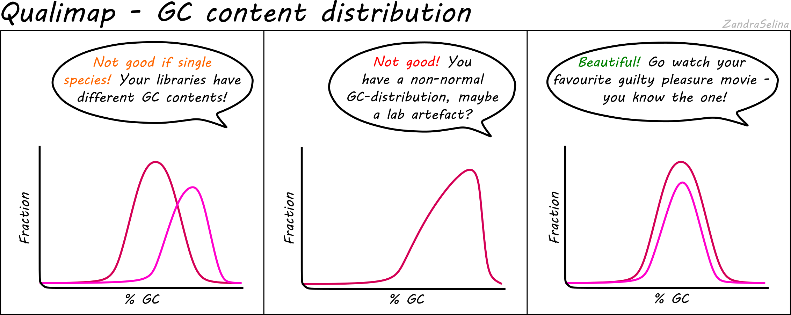
</p>

Things to watch out for:

* This plot should normally show a normal distribution around the average GC content of your reference genome.
* Binomial peaks may represent lab-based artefacts that should be further investigated.
* Skews of the peak to a higher GC content that the refernence in Illumina dual-colour chemistry data (e.g. NextSeq or NovaSeq), may suggest long poly-G tails that are mapping to poly-G stretches of your genome. The EAGER2 trimming option `--complexity_filter_poly_g` can be used to remove these tails by utilising the tool FastP for detection and trimming.
  
### DamageProfiler

#### Background

DamageProfiler is a tool which calculates a variety of standard 'aDNA' metrics from a BAM file. The primary plots here are the misincorporation and length distribution plots. Ancient DNA undergoes depurination and hydrolysis, causing fragmentation of molecules into gradually shorter fragments, and cytosine to thymine deamination damage, that occur on the subsequent single-stranded overhangs at the ends of molecules.

Therefore, three main characteristics of ancient DNA are:

* Short DNA fragments
* Elevated G and As (purines) just before strand breaks
* Increased C and Ts at ends of fragments
  
#### Misincorporation Plots

The MultiQC DamageProfiler module misincorporation plots shows the percent frequency (Y axis) of C to T mismatches at 5' read ends and complementary G to A mismatches at the 3' ends. The X axis represents base pairs from the end of the molecule from the given prime end, going into the middle of the molecule i.e. 1st base of molecule, 2nd base of molecule etc until the 14th base pair. The mismatches are when compared to the base of the reference genome at that position.

When looking at the misincorporation plots, keep the following in mind:

* As few-base single-stranded overhangs are more likely to occur than long overhangs, we expect to see a gradual decrease in the frequency of the modifications from position 1 to the inside of the reads.
* If your library has been **partially-UDG treated**, only the first one or two bases will display the the misincorporation frequency.
* If your library has been **UDG treated** you will expect to see extremely-low to no misincorporations at read ends.
* If your library is **single-stranded**, you will expect to see only C to T misincorporations at both 5' and 3' ends of the fragments.
* We generally expect that the older the sample, or the less-ideal preservational environtment (hot/wet) the greater the frequency of C to T/G to A.
* The curve will be not smooth then you have few reads informing the frequency calculation. Read counts of less than 500 are likely not reliable.

<p align="center">
  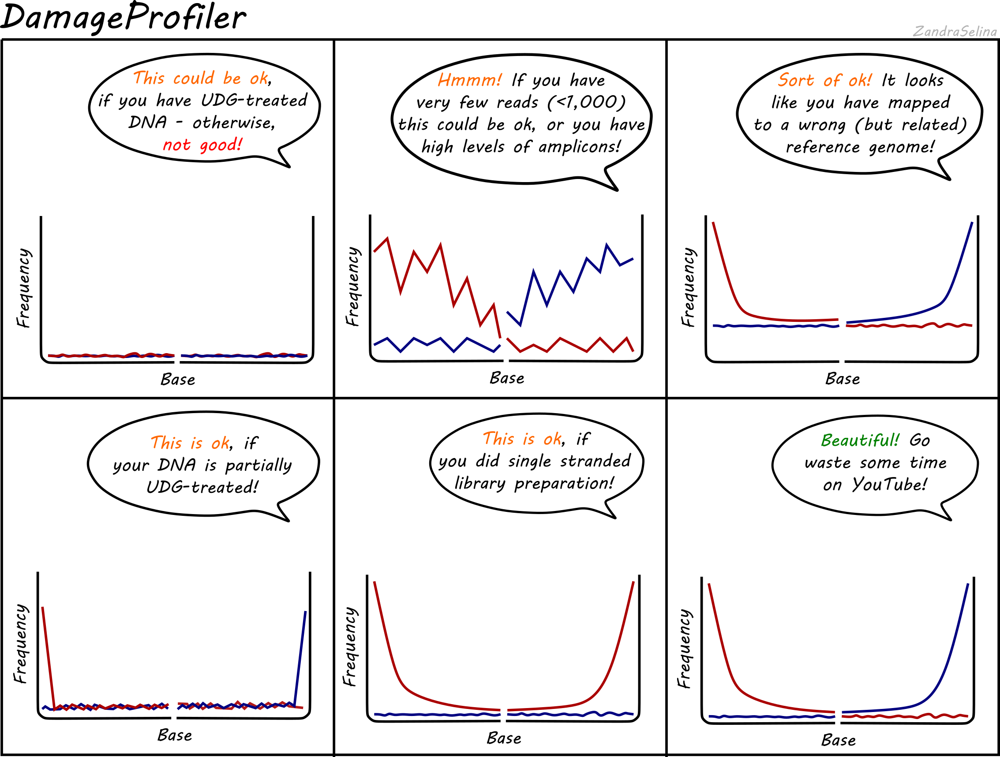
</p>

> **NB:** An important difference to note compared to the MapDamage tool, which DamageProfiler is an exact-reimplmentation of, is that the percent frequency on the Y axis is not fixed between 0 and 0.3, and will 'zoom' into small values the less damage there is

#### Length Distribution

The MultiQC DamageProfiler module length distribution plots show the frequency of read lengths across forward and reverse reads respectively.

When looking at the length distribution plots, keep in mind the following:

* Your curves will likely not start at 0, and will start wherever your minimum read-length setting was when removing adapters.
* You should typically see the bulk of the distribution falling between 40-120bp, which is normal for aDNA
* You may see large peaks at paired-end turn arounds, due to very-long reads that could not overlap for merging being present, however this reads are normally from modern contamination.
  
## Output Files

This section gives a brief summary of where to look for what files for downstream analysis.

Each module has it's own output directory which sit alongside the `MultiQC/` directory from which you opened the report.

* `reference_genome/` - this directory contains the indexing files  of your input reference genome (i.e. the various `bwa` indices, a `samtools`' `.fai` file, and a picard `.dict`), if you used the `--saveReference` flag.
* `FastQC/` - this contains the original per-FASTQ FastQC reports that are summarised with MultiQC. These occur in both `html` (the report) and `.zip` format (raw data). The `after_clipping` folder contains the same but for after AdapterRemoval.
* `read_merging/` - this contains the log files (ending with `.settings`) with raw trimming (and merging) statistics after AdapterRemoval. In the `output` sub-directory, are the output trimmed (and merged) FASTQ files. These you can use for downstream applications such as taxonomic binning for metagenomic studies.
* `mapping/` - this contains a sub-directory corresponding to the mapping tool you used, inside of which will be the initial BAM files containing the reads that mapped to your reference genome with no modification (see below). You will also find a corresponding BAM index file (ending in `.csi` or `.bam`). You can use these for downstream applications e.g. if you wish to use a different de-duplication tool not included in EAGER2 (although please feel free to add a new module request on the Github repository's [issue page](https://github.com/nf-core/eager/issues)!).
* `samtools/` - this contains two sub-directories. `stats/` contain the raw mapping statistics files (ending in `.stats`) from directly after mapping. `filter/` contains BAM files that have had a mapping quality filter applied (set by the `--bam_mapping_quality_threshold` flag) and a corresponding index file. Furthermore, if you selected `--bam_discard_unmapped`, you will find your separate file with only unmapped reads in the format you selected. Note unmapped read BAM files will _not_ have an index file.
* `deduplication/` - this contains a sub-directory called `dedup/`, inside here are sample specific directories. Each directory contains a BAM file containing mapped reads but with PCR duplicates removed, a corresponding index file and two stats file. `.hist.` contains raw data for a deduplication histogram used for tools like preseq (see below), and the `.log` contains overall summary dedupliction statistics.
* `endorSpy/` - this contains all JSON files exported from the endorSpy endogenous DNA calculation tool. The JSON files are generated specifically for display in the MultiQC general statistics table and is otherwise very likely not useful for you.
* `preseq/` - this contains a `.ccurve` file for every BAM file that had enough deduplication statistics to generate a complexity curve for estimating the amount unique reads that will be yield if the library is re-sequenced. You can use this file for plotting e.g. in `R` to find your sequencing target depth.
* `qualimap/` - this contains a sub-directory for every sample, which includes a qualimap report and associated raw statistic files. You can open the `.html` file in your internet browser to see the in-depth report (this will be more detailed than in MultiQC). This includes stuff like percent coverage, depth coverage, GC content and so on of your mapped reads.
* `damageprofiler/` - this contains sample specific directories containing raw statistics and damage plots from DamageProfiler. The `.pdf` files can be used to visualise C to T miscoding lesions or read length distributions of your mapped reads. All raw statistics used for the PDF plots are contained in the `.txt` files.
* `pmdtools/` this contains raw output statistics of pmdtools (estimates of frequencies of subsititutions), and BAM files which have been filtered to remove reads that do not have a Post-mortem damage (PMD) score of `--pmdtools_threshold`. The BAM files do not have corresponding index files.
* `trimmed_bam/` this contains the BAM files with X number of bases trimmed off as defined with the `--bamutils_clip_left` and `--bamutils_clip_right` flags and corresponding index files. You can use these BAM files for downstream analysis such as re-mapping data with more stringent parameters (if you set trimming to remove the most likely places containing damage in the read).
* `genotyping/` this contains all the (gzipped) VCF files produced by your genotyping module. The file suffix will have the genotyping tool name. You will have VCF files corresponding to your deduplicated BAM files, as well as any turned-on downstream processes that create BAMs (e.g. trimmed bams or pmd tools).
* `MultiVCFAnalyzer/` this contains all output from MultiVCFAnalyzer, including SNP calling statistics, various SNP table(s) and FASTA alignment files.
* `sex_determination/` this contains the output for the sex determination run. This is a single `.tsv` file that includes a table with the Sample Name, the Nr of Autosomal SNPs, Nr of SNPs on the X/Y chromosome, the Nr of reads mapping to the Autosomes, the Nr of reads mapping to the X/Y chromosome, the relative coverage on the X/Y chromosomes, and the standard error associated with the relative coverages. These measures are provided for each bam file, one row per bam. If the `sexdeterrmine_bedfile` option has not been provided, the error bars cannot be trusted, and runtime will be considerably longer.
* `nuclear_contamination/` this contains the output of the nuclear contamination processes. The directory contains one `*.X.contamination.out` file per individual, as well as `nuclear_contamination.txt` which is a summary table of the results for all individual. `nuclear_contamination.txt` contains a header, followed by one line per individual, comprised of the Method of Moments (MOM) and Maximum Likelihood (ML) contamination estimate (with their respective standard errors) for both Method1 and Method2.
* `bedtools/` this contains two files as the output from bedtools coverage. One file contains the 'breadth' coverage (`*.breadth.gz`). This file will have the contents of your annotation file (e.g. BED/GFF), and the following subsequent columns: no. reads on feature, # bases at depth, length of feature, and % of feature. The second file (`*.depth.gz`), contains the contents of your annotation file (e.g. BED/GFF), and an additional column which is mean depth coverage (i.e. average number of reads covering each position).
* `metagenomic_classification/` This contains the output for a given metagenomic classifer.
  * Malt will contain RMA6 files that can be loaded into MEGAN6 or MaltExtract for phylogenetic visualisation of read taxonomic assignments and aDNA characteristics respectively. Additional a `malt.log` file is provided which gives additional information such as run-time, memory usage and per-sample statistics of numbers of alignments with taxonomic assignment etc.
  * Kraken will contain the Kraken output and report files, as well as a merged Taxon count table.
* `MaltExtract/` this will contain a `results` directory in which contains the output from MaltExtract - typically one folder for each filter type, an error and a log file. The characteristics of each node (e.g. damage, read lengths, edit distances - each in different txt formats) can be seen in each sub-folder of the filter folders. Output can be visualised either with the [HOPS postprocessing script](https://github.com/rhuebler/HOPS) or [MEx-IPA](https://github.com/jfy133/MEx-IPA)
* `consensus_sequence` this contains three FASTA files from VCF2Genome, of a consensus sequence based on the reference FASTA with each sample's unique modifications. The main FASTA is a standard file with bases not passing the specified thresholds as Ns. The two other FASTAS (`_refmod.fasta.gz`) and (`_uncertainity.fasta.gz`) are IUPAC uncertainty codes (rather than Ns) and a special number-based uncertainity system used for other downstream tools, respectively.
