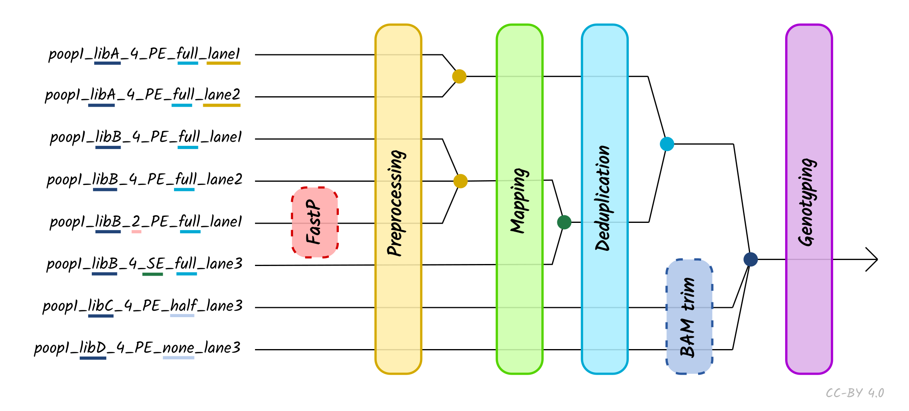

# nf-core/eager: Usage

## Table of contents

<!-- TOC -->

- [nf-core/eager: Usage](#nf-coreeager-usage)
  - [Table of contents](#table-of-contents)
  - [Running the pipeline](#running-the-pipeline)
    - [Quick Start](#quick-start)
    - [Updating the pipeline](#updating-the-pipeline)
    - [Reproducibility](#reproducibility)
    - [Automatic Resubmission](#automatic-resubmission)
  - [Core Nextflow arguments](#core-nextflow-arguments)
    - [`-profile`](#-profile)
    - [`-resume`](#-resume)
    - [`-c`](#-c)
      - [Custom resource requests](#custom-resource-requests)
      - [`-name`](#-name)
    - [Running in the background](#running-in-the-background)
      - [Nextflow memory requirements](#nextflow-memory-requirements)
  - [Pipeline Options](#pipeline-options)
    - [Input](#input)
      - [`--input`](#--input)
        - [Direct Input Method](#direct-input-method)
        - [TSV Input Method](#tsv-input-method)
      - [`--udg_type`](#--udg_type)
      - [`--single_stranded`](#--single_stranded)
      - [`--single_end`](#--single_end)
      - [`--colour_chemistry`](#--colour_chemistry)
      - [`--bam`](#--bam)
    - [Input Data Additional Options](#input-data-additional-options)
      - [`--snpcapture_bed`](#--snpcapture_bed)
      - [`--run_convertinputbam`](#--run_convertinputbam)
    - [References](#references)
      - [`--fasta`](#--fasta)
      - [`--genome` (using iGenomes)](#--genome-using-igenomes)
      - [`--bwa_index`](#--bwa_index)
      - [`--bt2_index`](#--bt2_index)
      - [`--fasta_index`](#--fasta_index)
      - [`--seq_dict`](#--seq_dict)
      - [`--large_ref`](#--large_ref)
      - [`--save_reference`](#--save_reference)
    - [Output](#output)
      - [`--outdir`](#--outdir)
      - [`-w / -work-dir`](#-w---work-dir)
      - [`--publish_dir_mode`](#--publish_dir_mode)
    - [Other run specific parameters](#other-run-specific-parameters)
      - [`--max_memory`](#--max_memory)
      - [`--max_time`](#--max_time)
      - [`--max_cpus`](#--max_cpus)
      - [`--email`](#--email)
      - [`--email_on_fail`](#--email_on_fail)
      - [`--plaintext_email`](#--plaintext_email)
      - [`--monochrome_logs`](#--monochrome_logs)
      - [`--multiqc_config`](#--multiqc_config)
      - [`--custom_config_version`](#--custom_config_version)
    - [Step skipping parameters](#step-skipping-parameters)
      - [`--skip_fastqc`](#--skip_fastqc)
      - [`--skip_adapterremoval`](#--skip_adapterremoval)
      - [`--skip_preseq`](#--skip_preseq)
      - [`--skip_deduplication`](#--skip_deduplication)
      - [`--skip_damage_calculation`](#--skip_damage_calculation)
      - [`--skip_qualimap`](#--skip_qualimap)
    - [Complexity Filtering Options](#complexity-filtering-options)
      - [`--complexity_filter_poly_g`](#--complexity_filter_poly_g)
      - [`--complexity_filter_poly_g_min`](#--complexity_filter_poly_g_min)
    - [Adapter Clipping and Merging Options](#adapter-clipping-and-merging-options)
      - [`--clip_forward_adaptor`](#--clip_forward_adaptor)
      - [`--clip_reverse_adaptor`](#--clip_reverse_adaptor)
      - [`--clip_readlength`](#--clip_readlength)
      - [`--clip_min_read_quality`](#--clip_min_read_quality)
      - [`--clip_min_adap_overlap`](#--clip_min_adap_overlap)
      - [`--skip_collapse`](#--skip_collapse)
      - [`--skip_trim`](#--skip_trim)
      - [`--preserve5p`](#--preserve5p)
      - [`--mergedonly`](#--mergedonly)
    - [Read Mapping Parameters](#read-mapping-parameters)
      - [`--mapper`](#--mapper)
      - [BWA (default)](#bwa-default)
        - [`--bwaalnn`](#--bwaalnn)
        - [`--bwaalnk`](#--bwaalnk)
        - [`--bwaalnl`](#--bwaalnl)
      - [CircularMapper](#circularmapper)
        - [`--circularextension`](#--circularextension)
        - [`--circulartarget`](#--circulartarget)
        - [`--circularfilter`](#--circularfilter)
      - [Bowtie2](#bowtie2)
        - [`--bt2_alignmode`](#--bt2_alignmode)
        - [`--bt2_sensitivity`](#--bt2_sensitivity)
        - [`--bt2n`](#--bt2n)
        - [`--bt2l`](#--bt2l)
        - [`-bt2_trim5`](#-bt2_trim5)
        - [`-bt2_trim3`](#-bt2_trim3)
    - [Mapped Reads Stripping](#mapped-reads-stripping)
      - [`--strip_input_fastq`](#--strip_input_fastq)
      - [`--strip_mode`](#--strip_mode)
    - [Read Filtering and Conversion Parameters](#read-filtering-and-conversion-parameters)
      - [`--run_bam_filtering`](#--run_bam_filtering)
      - [`--bam_mapping_quality_threshold`](#--bam_mapping_quality_threshold)
      - [`--bam_filter_minreadlength`](#--bam_filter_minreadlength)
      - [`--bam_unmapped_type`](#--bam_unmapped_type)
    - [Read DeDuplication Parameters](#read-deduplication-parameters)
      - [`--dedupper`](#--dedupper)
      - [`--dedup_all_merged`](#--dedup_all_merged)
    - [Library Complexity Estimation Parameters](#library-complexity-estimation-parameters)
      - [`--preseq_step_size`](#--preseq_step_size)
    - [DNA Damage Assessment Parameters](#dna-damage-assessment-parameters)
      - [`--damageprofiler_length`](#--damageprofiler_length)
      - [`--damageprofiler_threshold`](#--damageprofiler_threshold)
      - [`--damageprofiler_yaxis`](#--damageprofiler_yaxis)
      - [`--run_pmdtools`](#--run_pmdtools)
      - [`--pmdtools_range`](#--pmdtools_range)
      - [`--pmdtools_threshold`](#--pmdtools_threshold)
      - [`--pmdtools_reference_mask`](#--pmdtools_reference_mask)
      - [`--pmdtools_max_reads`](#--pmdtools_max_reads)
    - [Feature Annotation Statistics](#feature-annotation-statistics)
      - [`--run_bedtools_coverage`](#--run_bedtools_coverage)
      - [`--anno_file`](#--anno_file)
    - [BAM Trimming Parameters](#bam-trimming-parameters)
      - [`--run_trim_bam`](#--run_trim_bam)
      - [`--bamutils_clip_half_udg_left` / `--bamutils_clip_half_udg_right`](#--bamutils_clip_half_udg_left----bamutils_clip_half_udg_right)
      - [`--bamutils_clip_none_udg_left` / `--bamutils_clip_none_udg_right`](#--bamutils_clip_none_udg_left----bamutils_clip_none_udg_right)
      - [`--bamutils_softclip`](#--bamutils_softclip)
    - [Genotyping Parameters](#genotyping-parameters)
      - [`--run_genotyping`](#--run_genotyping)
      - [`--genotyping_tool`](#--genotyping_tool)
      - [`--genotyping_source`](#--genotyping_source)
      - [`--gatk_ug_jar`](#--gatk_ug_jar)
      - [`--gatk_call_conf`](#--gatk_call_conf)
      - [`--gatk_ploidy`](#--gatk_ploidy)
      - [`--gatk_downsample`](#--gatk_downsample)
      - [`--gatk_dbsnp`](#--gatk_dbsnp)
      - [`--gatk_hc_out_mode`](#--gatk_hc_out_mode)
      - [`--gatk_hc_emitrefconf`](#--gatk_hc_emitrefconf)
      - [`--gatk_ug_out_mode`](#--gatk_ug_out_mode)
      - [`--gatk_ug_genotype_model`](#--gatk_ug_genotype_model)
      - [`--gatk_ug_keep_realign_bam`](#--gatk_ug_keep_realign_bam)
      - [`--gatk_ug_gatk_ug_defaultbasequalities`](#--gatk_ug_gatk_ug_defaultbasequalities)
      - [`--freebayes_C`](#--freebayes_c)
      - [`--freebayes_g`](#--freebayes_g)
      - [`--freebayes_p`](#--freebayes_p)
      - [`--pileupcaller_bedfile`](#--pileupcaller_bedfile)
      - [`--pileupcaller_snpfile`](#--pileupcaller_snpfile)
      - [`--pileupcaller_method`](#--pileupcaller_method)
      - [`--pileupcaller_transitions_mode`](#--pileupcaller_transitions_mode)
      - [`--angsd_glmodel`](#--angsd_glmodel)
      - [`--angsd_glformat`](#--angsd_glformat)
      - [`--angsd_createfasta`](#--angsd_createfasta)
      - [`--angsd_fastamethod`](#--angsd_fastamethod)
    - [Consensus Sequence Generation](#consensus-sequence-generation)
      - [`--run_vcf2genome`](#--run_vcf2genome)
      - [`--vcf2genome_outfile`](#--vcf2genome_outfile)
      - [`--vcf2genome_header`](#--vcf2genome_header)
      - [`--vcf2genome_minc`](#--vcf2genome_minc)
      - [`--vcf2genome_minq`](#--vcf2genome_minq)
      - [`--vcf2genome_minfreq`](#--vcf2genome_minfreq)
    - [SNP Table Generation](#snp-table-generation)
      - [`--run_multivcfanalyzer`](#--run_multivcfanalyzer)
      - [`--write_allele_frequencies`](#--write_allele_frequencies)
      - [`--min_genotype_quality`](#--min_genotype_quality)
      - [`--min_base_coverage`](#--min_base_coverage)
      - [`--min_allele_freq_hom`](#--min_allele_freq_hom)
      - [`--min_allele_freq_het`](#--min_allele_freq_het)
      - [`--additional_vcf_files`](#--additional_vcf_files)
      - [`--reference_gff_annotations`](#--reference_gff_annotations)
      - [`--reference_gff_exclude`](#--reference_gff_exclude)
      - [`--snp_eff_results`](#--snp_eff_results)
    - [Mitochondrial to Nuclear Ratio](#mitochondrial-to-nuclear-ratio)
      - [`--run_mtnucratio`](#--run_mtnucratio)
      - [`--mtnucratio_header`](#--mtnucratio_header)
    - [Human Sex Determination](#human-sex-determination)
      - [`--run_sexdeterrmine`](#--run_sexdeterrmine)
      - [`--sexdeterrmine_bedfile`](#--sexdeterrmine_bedfile)
    - [Human Nuclear Contamination](#human-nuclear-contamination)
      - [`--run_nuclear_contamination`](#--run_nuclear_contamination)
      - [`--contamination_chrom_name`](#--contamination_chrom_name)
    - [Metagenomic Screening](#metagenomic-screening)
      - [`--run_metagenomic_screening`](#--run_metagenomic_screening)
      - [`--metagenomic_tool`](#--metagenomic_tool)
      - [`--database`](#--database)
      - [`--metgenomic_min_support_reads`](#--metgenomic_min_support_reads)
      - [`--percent_identity`](#--percent_identity)
      - [`--malt_mode`](#--malt_mode)
      - [`--malt_alignment_mode`](#--malt_alignment_mode)
      - [`--malt_top_percent`](#--malt_top_percent)
      - [`--malt_min_support_mode`](#--malt_min_support_mode)
      - [`--malt_min_support_percent`](#--malt_min_support_percent)
      - [`--malt_max_queries`](#--malt_max_queries)
      - [`--malt_memory_mode`](#--malt_memory_mode)
    - [Metagenomic Authentication](#metagenomic-authentication)
      - [`--run_maltextract`](#--run_maltextract)
      - [`--maltextract_taxon_list`](#--maltextract_taxon_list)
      - [`--maltextract_ncbifiles`](#--maltextract_ncbifiles)
      - [`--maltextract_filter`](#--maltextract_filter)
      - [`--maltextract_toppercent`](#--maltextract_toppercent)
      - [`--maltextract_destackingoff`](#--maltextract_destackingoff)
      - [`--maltextract_downsamplingoff`](#--maltextract_downsamplingoff)
      - [`--maltextract_duplicateremovaloff`](#--maltextract_duplicateremovaloff)
      - [`--maltextract_matches`](#--maltextract_matches)
      - [`--maltextract_megansummary`](#--maltextract_megansummary)
      - [`--maltextract_percentidentity`](#--maltextract_percentidentity)
      - [`maltextract_topalignment`](#maltextract_topalignment)
    - [Clean up](#clean-up)
  - [Troubleshooting and FAQs](#troubleshooting-and-faqs)
    - [My pipeline update doesn't seem to do anything](#my-pipeline-update-doesnt-seem-to-do-anything)
    - [Warning about sticked on revision](#warning-about-sticked-on-revision)
    - [Input files not found](#input-files-not-found)
    - [I am only getting output for a single sample although I specified multiple with wildcards](#i-am-only-getting-output-for-a-single-sample-although-i-specified-multiple-with-wildcards)
    - [The pipeline crashes almost immediately with an early pipeline step](#the-pipeline-crashes-almost-immediately-with-an-early-pipeline-step)
      - [I am running Docker](#i-am-running-docker)
      - [I am running Singularity](#i-am-running-singularity)
    - [The pipeline has crashed with an error but Nextflow is still running](#the-pipeline-has-crashed-with-an-error-but-nextflow-is-still-running)
    - [I get a file name collision error during merging](#i-get-a-file-name-collision-error-during-merging)
    - [I specified a module and it didn't produce the expected output](#i-specified-a-module-and-it-didnt-produce-the-expected-output)
    - [I get a unable to acquire lock](#i-get-a-unable-to-acquire-lock)
  - [Tutorials](#tutorials)
    - [Tutorial - How to investigate a failed run](#tutorial---how-to-investigate-a-failed-run)
      - [1a Nextflow reports an 'error executing process' with command error](#1a-nextflow-reports-an-error-executing-process-with-command-error)
      - [1b Nextflow reports an 'error executing process' with no command error](#1b-nextflow-reports-an-error-executing-process-with-no-command-error)
      - [2 Investigating an failed process's `work/` directory](#2-investigating-an-failed-processs-work-directory)
    - [Tutorial - What are Profiles and How To Use Them](#tutorial---what-are-profiles-and-how-to-use-them)
      - [Tutorial Profiles - Background](#tutorial-profiles---background)
      - [Tutorial Profiles - Inheritance Rules](#tutorial-profiles---inheritance-rules)
        - [Tutorial Profiles - Profiles](#tutorial-profiles---profiles)
        - [Tutorial Profiles - Configuration Files](#tutorial-profiles---configuration-files)
      - [Tutorial Profiles - Writing your own profile](#tutorial-profiles---writing-your-own-profile)
    - [Tutorial - How to set up nf-core/eager for human population genetics](#tutorial---how-to-set-up-nf-coreeager-for-human-population-genetics)
      - [Tutorial Human Pop-Gen - Introduction](#tutorial-human-pop-gen---introduction)
      - [Tutorial Human Pop-Gen - Preparation](#tutorial-human-pop-gen---preparation)
      - [Tutorial Human Pop-Gen - Inputs and Outputs](#tutorial-human-pop-gen---inputs-and-outputs)
      - [Tutorial Human Pop-Gen - Pipeline Configuration](#tutorial-human-pop-gen---pipeline-configuration)
      - [Tutorial Human Pop-Gen - Results](#tutorial-human-pop-gen---results)
        - [Tutorial Human Pop-Gen - MultiQC Report](#tutorial-human-pop-gen---multiqc-report)
        - [Tutorial Human Pop-Gen - Files for Downstream Analysis](#tutorial-human-pop-gen---files-for-downstream-analysis)
      - [Tutorial Human Pop-Gen - Clean up](#tutorial-human-pop-gen---clean-up)
      - [Summary](#summary)
    - [Tutorial - How to set up nf-core/eager for metagenomic screening](#tutorial---how-to-set-up-nf-coreeager-for-metagenomic-screening)
      - [Tutorial Metagenomics - Introduction](#tutorial-metagenomics---introduction)
      - [Tutorial Metagenomics - Preparation](#tutorial-metagenomics---preparation)
      - [Tutorial Metagenomics - Inputs and Outputs](#tutorial-metagenomics---inputs-and-outputs)
      - [Tutorial Metagenomics - Pipeline Configuration](#tutorial-metagenomics---pipeline-configuration)
      - [Tutorial Metagenomics - Results](#tutorial-metagenomics---results)
        - [Tutorial Metagenomics - MultiQC Report](#tutorial-metagenomics---multiqc-report)
        - [Tutorial Metagenomics - Files for Downstream Analysis](#tutorial-metagenomics---files-for-downstream-analysis)
      - [Tutorial Metagenomics - Clean up](#tutorial-metagenomics---clean-up)
      - [Tutorial Metagenomics - Summary](#tutorial-metagenomics---summary)
    - [Tutorial - How to set up nf-core/eager for pathogen screening](#tutorial---how-to-set-up-nf-coreeager-for-pathogen-screening)
      - [Tutorial Pathogens - Introduction](#tutorial-pathogens---introduction)
      - [Tutorial Pathogens - Preparation](#tutorial-pathogens---preparation)
      - [Tutorial Pathogens - Inputs and Outputs](#tutorial-pathogens---inputs-and-outputs)
      - [Tutorial Pathogens - Pipeline Configuration](#tutorial-pathogens---pipeline-configuration)
      - [Tutorial Pathogens - Results](#tutorial-pathogens---results)
        - [Tutorial Pathogens - MultiQC Report](#tutorial-pathogens---multiqc-report)
        - [Tutorial Pathogens - Files for Downstream Analysis](#tutorial-pathogens---files-for-downstream-analysis)
      - [Tutorial Pathogens - Clean up](#tutorial-pathogens---clean-up)
      - [Tutorial Pathogens - Summary](#tutorial-pathogens---summary)

<!-- /TOC -->

## Running the pipeline

### Quick Start

> Before you start you should change into the output directory you wish your
> results to go in. When you start the nextflow job, it will place all the log
> files and 'working' folders in the current directory and NOT necessarily the
> directory the output files will be in.

The typical command for running the pipeline is as follows:

```bash
nextflow run nf-core/eager --input '*_R{1,2}.fastq.gz' --fasta 'some.fasta' -profile standard,docker
```

where the reads are from libraries of the same pairing.

This will launch the pipeline with the `docker` configuration profile. See below
for more information about profiles.

Note that the pipeline will create the following files in your working
directory:

```bash
work            # Directory containing the nextflow working files
results         # Finished results (configurable, see below)
.nextflow.log   # Log file from Nextflow
               \# Other nextflow hidden files, eg. history of pipeline runs and old logs.
```

To see the the nf-core/eager pipeline help message run: `nextflow run
nf-core/eager --help`

If you want to configure your pipeline interactively using a graphical user
interface, please visit [https://nf-co.re/launch](https://nf-co.re/launch),
select the `eager` pipeline and the version you intend to run and follow the
on-screen instructions to create a config for your pipeline run.

### Updating the pipeline

When you run the above command, Nextflow automatically pulls the pipeline code
from GitHub and stores it as a cached version. When running the pipeline after
this, it will always use the cached version if available - even if the pipeline
has been updated since. To make sure that you're running the latest version of
the pipeline, make sure that you regularly update the cached version of the
pipeline:

```bash
nextflow pull nf-core/eager
```

### Reproducibility

It's a good idea to specify a pipeline version when running the pipeline on your
data. This ensures that a specific version of the pipeline code and software are
used when you run your pipeline. If you keep using the same tag, you'll be
running the same version of the pipeline, even if there have been changes to the
code since.

First, go to the [nf-core/eager releases
page](https://github.com/nf-core/eager/releases) and find the latest version
number - numeric only (eg. `2.2.0`). Then specify this when running the pipeline
with `-r` (one hyphen) - eg. `-r 2.2.0`.

This version number will be logged in reports when you run the pipeline, so that
you'll know what you used when you look back in the future.

Additionally, nf-core/eager pipeline releases are named after Swabian German
Cities. The first release V2.0 is named "Kaufbeuren". Future releases are named
after cities named in the [Swabian league of
Cities](https://en.wikipedia.org/wiki/Swabian_League_of_Cities).

### Automatic Resubmission

By default, if a pipeline step fails, nf-core/eager will resubmit the job with
twice the amount of CPU and memory. This will occur two times before failing.

## Core Nextflow arguments

> **NB:** These options are part of Nextflow and use a _single_ hyphen (pipeline
> parameters use a double-hyphen).

### `-profile`

Use this parameter to choose a configuration profile. Profiles can give
configuration presets for different compute environments.

Several generic profiles are bundled with the pipeline which instruct the
pipeline to use software packaged using different methods (Docker, Singularity,
Conda) - see below.

> We highly recommend the use of Docker or Singularity containers for full
> pipeline reproducibility, however when this is not possible, Conda is also
> supported.

The pipeline also dynamically loads configurations from
[https://github.com/nf-core/configs](https://github.com/nf-core/configs) when it
runs, making multiple config profiles for various institutional clusters
available at run time. For more information and to see if your system is
available in these configs please see the [nf-core/configs
documentation](https://github.com/nf-core/configs#documentation).

Note that multiple profiles can be loaded, for example: `-profile test,docker` -
the order of arguments is important! They are loaded in sequence, so later
profiles can overwrite earlier profiles.

If `-profile` is not specified, the pipeline will run locally and expect all
software to be installed and available on the `PATH`. This is _not_ recommended.

> *Important*: If running nf-core/eager on a cluster - ask your system
> administrator what profile to use.

- `docker`
  - A generic configuration profile to be used with
    [Docker](https://docker.com/)
  - Pulls software from Docker Hub:
    [`nfcore/eager`](https://hub.docker.com/r/nfcore/eager/)
- `singularity`
  - A generic configuration profile to be used with
    [Singularity](https://sylabs.io/docs/)
  - Pulls software from Docker Hub:
    [`nfcore/eager`](https://hub.docker.com/r/nfcore/eager/)
- `conda`
  - Please only use Conda as a last resort i.e. when it's not possible to run
    the pipeline with Docker or Singularity.
  - A generic configuration profile to be used with
    [Conda](https://conda.io/docs/)
  - Pulls most software from [Bioconda](https://bioconda.github.io/)
- `test`
  - A profile with a complete configuration for automated testing
  - Includes links to test data so needs no other parameters

**Institution Specific Profiles** These are profiles specific to certain **HPC
clusters**, and are centrally maintained at
[nf-core/configs](https://github.com/nf-core/configs). Those listed below are
regular users of nf-core/eager, if you don't see your own institution here check
the [nf-core/configs](https://github.com/nf-core/configs) repository.

- `uzh`
  - A profile for the University of Zurich Research Cloud
  - Loads Singularity and defines appropriate resources for running the
    pipeline.
- `binac`
  - A profile for the BinAC cluster at the University of Tuebingen 0 Loads
    Singularity and defines appropriate resources for running the pipeline
- `shh`
  - A profiler for the S/CDAG cluster at the Department of Archaeogenetics of
    the Max Planck Institute for the Science of Human History
  - Loads Singularity and defines appropriate resources for running the pipeline

**Pipeline Specific Institution Profiles** There are also pipeline-specific
institution profiles. I.e., we can also offer a profile which sets special
resource settings to specific steps of the pipeline, which may not apply to all
pipelines. This can be seen at
[nf-core/configs](https://github.com/nf-core/configs) under
[conf/pipelines/eager/](https://github.com/nf-core/configs/tree/master/conf/pipeline/eager).

We currently offer a nf-core/eager specific profile for

- `shh`
  - A profiler for the S/CDAG cluster at the Department of Archaeogenetics of
    the Max Planck Institute for the Science of Human History
  - In addition to the nf-core wide profile, this also sets the MALT resources
    to match our commonly used databases

Further institutions can be added at
[nf-core/configs](https://github.com/nf-core/configs). Please ask the eager
developers to add your institution to the list above, if you add one!

### `-resume`

Specify this when restarting a pipeline. Nextflow will used cached results from
any pipeline steps where the inputs are the same, continuing from where it got
to previously.

You can also supply a run name to resume a specific run: `-resume [run-name]`.
Use the `nextflow log` command to show previous run names.

### `-c`

Specify the path to a specific config file (this is a core Nextflow command).
See the [nf-core website documentation](https://nf-co.re/usage/configuration)
for more information.

#### Custom resource requests

Each step in the pipeline has a default set of requirements for number of CPUs,
memory and time. For most of the steps in the pipeline, if the job exits with an
error code of `143` (exceeded requested resources) it will automatically
resubmit with higher requests (2 x original, then 3 x original). If it still
fails after three times then the pipeline is stopped.

Whilst these default requirements will hopefully work for most people with most
data, you may find that you want to customise the compute resources that the
pipeline requests. You can do this by creating a custom config file. For
example, to give the workflow process `star` 32GB of memory, you could use the
following config:

```nextflow
process {
  withName: bwa {
    memory = 32.GB
  }
}
```

See the main [Nextflow
documentation](https://www.nextflow.io/docs/latest/config.html) for more
information.

If you are likely to be running `nf-core` pipelines regularly it may be a good
idea to request that your custom config file is uploaded to the
`nf-core/configs` git repository. Before you do this please can you test that
the config file works with your pipeline of choice using the `-c` parameter (see
definition below). You can then create a pull request to the `nf-core/configs`
repository with the addition of your config file, associated documentation file
(see examples in
[`nf-core/configs/docs`](https://github.com/nf-core/configs/tree/master/docs)),
and amending
[`nfcore_custom.config`](https://github.com/nf-core/configs/blob/master/nfcore_custom.config)
to include your custom profile.

If you have any questions or issues please send us a message on
[Slack](https://nf-co.re/join/slack) on the [`#configs`
channel](https://nfcore.slack.com/channels/configs).

#### `-name`

Name for the pipeline run. If not specified, Nextflow will automatically
generate a random mnemonic.

This is used in the MultiQC report (if not default) and in the summary HTML /
e-mail (always).

**NB:** Single hyphen (core Nextflow option)

### Running in the background

Nextflow handles job submissions and supervises the running jobs. The Nextflow
process must run until the pipeline is finished.

Nextflow handles job submissions on SLURM or other environments, and supervises
running the jobs. Thus the Nextflow process must run until the pipeline is
finished. We recommend that you put the process running in the background
through `screen` / `tmux` or similar tool. Alternatively you can run nextflow
within a cluster job submitted your job scheduler.

To create a screen session:

```bash
screen -R nf-core/eager
```

To disconnect, press `ctrl+a` then `d`.

To reconnect, type:

```bash
screen -r nf-core/eager
```

to end the screen session while in it type `exit`.

Alternatively, the Nextflow `-bg` flag launches Nextflow in the background,
detached from your terminal so that the workflow does not stop if you log out of
your session. The logs are saved to a file.

#### Nextflow memory requirements

In some cases, the Nextflow Java virtual machines can start to request a large
amount of memory. We recommend adding the following line to your environment to
limit this (typically in `~/.bashrc` or `~./bash_profile`):

```bash
NXF_OPTS='-Xms1g -Xmx4g'
```

## Pipeline Options

### Input

#### `--input`

There are two possible ways of supplying input sequencing data to nf-core/eager.
The most efficient but more simplistic is supplying direct paths (with
wildcards) to your FASTQ or BAM files, with each file or pair being considered a
single library and each one run independently. TSV input requires creation of an
extra file by the user and extra metadta, but allows more powerful lane and
library merging.

##### Direct Input Method

This method is where you specify with `--input`, the path locations of FASTQ
(optionally gzipped) or BAM file(s). This option is mutually exclusive to the
[TSV input method](#tsv-input-method) which is used for more complex input
configurations such as lane and library merging.

When using the direct method of `--input` you can specify one or multiple
samples in one or more directories files. File names **must be unique**, even if
in different directories.  

By default, the pipeline _assumes_ you have paired-end data. If you want to run
single-end data you must specify [`--single_end`]('#single_end')

For example, for a single set of FASTQs, or multiple files paired-end FASTQ
files in one directory, you can specify:

```bash
--input 'path/to/data/sample_*_{1,2}.fastq.gz'
```

If you have multiple files in different directories, you can use additional
wildcards (`*`) e.g.:

```bash
--input 'path/to/data/*/sample_*_{1,2}.fastq.gz'
```

> :warning: It is not possible to run a mixture of single-end and paired-end
> files in one run with the paths `--input` method! Please see the [TSV input
> method](#tsv-input-method) for possibilities.

**Please note** the following requirements:

1. Valid file extensions: `.fastq.gz`, `.fastq`, `.fq.gz`, `.fq`, `.bam`.
2. The path **must** be enclosed in quotes
3. The path must have at least one `*` wildcard character
4. When using the pipeline with **paired end data**, the path must use `{1,2}`
   notation to specify read pairs.
5. Files names must be unique, having files with the same name, but in different
   directories is _not_ sufficient
   - This can happen when a library has been sequenced across two sequencers on
     the same lane. Either rename the file, try a symlink with a unique name, or
     merge the two FASTQ files prior input.
6. Due to limitations of downstream tools (e.g. FastQC), sample IDs maybe
   truncated after the first `.` in the name, Ensure file names are unique prior
   to this!

##### TSV Input Method

Alternatively to the [direct input method](#direct-input-method), you can supply
to `--input` a path to a TSV file that contains paths to FASTQ/BAM files and
additional metadata. This allows for more complex procedures such as merging of
sequencing data across lanes, sequencing runs, sequencing configuration types,
and samples.

<p align="center">
  
</p>

The use of the TSV `--input` method is recommended to be used when performing
more complex procedures such as lane or library merging. You do not need to
specify `--single_end`, `--bam`, `--colour_chemistry`, `-udg_type` etc. when
using TSV input - this is defined within the TSV file itself.

This TSV should look like the following:

| Sample_Name | Library_ID | Lane | Colour_Chemistry | SeqType | Organism | Strandedness | UDG_Treatment | R1 | R2 | BAM |
|-------------|------------|------|------------------|--------|----------|--------------|---------------|----|----|-----|
| JK2782      | JK2782     | 1    | 4                | PE      | Mammoth  | double       | full          | [https://github.com/nf-core/test-datasets/raw/eager/testdata/Mammoth/fastq/JK2782_TGGCCGATCAACGA_L008_R1_001.fastq.gz.tengrand.fq.gz](https://github.com/nf-core/test-datasets/raw/eager/testdata/Mammoth/fastq/JK2782_TGGCCGATCAACGA_L008_R1_001.fastq.gz.tengrand.fq.gz) | [https://github.com/nf-core/test-datasets/raw/eager/testdata/Mammoth/fastq/JK2782_TGGCCGATCAACGA_L008_R2_001.fastq.gz.tengrand.fq.gz](https://github.com/nf-core/test-datasets/raw/eager/testdata/Mammoth/fastq/JK2782_TGGCCGATCAACGA_L008_R2_001.fastq.gz.tengrand.fq.gz) | NA  |
| JK2802      | JK2802     | 2    | 2                | SE      | Mammoth  | double       | full          | [https://github.com/nf-core/test-datasets/raw/eager/testdata/Mammoth/fastq/JK2802_AGAATAACCTACCA_L008_R1_001.fastq.gz.tengrand.fq.gz](https://github.com/nf-core/test-datasets/raw/eager/testdata/Mammoth/fastq/JK2802_AGAATAACCTACCA_L008_R1_001.fastq.gz.tengrand.fq.gz) | [https://github.com/nf-core/test-datasets/raw/eager/testdata/Mammoth/fastq/JK2802_AGAATAACCTACCA_L008_R2_001.fastq.gz.tengrand.fq.gz](https://github.com/nf-core/test-datasets/raw/eager/testdata/Mammoth/fastq/JK2802_AGAATAACCTACCA_L008_R2_001.fastq.gz.tengrand.fq.gz) | NA  |

A template can be taken from
[here](https://raw.githubusercontent.com/nf-core/test-datasets/eager/reference/TSV_template.tsv).

> :warning: Cells **must not** contain spaces before or after strings, as this
> will make the TSV unreadable by nextflow. Strings containing spaces should be
> wrapped in quotes.

When using TSV_input, nf-core/eager will merge FASTQ files of libraries with the
same `Library_ID` but different `Lanes` after adapter clipping (and merging),
assuming all other metadata columns are the same. If you have the same
`Library_ID` but with different SeqType, this will be merged directly after
mapping prior BAM filtering. Finally, it will also merge BAM files with the same
`Sample_ID` but different `Library_ID` after duplicate removal, but prior to
genotyping. Please see caveats to this below.

Column descriptions are as follows:

- **Sample_Name:** A text string containing the name of a given sample of which
  there can be multiple libraries. All libraries with the same sample name and
  same SeqType will be merged after deduplication.
- **Library_ID:** A text string containing a given library, which there can be
  multiple sequencing lanes (with the same SeqType).
- **Lane:** A number indicating which lane the library was sequenced on. Files
  from the libraries sequenced on different lanes (and different SeqType) will
  be concatenated after read clipping and merging.
- **Colour Chemistry** A number indicating whether the Illumina sequencing
  machine the library was sequenced on was 2 (e.g. Next/NovaSeq) or 4
  (Hi/MiSeq). This informs whether poly-G trimming (if turned on) should be
  performed.
- **SeqType:** A text string of either 'PE' or 'SE', specifying paired end (with
  both an R1 [or forward] and R2 [or reverse]) and single end data (only R1
  [forward], or BAM). This will affect lane merging if different per library.
- **Organism:** A text string of the organism name of the sample or 'NA'. This
  currently has no functionality and can be set to 'NA', but will affect
  lane/library merging if different per library
- **Strandedness:** A text string indicating whether the library type is
  'single' or 'double'. This currently has no functionality, but will affect
  lane/library merging if different per library.
- **UDG_Treatment:** A text string indicating whether the library was generated
  with UDG treatment - either 'full', 'half' or 'none'. Will affect lane/library
  merging if different per library.
- **R1:** A text string of a file path pointing to a forward or R1 FASTQ file.
  This can be used with the R2 column. File names **must be unique**, even if in
  different directories.
- **R2:** A text string of a file path pointing to a reverse or R2 FASTQ file,
  or 'NA' when single end data. This can be used with the R1 column. File names
  **must be unique**, even if in different directories.
- **BAM:** A text string of a file path pointing to a BAM file, or 'NA'. Cannot
  be specified at the same time as R1 or R2, both of which should be set to 'NA'

For example, with the following:

| Sample_Name | Library_ID | Lane | Colour_Chemistry | SeqType | Organism | Strandedness | UDG_Treatment | R1                                                             | R2                                                             | BAM |
|-------------|------------|------|------------------|---------|----------|--------------|---------------|----------------------------------------------------------------|----------------------------------------------------------------|-----|
| JK2782      | JK2782     | 7    | 4                | PE      | Mammoth  | double       | full          | data/JK2782_TGGCCGATCAACGA_L007_R1_001.fastq.gz.tengrand.fq.gz | data/JK2782_TGGCCGATCAACGA_L007_R2_001.fastq.gz.tengrand.fq.gz | NA  |
| JK2782      | JK2782     | 8    | 4                | PE      | Mammoth  | double       | full          | data/JK2782_TGGCCGATCAACGA_L008_R1_001.fastq.gz.tengrand.fq.gz | data/JK2782_TGGCCGATCAACGA_L008_R2_001.fastq.gz.tengrand.fq.gz | NA  |
| JK2802      | JK2802  | 7    | 4                | PE      | Mammoth  | double       | full          | data/JK2802_AGAATAACCTACCA_L007_R1_001.fastq.gz.tengrand.fq.gz | data/JK2802_AGAATAACCTACCA_L007_R2_001.fastq.gz.tengrand.fq.gz | NA  |
| JK2802      | JK2802  | 8    | 4                | SE      | Mammoth  | double       | full          | data/JK2802_AGAATAACCTACCA_L008_R1_001.fastq.gz.tengrand.fq.gz | NA                                                             | NA  |

In this context the following will occur:

- After AdapterRemoval, and prior to mapping, FASTQ files from lane 7 and lane 8
  _with the same `SeqType`_ (and all other _metadata_ columns) will be
  concatenated together for each **Library**.
- After mapping, and prior BAM filtering, BAM files with the same with different
  `SeqType` (but with all other metadata columns th esame) will be merged
  together for each **Library**.
- After duplicate removal, BAM files with `Library_ID`s with the same
  `Sample_Name` and the same `UDG_Treatment` will be merged together.
- If BAM trimming is turned, all post-trimming BAMs (i.e. non-UDG and half-UDG )
  will be merged with UDG-treated (untreated) BAMs, if they have the same
  `Sample_Name`.

Note the following important points and limitations for setting up:

- The TSV must use actual tabs (not spaces) between cells.
- *File* names must be unique irregardless of file path, due to risk of
  over-writing (see:
  [https://github.com/nextflow-io/nextflow/issues/470](https://github.com/nextflow-io/nextflow/issues/470)).
  - If it is 'too late' and already have duplicate file names, a work around is
    to concatenate the FASTQ files together and supply this to a nf-core/eager
    run. The only downside is that you will not get independent FASTQC results
    for each file.
- Lane IDs must be unique for each sequencing of each library.
  - If you have a library sequenced e.g. on Lane 8 of two HiSeq runs, you can
    give a fake lane ID (e.g. 20) for one of the FASTQs, and the libraries will
    still be processed correctly.
  - This also applies to the SeqType column, i.e. with the example above, if one
    run is PE and one run is SE, you need to give fake lane IDs to one of the
    runs as well.
- All _BAM_ files must be specified as `SE` under `SeqType`.
- nf-core/eager will only merge multiple _lanes_ of sequencing runs with the
  same single-end or paired-end configuration
- Accordingly nf-core/eager will not merge _lanes_ of FASTQs with BAM files
  (unless you use `--run_convertbam`), as only FASTQ files are lane-merged
  together.
- Same libraries that are sequenced on different sequencing configurations (i.e
  single- and paired-end data), will be merged after mapping and will _always_
  be considered 'paired-end' during downstream processes
  - **Important** running DeDup in this context is _not_ recommended, as PE and
    SE data at the same position will _not_ be evaluated as duplicates.
    Therefore not all duplicates will be removed.
  - When you wish to run PE/SE data together `-dedupper markduplicates` is
    therefore prefered.
  - An error will be thrown if you try to merge both PE and SE and also supply
    `--skip_merging`.
  - If truly you want to mix SE data and PE data but using mate-pair info for PE
    mapping, please run FASTQ preprocessing mapping manually and supply BAM
    files for downstream processing by nf-core/eager
  - If you _regularly_ want to run the situation above, please leave an feature
    request on github.
- DamageProfiler, NuclearContamination, MTtoNucRatio and PreSeq are performed on
  each unique library separately after deduplication (but prior same-treated
  library merging).
- nf-core/eager functionality such as `--run_trim_bam` will be applied to only
  non-UDG (UDG_Treatment: none) or half-UDG (UDG_Treatment: half) libraries.
- Qualimap is run on each sample, after merging of libraries (i.e. your values
  will reflect the values of all libraries combined - after being damage trimmed
  etc.).
- Genotyping will typically be performed on each `sample` independently as
  normally all libraries will have been merged together. However, if you have a
  mixture of single-stranded and double-stranded libraries, you will normally
  need to genotype separately. In this case you **must** give each the SS and DS
  libraries _distinct_ `Sample_IDs` otherwise you will recieve a `file
  collision` error in steps such as `sexdeterrmine`, and merge these yourself.
  We will consider changing this behaviour in the future if there is enough
  interest.  

#### `--udg_type`

Defines whether Uracil-DNA glycosylase (UDG) treatment was used to remove DNA
damage on the sequencing libraries.

Specify `'none'` if no treatment was performed. If you have partial UDG treated
data ([Rohland et al 2016](http://dx.doi.org/10.1098/rstb.2013.0624)), specify
`'half'`. If you have complete UDG treated data ([Briggs et al.
2010](https://doi.org/10.1093/nar/gkp1163)), specify `'full'`. When also using
PMDtools `'half'` will use a different model for DNA damage assessment in
PMDTools. Specify the parameter with `'full'` and the PMDtools DNA damage
assessment will use CpG context only. Default: `'none'`.

#### `--single_stranded`

Indicates libraries are single stranded.

Currently only affects MALTExtract where it will switch on damage patterns
calculation mode to single-stranded, and genotyping with pileupcaller where a
different method is used. Default: false.

Only required when using the 'Path' method of [`--input`](#--input).

#### `--single_end`

Indicates libraries were sequenced with single-end sequencing chemistries (i.e.
only a R1 file is present). If not supplied, input data assumed to be paired-end
by default.

Only required when using the 'Path' method of [`--input`](#--input).

#### `--colour_chemistry`

Specifies which Illumina colour chemistry was a library was sequenced with. This
informs  whether to perform poly-G trimming (if `--complexity_filter_poly_g` is
also supplied). Only 2 colour chemistry sequencers (e.g. NextSeq or NovaSeq) can
generate uncertain poly-G tails (due to 'G' being indicated via a no-colour
detection). Default is '4' to indicate e.g. HiSeq or MiSeq platforms, which do
not require poly-G trimming. Options: 2, 4. Default: 4

Only required when using the 'Path' method of [`--input`](#--input).

#### `--bam`

Specifies the input file type to `--input` is in BAM format. This will
automatically also apply `--single_end`.

Only required when using the 'Path' method of [`--input`](#--input).

### Input Data Additional Options

#### `--snpcapture_bed`

Can be used to set a path to a BED file (3/6 column format) of SNP positions of
a reference genome, to calculate SNP capture'd libraries on-target efficiency.
This should be used for array or in-solution SNP capture protocols such as
390K,1240K, etc. If supplied, on-target metrics automatically for you by
qualimap.

#### `--run_convertinputbam`

Allows you to convert an input BAM file back to FASTQ for downstream processing.
Note this is required if you need to perform AdapterRemoval and/or polyG
clipping.

If not turned on, BAMs will automatically be sent to post-mapping steps.

### References

All nf-core/eager runs require a reference genome in FASTA format to map reads
against to.

In addition we provide various options for indexing of different types of
reference genomes (based on the tools used in the pipeline). nf-core/eager can
index reference genomes for you (with options to save these for other analysis),
but you can also supply your pre-made indices.

Supplying pre-made indices saves time in pipeline execution and is especially
advised when running multiple times on the same cluster system for example. You
can even add a resource [specific profile](#profile) that sets paths to
pre-computed reference genomes, saving time when specifying these.

#### `--fasta`

You specify the full path to your reference genome here. The FASTA file can have
any file suffix, such as `.fasta`, `.fna`, `.fa`, `.FastA` etc. You may also
supply a gzipped reference files, which will be unzipped automatically for you.

For example:

```bash
--fasta '/<path>/<to>/my_reference.fasta'
```

> If you don't specify appropriate `--bwa_index`, `--fasta_index` parameters
> (see [below](#optional-reference-options)), the pipeline will create these
> indices for you automatically. Note that you can save the indices created for
> you for later by giving the `--save_reference` flag. You must select either a
> `--fasta` or `--genome`

#### `--genome` (using iGenomes)

Alternatively, the pipeline config files come bundled with paths to the Illumina
iGenomes reference index files. If running with docker or AWS, the configuration
is set up to use the [AWS-iGenomes](https://ewels.github.io/AWS-iGenomes/)
resource.

There are 31 different species supported in the iGenomes references. To run the
pipeline, you must specify which to use with the `--genome` flag.

You can find the keys to specify the genomes in the [iGenomes config
file](../conf/igenomes.config). Common genomes that are supported are:

- Human
  - `--genome GRCh37`
  - `--genome GRCh38`
- Mouse *
  - `--genome GRCm38`
- _Drosophila_ *
  - `--genome BDGP6`
- _S. cerevisiae_ *
  - `--genome 'R64-1-1'`

> \* Not bundled with nf-core eager by default.

Note that you can use the same configuration setup to save sets of reference
files for your own use, even if they are not part of the iGenomes resource. See
the [Nextflow documentation](https://www.nextflow.io/docs/latest/config.html)
for instructions on where to save such a file.

The syntax for this reference configuration is as follows:

```nextflow
params {
  genomes {
    'GRCh37' {
      fasta   = '<path to the iGenomes genome fasta file>'
    }
    // Any number of additional genomes, key is used with --genome
  }
}
```

> You must select either a `--fasta` or `--genome`

#### `--bwa_index`

If you want to use pre-existing `bwa index` indices, please supply the
**directory** to the FASTA you also specified in `--fasta` (see above).
nf-core/eager will automagically detect the index files by searching for the
FASTA filename with the corresponding `bwa` index file suffixes.

For example:

```bash
nextflow run nf-core/eager \
-profile test,docker \
--input '*{R1,R2}*.fq.gz'
--fasta 'results/reference_genome/bwa_index/BWAIndex/Mammoth_MT_Krause.fasta' \
--bwa_index 'results/reference_genome/bwa_index/BWAIndex/'
```

> `bwa index` does not give you an option to supply alternative suffixes/names
> for these indices. Thus, the file names generated by this command _must not_
> be changed, otherwise nf-core/eager will not be able to find them.

#### `--bt2_index`

If you want to use pre-existing `bt2 index` indices, please supply the
**directory** to the FASTA you also specified in `--fasta` (see above).
nf-core/eager will automagically detect the index files by searching for the
FASTA filename with the corresponding `bt2` index file suffixes.

For example:

```bash
nextflow run nf-core/eager \
-profile test,docker \
--input '*{R1,R2}*.fq.gz'
--fasta 'results/reference_genome/bwa_index/BWAIndex/Mammoth_MT_Krause.fasta' \
--bwa_index 'results/reference_genome/bt2_index/BT2Index/'
```

> `bowtie2-build` does not give you an option to supply alternative
> suffixes/names for these indices. Thus, the file names generated by this
> command _must not_ be changed, otherwise nf-core/eager will not be able to
> find them.

#### `--fasta_index`

If you want to use a pre-existing `samtools faidx` index, Use this to specify
the required FASTA index file for the selected reference genome. This should be
generated by `samtools faidx` and has a file suffix of `.fai`

For example:

```bash
--fasta_index 'Mammoth_MT_Krause.fasta.fai'
```

#### `--seq_dict`

If you want to use a pre-existing `picard CreateSequenceDictionary` dictionary
file, use this to specify the required `.dict` file for the selected reference
genome.

For example:

```bash
--seq_dict 'Mammoth_MT_Krause.dict'
```

#### `--large_ref`

This parameter is required to be set for large reference genomes. If your
reference genome is larger than 3.5GB, the `samtools index` calls in the
pipeline need to generate `CSI` indices instead of `BAI` indices to compensate
for the size of the reference genome. This parameter is not required for smaller
references (including a human `hg19` or `grch37`/`grch38` reference), but `>4GB`
genomes have been shown to need `CSI` indices. Default: off

#### `--save_reference`

Use this if you do not have pre-made reference FASTA indices for `bwa`,
`samtools` and `picard`. If you turn this on, the indices nf-core/eager
generates for you and will be saved in the
`<your_output_dir>/results/reference_genomes` for you. If not supplied,
nf-core/eager generated index references will be deleted.

### Output

#### `--outdir`

The output directory where the results will be saved.

#### `-w / -work-dir`

The output directory where _intermediate_ files will be saved. It is **highly
recommended** that this is the same path as `--outdir`, otherwise you may 'lose'
your intermediate files if you need to re-run a pipeline. By default, if this
flag is not given, the intermediate files will be saved in a `work/` and
`.nextflow/` directory from wherever you have run nf-core/eager from.

#### `--publish_dir_mode`

Nextflow mode for 'publishing' final results files i.e. how to move final files
into your `--outdir` from working directories. Options: 'symlink', 'rellink',
'link', 'copy', 'copyNoFollow', 'move'. Default: 'copy'.

> It is recommended to select `copy` (default) if you plan to regularly delete
> intermediate files from `work/`.

### Other run specific parameters

#### `--max_memory`

Use to set a top-limit for the default memory requirement for each process.
Should be a string in the format integer-unit. eg. `--max_memory '8.GB'`. If not
specified, will be taken from the configuration in the `-profile` flag.

#### `--max_time`

Use to set a top-limit for the default time requirement for each process. Should
be a string in the format integer-unit. eg. `--max_time '2.h'`. If not
specified, will be taken from the configuration in the `-profile` flag.

#### `--max_cpus`

When _not_ using a instutite specific `-profile`, you can use this parameter to
set a top-limit for the default CPU requirement for each **process**. This is
not the maximum number of CPUs that can be used for the whole pipeline, but the
maximum number of CPUs each program can use for each program submission (known
as a process).

Do not set this higher than what is available on your workstation or computing
node can provide. If you're unsure, ask your local IT administrator for details
on compute node capabilities! Should be a string in the format integer-unit. eg.
`--max_cpus 1`. If not specified, will be taken from the configuration in the
`-profile` flag.

#### `--email`

Set this parameter to your e-mail address to get a summary e-mail with details
of the run sent to you when the workflow exits. If set in your user config file
(`~/.nextflow/config`) then you don't need to specify this on the command line
for every run.

Note that this functionality requires either `mail` or `sendmail` to be
installed on your system.

#### `--email_on_fail`

Set this parameter to your e-mail address to get a summary e-mail with details
of the run if it fails. Normally would be the same as in `--email`. If set in
your user config file (`~/.nextflow/config`) then you don't need to specify this
on the command line for every run.

> Note that this functionality requires either `mail` or `sendmail` to be
> installed on your system.

#### `--plaintext_email`

Set to receive plain-text e-mails instead of HTML formatted.

#### `--monochrome_logs`

Set to disable colourful command line output and live life in monochrome.

#### `--multiqc_config`

Specify a path to a custom MultiQC configuration file.

#### `--custom_config_version`

Provide git commit id for custom Institutional configs hosted at
`nf-core/configs`. This was implemented for reproducibility purposes. Default is
set to `master`.

```bash
\#\# Download and use config file with following git commid id
--custom_config_version d52db660777c4bf36546ddb188ec530c3ada1b96
```

### Step skipping parameters

Some of the steps in the pipeline can be executed optionally. If you specify
specific steps to be skipped, there won't be any output related to these
modules.

#### `--skip_fastqc`

Turns off FastQC pre- and post-Adapter Removal, to speed up the pipeline. Use of
this flag is most common when data has been previously pre-processed and the
post-Adapter Removal mapped reads are being re-mapped to a new reference genome.

#### `--skip_adapterremoval`

Turns off adaptor trimming and paired-end read merging. Equivalent to setting
both `--skip_collapse` and `--skip_trim`.

#### `--skip_preseq`

Turns off the computation of library complexity estimation.

#### `--skip_deduplication`

Turns off duplicate removal methods DeDup and MarkDuplicates respectively. No
duplicates will be removed on any data in the pipeline.

#### `--skip_damage_calculation`

Turns off the DamageProfiler module to compute DNA damage profiles.

#### `--skip_qualimap`

Turns off QualiMap and thus does not compute coverage and other mapping metrics.

### Complexity Filtering Options

More details can be seen in the [fastp
documentation](https://github.com/OpenGene/fastp)

If using TSV input, this is performed per lane separately.

#### `--complexity_filter_poly_g`

Performs a poly-G tail removal step in the beginning of the pipeline using
`fastp`, if turned on. This can be useful for trimming ploy-G tails from
short-fragments sequenced on two-colour Illumina chemistry such as NextSeqs
(where no-fluorescence is read as a G on two-colour chemistry), which can
inflate reported GC content values.

#### `--complexity_filter_poly_g_min`

This option can be used to define the minimum length of a poly-G tail to begin
low complexity trimming. By default, this is set to a value of `10` unless the
user has chosen something specifically using this option.

### Adapter Clipping and Merging Options

These options handle various parts of adapter clipping and read merging steps.

More details can be seen in the [AdapterRemoval
documentation](https://adapterremoval.readthedocs.io/en/latest/)

If using TSV input, this is performed per lane separately.

#### `--clip_forward_adaptor`

Defines the adapter sequence to be used for the forward read. By default, this
is set to `'AGATCGGAAGAGCACACGTCTGAACTCCAGTCAC'`.

#### `--clip_reverse_adaptor`

Defines the adapter sequence to be used for the reverse read in paired end
sequencing projects. This is set to `'AGATCGGAAGAGCGTCGTGTAGGGAAAGAGTGTA'` by
default.

#### `--clip_readlength`

Defines the minimum read length that is required for reads after merging to be
considered for downstream analysis after read merging. Default is `30`.

Note that performing read length filtering at this step is not reliable for
correct endogenous DNA calculation, when you have a large percentage of very
short reads in your library - such retrieved in single-stranded library
protocols. When you have very few reads passing this length filter, it will
artificially inflate your endogenous DNA by creating a very small denominator.
In these cases it is recommended to set this to 0, and use
`--bam_filter_minreadlength` to instead, to filter out 'unusuable' short reads
after mapping.

#### `--clip_min_read_quality`

Defines the minimum read quality per base that is required for a base to be
kept. Individual bases at the ends of reads falling below this threshold will be
clipped off. Default is set to `20`.

#### `--clip_min_adap_overlap`

Sets the minimum overlap between two reads when read merging is performed.
Default is set to `1` base overlap.

#### `--skip_collapse`

Turns off the paired-end read merging.

For example

```bash
--skip_collapse  --input '*_{R1,R2}_*.fastq'
```

> It is important to use the paired-end wildcard globbing as `--skip_collapse`
> can only be used on paired-end data! :warning: If you run this and also with
> `--clip_readlength` set to something (as is by default), you may end up
> removing single reads from either the pair1 or pair2 file. These will be NOT
> be mapped when aligning with either `bwa` or `bowtie`, as both can only accept
> one (forward) or two (forward and reverse) FASTQs as input.

#### `--skip_trim`

Turns off adaptor and quality trimming.

For example:

```bash
--skip_trim  --input '*.fastq'
```

#### `--preserve5p`

Turns off quality based trimming at the 5p end of reads when any of the
--trimns, --trimqualities, or --trimwindows options are used. Only 3p end of
reads will be removed.

> This also entirely disables quality based trimming of collapsed reads, since
> both ends of these are informative for PCR duplicate filtering. Described
> [here](https://github.com/MikkelSchubert/adapterremoval/issues/32#issuecomment-504758137).

#### `--mergedonly`

Specify that only merged reads are sent downstream for analysis.

Singletons (i.e. reads missing a pair), or un-merged reads (where there wasn't
sufficient overlap) are discarded.

You may want to use this if you want ensure only the best quality reads for your
analysis, but with the penalty of potentially losing still valid data (even if
some reads have slightly lower quality). It is highly recommended when using
`--dedupper 'dedup'` (see below).

### Read Mapping Parameters

If using TSV input, mapping is performed library, i.e. after lane merging.

#### `--mapper`

Specify which mapping tool to use. Options are BWA aln (`'bwaaln'`), BWA mem
(`'bwamem'`), circularmapper (`'circularmapper'`), or bowtie2 (`bowtie2`). bwa
aln is the default and highly suited for short read ancient DNA. bwa mem can be
quite useful for modern DNA, but is rarely used in projects for ancient DNA.
CircularMapper enhances  the mapping procedure to circular references, using the
BWA algorithm but utilizing a extend-remap procedure (see Peltzer et al 2016,
Genome Biology for details). Bowtie2 is similar to bwa aln, and has recently
been suggested to provide slightly better results under certain conditions
([Poullet and Orlando 2020](https://doi.org/10.3389/fevo.2020.00105)), as well
as providing extra functionality (such as FASTQ trimming). Default is 'bwaaln'

More documentation can be seen for each tool under:

- [bwa aln](http://bio-bwa.sourceforge.net/bwa.shtml#3)
- [bwa mem](http://bio-bwa.sourceforge.net/bwa.shtml#3)
- [CircularMapper](https://circularmapper.readthedocs.io/en/latest/contents/userguide.html)
- [bowtie2](http://bowtie-bio.sourceforge.net/bowtie2/manual.shtml#command-line)

#### BWA (default)

These parameters configure mapping algorithm parameters.

##### `--bwaalnn`

Configures the `bwa aln -n` parameter, defining how many mismatches are allowed
in a read. By default set to `0.04` (following recommendations of [Schubert et
al. (2012 _BMC Genomics_)](https://doi.org/10.1186/1471-2164-13-178)), if you're
uncertain what to set check out
[this](https://apeltzer.shinyapps.io/bwa-mismatches/) Shiny App for more
information on how to set this parameter efficiently.

##### `--bwaalnk`

Configures the `bwa aln -k` parameter for the seeding phase in the mapping
algorithm. Default is set to `2`.

##### `--bwaalnl`

Configures the length of the seed used in `bwa aln -l`. Default is set to be
'turned off' at the recommendation of Schubert et al. ([2012 _BMC
Genomics_](https://doi.org/10.1186/1471-2164-13-178)) for ancient DNA with
`1024`.

> Note: Despite being recommended, turning off seeding can result in long
> runtimes!

#### CircularMapper

##### `--circularextension`

The number of bases to extend the reference genome with. By default this is set
to `500` if not specified otherwise.

##### `--circulartarget`

The chromosome in your FASTA reference that you'd like to be treated as
circular. By default this is set to `MT` but can be configured to match any
other chromosome.

##### `--circularfilter`

If you want to filter out reads that don't map to a circular chromosome, turn
this on. By default this option is turned off.

#### Bowtie2

##### `--bt2_alignmode`

The type of read alignment to use. Options are 'local' or 'end-to-end'. Local
allows only partial alignment of read, with ends of reads possibly
'soft-clipped' (i.e. remain unaligned/ignored), if the soft-clipped alignment
provides best alignment score. End-to-end requires all nucleotides to be
aligned. Default is 'local', following [Cahill et al
(2018)](https://doi.org/10.1093/molbev/msy018) and [Poullet and Orlando
2020](https://doi.org/10.3389/fevo.2020.00105).

##### `--bt2_sensitivity`

The Bowtie2 'preset' to use. Options: 'no-preset' 'very-fast', 'fast',
'sensitive', or 'very-sensitive'. These strings apply to both `--bt2_alignmode`
options. See the Bowtie2
[manual](http://bowtie-bio.sourceforge.net/bowtie2/manual.shtml#command-line)
for actual settings. Default is 'sensitive' (following [Poullet and Orlando
(2020)](https://doi.org/10.3389/fevo.2020.00105), when running damaged-data
_without_ UDG treatment)

##### `--bt2n`

The number of mismatches allowed in the seed during seed-and-extend procedure of
Bowtie2. This will override any values set with `--bt2_sensitivity`. Can either
be 0 or 1. Default: 0 (i.e. use`--bt2_sensitivity` defaults).

##### `--bt2l`

The length of the seed substring to use during seeding. This will override any
values set with `--bt2_sensitivity`. Default: 0 (i.e. use`--bt2_sensitivity`
defaults: [20 for local and 22 for
end-to-end](http://bowtie-bio.sourceforge.net/bowtie2/manual.shtml#command-line).

##### `-bt2_trim5`

Number of bases to trim of 5' (left) end of read prior alignment. Maybe useful
when left-over sequencing artefacts of in-line barcodes present Default: 0

##### `-bt2_trim3`

Number of bases to trim of 3' (right) end of read prior alignment. Maybe useful
when left-over sequencing artefacts of in-line barcodes present Default: 0.

### Mapped Reads Stripping

These parameters are used for removing mapped reads from the original input
FASTQ files, usually in the context of uploading the original FASTQ files to a
public read archive (NCBI SRA/EBI ENA).

These flags will produce FASTQ files almost identical to your input files,
except that reads with the same read ID as one found in the mapped bam file, are
either removed or 'masked' (every base replaced with Ns).

This functionality allows you to provide other researchers who wish to re-use
your data to apply their own adapter removal/read merging procedures, while
maintaining anonyminity for sample donors - for example with microbiome
research.

If using TSV input, stripping is performed library, i.e. after lane merging.

#### `--strip_input_fastq`

Create pre-Adapter Removal FASTQ files without reads that mapped to reference
(e.g. for public upload of privacy sensitive non-host data)

#### `--strip_mode`

Read removal mode. Strip mapped reads completely (`'strip'`) or just replace
mapped reads sequence by N (`'replace'`)

### Read Filtering and Conversion Parameters

Users can configure to keep/discard/extract certain groups of reads efficiently
in the nf-core/eager pipeline.

If using TSV input, filtering is performed library, i.e. after lane merging.

#### `--run_bam_filtering`

Turns on the bam filtering module for either mapping quality filtering or
unmapped read treatment.

#### `--bam_mapping_quality_threshold`

Specify a mapping quality threshold for mapped reads to be kept for downstream
analysis. By default keeps all reads and is therefore set to `0` (basically
doesn't filter anything).

#### `--bam_filter_minreadlength`

Specify minimum length of mapped reads. This filtering will apply at the same
time as mapping quality filtering.

If used _instead_ of minimum length read filtering at AdapterRemoval, this can
be useful to get more realistic endogenous DNA percentages, when most of your
reads are very short (e.g. in single-stranded libraries) and would otherwise be
discarded by AdapterRemoval (thus making an artifically small denominator for a
typical endogenous DNA calculation). Note in this context you should not perform
mapping quality filtering nor discarding of unmapped reads to ensure a correct
'denominator' of 'all reads', for the Endogenous DNA calculation.

#### `--bam_unmapped_type`

Defines how to proceed with unmapped reads: `'discard'` removes all unmapped
reads, `keep` keeps both unmapped and mapped reads in the same BAM file, `'bam'`
keeps unmapped reads as BAM file, `'fastq'` keeps unmapped reads as FastQ file,
`both` keeps both BAM and FASTQ files. Default is `discard`.  `keep` is what
would happen if `--run_bam_filtering` was _not_ supplied.

Note that in all cases, if `--bam_mapping_quality_threshold` is also supplied,
mapping quality filtering will still occur on the mapped reads.

### Read DeDuplication Parameters

If using TSV input, deduplication is performed library, i.e. after lane merging.

#### `--dedupper`

Sets the duplicate read removal tool. By default uses `markduplicates` from
Picard. Alternatively an ancient DNA specific read deduplication tool 'dedup'
([Peltzer et al. 2016](http://dx.doi.org/10.1186/s13059-016-0918-z)) is offered.

This utilises both ends of paired-end data to remove duplicates (i.e. true exact
duplicates, as markduplicates will over-zealously deduplicate anything with the
same starting position even if the ends are different). DeDup should only be
used solely on paired-end data otherwise suboptimal deduplication can occur if
applied to either single-end or a mix of single-end/paired-end data.

Note that if you run without the `--mergedonly` flag for AdapterRemoval, DeDup
will likely fail. If you absolutely want to use both PE and SE data, you can
supply the `--dedup_all_merged` flag to consider singletons to also be merged
paired-end reads. This may result in over-zealous deduplication.

#### `--dedup_all_merged`

Sets DeDup to treat all reads as merged reads. This is useful if reads are for
example not prefixed with `M_` in all cases. Therefore, this can be used as a
workaround when also using a mixture of paired-end and single-end data, however
this is not recommended (see above).

### Library Complexity Estimation Parameters

nf-core/eager uses Preseq on map reads as one method to calculate library
complexity. If DeDup is used, Preseq uses the historigram output of DeDup,
otherwise the sored non-duplicated BAM file is supplied. Furthermore, if
paired-end read collapsing is not performed, the `-P` flag is used.

#### `--preseq_step_size`

Can be used to configure the step size of Preseqs `c_curve` method. Can be
useful when only few and thus shallow sequencing results are used for
extrapolation.

### DNA Damage Assessment Parameters

More documentation can be seen in the follow links for:

- [DamageProfiler](https://github.com/Integrative-Transcriptomics/DamageProfiler)
- [PMDTools documentation](https://github.com/pontussk/PMDtools)

If using TSV input, DamageProfiler is performed library, i.e. after lane
merging. PMDtools and  BAM Trimming is run after library merging of same-named
library BAMs that have the same type of UDG treatment. BAM Trimming is only
performed on non-UDG and half-UDG treated data.

#### `--damageprofiler_length`

Specifies the length filter for DamageProfiler. By default set to `100`.

#### `--damageprofiler_threshold`

Specifies the length of the read start and end to be considered for profile
generation in DamageProfiler. By default set to `15` bases.

#### `--damageprofiler_yaxis`

Specifies what the maximum misincorporation frequency should be displayed as, in
the DamageProfiler damage plot. This is set to `0.30` (i.e. 30%) by default as
this matches the popular [mapDamage2.0](https://ginolhac.github.io/mapDamage)
program. However, the default behaviour of DamageProfiler is to 'autoscale' the
y-axis maximum to zoom in on any _possible_ damage that may occur (e.g. if the
damage is about 10%, the highest value on the y-axis would be set to 0.12). This
'autoscale' behaviour can be turned on by specifying the number to `0`. Default:
`0.30`.

#### `--run_pmdtools`

Specifies to run PMDTools for damage based read filtering and assessment of DNA
damage in sequencing libraries. By default turned off.

#### `--pmdtools_range`

Specifies the range in which to consider DNA damage from the ends of reads. By
default set to `10`.

#### `--pmdtools_threshold`

Specifies the PMDScore threshold to use in the pipeline when filtering BAM files
for DNA damage. Only reads which surpass this damage score are considered for
downstream DNA analysis. By default set to `3` if not set specifically by the
user.

#### `--pmdtools_reference_mask`

Can be used to set a path to a reference genome mask for PMDTools.

#### `--pmdtools_max_reads`

The maximum number of reads used for damage assessment in PMDtools. Can be used
to significantly reduce the amount of time required for damage assessment in
PMDTools. Note that a too low value can also obtain incorrect results.

### Feature Annotation Statistics

If you're interested in looking at coverage stats for certain features on your
reference such as genes, SNPs etc., you can use the following bedtools module
for this purpose.

More documentation on bedtools can be seen in the [bedtools
documentation](https://bedtools.readthedocs.io/en/latest/)

If using TSV input, bedtools is run after library merging of same-named library
BAMs that have the same type of UDG treatment.

#### `--run_bedtools_coverage`

Specifies to turn on the bedtools module, producing statistics for breadth (or
percent coverage), and depth (or X fold) coverages.

#### `--anno_file`

Specify the path to a GFF/BED containing the feature coordinates (or any
acceptable input for [`bedtools
coverage`](https://bedtools.readthedocs.io/en/latest/content/tools/coverage.html)).
Must be in quotes.

### BAM Trimming Parameters

For some library preparation protocols, users might want to clip off damaged
bases before applying genotyping methods. This can be done in nf-core/eager
automatically by turning on the `--run_trim_bam` parameter.

More documentation can be seen in the [bamUtil
documentation](https://genome.sph.umich.edu/wiki/BamUtil:_trimBam)

#### `--run_trim_bam`

Turns on the BAM trimming method. Trims off `[n]` bases from reads in the
deduplicated BAM file  Damage assessment in PMDTools or DamageProfiler remains
untouched, as data is routed through this independently. BAM trimming os
typically performed to reduce errors during genotyping that can be caused by
aDNA damage.

BAM trimming will only be performed on libraries indicated as `--udg_type
'none'` or `--udg_type 'half'`. Complete UDG treatment ('full') should have
removed all damage. The amount of bases that will be trimmed off can be set
separately for libraries with `--udg_type` `'none'` and `'half'`  (see
`--bamutils_clip_half_udg_left` / `--bamutils_clip_half_udg_right` /
`--bamutils_clip_none_udg_left` / `--bamutils_clip_none_udg_right`).

> Note: additional artefacts such as bar-codes or adapters that could
> potentially also be trimmed should be removed prior mapping.

#### `--bamutils_clip_half_udg_left` / `--bamutils_clip_half_udg_right`

Default set to `1` and clips off one base of the left or right side of reads
from libraries whose UDG treatment is set to `half`. Note that reverse reads
will automatically be clipped off at the reverse side with this (automatically
reverses left and right for the reverse read).

#### `--bamutils_clip_none_udg_left` / `--bamutils_clip_none_udg_right`

Default set to `1` and clips off one base of the left or right side of reads
from libraries whose UDG treatment is set to `none`. Note that reverse reads
will automatically be clipped off at the reverse side with this (automatically
reverses left and right for the reverse read).

#### `--bamutils_softclip`

By default, nf-core/eager uses hard clipping and sets clipped bases to `N` with
quality `!` in the BAM output. Turn this on to use soft-clipping instead,
masking reads at the read ends respectively using the CIGAR string.

### Genotyping Parameters

There are options for different genotypers (or genotype likelihood calculators)
to be used. We suggest you the documentation of each tool to find the ones that
suit your needs.

Documentation for each tool:

- [GATK
  UnifiedGenotyper](https://software.broadinstitute.org/gatk/documentation/tooldocs/3.5-0/org_broadinstitute_gatk_tools_walkers_genotyper_UnifiedGenotyper.php)
- [GATK
  HaplotypeCaller](https://software.broadinstitute.org/gatk/documentation/tooldocs/3.8-0/org_broadinstitute_gatk_tools_walkers_haplotypecaller_HaplotypeCaller.php)
- [FreeBayes](https://github.com/ekg/freebayes)
- [ANGSD](http://www.popgen.dk/angsd/index.php/Genotype_Likelihoods)
- [sequenceTools pileupCaller](https://github.com/stschiff/sequenceTools)

If using TSV input, genotyping is performed per sample (i.e. after all types of
libraries are merged), except pileupCaller which gathers all double-stranded and
single-stranded (same-type merged) libraries respectively.

#### `--run_genotyping`

Turns on genotyping to run on all post-dedup and downstream BAMs. For example if
`--run_pmdtools` and `--trim_bam` are both supplied, the genotyper will be run
on all three BAM files i.e. post-deduplication, post-pmd and post-trimmed BAM
files.

#### `--genotyping_tool`

Specifies which genotyper to use. Current options are: GATK (v3.5)
UnifiedGenotyper or GATK Haplotype Caller (v4); and the FreeBayes Caller.
Specify 'ug', 'hc', 'freebayes', 'pileupcaller' and 'angsd' respectively.

> NB that while UnifiedGenotyper is more suitable for low-coverage ancient DNA
> (HaplotypeCaller does _de novo_ assembly around each variant site), it is
> officially deprecated by the Broad Institute and is only accessible by an
> archived version not properly available on `conda`. Therefore if specifying
> 'ug', will need to supply a GATK 3.5 `-jar` to the parameter `gatk_ug_jar`.
> Note that this means the pipline is not fully reproducible in this
> configuration, unless you personally supply the `.jar` file.

#### `--genotyping_source`

Indicates which BAM file to use for genotyping, depending on what BAM processing
modules you have turned on. Options are: `'raw'` for mapped only, filtered, or
DeDup BAMs (with priority right to left); `'trimmed'` (for base clipped BAMs);
`'pmd'` (for pmdtools output). Default is: `'raw'`.

#### `--gatk_ug_jar`

Specify a path to a local copy of a GATK 3.5 `.jar` file, preferably version
'3.5-0-g36282e4'. The download location of this may be available from the GATK
forums of the Broad Institute.

> You must manually report your version of GATK 3.5 in publications/MultiQC as
> it is not included in our container.

#### `--gatk_call_conf`

If selected a GATK genotyper phred-scaled confidence threshold of a given
SNP/INDEL call. Default: `30`

#### `--gatk_ploidy`

If selected a GATK genotyper, what is the ploidy of your reference organism.
E.g. do you want to allow heterozygous calls from >= diploid organisms. Default:
`2`

#### `--gatk_downsample`

Maximum depth coverage allowed for genotyping before down-sampling is turned on.
Any position with a coverage higher than this value will be randomly
down-sampled to 250 reads. Default: `250`

#### `--gatk_dbsnp`

(Optional) Specify VCF file for output VCF SNP annotation e.g. if you want
annotate your VCF file with 'rs' SNP IDs. Check GATK documentation for more
information. Gzip not accepted.

#### `--gatk_hc_out_mode`

If selected the GATK genotyper HaplotypeCaller, what type of VCF to create, i.e.
produce calls for every site or just confidence sites. Options:
`'EMIT_VARIANTS_ONLY'`, `'EMIT_ALL_CONFIDENT_SITES'`, `'EMIT_ALL_ACTIVE_SITES'`.
Default: `'EMIT_VARIANTS_ONLY'`

#### `--gatk_hc_emitrefconf`

If selected GATK HaplotypeCaller, mode for emitting reference confidence calls.
Options: `'NONE'`, `'BP_RESOLUTION'`, `'GVCF'`. Default: `'GVCF'`

#### `--gatk_ug_out_mode`

If selected the GATK genotyper UnifiedGenotyper, what type of VCF to create,
i.e. produce calls for every site or just confidence sites. Options:
`'EMIT_VARIANTS_ONLY'`, `'EMIT_ALL_CONFIDENT_SITES'`, `'EMIT_ALL_SITES'`.
Default: `'EMIT_VARIANTS_ONLY'`

#### `--gatk_ug_genotype_model`

If selected GATK UnifiedGenotyper, which likelihood model to follow, i.e.
whether to call use SNPs or INDELS etc. Options: `'SNP'`, `'INDEL'`, `'BOTH'`,
`'GENERALPLOIDYSNP'`, `'GENERALPLOIDYINDEL`'. Default: `'SNP'`

#### `--gatk_ug_keep_realign_bam`

If provided, this will put into the output folder the BAMs that have realigned
reads (with GATK's (v3) IndelRealigner) around possible variants for improved
genotyping.

These BAMs will be stored in the same folder as the corresponding VCF files.

#### `--gatk_ug_gatk_ug_defaultbasequalities`

Specify a value to set base quality scores, if reads are missing this
information. Maybe useful if you have 'synthetically' generated reads (e.g.
chopping up a reference genome). Default is set to -1  which is do not set any
default quality (turned off). Default: `-1`

#### `--freebayes_C`

Specify minimum required supporting observations to consider a variant. Default:
`1`

#### `--freebayes_g`

Specify to skip over regions of high depth by discarding alignments overlapping
positions where total read depth is greater than specified C. Not set by
default.

#### `--freebayes_p`

Specify ploidy of sample in FreeBayes. Default is diploid. Default: `2`

#### `--pileupcaller_bedfile`

Specify a SNP panel in the form of a bed file of sites at which to generate
pileup for pileupCaller.

#### `--pileupcaller_snpfile`

Specify a SNP panel in
[EIGENSTRAT](https://github.com/DReichLab/EIG/tree/master/CONVERTF) format,
pileupCaller will call these sites.

#### `--pileupcaller_method`

Specify calling method to use. Options: randomHaploid, randomDiploid,
majorityCall. Default: `'randomHaploid'`

#### `--pileupcaller_transitions_mode`

Specify if genotypes of transition SNPs should be called, set to missing, or
excluded from the genotypes respectively. Options: `'AllSites'`,
`'TransitionsMissing'`, `'SkipTransitions'`. Default: `'AllSites'`

#### `--angsd_glmodel`

Specify which genotype likelihood model to use. Options: `'samtools`, `'gatk'`,
`'soapsnp'`, `'syk'`. Default: `'samtools'`

#### `--angsd_glformat`

Specifies what type of genotyping likelihood file format will be output.
Options: `'text'`, `'binary'`, `'binary_three'`, `'beagle_binary'`. Default:
`'text'`.

The options refer to the following descriptions respectively:

- `text`: textoutput of all 10 log genotype likelihoods.
- `binary`: binary all 10 log genotype likelihood
- `binary_three`: binary 3 times likelihood
- `beagle_binary`: beagle likelihood file

See the [ANGSD documentation](http://www.popgen.dk/angsd/) for more information
on which to select for your downstream applications.

#### `--angsd_createfasta`

Turns on the ANGSD creation of a FASTA file from the BAM file.

#### `--angsd_fastamethod`

The type of base calling to be performed when creating the ANGSD FASTA file.
Options: `'random'` or `'common'`. Will output the most common non-N base at
each given position, whereas 'random' will pick one at random. Default:
`'random'`.

### Consensus Sequence Generation

If using TSV input, consensus eneration is performed per sample (i.e. after all
types of libraries are merged).

#### `--run_vcf2genome`

Turn on concensus sequence genome creation via VCF2Genome. Only accepts GATK
UnifiedGenotyper VCF files with the `--gatk_ug_out_mode 'EMIT_ALL_SITES'` and
`--gatk_ug_genotype_model 'SNP` flags. Typically useful for small genomes such
as mitochondria.

#### `--vcf2genome_outfile`

The name of your requested output FASTA file. Do not include `.fasta` suffix.

#### `--vcf2genome_header`

The name of the FASTA entry you would like in your FASTA file.

#### `--vcf2genome_minc`

Minimum depth coverage for a SNP to be called. Else, a SNP will be called as N.
Default: `5`

#### `--vcf2genome_minq`

Minimum genotyping quality of a call to be called. Else N will be called.
Default: `30`

#### `--vcf2genome_minfreq`

In the case of two possible alleles, the frequency of the majority allele
required to be called. Else, a SNP will be called as N. Default: `0.8`

### SNP Table Generation

SNP Table Generation here is performed by MultiVCFAnalyzer. The current version
of MultiVCFAnalyzer version only accepts GATK UnifiedGenotyper 3.5 VCF files,
and when the ploidy was set to 2 (this allows MultiVCFAnalyzer to look for
report frequencies of polymorphic positions). A description of how the tool
works can be seen in the Supplementary Information of [Bos et al.
(2014)](https://doi.org/10.1038/nature13591) under "SNP Calling and Phylogenetic
Analysis".

More can be seen in the [MultiVCFAnalyzer
documentation](https://github.com/alexherbig/MultiVCFAnalyzer).

If using TSV input, MultiVCFAnalyzer is performed on all samples gathered
together.

#### `--run_multivcfanalyzer`

Turns on MultiVCFAnalyzer. Will only work when in combination with
UnifiedGenotyper genotyping module.

#### `--write_allele_frequencies`

Specify whether to tell MultiVCFAnalyzer to write within the SNP table the
frequencies of the allele at that position e.g. A (70%).

#### `--min_genotype_quality`

The minimal genotyping quality for a SNP to be considered for processing by
MultiVCFAnalyzer. The default threshold is `30`.

#### `--min_base_coverage`

The minimal number of reads covering a base for a SNP at that position to be
considered for processing by MultiVCFAnalyzer. The default depth is `5`.

#### `--min_allele_freq_hom`

The minimal frequency of a nucleotide for a 'homozygous' SNP to be called. In
other words, e.g. 90% of the reads covering that position must have that SNP to
be called. If the threshold is not reached, and the previous two parameters are
matched, a reference call is made (displayed as . in the SNP table). If the
above two parameters are not met, an 'N' is called. The default allele frequency
is `0.9`.

#### `--min_allele_freq_het`

The minimum frequency of a nucleotide for a 'heterozygous' SNP to be called. If
this parameter is set to the same as `--min_allele_freq_hom`, then only
homozygous calls are made. If this value is less than the previous parameter,
then a SNP call will be made if it is between this and the previous parameter
and displayed as a IUPAC uncertainty call. Default is `0.9`.

#### `--additional_vcf_files`

If you wish to add to the table previously created VCF files, specify here a
path with wildcards (in quotes). These VCF files must be created the same way as
your settings for [GATK UnifiedGenotyping](#genotyping-parameters) module above.

#### `--reference_gff_annotations`

If you wish to report in the SNP table annotation information for the regions
SNPs fall in. This must be in GFF format and the path must be in quotes.

#### `--reference_gff_exclude`

If you wish to exclude SNP regions from consideration by MultiVCFAnalyzer (such
as for problematic regions), provide a file in GFF format (the path must be in
quotes).

#### `--snp_eff_results`

If you wish to include results from SNPEff effect analysis, supply the output
from SNPEff in txt format. The path must be in quotes.

### Mitochondrial to Nuclear Ratio

If using TSV input, Mitochondrial to Nuclear Ratio calculation is calculated per
deduplicated library (after lane merging)

#### `--run_mtnucratio`

Turn on the module to estimate the ratio of mitochondrial to nuclear reads.

#### `--mtnucratio_header`

Specify the FASTA entry in the reference file specified as `--fasta`, which acts
as the mitochondrial 'chromosome' to base the ratio calculation from. The tool
only accepts the first section of the header before the first space. The default
chromosome name is based on hs37d5/GrCH37 human reference genome. Default: 'MT'

### Human Sex Determination

An optional process for human DNA. It can be used to calculate the relative
coverage of X and Y chromosomes compared to the autosomes (X-/Y-rate). Standard
errors for these measurements are also calculated, assuming a binomial
distribution of reads across the SNPs.

If using TSV input, SexDetERRmine is performed on all samples gathered together.

#### `--run_sexdeterrmine`

Specify to run the optional process of sex determination.

#### `--sexdeterrmine_bedfile`

Specify an optional bedfile of the list of SNPs to be used for X-/Y-rate
calculation. Running without this parameter will considerably increase runtime,
and render the resulting error bars unstrustworthy. Theoretically, any set of
SNPs that are distant enough that two SNPs are unlikely to be covered by the
same read can be used here. The programme was coded with the 1240K panel in
mind. The path must be in quotes.

### Human Nuclear Contamination

#### `--run_nuclear_contamination`

Specify to run the optional processes for human nuclear DNA contamination
estimation.

#### `--contamination_chrom_name`

The name of the chromosome X in your bam. `'X'` for hs37d5, `'chrX'` for HG19.
Defaults to `'X'`.

### Metagenomic Screening

An increasingly common line of analysis in high-throughput aDNA analysis today
is simultaenously screening off target reads of the host for endogenous
microbial signals - particularly of pathogens. Metagenomic screening is
currently offered via MALT with aDNA specific verification via MaltExtract, or
Kraken2.

Please note the following:

- MALT database construction functionality is _not_ included within the pipeline
  - this should be done independently, **prior** the nf-core/eager run.
  - To use `malt-build` from the same version as `malt-run`, load either the
    docker, singularity or conda environment.
- MALT can often require very large computing resources depending on your
  database. We set a absolute minimum of 16 cores and 128GB of memory (which is
  1/4 of the recommendation from the developer). Please leave an issue on the
  [nf-core github](https://github.com/nf-core/eager/issues) if you would like to
  see this changed.

> :warning: Running MALT on a server with less than 128GB of memory should be
> performed at your own risk.

If using TSV input, metagenomic screening is performed on all samples gathered
together.

#### `--run_metagenomic_screening`

Turn on the metagenomic screening module.

#### `--metagenomic_tool`

Specify which taxonomic classifier to use. There are two options available:

- `kraken` with [Kraken2](https://ccb.jhu.edu/software/kraken2)
- `malt` : more can be seen in the [MALT
  documentation](http://ab.inf.uni-tuebingen.de/data/software/malt/download/manual.pdf)

:warning: **Important** It is very important to run `nextflow clean -f` on your
nextflow run directory once completed. RMA6 files are VERY large and are
_copied_ from a `work/` directory into the results folder. You should clean the
work directory with the command to ensure non-redundency and large HDD
footprints!

#### `--database`

Specify the path to the _directory_ containing your taxonomic classifer's
database (malt or kraken).

For Kraken2, it can be either the path to the _directory_ or the path to the
`.tar.gz` compressed directory of the Kraken2 database.

#### `--metgenomic_min_support_reads`

Specify the minimum number of reads a given taxon is required to have to be
retained as a positive 'hit'.  
For malt, this only applies when `--malt_min_support_mode` is set to 'reads'.
Default: 1 .

#### `--percent_identity`

Specify the minimum percent identity (or similarity) a squence must have to the
reference for it to be retained. Default is `85`

Only used when `--metagenomic_tool malt` is also supplied.

#### `--malt_mode`

Use this to run the program in 'BlastN', 'BlastP', 'BlastX' modes to align DNA
and DNA, protein and protein, or DNA reads against protein references
respectively. respectively. Ensure your database matches the mode. Check the
[MALT
manual](http://ab.inf.uni-tuebingen.de/data/software/malt/download/manual.pdf)
for more details. Default: `'BlastN'`

Only when `--metagenomic_tool malt` is also supplied.

#### `--malt_alignment_mode`

Specify what alignment algorithm to use. Options are 'Local' or 'SemiGlobal'.
Local is a BLAST like alignment, but is much slower. Semi-global alignment
aligns reads end-to-end. Default: `'SemiGlobal'`

Only when `--metagenomic_tool malt` is also supplied.

#### `--malt_top_percent`

Specify the top percent value of the LCA algorthim. From the [MALT
manual](http://ab.inf.uni-tuebingen.de/data/software/malt/download/manual.pdf):
"For each read, only those matches are used for taxonomic placement whose bit
disjointScore is within 10% of the best disjointScore for that read.". Default:
`1`.

Only when `--metagenomic_tool malt` is also supplied.

#### `--malt_min_support_mode`

Specify whether to use a percentage, or raw number of reads as the value used to
decide the minimum support a taxon requires to be retained.

Only when `--metagenomic_tool malt` is also supplied.

#### `--malt_min_support_percent`

Specify the minimum number of reads (as a percentage of all assigned reads) a
given taxon is required to have to be retained as a positive 'hit' in the RMA6
file. This only applies when `--malt_min_support_mode` is set to 'percent'.
Default 0.01.

Only when `--metagenomic_tool malt` is also supplied.

#### `--malt_max_queries`

Specify the maximum number of alignments a read can have. All further alignments
are discarded. Default: `100`

Only when `--metagenomic_tool malt` is also supplied.

#### `--malt_memory_mode`

How to load the database into memory. Options are `'load'`, `'page'` or `'map'`.
'load' directly loads the entire database into memory prior seed look up, this
is slow but compatible with all servers/file systems. `'page'` and `'map'`
perform a sort of 'chunked' database loading, allow seed look up prior entire
database loading. Note that Page and Map modes do not work properly not with
many remote file-systems such as GPFS. Default is `'load'`.

Only when `--metagenomic_tool malt` is also supplied.

### Metagenomic Authentication

#### `--run_maltextract`

Turn on MaltExtract for MALT aDNA characteristics authentication of metagenomic
output from MALT.

More can be seen in the [MaltExtract
documentation](https://github.com/rhuebler/)

Only when `--metagenomic_tool malt` is also supplied

#### `--maltextract_taxon_list`

Path to a `.txt` file with taxa of interest you wish to assess for aDNA
characteristics. In `.txt` file should be one taxon per row, and the taxon
should be in a valid [NCBI taxonomy](https://www.ncbi.nlm.nih.gov/taxonomy) name
format.

Only when `--metagenomic_tool malt` is also supplied.

#### `--maltextract_ncbifiles`

Path to directory containing containing the NCBI resource tree and taxonomy
table files (ncbi.tre and ncbi.map; available at the [HOPS
repository](https://github.com/rhuebler/HOPS/Resources)).

Only when `--metagenomic_tool malt` is also supplied.

#### `--maltextract_filter`

Specify which MaltExtract filter to use. This is used to specify what types of
characteristics to scan for. The default will output statistics on all
alignments, and then a second set with just reads with one C to T mismatch in
the first 5 bases. Further details on other parameters can be seen in the [HOPS
documentation](https://github.com/rhuebler/HOPS/#maltextract-parameters).
Options: `'def_anc'`, `'ancient'`, `'default'`, `'crawl'`, `'scan'`, `'srna'`,
'assignment'. Default: `'def_anc'`.

Only when `--metagenomic_tool malt` is also supplied.

#### `--maltextract_toppercent`

Specify percent of top alignments for each read to be considered for each node.
Default: `0.01`.

Only when `--metagenomic_tool malt` is also supplied.

#### `--maltextract_destackingoff`

Turn off destacking. If left on, a read that overlap with another read will be
removed (leaving a depth coverage of 1).

Only when `--metagenomic_tool malt` is also supplied.

#### `--maltextract_downsamplingoff`

Turn off downsampling. By default, downsampling is on and will randomly select
10,000 reads if the number of reads on a node exceeds this number. This is to
speed up processing, under the assumption at 10,000 reads the species is a 'true
positive'.

Only when `--metagenomic_tool malt` is also supplied.

#### `--maltextract_duplicateremovaloff`

Turn off duplicate removal. By default, reads that are an exact copy (i.e. same
start, stop coordinate and exact sequence match) will be removed as it is
considered a PCR duplicate.

Only when `--metagenomic_tool malt` is also supplied.

#### `--maltextract_matches`

Export alignments of hits for each node in BLAST format. By default turned off.

Only when `--metagenomic_tool malt` is also supplied.

#### `--maltextract_megansummary`

Export 'minimal' summary files (i.e. without alignments) that can be loaded into
[MEGAN6](https://doi.org/10.1371/journal.pcbi.1004957). By default turned off.

Only when `--metagenomic_tool malt` is also supplied.

#### `--maltextract_percentidentity`

Minimum percent identity alignments are required to have to be reported. Higher
values allows fewer mismatches between read and reference sequence, but
therefore will provide greater confidence in the hit. Lower values allow more
mismatches, which can account for damage and divergence of a related
strain/species to the reference. Recommended to set same as MALT parameter or
higher. Default: `85.0`.

Only when `--metagenomic_tool malt` is also supplied.

#### `maltextract_topalignment`

Use the best alignment of each read for every statistic, except for those
concerning read distribution and coverage. Default: off.

Only when `--metagenomic_tool malt` is also supplied.

### Clean up

Once completed a run has completed, you will have _lots_ of (some very large)
intermediate files in your output directory, within the directory named `work`.

Once you have verified your run completed correctly and everything in the module
output directories are present as you expect and need, you can perform a clean
up.

> **Important**: Once clean up is completed, you will _not_ be able to re-rerun
> the pipline from an earlier step and you'll have to re-run from scratch.

While in your output directory, firstly verify you're only deleting files stored
in `work/` with the dry run command:

```bash
nextflow clean -n
```

If you're ready, you can then remove the files with

```bash
nextflow clean -f -k
```

This will make your system administrator very happy as you will _halve_ the
harddrive footprint of the run, so be sure to do this!

## Troubleshooting and FAQs

### My pipeline update doesn't seem to do anything

To download a new version of a pipeline, you can use the following, replacing
`<VERSION>` the the corresponding verison.

```bash
nextflow pull nf-core/eager -r <VERSION>
```

However, in very rare cases, minor fixes to a version will be pushed out without
a version number bump. This can confuse nextflow slightly, as it thinks you
already have the 'broken' version from your original pipeline download.

If when running the pipeline you don't see any changes in the fixed version when
running it, you can try removing your nextflow EAGER cache typically stored in
your home directory with

```bash
rm -r ~/.nextflow/assets/nf-core/eager
```

And re-pull the pipeline with the command above. This will install a fresh
version of the version with the fixes.

### Warning about sticked on revision

If you get a warning like the following:

```bash
Project nf-core/eager currently is sticked on revision: dev -- you need to specify explicitly a revision with the option `-r` to use it
```

This is a nextflow error. This means that you have multiple versions of
nf-core/eager downloaded (e.g. 2.0.0, 2.1.0, 2.1.1, dev etc.). With every
`nextflow run nf-core/eager` command you must always specify which one you want
to use with `-r` - there is no 'default' version it will use.

For example you must run :

```bash
nextflow run nf-core/eager -r 2.1.0 --reads '/<path>/<to>/data/*_{R1,R2}_*.fq.gz' <...>
```

Specifying the version of the run you are using is highly recommended, as it
helps in full reproducibility. Whereby if you record the whole command _with_
the version for your publication or internal reports, then anyone who wants to
check your work can use the exact version you also used (including all internal
tools).

You can see more information on the nextflow documentation
[here](https://www.nextflow.io/docs/latest/sharing.html?highlight=revision#handling-revisions).

### Input files not found

If no file, only one input file, or only read one and not read two is picked up
then something is wrong with your input file declaration

1. The path must be enclosed in quotes (`'` or `"`)
2. The path must have at least one `*` wildcard character. This is even if you
   are only running one paired end sample.
3. When using the pipeline with paired end data, the path must use `{1,2}` or
   `{R1,R2}` notation to specify read pairs.
4. If you are running Single end data make sure to specify `--single_end`

**Important**: The pipeline can't take a list of multiple input files - it takes
a 'glob' expression. If your input files are scattered in different paths then
we recommend that you generate a directory with symlinked files. If running in
paired end mode please make sure that your files are sensibly named so that they
can be properly paired. See the previous point.

If the pipeline can't find your files then you will get the following error

```bash
ERROR ~ Cannot find any reads matching: *{1,2}.fastq.gz
```

IF your sample name is "messy" then you have to be very particular with your
glob specification. A file name like `L1-1-D-2h_S1_L002_R1_001.fastq.gz` can be
difficult enough for a human to read. Specifying `*{1,2}*.gz` won't work give
you what you want whilst `*{R1,R2}*.gz` will.

### I am only getting output for a single sample although I specified multiple with wildcards

You must specify paths to files in quotes, otherwise your shell will evaluate
any wildcards (\*) rather than Nextflow.

For example

```bash
nextflow run nf-core/eager --input /path/to/sample_*/*.fq.gz
```

Would be evaluated by your shell as  

```bash
nextflow run nf-core/eager --input /path/to/sample_1/sample_1.fq.gz /path/to/sample_1/sample_1.fq.gz /path/to/sample_1/sample_1.fq.gz
```

And Nextflow will only take the first path after `--input`, ignoring the others.

On the otherhand encapsulating the path in quotes will allow Nextflow to
evaluate the paths.

```bash
nextflow run nf-core/eager --input "/path/to/sample_*/*.fq.gz"
```

### The pipeline crashes almost immediately with an early pipeline step

Sometimes a newly downloaded and set up nf-core/eager pipeline will encounter an
issue where a run almost immediately crashes (e.g. at `fastqc`,
`outputdocumentation` etc.) saying the tool could not be found or similar.

#### I am running Docker

You may have an outdated container. This happens more often when running on the
`dev` branch of nf-core/eager, because docker will _not_ update the container on
each new commit, and thus may not get new tools called within the pipeline code.

To fix, just re-pull the nf-core/eager docker container manually with:

```bash
docker pull nfcore/eager:dev
```

#### I am running Singularity

If you're running singularity, it could be that nextflow cannot access your
singularity image properly - often due to missing bind paths.

See
[here](https://nf-co.re/usage/troubleshooting#cannot-find-input-files-when-using-singularity)
for more information.

### The pipeline has crashed with an error but Nextflow is still running

If this happens, you can either wait until all other already running jobs to
safely finish, or if nextflow _still_ does not stop press `ctrl + c` on your
keyboard (or equivalent) to stop the nextflow run.

> :warning: if you do this, and do not plan to fix the run make sure to delete
the output folder. Otherwise you may end up a lot of large intermediate files
being left! You can clean a nextflow run of all intermediate files with
`nextflow clean -f -k` or delete the `work/` directory.

### I get a file name collision error during merging

When using TSV input, nf-core/eager will attempt to merge all files with the
same `Library ID` or `Sample ID`. However, if you have specified the same
`Library_ID` for two sets of FASTQ files you will likely receive an error such
as

```bash
Error executing process > 'library_merge (JK2782)'
Caused by:
  Process `library_merge` input file name collision -- There are multiple input files for each of the following file names: JK2782.mapped_rmdup.bam.csi, JK2782.mapped_rmdup.bam
Tip: you can try to figure out what's wrong by changing to the process work dir and showing the script file named `.command.sh`
Execution cancelled -- Finishing pending tasks before exit
```

In this case you must modify your `Library_ID` accordingly to make them unique.

### I specified a module and it didn't produce the expected output

Possible options:

1. Check there if you have a typo in the parameter name. Nextflow _does not_
   check for this
2. Check that an upstream module was turned on (if a module requires the output
   of a previous module, it will not be activated unless it receives the output)

### I get a unable to acquire lock

Errors like the following

```bash
Unable to acquire lock on session with ID 84333844-66e3-4846-a664-b446d070f775
```

Normally suggest a previous nextflow run (on the same folder) was not cleanly
killed by a user (e.g. using ctrl + z to hard kill an errored run).

To fix this, you must clean the entirety of the output directory (including
output files) e.g. with `rm -r <output_dir>/* <output_dir>/.*` and re-running
from scratch.

<kbd>ctrl</kbd> + <kbd>z<kbd> is **not** a recommended way of killing a Nextflow
job. Runs that take a long time to fail are often still running because other
job submissions are still running. Nextflow will normally wait for those
processes to complete before cleaning shutting down the run (to allow rerunning
of a run with `-resume`). <kbd>ctrl</kbd> + <kbd>c</kbd> is much safer as it
will tell Nextflow to stop earlier but cleanly.

## Tutorials

### Tutorial - How to investigate a failed run

As with most pipelines, nf-core/eager can sometimes fail either through a
problem with the pipeline itself, but also sometimes through an issue of the
program being run at the given step.

To help try and identify what has caused the error, you can perform the
following steps before reporting the issue:

#### 1a Nextflow reports an 'error executing process' with command error

Firstly, take a moment to read the terminal output that is printed by an
nf-core/eager command.

When reading the following, you can see that the actual _command_ failed. When
you get this error, this would suggest that an actual program used by the
pipeline has failed. This is identifiable that you get an `exit status` and a
`Command error:`, the latter of which is what is reported by the failed program
itself.

```bash
ERROR ~ Error executing process > 'circulargenerator (hg19_complete_500.fasta)'

Caused by:
  Process `circulargenerator (hg19_complete_500.fasta)` terminated with an error exit status (1)

Command executed:

  circulargenerator -e 500 -i hg19_complete.fasta -s MT
  bwa index hg19_complete_500.fasta

Command exit status:
  1

Command output:
  (empty)

Command error:
  Exception in thread "main" java.lang.OutOfMemoryError: Java heap space
        at java.util.Arrays.copyOf(Arrays.java:3332)
        at java.lang.AbstractStringBuilder.ensureCapacityInternal(AbstractStringBuilder.java:124)
        at java.lang.AbstractStringBuilder.append(AbstractStringBuilder.java:448)
        at java.lang.StringBuffer.append(StringBuffer.java:270)
  rk dirat CircularGenerator.extendFastA(CircularGenerator.java:155)
        at CircularGenerator.main(CircularGenerator.java:119)

Work dir:
  /projects1/microbiome_calculus/RIII/03-preprocessing/mtCap_preprocessing/work/7f/52f33fdd50ed2593d3d62e7c74e408

Tip: you can replicate the issue by changing to the process work dir and entering the command `bash .command.run`

 -- Check '.nextflow.log' file for details
```

If you find it is a common error try and fix it yourself by changing your
options in your nf-core/eager run - it could be a configuration error on your
part - however in some cases it could be an error in the way we've set up the
process in nf-core/eager.

To further investigate, go to step 2.

#### 1b Nextflow reports an 'error executing process' with no command error

Alternatively, you may get an error with nextflow itself. The most common one
would be a 'process fails' and it looks like the following.

```bash
Error executing process > 'library_merge (JK2782)'
Caused by:
  Process `library_merge` input file name collision -- There are multiple input files for each of the following file names: JK2782.mapped_rmdup.bam.csi, JK2782.mapped_rmdup.bam
Tip: you can try to figure out what's wrong by changing to the process work dir and showing the script file named `.command.sh`
Execution cancelled -- Finishing pending tasks before exit
```

However in this case, there is no `exit status` or `Command error:` message. In
this case this is a nextflow issue.

The example above is because a user has specified multiple sequencing runs of
different libraries but with the same library name. In this case nextflow could
not identify which is the correct file to merge because they have the same name.

This again can also be a user or nextflow error, but the errors are often more
abstract and less clear how to solve (unless you are familiar with nextflow).

Try to investigate a bit further and see if you can understand what the error
refers to, but if you cannot - please ask on the #eager channel on the [nf-core
slack](https://nf-co.re/join/slack) or leave a [github
issue](https://github.com/nf-core/eager/issues).

#### 2 Investigating an failed process's `work/` directory

If you haven't found a clear solution to the failed process from the reported
error's, you can next go into the directory where the process was working in,
and investigate the log and error messages that are produced by each command of
the process.

For example, in the error in
[1a](#1a-Nextflow-reports-an-error-executing-process-with-command-error) you can
see the following line

```bash
Work dir:
  /projects1/microbiome_calculus/RIII/03-preprocessing/mtCap_preprocessing/work/7f/52f33fdd50ed2593d3d62e7c74e408
```

If you change into this with `cd` and run `ls -la` you should see a collection
normal files, symbolic links (symlinks) and hidden files (indicated with `.` at
the beginning of the file name).

- Symbolic links: are typically input files from previous processes.
- Normal files: are typically successfully completed output files from some of
  some of the commands in the process
- Hidden files are nextflow generated files and include the submission commands
  as well as log files

When you have an error run, you can firstly check the contents of the output
files to see if they are empty or not (e.g. with `cat` or `zcat`),
interpretation of which will depend on the program thus dependent on the user
knowledge.

Next, you can investigate `.command.err` and `.command.out`, or `.command.log`.
These represent the standard out or err (in the case of `.log`, both combined)
of all the commands/programs in the process - i.e. what would be printed to
screen if you were running the command/program yourself. Again, view these with
e.g. `cat` and see if you can identify the error of the program itself.

Finally, you can also try running the commands _yourself_. You can firstly try
to do this by loading your given nf-core/eager environment (e.g. `singularity
shell /\<path\>/\<to\>/nf-core-eager-X-X-X.img` or `conda activate
nf-core-eager-X.X.X`), then running `bash .command.sh`.

If this doesn't work this suggests either there is something wrong with the
nf-core/eager environment confirugration, _or_ there still a problem with the
program itself. To confirm the former, try running the command within the
`.command.sh` file (viewable with `cat`) but with locally installed versions of
programs you may already have on your system. If the command still doesn't work,
it is a problem with the program or your specified configuration. If it does
work locally, please report as a [github
issue](https://github.com/nf-core/eager/issues).

If it does, please ask the developer of the tool (although we will endevour to
help as much as we can via the [nf-core slack](https://nf-co.re/join/slack) in
the #eager channel).

### Tutorial - What are Profiles and How To Use Them

#### Tutorial Profiles - Background

A useful feature of Nextflow is the ability to use configuration *profiles* that
can specify many default parameters and other settings on how to run your
pipeline.

For example, you can use it to set your preferred mapping parameters, or specify
where to keep docker, singularity or conda environments, and which cluster
scheduling system (and queues) your pipeline runs should normally use.

This are defined in `.config` files, and these in-turn can contain different
profiles that can define parameters for different contexts.

For example, a `.config` file could contain two profiles, one for
shallow-sequenced samples that uses only a small number of CPUs and memory e.g.
`small`, and another for deep sequencing data, `deep`, that allows larger
numbers of CPUs and memory. As another example you could define one profile
called `loose` that contains mapping parameters to allow reads with aDNA damage
to map, and then another called `strict` that reduces the likelihood of damaged
DNA to map and cause false positive SNP calls.

Within nf-core, there are two main levels of configs

- Institutional-level profiles: these normally define things like paths to
  common storage, resource maximums, scheduling system
- Pipeline-level profiles: these normally define parameters specifically for a
  pipeline (such as mapping parameters, turning specific modules on or off)

As well as allowing more efficiency and control at cluster or Institutional
levels in terms of memory usage, pipeline-level profiles can also assist in
facilitating reproducible science by giving a way for researchers to 'publish'
their exact pipeline parameters in way other users can automatically re-run the
pipeline with the pipeline parameters used in the original publication but on
their *own* cluster.

To illustrate this, lets say we analysed our data on a HPC called 'blue' for
which an institutional profile already exists, and for our analysis we defined a
profile called 'old_dna'. We will have run our pipeline with the following
command

```bash
nextflow run nf-core/eager -c old_dna_profile.config -profile old_dna,hpc_blue <...>
```

Then our colleague wished to recreate your results. As long as the
`old_dna_profile.config` was published alongside your results, they can run the
same pipeline settings but on their own cluster HPC 'purple'.

```bash
nextflow run nf-core/eager -c old_dna_profile.config -profile old_dna,hpc_purple <...>
```

(where the `old_dna` profile is defined in `old_dna_profile.config`, and
`hpc_purple` is defined on nf-core/configs)

This tutorial will describe how to create and use profiles that can be used by
or from other researchers.

#### Tutorial Profiles - Inheritance Rules

##### Tutorial Profiles - Profiles

An important thing to understand before you start writing your own profile is
understanding 'inheritance' of profiles when specifying multiple when using
`nextflow run`.

When specifying multiple profiles, parameters defined in the profile in the
first position will overwrite those in the second, and everything defined in the
first and second will overwrite everything in a third.

This can be illustrated as follows.

```bash
           overwrites  overwrites
            ┌──────┐   ┌──────┐
            │      ▼   │      ▼
-profile my_paper,cluster,institution
```

This would be translated as follows.

If your parameters looked like the following

Parameter       | Resolved Parameters    | my_paper | cluster | institution
----------------|------------------------|----------|---------|------------
--executor      | singularity            | \<none\>   | \<none\>  | singularity
--max_memory    | 256GB                  | \<none\>   | 256GB   | 756GB
--bwa_aln       | 0.1                    | 0.1      | 0.01    | \<none\>

(where '\<none\>' is the parameter is not defined in a given profile.)

You can see that `my_paper` inherited the `0.1` parameter over the `0.01`
defined in the `cluster` profile.

> :warning: You must always check if parameters are defined in any 'upstream'
> profiles that have been set by profile administrators that you may be unaware
> of. This is make sure there are no unwanted or unreported 'defaults' away from
> original nf-core/eager defaults.

##### Tutorial Profiles - Configuration Files

> :warning: This section is only needed for users that want to set up
> institutional-level profiles.

<details><summary>Expand to view</summary>
<p>

In actuality, a nf-core/eager run already contains many configs and profiles,
and will normally use *multiple* configs profiles in a single run. Multiple
configuration and profiles files can be used, and each new one selected will
inherit all the previous one's parameters, and the parameters in the new one
will then overwrite any that have been changed from the original.

This can be visualised here

<p align="center">
  
</p>

Using the example given in the [background](#background), if the `hpc_blue`
profile has the following pipeline parameters set

```txt
<...>
mapper = 'bwamem'
dedupper = 'markduplicates'
<...>
```

However, the profile `old_dna` has only the following parameter

```txt
<...>
mapper = 'bwaaln'
<...>
```

Then running the pipeline with the profiles in the order of the following run
command:

```bash
nextflow run nf-core/eager -c old_dna_profile.config -profile old_dna,hpc_blue <...>
```

In the background, any parameters in the pipeline's `nextflow.config`
(containing default parameters) will be overwritten by the
`old_dna_profile.config`. In addition, the `old_dna` *profile* will overwrite
any parameters set in the config but outside the profile definition of
`old_dna_profile.config`.

Therefore, the final profile used by your given run would look like:

```txt
<...>
mapper = 'bwaaln'
dedupper = 'markduplicates'
<...>
```

You can see here that `markduplicates` has not changed as originally defined in
the `hpc_blue` profile, but the `mapper` parameter has been changed from
`bwamem` to `bwaaln`, as specified in the `old_dna` profile.

The order of loading of different configuration files can be seen here:

Loading Order | Configuration File
-------------:|:-------------------
1             | `nextflow.config` in your current directory,
2             | (if using a script for `nextflow run`) a `nextflow.config` in the directory the script is located
3             | `config` stored in your human directory under `~/.nextflow/`
4             | `<your_file>.config` if you specify in the `nextflow run` command with `-c`
5             | general nf-core institutional configurations stored at [nf-core/configs](https://github.com/nf-core/configs)
6             | pipeline-specific nf-core institutional configurations at [nf-core/configs](https://github.com/nf-core/configs)

This loading order of these `.config` files will not normally affect the
settings you use for the pipeline run itself; `-profiles` are normally more
important. However this is good to keep in mind when you need to debug profiles
if your run does not use the parameters you expect.

> :warning: It is also possible to ignore every configuration file other when
> specifying a custom `.config` file by using `-C` (capital C) instead of `-c`
> (which inherits previously specify parameters)

Another thing that is important to note is that if a specific *profile* is
specified in `nextflow run`, this replaces any 'global' parameter that is
specified within the config file (but outside a profile) itself - **regardless**
of profile order (see above).

For example, see the example adapted from the SHH nf-core/eager
pipeline-specific
[configuration](https://github.com/nf-core/configs/blob/master/conf/pipeline/eager/shh.config).

This pipeline-specific profile is automatically loaded if nf-core/eager detects
we are running eager and specified the profile as `shh`.

```txt
// global 'fallback' parameters
params {
  // Specific nf-core/configs params
  config_profile_contact = 'James Fellows Yates (@jfy133)'
  config_profile_description = 'nf-core/eager SHH profile provided by nf-core/configs'
  
  // default BWA
   bwaalnn = 0.04
   bwaalnl = 32
}

}

// profile specific parameters
profiles {
  pathogen_loose {
    params {
      config_profile_description = 'Pathogen (loose) MPI-SHH profile, provided by nf-core/configs.'
      bwaalnn = 0.01
      bwaalnl = 16
    }
  }
}

```

If you run with `nextflow run -profile shh` to specify to use an
institutional-level nf-core config, the parameters will be read as `--bwaaln
0.04` and `--bwaaln 32` as these are the defaults 'fall back' params as
indicated in the example above.

If you specify as `nextflow run -profile pathogen_loose,shh`, as expected
Nextflow will resolve the two parameters as `0.01` and `16`.

Importantly however, if you specify `-profile shh,pathogen_loose` the
`pathogen_loose` **profile** will **still** take precedence over just the
'global' params.

Equally, a **process**-level defined parameter (within the nf-core/eager code
itself) will take precedence over the fall back parameters in the `config` file.
This is also described in the Nextflow documentation
[here](https://www.nextflow.io/docs/latest/config.html#config-profiles)

This is because selecting a `profile` will always take precedence over the
values specified in a config file, but outside of a profile.

</p>
</details>

#### Tutorial Profiles - Writing your own profile

We will now provide an example of how to write, use and share a project specific
profile. We will use the example of [Andrades Valtueña et al.
2016](https://doi.org/10.1016/j.cub.2017.10.025).

In it they used the original EAGER (v1) to map DNA from ancient DNA to the
genome of the bacterium **Yersinia pestis**.

Now, we will generate a profile, that, if they were using nf-core/eager they
could share with other researchers.

In the methods they described the following:

> ... reads mapped to **Y. pestis** CO92 reference with BWA aln (-l 16, -n 0.01,
> hereby referred to as non-UDG parameters). Reads with mapping quality scores
> lower than 37 were filtered out. PCR duplicates were removed with
> MarkDuplicates."

Furthermore, in their 'Table 1' they say they used the NCBI **Y. pestis** genome
'NC_003143.1', which can be found on the NCBI FTP server at:
[https://ftp.ncbi.nlm.nih.gov/genomes/all/GCF/000/009/065/GCF_000009065.1_ASM906v1/GCF_000009065.1_ASM906v1_genomic.fna.gz](https://ftp.ncbi.nlm.nih.gov/genomes/all/GCF/000/009/065/GCF_000009065.1_ASM906v1/GCF_000009065.1_ASM906v1_genomic.fna.gz)

To make a profile with these paramters for use with nf-core/eager we first need
to open a text editor, and define a Nextflow 'profile' block.

```txt
profiles {

}

```

Next we need to define the name of the profile. This is what we would write in
`-profile`. Lets call this AndradesValtuena2018.

```txt
profiles {
  AndradesValtuena2018 {

  }
}
```

Now we need to make a `params` 'scope'. This means these are the parameters you
specifically pass to nf-core/eager itself (rather than Nextflow configuration
parameters).

You should generally not add [non-`params`
scopes](https://www.nextflow.io/docs/latest/config.html?highlight=profile#config-scopes)
in profiles for a specific project. This is because these will normally modify
the way the pipeline will run on the computer (rather than just nf-core/eager
itself, e.g. the scheduler/executor or maximum memory available), and thus not
allow other researchers to reproduce your analysis on their own
computer/clusters.

```txt
profiles {
  AndradesValtuena2018 {
    params {

    }
  }
}
```

Now, as a cool little trick, we can use a couple of nf-core specific parameters
that can help you keep track which profile you are using when running the
pipeline. The `config_profile_description` and `config_profile_contact` profiles
are displayed in the console log when running the pipeline. So you can use these
to check if your profile loaded as expected. These are free text boxes so you
can put what you like.

```txt
profiles {
  AndradesValtuena2018 {
    params {
        config_profile_description = 'non-UDG parameters used in Andrades Valtuena et al. 2018 Curr. Bio.'
        config_profile_contact = 'Aida Andrades Valtueña (@aidaanva)'
    }
  }
}
```

Now we can add the specific nf-core/eager parameters that will modify the
mapping and deduplication parameters in nf-core/eager.

```txt
profiles {
  AndradesValtuena2018 {
    params {
        config_profile_description = 'non-UDG parameters used in Andrades Valtuena et al. 2018 Curr. Bio.'
        config_profile_contact = 'Aida Andrades Valtueña (@aidaanva)'
        fasta = 'https://ftp.ncbi.nlm.nih.gov/genomes/all/GCF/000/009/065/GCF_000009065.1_ASM906v1/GCF_000009065.1_ASM906v1_genomic.fna.gz'
        bwaalnn = 0.01
        bwaalnl = 16
        run_bam_filtering = true
        bam_mapping_quality_threshold = 37
        dedupper = 'markduplicates'
    }
  }
}
```

Once filled in, we can save the file as `AndradesValtuena2018.config`. This you
can use yourself, or upload alongside your publication for others to use.

To use the profile you just need to specify the file containing the profile you
wish to use, and then the profile itself.

For example, Aida (Andrades Valtueña) on her cluster `sdag` at the MPI-SHH
(`shh`) in Jena could run the following:

```bash
nextflow run nf-core/eager -c /<path>/<to>/AndradesValtuena2018.config -profile AndradesValtuena2018,sdag,shh --input '/<path>/<to>/<some_input>/' <...>
```

Then a collegue at a different institution, such as the SciLifeLab, could run
the same profile on the UPPMAX cluster in Uppsala with:

```bash
nextflow run nf-core/eager -c /<path>/<to>/AndradesValtuena2018.config -profile AndradesValtuena2018,uppmax --input '/<path>/<to>/<some_input>/' <...>
```

And that's all there is to it. Of course you should always check that there are
no other 'default' parameters for your given pipeline are defined in any
pipeline-specific or institutional profiles. This ensures that someone
re-running the pipeline with your settings is as close to the nf-core/eager
defaults as possible, and only settings specific to your given project are used.
If there are 'upstream' defaults, you should explicitly specify these in your
project profile.

### Tutorial - How to set up nf-core/eager for human population genetics

#### Tutorial Human Pop-Gen - Introduction

This tutorial will give a basic example on how to set up nf-core/eager to
perform initial screening of samples in the context of ancient human population
genetics research.

> :warning: this tutorial does not describe how to install and setup
> nf-core/eager For this please see other documentation on the
> [nf-co.re](https://nf-co.re/usage/installation) website.

We will describe how to set up mapping of ancient sequences against the human
reference genome to allow sequencing and library quality-control, estimation of
nuclear contamination, genetic sex determination, and production of random draw
genotypes in eigenstrat format for a specific set of sites, to be used in
further analysis. For this example, I will be using the 1240k SNP set. This SNP
set was first described in [Mathieson et al.
2015](https://www.nature.com/articles/nature16152) and contains various
positions along the genome that have been extensively genotyped in present-day
and ancient populations, and are therefore useful for ancient population genetic
analysis. Capture techniques are often used to enrich DNA libraries for
fragments, that overlap these SNPs, as is being assumed has been performed in
this example.

#### Tutorial Human Pop-Gen - Preparation

Prior setting up the nf-core/eager run, we will need:

1. Raw sequencing data in FASTQ format
2. Reference genome in FASTA format, with associated pre-made `bwa`, `samtools`
   and `picard SequenceDictionary` indices
3. A BED file with the positions of the sites of interest.
4. An eigenstrat formatted `.snp` file for the positions of interest.

We should also ensure we have the very latest version of the nf-core/eager
pipeline so we have all latest bugfixes etc. In this case we will be using
nf-core/eager version 2.2.0. You should always check on the
[nf-core](https://nf-co.re/eager) website  whether a newer release has been made
(particularly point releases e.g. 2.2.1).

```bash
nextflow pull nf-core/eager -r 2.2.0
```

It is important to note that if you are planning on running multiple runs of
nf-core/eager for a given project, that the version should be **kept the same**
for all runs to ensure consistency in settings for all of your libraries.

#### Tutorial Human Pop-Gen - Inputs and Outputs

To start, lets make a directory where all your nf-core/eager related files for
this run will go, and change into it.

```bash
mkdir projectX_preprossessing20200727
cd projectX_preprossessing20200727
```

The first part of constructing any nf-core/eager run is specifying a few generic
parameters that will often be common across all runs. This will be which
pipeline, version and _profile_ we will use. We will also specify a unique name
of the run to help us keep track of all the nf-core/eager runs you may be
running.

```bash
nextflow run nf-core/eager \
-r 2.2.0 \
-profile sdag,shh,singularity \
-name 'projectX_preprossessing20200727' \
<...>
```

For the `-profile` parameter, I have indicated that I wish to use singularity as
my software container environment, and I will use the MPI-SHH institutional
config as listed on
[nf-core/configs](https://github.com/nf-core/configs/blob/master/conf/shh.config),
and using the profile for the 'sdag' cluster. These profiles specify settings
optimised for the specific cluster/institution, such as maximum memory available
or which scheduler queues to submit to. More explanations about configs and
profiles can be seen in the [nf-core
website](https://nf-co.re/usage/configuration) and the [profile
tutorial](../tutorial_profiles.md).

Next we need to specify our input data. nf-core/eager can accept input FASTQs
files in two main ways, either with direct paths to files (with wildcards), or
with a Tab-Separate-Value (TSV) file which contains the paths and extra
metadata. In this example, we will use the TSV method, as to simulate a
realistic use-case, such as receiving paired-end data from an Illumina NextSeq
of double-stranded libraries. Illumina NextSeqs sequence a given library across
four different 'lanes', so for each library you will receive four FASTQ files.
The TSV input method is more useful for this context, as it allows 'merging' of
these lanes after preprocessing prior mapping (whereas direct paths will
consider each pair of FASTQ files as independent libraries/samples).

Our TSV file will look something like the following:

```bash
Sample_Name     Library_ID      Lane    Colour_Chemistry        SeqType Organism        Strandedness    UDG_Treatment   R1      R2      BAM
EGR001  EGR001.B0101.SG1        1       2       PE      homo_sapiens    double  half    ../../02-raw_data/EGR001.B0101.SG1.1/EGR001.B0101.SG1.1_S0_L001_R1_001.fastq.gz ../../02-raw_data/EGR001.B0101.SG1.1/EGR001.B0101.SG1.1_S0_L001_R2_001.fastq.gz NA
EGR001  EGR001.B0101.SG1        2       2       PE      homo_sapiens    double  half    ../../02-raw_data/EGR001.B0101.SG1.1/EGR001.B0101.SG1.1_S0_L002_R1_001.fastq.gz ../../02-raw_data/EGR001.B0101.SG1.1/EGR001.B0101.SG1.1_S0_L002_R2_001.fastq.gz NA
EGR001  EGR001.B0101.SG1        3       2       PE      homo_sapiens    double  half    ../../02-raw_data/EGR001.B0101.SG1.1/EGR001.B0101.SG1.1_S0_L003_R1_001.fastq.gz ../../02-raw_data/EGR001.B0101.SG1.1/EGR001.B0101.SG1.1_S0_L003_R2_001.fastq.gz NA
EGR001  EGR001.B0101.SG1        4       2       PE      homo_sapiens    double  half    ../../02-raw_data/EGR001.B0101.SG1.1/EGR001.B0101.SG1.1_S0_L004_R1_001.fastq.gz ../../02-raw_data/EGR001.B0101.SG1.1/EGR001.B0101.SG1.1_S0_L004_R2_001.fastq.gz NA
EGR001  EGR001.B0101.SG1        5       2       PE      homo_sapiens    double  half    ../../02-raw_data/EGR001.B0101.SG1.2/EGR001.B0101.SG1.2_S0_L001_R1_001.fastq.gz ../../02-raw_data/EGR001.B0101.SG1.2/EGR001.B0101.SG1.2_S0_L001_R2_001.fastq.gz NA
EGR001  EGR001.B0101.SG1        6       2       PE      homo_sapiens    double  half    ../../02-raw_data/EGR001.B0101.SG1.2/EGR001.B0101.SG1.2_S0_L002_R1_001.fastq.gz ../../02-raw_data/EGR001.B0101.SG1.2/EGR001.B0101.SG1.2_S0_L002_R2_001.fastq.gz NA
EGR001  EGR001.B0101.SG1        7       2       PE      homo_sapiens    double  half    ../../02-raw_data/EGR001.B0101.SG1.2/EGR001.B0101.SG1.2_S0_L003_R1_001.fastq.gz ../../02-raw_data/EGR001.B0101.SG1.2/EGR001.B0101.SG1.2_S0_L003_R2_001.fastq.gz NA
EGR002  EGR002.B0201.SG1        8       2       PE      homo_sapiens    double  half    ../../02-raw_data/EGR001.B0101.SG1.2/EGR001.B0101.SG1.2_S0_L004_R1_001.fastq.gz ../../02-raw_data/EGR001.B0101.SG1.2/EGR001.B0101.SG1.2_S0_L004_R2_001.fastq.gz NA
EGR002  EGR002.B0201.SG1        1       2       PE      homo_sapiens    double  half    ../../02-raw_data/EGR002.B0201.SG1.1/EGR002.B0201.SG1.1_S0_L001_R1_001.fastq.gz ../../02-raw_data/EGR002.B0201.SG1.1/EGR002.B0201.SG1.1_S0_L001_R2_001.fastq.gz NA
EGR002  EGR002.B0201.SG1        2       2       PE      homo_sapiens    double  half    ../../02-raw_data/EGR002.B0201.SG1.1/EGR002.B0201.SG1.1_S0_L002_R1_001.fastq.gz ../../02-raw_data/EGR002.B0201.SG1.1/EGR002.B0201.SG1.1_S0_L002_R2_001.fastq.gz NA
EGR002  EGR002.B0201.SG1        3       2       PE      homo_sapiens    double  half    ../../02-raw_data/EGR002.B0201.SG1.1/EGR002.B0201.SG1.1_S0_L003_R1_001.fastq.gz ../../02-raw_data/EGR002.B0201.SG1.1/EGR002.B0201.SG1.1_S0_L003_R2_001.fastq.gz NA
EGR002  EGR002.B0201.SG1        4       2       PE      homo_sapiens    double  half    ../../02-raw_data/EGR002.B0201.SG1.1/EGR002.B0201.SG1.1_S0_L004_R1_001.fastq.gz ../../02-raw_data/EGR002.B0201.SG1.1/EGR002.B0201.SG1.1_S0_L004_R2_001.fastq.gz NA
EGR002  EGR002.B0201.SG1        5       2       PE      homo_sapiens    double  half    ../../02-raw_data/EGR002.B0201.SG1.2/EGR002.B0201.SG1.2_S0_L001_R1_001.fastq.gz ../../02-raw_data/EGR002.B0201.SG1.2/EGR002.B0201.SG1.2_S0_L001_R2_001.fastq.gz NA
EGR002  EGR002.B0201.SG1        6       2       PE      homo_sapiens    double  half    ../../02-raw_data/EGR002.B0201.SG1.2/EGR002.B0201.SG1.2_S0_L002_R1_001.fastq.gz ../../02-raw_data/EGR002.B0201.SG1.2/EGR002.B0201.SG1.2_S0_L002_R2_001.fastq.gz NA
EGR002  EGR002.B0201.SG1        7       2       PE      homo_sapiens    double  half    ../../02-raw_data/EGR002.B0201.SG1.2/EGR002.B0201.SG1.2_S0_L003_R1_001.fastq.gz ../../02-raw_data/EGR002.B0201.SG1.2/EGR002.B0201.SG1.2_S0_L003_R2_001.fastq.gz NA
EGR002  EGR002.B0201.SG1        8       2       PE      homo_sapiens    double  half    ../../02-raw_data/EGR002.B0201.SG1.2/EGR002.B0201.SG1.2_S0_L004_R1_001.fastq.gz ../../02-raw_data/EGR002.B0201.SG1.2/EGR002.B0201.SG1.2_S0_L004_R2_001.fastq.gz NA
```

You can see that we have a single line for each pair of FASTQ files representing
each `Lane`, but the `Sample_Name` and `Library_ID` columns identify and group
them together accordingly. Secondly, as we have NextSeq data, we have specified
we have two `Colour_Chemistry`, which is important for downstream processing
(see below). The other columns are less important for this particular context of
metagenomic screening. See the nf-core/eager [usage](../usage.md) documentation
for more specifications on how to set up a TSV file (e.g. why despite NextSeqs
only having 4 lanes, we go up to 8 in the example above).

Alongside our input TSV file, we will also specify the paths to our reference
FASTA file and the corresponding indices.

```bash
nextflow run nf-core/eager \
-r 2.2.0 \
-profile sdag,shh,singularity \
-name 'projectX_preprossessing20200727' \
--input 'preprossessing20200727.tsv' \
--fasta '../Reference/genome/hs37d5.fa' \
--bwa_index '../Reference/genome/hs37d5/' \
--fasta_index '../Reference/genome/hs37d5.fa.fai' \
--seq_dict '../Reference/genome/hs37d5.dict' \
<...>
```

We specify the paths to each reference genome and it's corresponding tool
specific index. Paths should always be encapsulated in quotes to ensure Nextflow
evaluates them, rather than your shell! Also note that as `bwa` generates
multiple index files, nf-core/eager takes a _directory_ that must contain these
indices instead.

> Note the difference between single and double `-` parameters. The former
> represent nextflow flags, while the latter are nf-core/eager specific flags.

Finally, we can also specify the output directory and the Nextflow `work/`
directory (which contains "intermediate" working files and directories).

```bash
nextflow run nf-core/eager \
-r 2.2.0 \
-profile sdag,shh,singularity \
-name 'projectX_preprossessing20200727' \
--input 'preprossessing20200727.tsv' \
--fasta '../Reference/genome/hs37d5.fa' \
--bwa_index '../Reference/genome/hs37d5/' \
--fasta_index '../Reference/genome/hs37d5.fa.fai' \
--seq_dict '../Reference/genome/hs37d5.dict' \
--outdir './results/' \
- w './work/' \
<...>
```

#### Tutorial Human Pop-Gen - Pipeline Configuration

Now that we have specified the input data, we can start moving onto specifying
settings for each different module we will be running. As mentioned above, we
are pretending to run with NextSeq data, which is generated with a two-colour
imaging technique. What this means is when you have shorter molecules than the
number of cycles of the sequencing chemistry, the sequencer will repeatedly see
'G' calls (no colour) at the last few cycles, and you get long poly-G 'tails' on
your reads. We therefore will turn on the poly-G clipping functionality offered
by [`fastp`](https://github.com/OpenGene/fastp), and any pairs of files
indicated in the TSV file as having `2` in the `Colour_Chemistry` column will be
passed to `fastp`. We will not change the default minimum length of a poly-G
string to be clipped.

```bash
nextflow run nf-core/eager \
-r 2.2.0 \
-profile sdag,shh,singularity \
-name 'projectX_preprossessing20200727' \
--input 'preprossessing20200727.tsv' \
--fasta '../Reference/genome/hs37d5.fa' \
--bwa_index '../Reference/genome/hs37d5/' \
--fasta_index '../Reference/genome/hs37d5.fa.fai' \
--seq_dict '../Reference/genome/hs37d5.dict' \
--outdir './results/' \
- w './work/' \
--complexity_filter_poly_g \
<...>
```

Since our input data is paired-end, we will be using `DeDup` for duplicate
removal, which takes into account both the start and end of a merged read before
flagging it as a duplicate. To ensure this happens works properly we first need
to diable base quality trimming of collapsed reads within Adapter Removal. To do
this, we will provide the option `--preserve5p`. Additionally, Dedup should only
be provided with merged reads, so we will need to provide the ooption
`--mergedonly` here as well. We can then specify which dedupper we want to use
with `--dedupper`.

```bash
nextflow run nf-core/eager \
-r 2.2.0 \
-profile sdag,shh,singularity \
-name 'projectX_preprossessing20200727' \
--input 'preprossessing20200727.tsv' \
--fasta '../Reference/genome/hs37d5.fa' \
--bwa_index '../Reference/genome/hs37d5/' \
--fasta_index '../Reference/genome/hs37d5.fa.fai' \
--seq_dict '../Reference/genome/hs37d5.dict' \
--outdir './results/' \
- w './work/' \
--complexity_filter_poly_g \
--preserve5p \
--mergedonly \
--dedupper 'dedup' \
<...>
```

We then need to specify the mapping parameters for this run. The default mapping
parameters of nf-core/eager are fine for the purposes of our run. Personally, I
like to set `--bwaalnn` to `0.01`, (down from the defauls `0.04`) which reduces
the stringency in the number of allowed mismatches between the aligned sequences
and the reference.

```bash
nextflow run nf-core/eager \
-r 2.2.0 \
-profile sdag,shh,singularity \
-name 'projectX_preprossessing20200727' \
--input 'preprossessing20200727.tsv' \
--fasta '../Reference/genome/hs37d5.fa' \
--bwa_index '../Reference/genome/hs37d5/' \
--fasta_index '../Reference/genome/hs37d5.fa.fai' \
--seq_dict '../Reference/genome/hs37d5.dict' \
--outdir './results/' \
- w './work/' \
--complexity_filter_poly_g \
--preserve5p \
--mergedonly \
--dedupper 'dedup' \
--bwaalnn 0.01 \
<...>
```

Next, we will set up trimming of the mapped reads to allevite the effects of DNA
damage during genotyping. To do this we will activate trimming with
`--run_trim_bam`. The libraries in this underwent 'half' UDG treatment. This
will generally restrict all remaining DNA damage to the first 2 base pairs of a
fragment. We will therefore use `--bamutils_clip_half_udg_left` and
`--bamutils_clip_half_udg_right` to trim 2bp on either side of each fragment.

```bash
nextflow run nf-core/eager \
-r 2.2.0 \
-profile sdag,shh,singularity \
-name 'projectX_preprossessing20200727' \
--input 'preprossessing20200727.tsv' \
--fasta '../Reference/genome/hs37d5.fa' \
--bwa_index '../Reference/genome/hs37d5/' \
--fasta_index '../Reference/genome/hs37d5.fa.fai' \
--seq_dict '../Reference/genome/hs37d5.dict' \
--outdir './results/' \
- w './work/' \
--complexity_filter_poly_g \
--preserve5p \
--mergedonly \
--dedupper 'dedup' \
--bwaalnn 0.01 \
--run_trim_bam \
--bamutils_clip_half_udg_left 2 \
--bamutils_clip_half_udg_right 2 \
<...>
```

To activate sex determination (using
[Sex.DetERRmine.py](https://github.com/TCLamnidis/Sex.DetERRmine)) we will
provide the option `--run_sexdeterrmine`. Additionally, we will provide
sexdeterrmine with the BED file of our SNPs of interest using the
`--sexdeterrmine_bedfile` flag. Here I will use the 1240k SNP set as an example.
This will cut down on computational time and while also providing us with an
error bar around the relative coverage on the X and Y chromosomes.

```bash
nextflow run nf-core/eager \
-r 2.2.0 \
-profile sdag,shh,singularity \
-name 'projectX_preprossessing20200727' \
--input 'preprossessing20200727.tsv' \
--fasta '../Reference/genome/hs37d5.fa' \
--bwa_index '../Reference/genome/hs37d5/' \
--fasta_index '../Reference/genome/hs37d5.fa.fai' \
--seq_dict '../Reference/genome/hs37d5.dict' \
--outdir './results/' \
- w './work/' \
--complexity_filter_poly_g \
--preserve5p \
--mergedonly \
--dedupper 'dedup' \
--bwaalnn 0.01 \
--run_trim_bam \
--bamutils_clip_half_udg_left 2 \
--bamutils_clip_half_udg_right 2 \
--run_sexdeterrmine \
--sexdeterrmine_bedfile '../Reference/genome/1240k.sites.bed' \
<...>
```

Similarly, we will activate nuclear contamination estimation with
`--run_nuclear_contamination`. This process requires us to also specify the
contig name of the X chromosome in the reference genome we are using with
`--contamination_chrom_name`. Here, we are using hs37d5, where the X chromosome
is simply named "X".

```bash
nextflow run nf-core/eager \
-r 2.2.0 \
-profile sdag,shh,singularity \
-name 'projectX_preprossessing20200727' \
--input 'preprossessing20200727.tsv' \
--fasta '../Reference/genome/hs37d5.fa' \
--bwa_index '../Reference/genome/hs37d5/' \
--fasta_index '../Reference/genome/hs37d5.fa.fai' \
--seq_dict '../Reference/genome/hs37d5.dict' \
--outdir './results/' \
- w './work/' \
--complexity_filter_poly_g \
--preserve5p \
--mergedonly \
--dedupper 'dedup' \
--bwaalnn 0.01 \
--run_trim_bam \
--bamutils_clip_half_udg_left 2 \
--bamutils_clip_half_udg_right 2 \
--run_sexdeterrmine \
--sexdeterrmine_bedfile '../Reference/genome/1240k.sites.bed' \
--run_nuclear_contamination \
--contamination_chrom_name 'X' \
<...>
```

Because nuclear contamination estimates can only be provided for males, it is
possible that we will need to get mitchondrial DNA contamination estimates for
any females in our dataset. This cannot be done within nf-core/eager (v2.2.0)
and we will need to do this manually at a later time. However, mtDNA
contamination estimates have been shown to only be reliable for nuclear
contamination when the ratio of mitochondrial to nuclear reads is low
([Furtwängler et al. 2018](https://doi.org/10.1038/s41598-018-32083-0)). We can
have nf-core/eager calculate that ratio for us with `--run_mtnucratio`, and
providing the name of the mitochondrial DNA contig in our reference genome with
`--mtnucratio_header`. Within hs37d5, the mitochondrial contig is named 'MT'.

```bash
nextflow run nf-core/eager \
-r 2.2.0 \
-profile sdag,shh,singularity \
-name 'projectX_preprossessing20200727' \
--input 'preprossessing20200727.tsv' \
--fasta '../Reference/genome/hs37d5.fa' \
--bwa_index '../Reference/genome/hs37d5/' \
--fasta_index '../Reference/genome/hs37d5.fa.fai' \
--seq_dict '../Reference/genome/hs37d5.dict' \
--outdir './results/' \
- w './work/' \
--complexity_filter_poly_g \
--preserve5p \
--mergedonly \
--dedupper 'dedup' \
--bwaalnn 0.01 \
--run_trim_bam \
--bamutils_clip_half_udg_left 2 \
--bamutils_clip_half_udg_right 2 \
--run_sexdeterrmine \
--sexdeterrmine_bedfile '../Reference/genome/1240k.sites.bed' \
--run_nuclear_contamination \
--contamination_chrom_name 'X' \
--run_mtnucratio \
--mtnucratio_header 'MT' \
<...>
```

Finally, we need to specify genotyping parameters. First, we need to activate
genotyping with `--run_genotyping`. It is also important to specify we wish to
use the **trimmed** data for genotyping, to avoid the effects of DNA damage. To
do this, we will specify the `--genotyping_source` is `'trimmed'`. Then we can
specify the genotyping tool to use with `--genotyping_tool`. We will be using
`'pileupCaller'` to produce random draw genotypes in eigenstrat format. For this
process we will need to specify a BED file of the sites of interest (the same as
before) with `--pileupcaller_bedfile`, as well as an eigenstrat formatted `.snp`
file of these sites that is specified with `--pileupcaller_snpfile`.

```bash
nextflow run nf-core/eager \
-r 2.2.0 \
-profile sdag,shh,singularity \
-name 'projectX_preprossessing20200727' \
--input 'preprossessing20200727.tsv' \
--fasta '../Reference/genome/hs37d5.fa' \
--bwa_index '../Reference/genome/hs37d5/' \
--fasta_index '../Reference/genome/hs37d5.fa.fai' \
--seq_dict '../Reference/genome/hs37d5.dict' \
--outdir './results/' \
- w './work/' \
--complexity_filter_poly_g \
--preserve5p \
--mergedonly \
--dedupper 'dedup' \
--bwaalnn 0.01 \
--run_trim_bam \
--bamutils_clip_half_udg_left 2 \
--bamutils_clip_half_udg_right 2 \
--run_sexdeterrmine \
--sexdeterrmine_bedfile '../Reference/genome/1240k.sites.bed' \
--run_nuclear_contamination \
--contamination_chrom_name 'X' \
--run_mtnucratio \
--mtnucratio_header 'MT' \
--run_genotyping \
--genotyping_source 'trimmed' \
--genotyping_tool 'pileupcaller' \
--pileupcaller_bedfile '../Reference/genome/1240k.sites.bed' \
--pileupcaller_snpfile '../Datasets/1240k/1240k.snp'
```

With this, we are ready to submit! If running on a remote cluster/server, Make
sure to run this in `screen` session or similar, so that if you get a `ssh`
signal drop or want to log off, Nextflow will not crash.

#### Tutorial Human Pop-Gen - Results

Assuming the run completed without any crashes (if problems do occur, check all
against [#usage](usage.md) all parameters are as expected, or check the
[FAQ](../faq.md)), we can now check our results in `results/`.

##### Tutorial Human Pop-Gen - MultiQC Report

In here there are many different directories containing different output files.
The first directory to check is the `MultiQC/` directory. In here you should
find a `multiqc_report.html` file. You will need to view this in a web browser,
so I recommend either mounting your server to your file browser, or downloading
it to your own local machine (PC/Laptop etc.).

Once you've opened this you can go through each section and evaluate all the
results. You will likely want to check these for artefacts (e.g. weird damage
patterns on the human DNA, or weirdly skewed coverage distributions).

For example, I normally look for things like:

General Stats Table:

- Do I see the expected number of raw sequencing reads (summed across each set
  of FASTQ files per library) that was requested for sequencing?
- Does the percentage of trimmed reads look normal for aDNA, and do lengths
  after trimming look short as expected of aDNA?
- Does ClusterFactor or 'Dups' look high (e.g. >2 or >10% respectively)
  suggesting over-amplified or badly preserved samples?
- Do the mapped reads show increased frequency of C>Ts on the 5' end of
  molecules (you may need to un-hide the 2nd base columns with 'configure
  columns' button)?
- Is the number of SNPs used for nuclear contamination really low for any
  individuals (e.g. < 100)? then the estimates might not be very accurate.

FastQC (pre-AdapterRemoval):

- Do I see any very early drop off of sequence quality scores suggesting
  problematic sequencing run?
- Do I see outlier GC content distributions?
- Do I see high sequence duplication levels?

AdapterRemoval:

- Do I see high numbers of singletons or discarded read pairs?

FastQC (post-AdapterRemoval):

- Do I see improved sequence quality scores along the length of reads?
- Do I see reduced adapter content levels?

Samtools Flagstat (pre/post Filter):

- Do I see outliers, e.g. with unusually high levels of human DNA, (indicative
  of contamination) that require downstream closer assessment? Are your samples
  exceptionally preserved? If not, a value higher than e.g. 50% might require
  your attention.

DeDup/Picard MarkDuplicates):

- Do I see large numbers of duplicates being removed, possibly indicating
  over-amplified or badly preserved samples?

DamageProfiler:

- Do I see evidence of damage on human DNA?
  - If high numbers of mapped reads but no damage may indicate significant
    modern contamination.
  - Was the read trimming I specified enough to overcome damage effects?

SexDetERRmine:

- Do the relative coverages on the X and Y chromosome fall within the expected
  areas of the plot?
- Do all individuals have enough data for accurate sex determination?
- Do the proportions of autosomal/X/Y reads make sense? If there is an
  overrepresentation of reads within one bin, is the data enriched for that bin?

> Detailed documentation and descriptions for all MultiQC modules can be seen in
> the the 'Documentation' folder of the results directory or here in the [output
> documentation](output.md)

If you're happy everything looks good in terms of sequencing, we then look at
specific directories to find any files you might want to use for downstream
processing.

Note that when you get back to writing up your publication, all the versions of
the tools can be found under the 'nf-core/eager Software Versions' section of
the MultiQC report. But be careful! All tools in the container are listed, so
you may have to remove some of them that you didn't actually use in the set up.

For example, in this example, we have used: Nextflow, nf-core/eager, FastQC,
AdapterRemoval, fastP, BWA, Samtools, endorS.py, DeDup, Qualimap, PreSeq,
DamageProfiler, bamUtil, sexdeterrmine, angsd, MTNucRatioCalculator,
sequenceTools, and MultiQC.

Citations to all used tools can be seen
[here](https://nf-co.re/eager#tool-references)

##### Tutorial Human Pop-Gen - Files for Downstream Analysis

You will find the eigenstrat dataset containing the random draw genotypes of
your run in the `genotyping/` directory. Genotypes from double stranded
libraries, like the ones in this example, are found in the dataset
`pileupcaller.double.{geno,snp,ind}.txt`, while genotypes for any single
stranded libraries will instead be in `pileupcaller.single.{geno,snp,ind}.txt`.

#### Tutorial Human Pop-Gen - Clean up

Finally, I would recommend cleaning up your `work/` directory of any
intermediate files (if your `-profile` does not already do so). You can do this
by going to above your `results/` and `work/` directory, e.g.

```bash
cd /<path>/<to>/projectX_preprossessing20200727
```

and running

```bash
nextflow clean -f -k
```

#### Summary

In this this tutorial we have described an example on how to set up an
nf-core/eager run to preproccess human aDNA for population genetic studies,
preform some simple quality control checks, and generate random draw genotypes
for downstream analysis of the data. Additionally, we described what to look for
in the run summary report generated by MultiQC and where to find output files
that can be used for downstream analysis.

### Tutorial - How to set up nf-core/eager for metagenomic screening

#### Tutorial Metagenomics - Introduction

The archaeogenetics field is now expanding out from analysing the genomes of
single organisms but to whole communities of taxa. One particular example is of
human associated microbiomes, as preserved in ancient palaeofaeces (gut) or
dental calculus (oral). This tutorial will give a basic example on how to set up
nf-core/eager to perform initial screening of samples in the context of ancient
microbiome research.

> :warning: this tutorial does not describe how to install and setup
> nf-core/eager For this please see other documentation on the
> [nf-co.re](https://nf-co.re/usage/installation) website.

We will describe how to set up mapping ancient dental calculus samples against
the human reference genome to allow sequencing and library quality-control, but
additionally perform taxonomic profiling of the off-target reads from this
mapping using MALT, and perform aDNA authentication with HOPS.

#### Tutorial Metagenomics - Preparation

Prior setting up an nf-core/eager run for metagenomic screening, we will need:

1. Raw sequencing data in FASTQ format
2. Reference genome in FASTA format, with associated pre-made `bwa`, `samtools`
   and `picard SequenceDictionary` indices
3. A MALT database of your choice (see [MALT
   manual](https://software-ab.informatik.uni-tuebingen.de/download/malt/manual.pdf)
   for setup)
4. A list of (NCBI) taxa containing well-known taxa of your microbiome (see
   below)
5. HOPS resources `.map` and `.tre` files (available
   [here](https://github.com/rhuebler/HOPS/tree/external/Resources))

We should also ensure we have the very latest version of the nf-core/eager
pipeline so we have all latest bugfixes etc. In this case we will be using
nf-core/eager version 2.2.0. You should always check on the
[nf-core](https://nf-co.re/eager) website  whether a newer release has been made
(particularly point releases e.g. 2.2.1).

```bash
nextflow pull nf-core/eager -r 2.2.0
```

It is important to note that if you are planning on running multiple runs of
nf-core/eager for a given project, that the version should be **kept the same**
for all runs to ensure consistency in settings for all of your libraries.

#### Tutorial Metagenomics - Inputs and Outputs

To start, lets make a directory where all your nf-core/eager related files for
this run will go, and change into it.

```bash
mkdir projectX_screening20200720
cd projectX_screening20200720
```

The first part of constructing any nf-core/eager run is specifying a few generic
parameters that will often be common across all runs. This will be which
pipeline, version and _profile_ we will use. We will also specify a unique name
of the run to help us keep track of all the nf-core/eager runs you may be
running.

```bash
nextflow run nf-core/eager \
-r 2.2.0 \
-profile sdag,shh,singularity \
-name 'projectX_screening20200720' \
<...>
```

For the `-profile` parameter, I have indicated that I wish to use singularity as
my software container environment, and I will use the MPI-SHH institutional
config as listed on
[nf-core/configs](https://github.com/nf-core/configs/blob/master/conf/shh.config),
and using the profile for the 'sdag' cluster. These profiles specify settings
optimised for the specific cluster/institution, such as maximum memory available
or which scheduler queues to submit to. More explanations about configs and
profiles can be seen in the [nf-core
website](https://nf-co.re/usage/configuration) and the [profile
tutorial](../tutorial_profiles.md).

Next we need to specify our input data. nf-core/eager can accept input FASTQs
files in two main ways, either with direct paths to files (with wildcards), or
with a Tab-Separate-Value (TSV) file which contains the paths and extra
metadata. In this example, we will use the TSV method, as to simulate a
realistic use-case, such as receiving paired-end data from an Illumina NextSeq
of double-stranded libraries. Illumina NextSeqs sequence a given library across
four different 'lanes', so for each library you will receive four FASTQ files.
The TSV input method is more useful for this context, as it allows 'merging' of
these lanes after preprocessing prior mapping (whereas direct paths will
consider each pair of FASTQ files as independent libraries/samples).

Our TSV file will look something like the following:

```bash
Sample_Name     Library_ID      Lane    Colour_Chemistry        SeqType Organism        Strandedness    UDG_Treatment   R1      R2      BAM
EGR001  EGR001.B0101.SG1        1       2       PE      homo_sapiens    double  half    ../../02-raw_data/EGR001.B0101.SG1.1/EGR001.B0101.SG1.1_S0_L001_R1_001.fastq.gz ../../02-raw_data/EGR001.B0101.SG1.1/EGR001.B0101.SG1.1_S0_L001_R2_001.fastq.gz NA
EGR001  EGR001.B0101.SG1        2       2       PE      homo_sapiens    double  half    ../../02-raw_data/EGR001.B0101.SG1.1/EGR001.B0101.SG1.1_S0_L002_R1_001.fastq.gz ../../02-raw_data/EGR001.B0101.SG1.1/EGR001.B0101.SG1.1_S0_L002_R2_001.fastq.gz NA
EGR001  EGR001.B0101.SG1        3       2       PE      homo_sapiens    double  half    ../../02-raw_data/EGR001.B0101.SG1.1/EGR001.B0101.SG1.1_S0_L003_R1_001.fastq.gz ../../02-raw_data/EGR001.B0101.SG1.1/EGR001.B0101.SG1.1_S0_L003_R2_001.fastq.gz NA
EGR001  EGR001.B0101.SG1        4       2       PE      homo_sapiens    double  half    ../../02-raw_data/EGR001.B0101.SG1.1/EGR001.B0101.SG1.1_S0_L004_R1_001.fastq.gz ../../02-raw_data/EGR001.B0101.SG1.1/EGR001.B0101.SG1.1_S0_L004_R2_001.fastq.gz NA
EGR001  EGR001.B0101.SG1        5       2       PE      homo_sapiens    double  half    ../../02-raw_data/EGR001.B0101.SG1.2/EGR001.B0101.SG1.2_S0_L001_R1_001.fastq.gz ../../02-raw_data/EGR001.B0101.SG1.2/EGR001.B0101.SG1.2_S0_L001_R2_001.fastq.gz NA
EGR001  EGR001.B0101.SG1        6       2       PE      homo_sapiens    double  half    ../../02-raw_data/EGR001.B0101.SG1.2/EGR001.B0101.SG1.2_S0_L002_R1_001.fastq.gz ../../02-raw_data/EGR001.B0101.SG1.2/EGR001.B0101.SG1.2_S0_L002_R2_001.fastq.gz NA
EGR001  EGR001.B0101.SG1        7       2       PE      homo_sapiens    double  half    ../../02-raw_data/EGR001.B0101.SG1.2/EGR001.B0101.SG1.2_S0_L003_R1_001.fastq.gz ../../02-raw_data/EGR001.B0101.SG1.2/EGR001.B0101.SG1.2_S0_L003_R2_001.fastq.gz NA
EGR002  EGR002.B0201.SG1        8       2       PE      homo_sapiens    double  half    ../../02-raw_data/EGR001.B0101.SG1.2/EGR001.B0101.SG1.2_S0_L004_R1_001.fastq.gz ../../02-raw_data/EGR001.B0101.SG1.2/EGR001.B0101.SG1.2_S0_L004_R2_001.fastq.gz NA
EGR002  EGR002.B0201.SG1        1       2       PE      homo_sapiens    double  half    ../../02-raw_data/EGR002.B0201.SG1.1/EGR002.B0201.SG1.1_S0_L001_R1_001.fastq.gz ../../02-raw_data/EGR002.B0201.SG1.1/EGR002.B0201.SG1.1_S0_L001_R2_001.fastq.gz NA
EGR002  EGR002.B0201.SG1        2       2       PE      homo_sapiens    double  half    ../../02-raw_data/EGR002.B0201.SG1.1/EGR002.B0201.SG1.1_S0_L002_R1_001.fastq.gz ../../02-raw_data/EGR002.B0201.SG1.1/EGR002.B0201.SG1.1_S0_L002_R2_001.fastq.gz NA
EGR002  EGR002.B0201.SG1        3       2       PE      homo_sapiens    double  half    ../../02-raw_data/EGR002.B0201.SG1.1/EGR002.B0201.SG1.1_S0_L003_R1_001.fastq.gz ../../02-raw_data/EGR002.B0201.SG1.1/EGR002.B0201.SG1.1_S0_L003_R2_001.fastq.gz NA
EGR002  EGR002.B0201.SG1        4       2       PE      homo_sapiens    double  half    ../../02-raw_data/EGR002.B0201.SG1.1/EGR002.B0201.SG1.1_S0_L004_R1_001.fastq.gz ../../02-raw_data/EGR002.B0201.SG1.1/EGR002.B0201.SG1.1_S0_L004_R2_001.fastq.gz NA
EGR002  EGR002.B0201.SG1        5       2       PE      homo_sapiens    double  half    ../../02-raw_data/EGR002.B0201.SG1.2/EGR002.B0201.SG1.2_S0_L001_R1_001.fastq.gz ../../02-raw_data/EGR002.B0201.SG1.2/EGR002.B0201.SG1.2_S0_L001_R2_001.fastq.gz NA
EGR002  EGR002.B0201.SG1        6       2       PE      homo_sapiens    double  half    ../../02-raw_data/EGR002.B0201.SG1.2/EGR002.B0201.SG1.2_S0_L002_R1_001.fastq.gz ../../02-raw_data/EGR002.B0201.SG1.2/EGR002.B0201.SG1.2_S0_L002_R2_001.fastq.gz NA
EGR002  EGR002.B0201.SG1        7       2       PE      homo_sapiens    double  half    ../../02-raw_data/EGR002.B0201.SG1.2/EGR002.B0201.SG1.2_S0_L003_R1_001.fastq.gz ../../02-raw_data/EGR002.B0201.SG1.2/EGR002.B0201.SG1.2_S0_L003_R2_001.fastq.gz NA
EGR002  EGR002.B0201.SG1        8       2       PE      homo_sapiens    double  half    ../../02-raw_data/EGR002.B0201.SG1.2/EGR002.B0201.SG1.2_S0_L004_R1_001.fastq.gz ../../02-raw_data/EGR002.B0201.SG1.2/EGR002.B0201.SG1.2_S0_L004_R2_001.fastq.gz NA
```

You can see that we have a single line for each pair of FASTQ files representing
each `Lane`, but the `Sample_Name` and `Library_ID` columns identify and group
them together accordingly. Secondly, as we have NextSeq data, we have specified
we have two `Colour_Chemistry`, which is important for downstream processing
(see below). The other columns are less important for this particular context of
metagenomic screening. See the nf-core/eager [usage](../usage.md) documentation
for more specifications on how to set up a TSV file (e.g. why despite NextSeqs
only having 4 lanes, we go up to 8 in the example above).

Alongside our input TSV file, we will also specify the paths to our reference
FASTA file and the corresponding indices.

```bash
nextflow run nf-core/eager \
-r 2.2.0 \
-profile sdag,shh,singularity \
-name 'projectX_screening20200720' \
--input 'screening20200720.tsv' \
--fasta '../Reference/genome/GRCh38.fa' \
--bwa_index '../Reference/genome/GRCh38/' \
--fasta_index '../Reference/genome/GRCh38.fa.fai' \
--seq_dict '../Reference/genome/GRCh38.dict' \
<...>
```

We specify the paths to each reference genome and it's corresponding tool
specific index. Paths should always be encapsulated in quotes to ensure Nextflow
evaluates them, rather than your shell! Also note that as `bwa` generates
multiple index files, nf-core/eager takes a _directory_ that must contain these
indices instead.

> Note the difference between single and double `-` parameters. The former
> represent nextflow flags, while double are nf-core/eager specific flags.

Finally, we can also specify the output directory and the Nextflow `work/`
directory (which contains "intermediate" working files and directories).

```bash
nextflow run nf-core/eager \
-r 2.2.0 \
-profile sdag,shh,singularity \
-name 'projectX_screening20200720' \
--input 'screening20200720.tsv' \
--fasta '../Reference/genome/GRCh38.fa' \
--bwa_index '../Reference/genome/GRCh38/' \
--fasta_index '../Reference/genome/GRCh38.fa.fai' \
--seq_dict '../Reference/genome/GRCh38.dict' \
--outdir './results/' \
- w './work/' \
<...>
```

#### Tutorial Metagenomics - Pipeline Configuration

Now that we have specified the input data, we can start moving onto specifying
settings for each different module we will be running. As mentioned above, we
are pretending to run with NextSeq data, which is generated with a two-colour
imaging technique. What this means is when you have shorter molecules than the
number of cycles of the sequencing chemistry, the sequencer will repeatedly see
'G' calls (no colour) at the last few cycles, and you get long poly-G 'tails' on
your reads. We therefore will turn on the poly-G clipping functionality offered
by [`fastp`](https://github.com/OpenGene/fastp), and any pairs of files
indicated in the TSV file as having `2` in the `Colour_Chemistry` column will be
passed to `fastp`. We will not change the default minimum length of a poly-G
string to be clipped.

```bash
nextflow run nf-core/eager \
-r 2.2.0 \
-profile sdag,shh,singularity \
-name 'projectX_screening20200720' \
--input 'screening20200720.tsv' \
--fasta '../Reference/genome/GRCh38.fa' \
--bwa_index '../Reference/genome/GRCh38/' \
--fasta_index '../Reference/genome/GRCh38.fa.fai' \
--seq_dict '../Reference/genome/GRCh38.dict' \
--outdir './results/' \
- w './work/' \
--complexity_filter_poly_g \
<...>
```

We will keep the default settings for mapping etc. against the reference genome
as we will only use this for sequencing quality control, however we now need to
specify that we want to run metagenomic screening. To do this we firstly need to
tell nf-core/eager what to do with the off target reads from the mapping.

```bash
nextflow run nf-core/eager \
-r 2.2.0 \
-profile sdag,shh,singularity \
-name 'projectX_screening20200720' \
--input 'screening20200720.tsv' \
--fasta '../Reference/genome/GRCh38.fa' \
--bwa_index '../Reference/genome/GRCh38/' \
--fasta_index '../Reference/genome/GRCh38.fa.fai' \
--seq_dict '../Reference/genome/GRCh38.dict' \
--outdir './results/' \
- w './work/' \
--complexity_filter_poly_g \
--run_bam_filtering \
--bam_unmapped_type 'fastq' \
<...>
```

nf-core/eager will now take all unmapped reads after mapping and convert the BAM
file back to FASTQ, which can be accepted by MALT. But of course, we also then
need to tell nf-core/eager we actually want to run MALT. We will also specify
the location of the [pre-built database](#preparation) and which 'min support'
method we want to use (this specifies the minimum number of alignments is needed
to a particular taxonomic node to be 'kept' in the MALT output files). Otherwise
we will keep all other parameters as default. For example using BlastN mode,
requiring a minimum of 85% identity, requiring at least 0.01% alignments for a
taxon to be saved (as specified with the `--malt_min_support_mode`). More
documentation describing each parameters can be seen in the usage
[documentation](usage.md)

```bash
nextflow run nf-core/eager \
-r 2.2.0 \
-profile sdag,shh,singularity \
-name 'projectX_screening20200720' \
--input 'screening20200720.tsv' \
--fasta '../Reference/genome/GRCh38.fa' \
--bwa_index '../Reference/genome/GRCh38/' \
--fasta_index '../Reference/genome/GRCh38.fa.fai' \
--seq_dict '../Reference/genome/GRCh38.dict' \
--outdir './results/' \
- w './work/' \
--complexity_filter_poly_g \
--run_bam_filtering \
--bam_unmapped_type 'fastq' \
--run_metagenomic_screening \
--metagenomic_tool 'malt' \
--database '../Reference/database/refseq-bac-arch-homo-2018_11' \
--malt_min_support_mode 'percent' \
<...>
```

Finally, to help quickly assess whether we our sample has taxa that are known to
exist in (modern samples of) our expected microbiome, and that these alignments
have indicators of true aDNA, we will run 'maltExtract' of the
[HOPS](https://github.com/rhuebler/HOPS) pipeline.

```bash
nextflow run nf-core/eager \
-r 2.2.0 \
-profile sdag,shh,singularity \
-name 'projectX_screening20200720' \
--input 'screening20200720.tsv' \
--fasta '../Reference/genome/GRCh38.fa' \
--bwa_index '../Reference/genome/GRCh38/' \
--fasta_index '../Reference/genome/GRCh38.fa.fai' \
--seq_dict '../Reference/genome/GRCh38.dict' \
--outdir './results/' \
- w './work/' \
--complexity_filter_poly_g \
--run_bam_filtering \
--bam_unmapped_type 'fastq' \
--run_metagenomic_screening \
--metagenomic_tool 'malt' \
--database '../Reference/database/refseq-bac-arch-homo-2018_11' \
--malt_min_support_mode 'percent' \
--run_maltextract \
--maltextract_taxon_list '../Reference/taxa_list/core_genera-anthropoids_hominids_panhomo-20180131.txt' \
--maltextract_ncbifiles '../Reference/hops' \
--maltextract_destackingoff
```

In the last parameters above we've specified the path to  our list of taxa. This
contains something like (for oral microbiomes):

```text
Actinomyces
Streptococcus
Tannerella
Porphyromonas
```

The path to the HOPS resources [downloaded earlier](#preparation), and that I
want to turn off 'destacking' (removal of any read that overlaps the positions
of another - something only recommended to keep on when you have high coverage
data).

With this, we are ready to submit! If running on a remote cluster/server, Make
sure to run this in `screen` session or similar, so that if you get a `ssh`
signal drop or want to log off, Nextflow will not crash.

#### Tutorial Metagenomics - Results

Assuming the run completed without any crashes (if problems do occur, check all
against [#usage](usage.md) all parameters are as expected, or check the
[FAQ](../faq.md)), we can now check our results in `results/`.

##### Tutorial Metagenomics - MultiQC Report

In here there are many different directories containing different output files.
The first directory to check is the `MultiQC/` directory. In here you should
find a `multiqc_report.html` file. You will need to view this in a web browser,
so I recommend either mounting your server to your file browser, or downloading
it to your own local machine (PC/Laptop etc.).

Once you've opened this you can go through each section and evaluate all the
results. You will likely not want to concern yourself too much with anything
after MALT - however you should check these for other artefacts (e.g. weird
damage patterns on the human DNA, or weirdly skewed coverage distributions).

For example, I normally look for things like:

General Stats Table:

- Do I see the expected number of raw sequencing reads (summed across each set
  of FASTQ files per library) that was requested for sequencing?
- Does the percentage of trimmed reads look normal for aDNA, and do lengths
  after trimming look short as expected of aDNA?
- Does ClusterFactor or 'Dups' look high (e.g. >2 or >10% respectively - however
  given this is on the human reads this is just a rule of thumb and may not
  reflect the quality of the metagenomic profile) suggesting over-amplified or
  badly preserved samples?
- Does the human DNA show increased frequency of C>Ts on the 5' end of molecules
  (you may need to un-hide the 2nd base columns with 'configure columns'
  button)?

FastQC (pre-AdapterRemoval):

- Do I see any very early drop off of sequence quality scores suggesting
  problematic sequencing run?
- Do I see outlier GC content distributions?
- Do I see high sequence duplication levels?

AdapterRemoval:

- Do I see high numbers of singletons or discarded read pairs?

FastQC (post-AdapterRemoval):

- Do I see improved sequence quality scores along the length of reads?
- Do I see reduced adapter content levels?

MALT:

- Do I have a reasonable level of mappability?
  - Somewhere between 10-30% can be pretty normal for aDNA, whereas e.g. <1%
    requires careful manual assessment
- Do I have a reasonable taxonomic assignment success?
  - You hope a large number of the mapped reads (from the mappability plot) also
    have taxonomic assignment.

Samtools Flagstat (pre/post Filter):

- Do I see outliers, e.g. with unusually high levels of human DNA, (indicative
  of contamination) that require downstream closer assessment?

DeDup/Picard MarkDuplicates):

- Do I see large numbers of duplicates being removed, possibly indicating
  over-amplified or badly preserved samples?

DamageProfiler:

- Do I see evidence of damage on human DNA? Note this is just a
  rule-of-thumb/corroboration of any signals you might find in the metagenomic
  screening and not essential.
  - If high numbers of human DNA reads but no damage may indicate significant
    modern contamination.

> Detailed documentation and descriptions for all MultiQC modules can be seen in
> the the 'Documentation' folder of the results directory or here in the [output
> documentation](output.md)

If you're happy everything looks good in terms of sequencing, we then look at
specific directories to find any files you might want to use for downstream
processing.

Note that when you get back to writing up your publication, all the versions of
the tools can be found under the 'nf-core/eager Software Versions' section of
the MultiQC report. Note that all tools in the container are listed, so you may
have to remove some of them that you didn't actually use in the set up.

For example, in this example, we have used: Nextflow, nf-core/eager, FastQC,
AdapterRemoval, fastP, BWA, Samtools, endorS.py, Picard Markduplicates,
Qualimap, PreSeq, DamageProfiler, MALT, Maltextract and MultiQC.

Citations to all used tools can be seen
[here](https://nf-co.re/eager#tool-references)

##### Tutorial Metagenomics - Files for Downstream Analysis

If you wanted to look at the output of MALT more closely, such as in the GUI
based tool
[MEGAN6](https://software-ab.informatik.uni-tuebingen.de/download/megan6/welcome.html),
you can find the `.rma6` files that is accepted by MEGAN under
`metagenomic_classification/malt/`. The log file containing the information
printed to screen while MALT is running can also be found in this directory. The

As we ran the HOPS pipeline (primarily with the MaltExtract tool), we can look
in `MaltExtract/results/` to find all the corresponding output files for the
authentication validation of the metagenomic screening (against the taxa you
specified in your `--maltextract_taxon_list`). First you can check the
`heatmap_overview_Wevid.pdf` summary PDF from HOPS (again you will need to
either mount the server or download), but to get the actual per-sample/taxon
damage patterns etc., you can look in `pdf_candidate_profiles`. In some cases
there maybe valid results that the HOPS 'postprocessing' script doesn't pick up.
In these cases you can go into the `default` directory to find all the raw text
files which you can use to visualise and assess the authentication results
yourself.

Finally, if you want to re-run the taxonomic classification with a new database
or tool, to find the raw `fastq/` files containing only unmapped reads that went
into MALT, you should go into `samtools/filter`. In here you will find files
ending in `unmapped.fastq.gz` for each library.

#### Tutorial Metagenomics - Clean up

Finally, I would recommend cleaning up your `work/` directory of any
intermediate files (if your `-profile` does not already do so). You can do this
by going to above your `results/` and `work/` directory, e.g.

```bash
cd /<path>/<to>/projectX_screening20200720
```

and running

```bash
nextflow clean -f -k
```

#### Tutorial Metagenomics - Summary

In this this tutorial we have described an example on how to set up a metagnomic
screening run of ancient microbiome samples. We have covered how set up
nf-core/eager to extract off-target in a form that can be used for MALT, and how
to additional run HOPS to authenticate expected taxa to be found in the
microbiome. Finally we have also described what to look for in the MultiQC run
summary report and where to find output files that can be used for downstream
analysis.

### Tutorial - How to set up nf-core/eager for pathogen screening

#### Tutorial Pathogens - Introduction

This tutorial will give a basic example on how to set up nf-core/eager to
perform reconstruct a bacterial genome from samples in the context of ancient
pathogenomic research.

> :warning: this tutorial does not describe how to install and setup
> nf-core/eager For this please see other documentation on the
> [nf-co.re](https://nf-co.re/usage/installation) website.

We will describe how to set up mapping ancient pathogen samples against the
reference of the targeted organism genome to allow sequencing and library
quality-control, calculation of depth and breath of coverage, check for damage
profiles, snp calling and producing an SNP alignment for its usage in
phylogenetic analysis. DATA!!!!

#### Tutorial Pathogens - Preparation

Prior setting up an nf-core/eager run for pathogen reconstruction, we will need:

1. Raw sequencing data in FASTQ format
2. Reference genome in FASTA format, with associated pre-made `bwa`, `samtools`
   and `picard SequenceDictionary` indices**

**Note: This files are not required per se. nf-core/eager will generate those
for the reference fasta if they are not present, however they will be removed
after the run if not specified otherwise. If your reference genome is large, is
best to generate this files once and keep them in a separate folder.

We should also ensure we have the very latest version of the nf-core/eager
pipeline so we have all latest bugfixes etc. In this case we will be using
nf-core/eager version 2.2.0. You should always check on the
[nf-core](https://nf-co.re/eager) website  whether a newer release has been made
(particularly point releases e.g. 2.2.1).

```bash
nextflow pull nf-core/eager -r 2.2.0
```

It is important to note that if you are planning on running multiple runs of
nf-core/eager for a given project, that the version should be **kept the same**
for all runs to ensure consistency in settings for all of your libraries.

#### Tutorial Pathogens - Inputs and Outputs

To start, lets make a directory where all your nf-core/eager related files for
this run will go, and change into it.

```bash
mkdir projectX_pestis20200720
cd projectX_pestis20200720
```

The first part of constructing any nf-core/eager run is specifying a few generic
parameters that will often be common across all runs. This will be which
pipeline, version and _profile_ we will use. We will also specify a unique name
of the run to help us keep track of all the nf-core/eager runs you may be
running.

```bash
nextflow run nf-core/eager \
-r 2.2.0 \
-profile sdag,shh,singularity \
-name 'projectX_pestis20200720' \
<...>
```

For the `-profile` parameter, I have indicated that I wish to use singularity as
my software container environment, and I will use the MPI-SHH institutional
config as listed on
[nf-core/configs](https://github.com/nf-core/configs/blob/master/conf/shh.config),
and using the profile for the 'sdag' cluster. These profiles specify settings
optimised for the specific cluster/institution, such as maximum memory available
or which scheduler queues to submit to. More explanations about configs and
profiles can be seen in the [nf-core
website](https://nf-co.re/usage/configuration) and the [profile
tutorial](../tutorial_profiles.md).

Next we need to specify our input data. nf-core/eager can accept input FASTQs
files in two main ways, either with direct paths to files (with wildcards), or
with a Tab-Separate-Value (TSV) file which contains the paths and extra
metadata. In this example, we will use the TSV method, as to simulate a
realistic use-case. DESCRIPTION DATA

Our TSV file will look something like the following:

```bash
Sample_Name     Library_ID      Lane    Colour_Chemistry        SeqType Organism        Strandedness    UDG_Treatment   R1      R2      BAM
EGR001  EGR001.B0101.SG1        1       2       PE      homo_sapiens    double  half    ../../02-raw_data/EGR001.B0101.SG1.1/EGR001.B0101.SG1.1_S0_L001_R1_001.fastq.gz ../../02-raw_data/EGR001.B0101.SG1.1/EGR001.B0101.SG1.1_S0_L001_R2_001.fastq.gz NA
EGR001  EGR001.B0101.SG1        2       2       PE      homo_sapiens    double  half    ../../02-raw_data/EGR001.B0101.SG1.1/EGR001.B0101.SG1.1_S0_L002_R1_001.fastq.gz ../../02-raw_data/EGR001.B0101.SG1.1/EGR001.B0101.SG1.1_S0_L002_R2_001.fastq.gz NA
EGR001  EGR001.B0101.SG1        3       2       PE      homo_sapiens    double  half    ../../02-raw_data/EGR001.B0101.SG1.1/EGR001.B0101.SG1.1_S0_L003_R1_001.fastq.gz ../../02-raw_data/EGR001.B0101.SG1.1/EGR001.B0101.SG1.1_S0_L003_R2_001.fastq.gz NA
EGR001  EGR001.B0101.SG1        4       2       PE      homo_sapiens    double  half    ../../02-raw_data/EGR001.B0101.SG1.1/EGR001.B0101.SG1.1_S0_L004_R1_001.fastq.gz ../../02-raw_data/EGR001.B0101.SG1.1/EGR001.B0101.SG1.1_S0_L004_R2_001.fastq.gz NA
EGR001  EGR001.B0101.SG1        5       2       PE      homo_sapiens    double  half    ../../02-raw_data/EGR001.B0101.SG1.2/EGR001.B0101.SG1.2_S0_L001_R1_001.fastq.gz ../../02-raw_data/EGR001.B0101.SG1.2/EGR001.B0101.SG1.2_S0_L001_R2_001.fastq.gz NA
EGR001  EGR001.B0101.SG1        6       2       PE      homo_sapiens    double  half    ../../02-raw_data/EGR001.B0101.SG1.2/EGR001.B0101.SG1.2_S0_L002_R1_001.fastq.gz ../../02-raw_data/EGR001.B0101.SG1.2/EGR001.B0101.SG1.2_S0_L002_R2_001.fastq.gz NA
EGR001  EGR001.B0101.SG1        7       2       PE      homo_sapiens    double  half    ../../02-raw_data/EGR001.B0101.SG1.2/EGR001.B0101.SG1.2_S0_L003_R1_001.fastq.gz ../../02-raw_data/EGR001.B0101.SG1.2/EGR001.B0101.SG1.2_S0_L003_R2_001.fastq.gz NA
EGR002  EGR002.B0201.SG1        8       2       PE      homo_sapiens    double  half    ../../02-raw_data/EGR001.B0101.SG1.2/EGR001.B0101.SG1.2_S0_L004_R1_001.fastq.gz ../../02-raw_data/EGR001.B0101.SG1.2/EGR001.B0101.SG1.2_S0_L004_R2_001.fastq.gz NA
EGR002  EGR002.B0201.SG1        1       2       PE      homo_sapiens    double  half    ../../02-raw_data/EGR002.B0201.SG1.1/EGR002.B0201.SG1.1_S0_L001_R1_001.fastq.gz ../../02-raw_data/EGR002.B0201.SG1.1/EGR002.B0201.SG1.1_S0_L001_R2_001.fastq.gz NA
EGR002  EGR002.B0201.SG1        2       2       PE      homo_sapiens    double  half    ../../02-raw_data/EGR002.B0201.SG1.1/EGR002.B0201.SG1.1_S0_L002_R1_001.fastq.gz ../../02-raw_data/EGR002.B0201.SG1.1/EGR002.B0201.SG1.1_S0_L002_R2_001.fastq.gz NA
EGR002  EGR002.B0201.SG1        3       2       PE      homo_sapiens    double  half    ../../02-raw_data/EGR002.B0201.SG1.1/EGR002.B0201.SG1.1_S0_L003_R1_001.fastq.gz ../../02-raw_data/EGR002.B0201.SG1.1/EGR002.B0201.SG1.1_S0_L003_R2_001.fastq.gz NA
EGR002  EGR002.B0201.SG1        4       2       PE      homo_sapiens    double  half    ../../02-raw_data/EGR002.B0201.SG1.1/EGR002.B0201.SG1.1_S0_L004_R1_001.fastq.gz ../../02-raw_data/EGR002.B0201.SG1.1/EGR002.B0201.SG1.1_S0_L004_R2_001.fastq.gz NA
EGR002  EGR002.B0201.SG1        5       2       PE      homo_sapiens    double  half    ../../02-raw_data/EGR002.B0201.SG1.2/EGR002.B0201.SG1.2_S0_L001_R1_001.fastq.gz ../../02-raw_data/EGR002.B0201.SG1.2/EGR002.B0201.SG1.2_S0_L001_R2_001.fastq.gz NA
EGR002  EGR002.B0201.SG1        6       2       PE      homo_sapiens    double  half    ../../02-raw_data/EGR002.B0201.SG1.2/EGR002.B0201.SG1.2_S0_L002_R1_001.fastq.gz ../../02-raw_data/EGR002.B0201.SG1.2/EGR002.B0201.SG1.2_S0_L002_R2_001.fastq.gz NA
EGR002  EGR002.B0201.SG1        7       2       PE      homo_sapiens    double  half    ../../02-raw_data/EGR002.B0201.SG1.2/EGR002.B0201.SG1.2_S0_L003_R1_001.fastq.gz ../../02-raw_data/EGR002.B0201.SG1.2/EGR002.B0201.SG1.2_S0_L003_R2_001.fastq.gz NA
EGR002  EGR002.B0201.SG1        8       2       PE      homo_sapiens    double  half    ../../02-raw_data/EGR002.B0201.SG1.2/EGR002.B0201.SG1.2_S0_L004_R1_001.fastq.gz ../../02-raw_data/EGR002.B0201.SG1.2/EGR002.B0201.SG1.2_S0_L004_R2_001.fastq.gz NA
```

You can see that we have a single line for each pair of FASTQ files representing
each `Lane`, but the `Sample_Name` and `Library_ID` columns identify and group
them together accordingly. Secondly, as we have NextSeq data, we have specified
we have two `Colour_Chemistry`, which is important for downstream processing
(see below). The other columns are less important for this particular context of
metagenomic screening. See the nf-core/eager [usage](../usage.md) documentation
for more specifications on how to set up a TSV file (e.g. why despite NextSeqs
only having 4 lanes, we go up to 8 in the example above).

Alongside our input TSV file, we will also specify the paths to our reference
FASTA file and the corresponding indices.

```bash
nextflow run nf-core/eager \
-r 2.2.0 \
-profile sdag,shh,singularity \
-name 'projectX_pestis20200720' \
--input 'pestis20200720.tsv' \
--fasta '../Reference/Y_pestis_CO92_NC_003143/Y_pestis_CO92_NC_003143.fasta' \
--bwa_index '../Reference/Y_pestis_CO92_NC_003143/' \
--fasta_index '../Reference/Y_pestis_CO92_NC_003143/Y_pestis_CO92_NC_003143.fasta.fai' \
--seq_dict '../Reference/Y_pestis_CO92_NC_003143/Y_pestis_CO92_NC_003143.dict' \
<...>
```

We specify the paths to each reference genome and it's corresponding tool
specific index. Paths should always be encapsulated in quotes to ensure Nextflow
evaluates them, rather than your shell! Also note that as `bwa` generates
multiple index files, nf-core/eager takes a _directory_ that must contain these
indices instead.

> Note the difference between single and double `-` parameters. The former
> represent nextflow flags, while double are nf-core/eager specific flags.

Finally, we can also specify the output directory and the Nextflow `work/`
directory (which contains "intermediate" working files and directories).

```bash
nextflow run nf-core/eager \
-r 2.2.0 \
-profile sdag,shh,singularity \
-name 'projectX_pestis20200720' \
--input 'pestis20200720.tsv' \
--fasta '../Reference/Y_pestis_CO92_NC_003143/Y_pestis_CO92_NC_003143.fasta' \
--bwa_index '../Reference/Y_pestis_CO92_NC_003143/' \
--fasta_index '../Reference/Y_pestis_CO92_NC_003143/Y_pestis_CO92_NC_003143.fasta.fai' \
--seq_dict '../Reference/Y_pestis_CO92_NC_003143/Y_pestis_CO92_NC_003143.dict' \
--outdir './results/' \
- w './work/' \
<...>
```

#### Tutorial Pathogens - Pipeline Configuration

Now that we have specified the input data, we can start moving onto specifying
settings for each different module we will be running. As mentioned above, we
are pretending to run with NextSeq data, which is generated with a two-colour
imaging technique. What this means is when you have shorter molecules than the
number of cycles of the sequencing chemistry, the sequencer will repeatedly see
'G' calls (no colour) at the last few cycles, and you get long poly-G 'tails' on
your reads. We therefore will turn on the poly-G clipping functionality offered
by [`fastp`](https://github.com/OpenGene/fastp), and any pairs of files
indicated in the TSV file as having `2` in the `Colour_Chemistry` column will be
passed to `fastp`. We will not change the default minimum length of a poly-G
string to be clipped.

```bash
nextflow run nf-core/eager \
-r 2.2.0 \
-profile sdag,shh,singularity \
-name 'projectX_pestis20200720' \
--input 'pestis20200720.tsv' \
--fasta '../Reference/Y_pestis_CO92_NC_003143/Y_pestis_CO92_NC_003143.fasta' \
--bwa_index '../Reference/Y_pestis_CO92_NC_003143/' \
--fasta_index '../Reference/Y_pestis_CO92_NC_003143/Y_pestis_CO92_NC_003143.fasta.fai' \
--seq_dict '../Reference/Y_pestis_CO92_NC_003143/Y_pestis_CO92_NC_003143.dict' \
--outdir './results/' \
- w './work/' \
--complexity_filter_poly_g \
<...>
```

We will now specify the mapping parameters and we will filter all unmapped reads
in order to reduce the size of the files.

```bash
nextflow run nf-core/eager \
-r 2.2.0 \
-profile sdag,shh,singularity \
-name 'projectX_pestis20200720' \
--input 'pestis20200720.tsv' \
--fasta '../Reference/Y_pestis_CO92_NC_003143/Y_pestis_CO92_NC_003143.fasta' \
--bwa_index '../Reference/Y_pestis_CO92_NC_003143/' \
--fasta_index '../Reference/Y_pestis_CO92_NC_003143/Y_pestis_CO92_NC_003143.fasta.fai' \
--seq_dict '../Reference/Y_pestis_CO92_NC_003143/Y_pestis_CO92_NC_003143.dict' \
--outdir './results/' \
- w './work/' \

```

Finally, multiVCFAnalyzer

```bash
nextflow run nf-core/eager \
-r 2.2.0 \
-profile sdag,shh,singularity \
-name 'projectX_pestis20200720' \
--input 'pestis20200720.tsv' \
--fasta '../Reference/Y_pestis_CO92_NC_003143/Y_pestis_CO92_NC_003143.fasta' \
--bwa_index '../Reference/Y_pestis_CO92_NC_003143/' \
--fasta_index '../Reference/Y_pestis_CO92_NC_003143/Y_pestis_CO92_NC_003143.fasta.fai' \
--seq_dict '../Reference/Y_pestis_CO92_NC_003143/Y_pestis_CO92_NC_003143.dict' \
--outdir './results/' \
- w './work/' \

```

With this, we are ready to submit! If running on a remote cluster/server, make
sure to run this in `screen` session or similar, so that if you get a `ssh`
signal drop or want to log off, Nextflow will not crash.

#### Tutorial Pathogens - Results

Assuming the run completed without any crashes (if problems do occur, check all
against [#usage](usage.md) all parameters are as expected, or check the
[FAQ](../faq.md)), we can now check our results in `results/`.

##### Tutorial Pathogens - MultiQC Report

In here there are many different directories containing different output files.
The first directory to check is the `MultiQC/` directory. In here you should
find a `multiqc_report.html` file. You will need to view this in a web browser,
so I recommend either mounting your server to your file browser, or downloading
it to your own local machine (PC/Laptop etc.).

Once you've opened this you can go through each section and evaluate all the
results. Now we can evaluate the quality of the sequencing data and how well
preserve the pathogen genome is.

For example, I normally look for things like:

General Stats Table:

- Do I see the expected number of raw sequencing reads (summed across each set
  of FASTQ files per library) that was requested for sequencing?
- Does the percentage of trimmed reads look normal for aDNA, and do lengths
  after trimming look short as expected of aDNA?
- Does ClusterFactor or 'Dups' look high (e.g. >2 or >10% respectively)
  suggesting over-amplified or badly preserved samples?

FastQC (pre-AdapterRemoval):

- Do I see any very early drop off of sequence quality scores suggesting
  problematic sequencing run?
- Do I see outlier GC content distributions?
- Do I see high sequence duplication levels?

AdapterRemoval:

- Do I see high numbers of singletons or discarded read pairs?

FastQC (post-AdapterRemoval):

- Do I see improved sequence quality scores along the length of reads?
- Do I see reduced adapter content levels?

General Genome Stats:

- Do you have a reasonable Mean Coverage (depth)?
  - To perform phylogenetic analysis, I would like to see a mean coverage >=3X
- How well do the reads cover the reference genome (breath of coverage)?
  - The percent of the reference coverage should be the closest possible to
    100%. However, we do not expect to cover the entire chromosome, since we
    remove reads that map equally well to more than 1 locations, thus excluding
    repetitive or duplicated regions.
  - We want to observe a gradually lost or no change in the percent of the
    reference covered. If a drastic drop in the percent of coverage is observed
    this may indicate cross-mapping from a related species.

Samtools Flagstat (pre/post Filter):

- Do I see outliers, e.g. with unusually high levels of pathogen DNA,
  (indicative of cross-mapping with a closer microorganism) that require
  downstream closer assessment?

DeDup/Picard MarkDuplicates):

- Do I see large numbers of duplicates being removed, possibly indicating
  over-amplified or badly preserved samples?

DamageProfiler:

- Do I see evidence of damage on pathogen DNA?
  - If high numbers of reads mapped to the pathogen reference but no damage may
    indicate missmapping from a related modern microorganism.

> Detailed documentation and descriptions for all MultiQC modules can be seen in
> the the 'Documentation' folder of the results directory or here in the [output
> documentation](output.md)

If you're happy everything looks good in terms of sequencing, we then look at
specific directories to find any files you might want to use for downstream
processing.

Note that when you get back to writing up your publication, all the versions of
the tools can be found under the 'nf-core/eager Software Versions' section of
the MultiQC report. Note that all tools in the container are listed, so you may
have to remove some of them that you didn't actually use in the set up.

For example, in this example, we have used: Nextflow, nf-core/eager, FastQC,
AdapterRemoval, fastP, BWA, Samtools, endorS.py, Picard Markduplicates,
Qualimap, PreSeq, DamageProfiler, MALT, Maltextract and MultiQC.

Citations to all used tools can be seen
[here](https://nf-co.re/eager#tool-references)

##### Tutorial Pathogens - Files for Downstream Analysis

IGV --> visualise the bam files

MultiVCFAnalyze results: -SNP alignment --> phylogeny -Genotype/blabla -->
structure -SNP table --> filter for unique snps of the samples analysed -SNP
table for snpEff --> to obtain the effects of the identified snps

#### Tutorial Pathogens - Clean up

Finally, I would recommend cleaning up your `work/` directory of any
intermediate files (if your `-profile` does not already do so). You can do this
by going to above your `results/` and `work/` directory, e.g.

```bash
cd /<path>/<to>/projectX_screening20200720
```

and running

```bash
nextflow clean -f -k
```

#### Tutorial Pathogens - Summary

In this this tutorial we have described an example on how to set up a pathogen
genome reconstruction run of ancient human samples where we have an indication
of a specific pathogen. We have covered how set up nf-core/eager to reconstruct
the pathogen genome, check for its ancient authenticity and set up an initial
multiVCFAnalyser run to contruct a phylogenetic tree and check for unique SNPs
and their effect. Finally we have also described what to look for in the MultiQC
run summary report and where to find output files that can be used for
downstream analysis.
