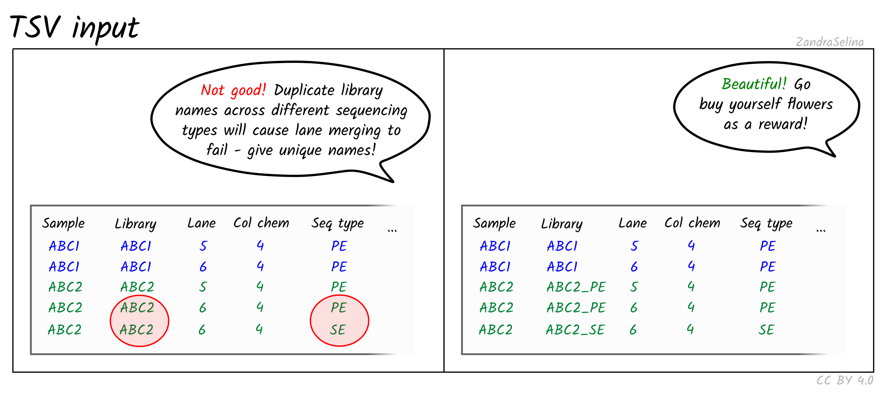

# nf-core/eager: Usage

## Table of contents

* [nf-core/eager: Usage](#nf-coreeager-usage)
  * [Table of contents](#table-of-contents)
  * [General Nextflow info](#general-nextflow-info)
    * [Automatic Resubmission](#automatic-resubmission)
    * [Help Message](#help-message)
  * [Running the pipeline](#running-the-pipeline)
    * [Updating the pipeline](#updating-the-pipeline)
    * [Mandatory Arguments](#mandatory-arguments)
      * [`-profile`](#-profile)
      * [`--input`](#--input)
      * [`--single_end`](#--single_end)
      * [`--colour_chemistry`](#--colour_chemistry)
      * [`--bam`](#--bam)
      * [`--single_stranded`](#--single_stranded)
      * [`--fasta`](#--fasta)
      * [`--genome` (using iGenomes)](#--genome-using-igenomes)
    * [Output Directories](#output-directories)
      * [`--outdir`](#--outdir)
      * [`-w / -work-dir`](#-w---work-dir)
    * [Optional Reference Options](#optional-reference-options)
      * [`--large_ref`](#--large_ref)
      * [`--save_reference`](#--save_reference)
      * [`--bwa_index`](#--bwa_index)
      * [`--seq_dict`](#--seq_dict)
      * [`--fasta_index`](#--fasta_index)
    * [Other run specific parameters](#other-run-specific-parameters)
      * [`-r`](#-r)
      * [`--max_memory`](#--max_memory)
      * [`--max_time`](#--max_time)
      * [`--max_cpus`](#--max_cpus)
      * [`--email`](#--email)
      * [`-name`](#-name)
      * [`-resume`](#-resume)
      * [`-c`](#-c)
      * [`--monochrome_logs`](#--monochrome_logs)
      * [`--multiqc_config`](#--multiqc_config)
      * [`--custom_config_version`](#--custom_config_version)
      * [`--plaintext_email`](#--plaintext_email)
  * [Adjustable parameters for nf-core/eager](#adjustable-parameters-for-nf-coreeager)
    * [Step skipping parameters](#step-skipping-parameters)
      * [`--skip_fastqc`](#--skip_fastqc)
      * [`--skip_adapterremoval`](#--skip_adapterremoval)
      * [`--skip_preseq`](#--skip_preseq)
      * [`--skip_deduplication`](#--skip_deduplication)
      * [`--skip_damage_calculation`](#--skip_damage_calculation)
      * [`--skip_qualimap`](#--skip_qualimap)
    * [BAM Conversion Options](#bam-conversion-options)
      * [`--run_convertbam`](#--run_convertbam)
    * [Complexity Filtering Options](#complexity-filtering-options)
      * [`--complexity_filter_poly_g`](#--complexity_filter_poly_g)
      * [`--complexity_filter_poly_g_min`](#--complexity_filter_poly_g_min)
    * [Adapter Clipping and Merging Options](#adapter-clipping-and-merging-options)
      * [`--clip_forward_adaptor`](#--clip_forward_adaptor)
      * [`--clip_reverse_adaptor`](#--clip_reverse_adaptor)
      * [`--clip_readlength` 30](#--clip_readlength-30)
      * [`--clip_min_read_quality` 20](#--clip_min_read_quality-20)
      * [`--clip_min_adap_overlap` 1](#--clip_min_adap_overlap-1)
      * [`--skip_collapse`](#--skip_collapse)
      * [`--skip_trim`](#--skip_trim)
      * [`--preserve5p`](#--preserve5p)
      * [`--mergedonly`](#--mergedonly)
    * [Read Mapping Parameters](#read-mapping-parameters)
      * [`--mapper`](#--mapper)
      * [BWA (default)](#bwa-default)
        * [`--bwaalnn`](#--bwaalnn)
        * [`--bwaalnk`](#--bwaalnk)
        * [`--bwaalnl`](#--bwaalnl)
      * [CircularMapper](#circularmapper)
        * [`--circularextension`](#--circularextension)
        * [`--circulartarget`](#--circulartarget)
        * [`--circularfilter`](#--circularfilter)
    * [Mapped Reads Stripping](#mapped-reads-stripping)
      * [`--strip_input_fastq`](#--strip_input_fastq)
      * [`--strip_mode`](#--strip_mode)
    * [Read Filtering and Conversion Parameters](#read-filtering-and-conversion-parameters)
      * [`--run_bam_filtering`](#--run_bam_filtering)
      * [`--bam_discard_unmapped`](#--bam_discard_unmapped)
      * [`--bam_unmapped_type`](#--bam_unmapped_type)
      * [`--bam_mapping_quality_threshold`](#--bam_mapping_quality_threshold)
    * [Read DeDuplication Parameters](#read-deduplication-parameters)
      * [`--dedupper`](#--dedupper)
      * [`--dedup_all_merged`](#--dedup_all_merged)
    * [Library Complexity Estimation Parameters](#library-complexity-estimation-parameters)
      * [`--preseq_step_size`](#--preseq_step_size)
    * [DNA Damage Assessment Parameters](#dna-damage-assessment-parameters)
      * [`--damageprofiler_length`](#--damageprofiler_length)
      * [`--damageprofiler_threshold`](#--damageprofiler_threshold)
      * [`--damageprofiler_yaxis`](#--damageprofiler_yaxis)
      * [`--run_pmdtools`](#--run_pmdtools)
      * [`--udg_type`](#--udg_type)
      * [`--pmdtools_range`](#--pmdtools_range)
      * [`--pmdtools_threshold`](#--pmdtools_threshold)
      * [`--pmdtools_reference_mask`](#--pmdtools_reference_mask)
      * [`--pmdtools_max_reads`](#--pmdtools_max_reads)
    * [BAM Trimming Parameters](#bam-trimming-parameters)
      * [`--run_trim_bam`](#--run_trim_bam)
      * [`--bamutils_clip_left` / `--bamutils_clip_right`](#--bamutils_clip_left----bamutils_clip_right)
      * [`--bamutils_softclip`](#--bamutils_softclip)
    * [Captured Library Parameters](#captured-library-parameters)
      * [`--snpcapture` false](#--snpcapture-false)
      * [`--bedfile`](#--bedfile)
    * [Feature Annotation Statistics](#feature-annotation-statistics)
      * [`--run_bedtools_coverage`](#--run_bedtools_coverage)
      * [`--anno_file`](#--anno_file)
    * [Genotyping Parameters](#genotyping-parameters)
      * [`--run_genotyping`](#--run_genotyping)
      * [`--genotyping_tool`](#--genotyping_tool)
      * [`--genotyping_source`](#--genotyping_source)
      * [`--gatk_ug_jar`](#--gatk_ug_jar)
      * [`--gatk_call_conf`](#--gatk_call_conf)
      * [`--gatk_ploidy`](#--gatk_ploidy)
      * [`--gatk_dbsnp`](#--gatk_dbsnp)
      * [`--gatk_ug_out_mode`](#--gatk_ug_out_mode)
      * [`--gatk_hc_out_mode`](#--gatk_hc_out_mode)
      * [`--gatk_ug_genotype_model`](#--gatk_ug_genotype_model)
      * [`--gatk_hc_emitrefconf`](#--gatk_hc_emitrefconf)
      * [`--gatk_downsample`](#--gatk_downsample)
      * [`--gatk_ug_gatk_ug_defaultbasequalities`](#--gatk_ug_gatk_ug_defaultbasequalities)
      * [`--freebayes_C`](#--freebayes_c)
      * [`--freebayes_g`](#--freebayes_g)
      * [`--freebayes_p`](#--freebayes_p)
    * [Consensus Sequence Generation](#consensus-sequence-generation)
      * [`--run_vcf2genome`](#--run_vcf2genome)
      * [`--vcf2genome_outfile`](#--vcf2genome_outfile)
      * [`--vcf2genome_header`](#--vcf2genome_header)
      * [`--vcf2genome_minc`](#--vcf2genome_minc)
      * [`--vcf2genome_minq`](#--vcf2genome_minq)
      * [`--vcf2genome_minfreq`](#--vcf2genome_minfreq)
    * [Mitochondrial to Nuclear Ratio](#mitochondrial-to-nuclear-ratio)
      * [`--run_mtnucratio`](#--run_mtnucratio)
      * [`--mtnucratio_header`](#--mtnucratio_header)
    * [SNP Table Generation](#snp-table-generation)
      * [`--run_multivcfanalyzer`](#--run_multivcfanalyzer)
      * [`--write_allele_frequencies`](#--write_allele_frequencies)
      * [`--min_genotype_quality`](#--min_genotype_quality)
      * [`--min_base_coverage`](#--min_base_coverage)
      * [`--min_allele_freq_hom`](#--min_allele_freq_hom)
      * [`--min_allele_freq_het`](#--min_allele_freq_het)
      * [`--additional_vcf_files`](#--additional_vcf_files)
      * [`--reference_gff_annotations`](#--reference_gff_annotations)
      * [`--reference_gff_exclude`](#--reference_gff_exclude)
      * [`--snp_eff_results`](#--snp_eff_results)
    * [Human Sex Determination](#human-sex-determination)
      * [`--run_sexdeterrmine`](#--run_sexdeterrmine)
      * [`--sexdeterrmine_bedfile`](#--sexdeterrmine_bedfile)
    * [Human Nuclear Contamination](#human-nuclear-contamination)
      * [`--run_nuclear_contamination`](#--run_nuclear_contamination)
      * [`--contamination_chrom_name`](#--contamination_chrom_name)
    * [Metagenomic Screening](#metagenomic-screening)
      * [`--run_metagenomic_screening`](#--run_metagenomic_screening)
      * [`--metagenomic_tool`](#--metagenomic_tool)
      * [`--metagenomic_min_support_reads`](#--metagenomic_min_support_reads)
      * [`--database`](#--database)
      * [`--percent_identity`](#--percent_identity)
      * [`--malt_mode`](#--malt_mode)
      * [`--malt_alignment_mode`](#--malt_alignment_mode)
      * [`--malt_top_percent`](#--malt_top_percent)
      * [`--malt_min_support_mode`](#--malt_min_support_mode)
      * [`--malt_min_support_percent`](#--malt_min_support_percent)
      * [`--malt_max_queries`](#--malt_max_queries)
      * [`--malt_memory_mode`](#--malt_memory_mode)
      * [`--run_maltextract`](#--run_maltextract)
      * [`maltextract_taxon_list`](#maltextract_taxon_list)
      * [`maltextract_ncbifiles`](#maltextract_ncbifiles)
      * [`maltextract_filter`](#maltextract_filter)
      * [`maltextract_toppercent`](#maltextract_toppercent)
      * [`maltextract_destackingoff`](#maltextract_destackingoff)
      * [`maltextract_downsamplingoff`](#maltextract_downsamplingoff)
      * [`maltextract_duplicateremovaloff`](#maltextract_duplicateremovaloff)
      * [`maltextract_matches`](#maltextract_matches)
      * [`maltextract_megansummary`](#maltextract_megansummary)
      * [`maltextract_percentidentity`](#maltextract_percentidentity)
      * [`maltextract_topalignment`](#maltextract_topalignment)
  * [Clean up](#clean-up)

## General Nextflow info

Nextflow handles job submissions on SLURM or other environments, and supervises running the jobs. Thus the Nextflow process must run until the pipeline is finished. We recommend that you put the process running in the background through `screen` / `tmux` or similar tool. Alternatively you can run nextflow within a cluster job submitted your job scheduler.

To create a screen session:

```bash
screen -R eager2
```

To disconnect, press `ctrl+a` then `d`.

To reconnect, type :

```bash
screen -r eager2
```

to end the screen session while in it type `exit`.

### Automatic Resubmission

By default, if a pipeline step fails, EAGER2 will resubmit the job with twice the amount of CPU and memory. This will occur two times before failing.

### Help Message

To access the nextflow help message run: `nextflow run -help`

## Running the pipeline

> Before you start you should change into the output directory you wish your results to go in. When you start the nextflow job, it will place all the log files and 'working' folders in the current directory and NOT necessarily the directory the output files will be in.

The typical command for running the pipeline is as follows:

```bash
nextflow run nf-core/eager --input '*_R{1,2}.fastq.gz' --fasta 'some.fasta' -profile standard,docker
```

where the reads are from libraries of the same pairing.

This will launch the pipeline with the `docker` configuration profile. See below for more information about profiles.

Note that the pipeline will create the following files in your working directory:

```bash
work            # Directory containing the nextflow working files
results         # Finished results (configurable, see below)
.nextflow.log   # Log file from Nextflow
               \# Other nextflow hidden files, eg. history of pipeline runs and old logs.
```

To see the the EAGER pipeline help message run: `nextflow run nf-core/eager --help`

> By default, if a pipeline step fails, nf-core/eager will resubmit the job with twice the amount of CPU and memory. This will occur two times before failing.

### Updating the pipeline

When you run the above command, Nextflow automatically pulls the pipeline code from GitHub and stores it as a cached version. When running the pipeline after this, it will always use the cached version if available - even if the pipeline has been updated since. To make sure that you're running the latest version of the pipeline, make sure that you regularly update the cached version of the pipeline:

```bash
nextflow pull nf-core/eager
```

See [below](#other-command-line-parameters) for more details about EAGER2 versioning.

### Mandatory Arguments

#### `-profile`

Use this parameter to choose a configuration profile. Profiles can give configuration presets for different computing environments (e.g. schedulers, software environments, memory limits etc). Note that multiple profiles can be loaded, for example: `-profile standard,docker` - the order of arguments is important! The first entry takes precendence over the others, e.g. if a setting is set by both the first and second profile, the first entry will be used and the second entry ignored.

> *Important*: If running EAGER2 on a cluster - ask your system administrator what profile to use.

For more details on how to set up your own private profile, please see [installation](../configuration/adding_your_own.md).

**Basic profiles**
These are basic profiles which primarily define where you derive the pipeline's software packages from. These are typically the profiles you would use if you are running the pipeline on your **own PC** (vs. a HPC cluster - see below).

* `awsbatch`
  * A generic configuration profile to be used with AWS Batch.
* `conda`
  * Please only use Conda as a last resort i.e. when it's not possible to run the pipeline with Docker or Singularity.
  * A generic configuration profile to be used with [conda](https://conda.io/docs/)
  * Pulls most software from [Bioconda](https://bioconda.github.io/)
* `docker`
  * A generic configuration profile to be used with [Docker](http://docker.com/)
  * Pulls software from dockerhub: [`nfcore/eager`](http://hub.docker.com/r/nfcore/eager/)
* `singularity`
  * A generic configuration profile to be used with [Singularity](http://singularity.lbl.gov/)
  * Pulls software from singularity-hub
* `test`
  * A profile with a complete configuration for automated testing
  * Includes links to test data so needs no other parameters
* `none`
  * No configuration at all. Useful if you want to build your own config from scratch and want to avoid loading in the default `base` config profile (not recommended).

**Institution Specific Profiles**
These are profiles specific to certain **HPC clusters**, and are centrally maintained at [nf-core/configs](https://github.com/nf-core/configs). Those listed below are regular users of EAGER2, if you don't see your own institution here check the [nf-core/configs](https://github.com/nf-core/configs) repository.

* `uzh`
  * A profile for the University of Zurich Research Cloud
  * Loads Singularity and defines appropriate resources for running the pipeline.
* `binac`
  * A profile for the BinAC cluster at the University of Tuebingen
  * Loads Singularity and defines appropriate resources for running the pipeline
* `shh`
  * A profiler for the S/CDAG cluster at the Department of Archaeogenetics of the Max Planck Institute for the Science of Human History
  * Loads Singularity and defines appropriate resources for running the pipeline

**Pipeline Specific Institution Profiles**
There are also pipeline-specific institution profiles. I.e., we can also offer a profile which sets special resource settings to specific steps of the pipeline, which may not apply to all pipelines. This can be seen at [nf-core/configs](https://github.com/nf-core/configs) under [conf/pipelines/eager/](https://github.com/nf-core/configs/tree/master/conf/pipeline/eager).

We currently offer a EAGER specific profile for

* `shh`
  * A profiler for the S/CDAG cluster at the Department of Archaeogenetics of the Max Planck Institute for the Science of Human History
  * In addition to the nf-core wide profile, this also sets the MALT resources to match our commonly used databases

Further institutions can be added at [nf-core/configs](https://github.com/nf-core/configs). Please ask the eager developers to add your institution to the list above, if you add one!

#### `--input`

There are two possible ways of supplying input sequencing data to nf-core/eager. The most efficient but more simplistic is supplying direct paths (with wildcards) to your FASTQ or BAM files, with each file or pair being considered a single library and each one run independently. TSV input requires creation of an extra file by the user and extra metadta, but allows more powerful lane and library merging.

##### Direct Input Method

Use this to specify the location of your input FASTQ (optionally gzipped) or BAM file(s). This option is mutually exclusive to [`--tsv_input`](#tsv_input) which is used for more complex input configurations such as lane and library merging.

When using the direct method of `--input` you can specify one or multiple samples in one or more directories files.

By default, the pipeline _assumes_ you have paired-end data. If you want to run single-end data you must specify [`--single_end`]('#single_end')

For example, for a single set of FASTQs, or multiple files paired-end FASTQ files in one directory, you can specify:

```bash
--input 'path/to/data/sample_*_{1,2}.fastq.gz'
```

If you have multiple files in different directories, you can use additional wildcards (`*`) e.g.:

```bash
--input 'path/to/data/*/sample_*_{1,2}.fastq.gz'
```

> :warning: It is not possible to run a mixture of single-end and paired-end files in one run with the paths `--input` method! Please see [`--tsv_input`](#tsv_input) for possibilities.

**Please note** the following requirements:

1. Valid file extensions: `.fastq.gz`, `.fastq`, `.fq.gz`, `.fq`, `.bam`.
2. The path **must** be enclosed in quotes
3. The path must have at least one `*` wildcard character
4. When using the pipeline with **paired end data**, the path must use `{1,2}` notation to specify read pairs.
5. Files names must be unique _prior_ the `{1,2}` notation, otherwise an error will be thrown.

### TSV Input Method

Specifies a path to a TSV file that contains paths to FASTQ/BAM files and additional metadata, which allows performing of more complex procedures such as merging of sequencing data across lanes, sequencing runs , sequencing configuration types, and samples.

The use of the TSV `--input` method is recommended to be used when performing more complex procedures such as lane or library merging. You do not need to specify `--single_end`, `--bam`, `--colour_chemistry`, `-udg_type` etc. when using TSV input - this is defined within the TSV file itself.

This TSV should look like the following:

| Sample_Name | Library_ID | Lane | Colour_Chemistry | SeqType | Organism | Strandedness | UDG_Treatment | R1 | R2 | BAM |
|-------------|------------|------|------------------|--------|----------|--------------|---------------|----|----|-----|
| JK2782      | JK2782     | 1    | 4                | PE      | Mammoth  | double       | full          | [https://github.com/nf-core/test-datasets/raw/eager/testdata/Mammoth/fastq/JK2782_TGGCCGATCAACGA_L008_R1_001.fastq.gz.tengrand.fq.gz](https://github.com/nf-core/test-datasets/raw/eager/testdata/Mammoth/fastq/JK2782_TGGCCGATCAACGA_L008_R1_001.fastq.gz.tengrand.fq.gz) | [https://github.com/nf-core/test-datasets/raw/eager/testdata/Mammoth/fastq/JK2782_TGGCCGATCAACGA_L008_R2_001.fastq.gz.tengrand.fq.gz](https://github.com/nf-core/test-datasets/raw/eager/testdata/Mammoth/fastq/JK2782_TGGCCGATCAACGA_L008_R2_001.fastq.gz.tengrand.fq.gz) | NA  |
| JK2802      | JK2802     | 2    | 2                | SE      | Mammoth  | double       | full          | [https://github.com/nf-core/test-datasets/raw/eager/testdata/Mammoth/fastq/JK2802_AGAATAACCTACCA_L008_R1_001.fastq.gz.tengrand.fq.gz](https://github.com/nf-core/test-datasets/raw/eager/testdata/Mammoth/fastq/JK2802_AGAATAACCTACCA_L008_R1_001.fastq.gz.tengrand.fq.gz) | [https://github.com/nf-core/test-datasets/raw/eager/testdata/Mammoth/fastq/JK2802_AGAATAACCTACCA_L008_R2_001.fastq.gz.tengrand.fq.gz](https://github.com/nf-core/test-datasets/raw/eager/testdata/Mammoth/fastq/JK2802_AGAATAACCTACCA_L008_R2_001.fastq.gz.tengrand.fq.gz) | NA  |

> :warning: Cells **must not** contain spaces before or after strings, as this will make the TSV unreadable by nextflow. Strings containing spaces should be wrapped in quotes.

When using TSV_input, nf-core/eager will merge FASTQ files of libraries with the same `Library_ID` but different `Lanes` after adapter clipping (and merging), assuming all other metadata columns are the same.
It will also merge BAM files with the `Sample_Lane` but different `Library_ID` after duplicate removal, but prior to genotyping.

Column descriptions are as follows:

* **Sample_Name:** A text string containing the name of a given sample of which there can be multiple libraries. All libraries with the same sample name and same SeqType will be merged after deduplication.
* **Library_ID:** A text string containing a given library, which there can be multiple sequencing lanes (with the same SeqType).
* **Lane:** A number indicating which lane the library was sequenced on. Files from the libraries sequenced on different lanes (with same SeqType) will be concatenated after read clipping and merging.
* **Colour Chemistry** A number indicating whether the Illumina sequencing machine the library was sequenced on was 2 (e.g. Next/NovaSeq) or 4 (Hi/MiSeq). This informs whether poly-G trimming (if turned on) should be performed.
* **SeqType:** A text string of either 'PE' or 'SE', specifying paired end (with both an R1 [or forward] and R2 [or reverse]) and single end data (only R1 [forward], or BAM). This will affect lane merging if different per library.
* **Organism:** A text string of the organism name of the sample or 'NA'. This currently has no functionality and can be set to 'NA', but will affect lane/library merging if different per library
* **Strandedness:** A text string indicating whether the library type is 'single' or 'double'. This currently has no functionality, but will affect lane/library merging if different per library.
* **UDG_Treatment:** A text string indicating whether the library was generated with UDG treatment - either 'full', 'half' or 'none'. Will affect lane/library merging if different per library.
* **R1:** A text string of a file path pointing to a forward or R1 FASTQ file. This can be used with the R2 column.
* **R2:** A text string of a file path pointing to a reverse or R2 FASTQ file, or 'NA' when single end data. This can be used with the R1 column.
* **BAM:** A text string of a file path pointing to a BAM file, or 'NA'. Cannot be specified at the same time as R1 or R2, both of which should be set to 'NA'

For example, with the following:

| Sample_Name | Library_ID | Lane | Colour_Chemistry | SeqType | Organism | Strandedness | UDG_Treatment | R1                                                             | R2                                                             | BAM |
|-------------|------------|------|------------------|---------|----------|--------------|---------------|----------------------------------------------------------------|----------------------------------------------------------------|-----|
| JK2782      | JK2782     | 7    | 4                | PE      | Mammoth  | double       | full          | data/JK2782_TGGCCGATCAACGA_L007_R1_001.fastq.gz.tengrand.fq.gz | data/JK2782_TGGCCGATCAACGA_L007_R2_001.fastq.gz.tengrand.fq.gz | NA  |
| JK2782      | JK2782     | 8    | 4                | PE      | Mammoth  | double       | full          | data/JK2782_TGGCCGATCAACGA_L008_R1_001.fastq.gz.tengrand.fq.gz | data/JK2782_TGGCCGATCAACGA_L008_R2_001.fastq.gz.tengrand.fq.gz | NA  |
| JK2802      | JK2802_SE  | 7    | 4                | PE      | Mammoth  | double       | full          | data/JK2802_AGAATAACCTACCA_L007_R1_001.fastq.gz.tengrand.fq.gz | data/JK2802_AGAATAACCTACCA_L007_R2_001.fastq.gz.tengrand.fq.gz | NA  |
| JK2802      | JK2802_PE  | 8    | 4                | SE      | Mammoth  | double       | full          | data/JK2802_AGAATAACCTACCA_L008_R1_001.fastq.gz.tengrand.fq.gz | NA                                                             | NA  |

After AdapterRemoval, and prior to mapping, FASTQ files from lane 7 and lane 8 _with the same `SeqType`_ (and all other _metadata_ columns) will be concatenated together for each **Library**. After duplicate removal, BAM files with `Library_ID`s with the same `Sample_Name` will be merged together. If BAM trimming is turned, all post-trimming BAMs (i.e. non-UDG and half-UDG ) will be merged with UDG-treated (untreated) BAMs, if they have the same `Sample_Name`.

<p align="center">
  
</p>

Note the following important points:

* The TSV must use actual tabs (not spaces) between cells.
* All _BAM_ files must be specified as `SE` under `SeqType`.
* nf-core/eager will only merge multiple _lanes_ of sequencing runs with the same single-end or paired-end configuration (as `DeDup` utilises both 5' and 3' ends of reads to remove duplicates).
* You **must** specify different `Library_ID` names for same libraries but with different sequencing configurations (e.g. by specifying `_SE` and `_PE` in the example above), otherwise nf-core/eager will crash with a `file name collision` error when trying to merge after DeDup.
* Accordingly nf-core/eager will not merge _lanes_ of FASTQs with BAM files (unless you us `--run_convertbam`), as only FASTQ files are lane-merged together.
* nf-core/eager functionality such as `--run_trim_bam` will be applied to only non-UDG (UDG_Treatment: none) or half-UDG (UDG_Treatment: half) libraries.

#### `--single_end`

If you have single-end data or BAM files, you need to specify `--single_end` on the command line when you launch the pipeline. A normal glob pattern, enclosed in quotation marks, can then be used for `--input`.

Only required when using the 'Path' method of [`--input`](#--input).

For example:

```bash
--single_end --input 'path/to/data/*.fastq.gz'
```

**Note**: It is currently not possible to run a mixture of single-end and paired-end files in one run.

#### `--bam`

Specifies the input file type to `--input` is in BAM format. This will automatically also apply `--single_end`.

Only required when using the 'Path' method of [`--input`](#--input).

#### `--single_stranded`

Indicates libraries are single stranded.

Currently only affects MALTExtract, where it will switch on damage patterns calculation mode to single-stranded. Default: false.

#### `--colour_chemistry`

Specifies which Illumina colour chemistry was a library was sequenced with. This informs  whether to perform poly-G trimming (if `--complexity_filter_poly_g` is also supplied). Only 2 colour chemistry sequencers (e.g. NextSeq or NovaSeq) can generate uncertain poly-G tails (due to 'G' being indicated via a no-colour detection). Default is '4' to indicate e.g. HiSeq or MiSeq platforms, which do not require poly-G trimming. Options: 2, 4. Default: 4

Only required when using the 'Path' method of [`--input`](#--input).

#### `--fasta`

You specify the full path to your reference genome here. The FASTA file can have any file suffix, such as `.fasta`, `.fna`, `.fa`, `.FastA` etc. You may also supply a gzipped reference files, which will be unzipped automatically for you.

For example:

```bash
--fasta '/<path>/<to>/my_reference.fasta'
```

> If you don't specify appropriate `--bwa_index`, `--fasta_index` parameters (see [below](#optional-reference-options)), the pipeline will create these indices for you automatically. Note that you can save the indices created for you for later by giving the `--save_reference` flag.
> You must select either a `--fasta` or `--genome`

#### `--genome` (using iGenomes)

Alternatively, the pipeline config files come bundled with paths to the Illumina iGenomes reference index files. If running with docker or AWS, the configuration is set up to use the [AWS-iGenomes](https://ewels.github.io/AWS-iGenomes/) resource.

There are 31 different species supported in the iGenomes references. To run the pipeline, you must specify which to use with the `--genome` flag.

You can find the keys to specify the genomes in the [iGenomes config file](../conf/igenomes.config). Common genomes that are supported are:

* Human
  * `--genome GRCh37`
  * `--genome GRCh38`
* Mouse *
  * `--genome GRCm38`
* _Drosophila_ *
  * `--genome BDGP6`
* _S. cerevisiae_ *
  * `--genome 'R64-1-1'`

> \* Not bundled with nf-core eager by default.

Note that you can use the same configuration setup to save sets of reference files for your own use, even if they are not part of the iGenomes resource. See the [Nextflow documentation](https://www.nextflow.io/docs/latest/config.html) for instructions on where to save such a file.

The syntax for this reference configuration is as follows:

```nextflow
params {
  genomes {
    'GRCh37' {
      fasta   = '<path to the iGenomes genome fasta file>'
    }
    // Any number of additional genomes, key is used with --genome
  }
}
```

> You must select either a `--fasta` or `--genome`

### Output Directories

#### `--outdir`

The output directory where the results will be saved.

#### `-w / -work-dir`

The output directory where _intermediate_ files will be saved. It is **highly recommended** that this is the same path as `--outdir`, otherwise you may 'lose' your intermediate files if you need to re-run a pipeline. By default, if this flag is not given, the intermediate files will be saved in a `work/` and `.nextflow/` directory from wherever you have run EAGER from.

### Optional Reference Options

We provide various options for indexing of different types of reference genomes. EAGER can index reference genomes for you (with options to save these for other analysis), but you can also supply your pre-made indices.

Supplying pre-made indices saves time in pipeline execution and is especially advised when running multiple times on the same cluster system for example. You can even add a resource [specific profile](#profile) that sets paths to pre-computed reference genomes, saving even time when specifying these.

#### `--large_ref`

This parameter is required to be set for large reference genomes. If your reference genome is larger than 3.5GB, the `samtools index` calls in the pipeline need to generate `CSI` indices instead of `BAI` indices to accompensate for the size of the reference genome. This parameter is not required for smaller references (including a human `hg19` or `grch37`/`grch38` reference), but `>4GB` genomes have been shown to need `CSI` indices. Default: off

#### `--save_reference`

Use this if you do not have pre-made reference FASTA indices for `bwa`, `samtools` and `picard`. If you turn this on, the indices EAGER2 generates for you will be stored in the `<your_output_dir>/results/reference_genomes` for you.

#### `--bwa_index`

If you want to use pre-existing `bwa index` indices, please supply the path **and file** to the FASTA you also specified in `--fasta` (see above). EAGER2 will automagically detect the index files by searching for the FASTA filename with the corresponding `bwa` index file suffixes.

For example:

```bash
nextflow run nf-core/eager \
-profile test,docker \
--paired_end \
--input '*{R1,R2}*.fq.gz'
--fasta 'results/reference_genome/bwa_index/BWAIndex/Mammoth_MT_Krause.fasta' \
--bwa_index 'results/reference_genome/bwa_index/BWAIndex/Mammoth_MT_Krause.fasta'
```

> `bwa index` does not give you an option to supply alternative suffixes/names for these indices. Thus, the file names generated by this command _must not_ be changed, otherwise EAGER2 will not be able to find them.

#### `--seq_dict`

If you want to use a pre-existing `picard CreateSequenceDictionary` dictionary file, use this to specify the required `.dict` file for the selected reference genome.

For example:

```bash
--seq_dict 'Mammoth_MT_Krause.dict'
```

#### `--fasta_index`

If you want to use a pre-existing `samtools faidx` index, Use this to specify the required FASTA index file for the selected reference genome. This should be generated by `samtools faidx` and has a file suffix of `.fai`

For example:

```bash
--fasta_index 'Mammoth_MT_Krause.fasta.fai'
```

### Other run specific parameters

#### `-r`

By default, EAGER2 will use the latest version of the pipeline that is downloaded on your system. However, it's a good idea to specify a pipeline version when running the pipeline on your data. This ensures that a specific version of the pipeline code and software are used when you run your pipeline. If you keep using the same tag, you'll be running the same version of the pipeline, even if there have been changes to the code since.

First, go to the [nf-core/eager releases page](https://github.com/nf-core/eager/releases) and find the latest version number - numeric only (eg. `2.0`). Then specify this when running the pipeline with `-r` (one hyphen) - eg. `-r 2.0`.

This version number will be logged in reports when you run the pipeline, so that you'll know what you used when you look back in the future.

Additionally, EAGER pipeline releases are named after Swabian German Cities. The first release V2.0 is named "Kaufbeuren". Future releases are named after cities named in the [Swabian league of Cities](https://en.wikipedia.org/wiki/Swabian_League_of_Cities).

#### `--max_memory`

Use to set a top-limit for the default memory requirement for each process.
Should be a string in the format integer-unit. eg. `--max_memory '8.GB'`. If not specified, will be taken from the configuration in the `-profile` flag.

#### `--max_time`

Use to set a top-limit for the default time requirement for each process.
Should be a string in the format integer-unit. eg. `--max_time '2.h'`. If not specified, will be taken from the configuration in the `-profile` flag.

#### `--max_cpus`

When _not_ using a instutite specific `-profile`, you can use this parameter to set a top-limit for the default CPU requirement for each **process**. This is not the maximum number of CPUs that can be used for the whole pipeline, but the maximum number of CPUs each program can use for each program submission (known as a process).

Do not set this higher than what is available on your workstation or computing node can provide. If you're unsure, ask your local IT administrator for details on compute node capabilities! Should be a string in the format integer-unit. eg. `--max_cpus 1`. If not specified, will be taken from the configuration in the `-profile` flag.

#### `--email`

Set this parameter to your e-mail address to get a summary e-mail with details of the run sent to you when the workflow exits. If set in your user config file (`~/.nextflow/config`) then you don't need to specify this on the command line for every run.

#### `-name`

Name for the pipeline run. If not specified, Nextflow will automatically generate a random mnemonic.

This is used in the MultiQC report (if not default) and in the summary HTML / e-mail (always).

**NB:** Single hyphen (core Nextflow option)

#### `-resume`

Specify this when restarting a pipeline. Nextflow will used cached results from any pipeline steps where the inputs are the same, continuing from where it got to previously.

You can also supply a run name to resume a specific run: `-resume [run-name]`. Use the `nextflow log` command to show previous run names.

**NB:** Single hyphen (core Nextflow option)

#### `-c`

Specify the path to a specific nextflow config file (this is a core NextFlow command).

**NB:** Single hyphen (core Nextflow option)

Note - you can use this to override pipeline defaults.

#### `--monochrome_logs`

Set to disable colourful command line output and live life in monochrome.

#### `--multiqc_config`

Specify a path to a custom MultiQC configuration file.

#### `--custom_config_version`

Provide git commit id for custom Institutional configs hosted at `nf-core/configs`. This was implemented for reproducibility purposes. Default is set to `master`.

```bash
\#\# Download and use config file with following git commid id
--custom_config_version d52db660777c4bf36546ddb188ec530c3ada1b96
```

#### `--plaintext_email`

Set to receive plain-text e-mails instead of HTML formatted.

## Adjustable parameters for nf-core/eager

This part of the documentation contains a list of user-adjustable parameters in nf-core/eager. You can specify any of these parameters on the command line when calling the pipeline by simply prefixing the respective parameter with a double dash `--`.

### Step skipping parameters

Some of the steps in the pipeline can be executed optionally. If you specify specific steps to be skipped, there won't be any output related to these modules.

#### `--skip_fastqc`

Turns off FastQC pre- and post-Adapter Removal, to speed up the pipeline. Use of this flag is most common when data has been previously pre-processed and the post-Adapter Removal mapped reads are being re-mapped to a new reference genome.

#### `--skip_adapterremoval`

Turns off adaptor trimming and paired-end read merging. Equivalent to setting both `--skip_collapse` and `--skip_trim`.

#### `--skip_preseq`

Turns off the computation of library complexity estimation.

#### `--skip_deduplication`

Turns off duplicate removal methods DeDup and MarkDuplicates respectively. No duplicates will be removed on any data in the pipeline.

#### `--skip_damage_calculation`

Turns off the DamageProfiler module to compute DNA damage profiles.

#### `--skip_qualimap`

Turns off QualiMap and thus does not compute coverage and other mapping metrics.

### BAM Conversion Options

#### `--run_convertbam`

Allows you to convert BAM input back to FASTQ for downstream processing. Note this is required if you need to perform AdapterRemoval and/or polyG clipping.

If not turned on, BAMs will automatically be sent to post-mapping steps.

### Complexity Filtering Options

More details on can be seen in the [fastp documentation](https://github.com/OpenGene/fastp)

#### `--complexity_filter_poly_g`

Performs a poly-G tail removal step in the beginning of the pipeline using `fastp`, if turned on. This can be useful for trimming ploy-G tails from short-fragments sequenced on two-colour Illumina chemistry such as NextSeqs (where no-fluorescence is read as a G on two-colour chemistry), which can inflate reported GC content values.

#### `--complexity_filter_poly_g_min`

This option can be used to define the minimum length of a poly-G tail to begin low complexity trimming. By default, this is set to a value of `10` unless the user has chosen something specifically using this option.

### Adapter Clipping and Merging Options

These options handle various parts of adapter clipping and read merging steps.

More details can be seen in the [AdapterRemoval documentation](https://adapterremoval.readthedocs.io/en/latest/)

#### `--clip_forward_adaptor`

Defines the adapter sequence to be used for the forward read. By default, this is set to `'AGATCGGAAGAGCACACGTCTGAACTCCAGTCAC'`.

#### `--clip_reverse_adaptor`

Defines the adapter sequence to be used for the reverse read in paired end sequencing projects. This is set to `'AGATCGGAAGAGCGTCGTGTAGGGAAAGAGTGTA'` by default.

#### `--clip_readlength` 30

Defines the minimum read length that is required for reads after merging to be considered for downstream analysis after read merging. Default is `30`.

#### `--clip_min_read_quality` 20

Defines the minimum read quality per base that is required for a base to be kept. Individual bases at the ends of reads falling below this threshold will be clipped off. Default is set to `20`.

#### `--clip_min_adap_overlap` 1

Sets the minimum overlap between two reads when read merging is performed. Default is set to `1` base overlap.

#### `--skip_collapse`

Turns off the paired-end read merging.

For example

```bash
--paired_end --skip_collapse  --input '*.fastq'
```

#### `--skip_trim`

Turns off adaptor and quality trimming.

For example:

```bash
--paired_end --skip_trim  --input '*.fastq'
```

#### `--preserve5p`

Turns off quality based trimming at the 5p end of reads when any of the --trimns, --trimqualities, or --trimwindows options are used. Only 3p end of reads will be removed.

> This also entirely disables quality based trimming of collapsed reads, since both ends of these are informative for PCR duplicate filtering. Described [here](https://github.com/MikkelSchubert/adapterremoval/issues/32#issuecomment-504758137).

#### `--mergedonly`

This flag means that only merged reads are sent downstream for analysis. Singletons (i.e. reads missing a pair), or un-merged reads (where there wasn't sufficient overlap) are discarded. You may want to use this if you want ensure only the best quality reads for your analysis, but with the penalty of potentially losing still valid data (even if some reads have slightly lower quality).

### Read Mapping Parameters

#### `--mapper`

Specify which mapping tool to use. Options are BWA aln (`'bwaaln'`), BWA mem (`'bwamem'`), circularmapper (`'circularmapper'`). bwa aln is the default and best for short read ancient DNA. bwa mem can be quite useful for modern DNA, but is rarely used in projects for ancient DNA. CircularMapper enhances  the mapping procedure to circular references, using the BWA algorithm but utilizing a extend-remap procedure (see Peltzer et al 2016, Genome Biology for details). Default is 'bwaaln'

More documentation can be seen for each tool under:

* [bwa aln](http://bio-bwa.sourceforge.net/bwa.shtml#3)
* [bwa mem](http://bio-bwa.sourceforge.net/bwa.shtml#3)
* [CircularMapper](https://circularmapper.readthedocs.io/en/latest/contents/userguide.html)

#### BWA (default)

These parameters configure mapping algorithm parameters.

##### `--bwaalnn`

Configures the `bwa aln -n` parameter, defining how many mismatches are allowed in a read. By default set to `0.03`, if you're uncertain what to set check out [this](https://apeltzer.shinyapps.io/bwa-mismatches/) Shiny App for more information on how to set this parameter efficiently.

##### `--bwaalnk`

Configures the `bwa aln -k` parameter for the seeding phase in the mapping algorithm. Default is set to `2`.

##### `--bwaalnl`

Configures the length of the seed used in `bwa aln -l`. Default is set to BWA default of `32`.

#### CircularMapper

##### `--circularextension`

The number of bases to extend the reference genome with. By default this is set to `500` if not specified otherwise.

##### `--circulartarget`

The chromosome in your FastA reference that you'd like to be treated as circular. By default this is set to `MT` but can be configured to match any other chromosome.

##### `--circularfilter`

If you want to filter out reads that don't map to a circular chromosome, turn this on. By default this option is turned off.

### Mapped Reads Stripping

These parameters are used for removing mapped reads from the original input FASTQ files, usually in the context of uploading the original FASTQ files to a public read archive (NCBI SRA/EBI ENA).

These flags will produce FASTQ files almost identical to your input files, except that reads with the same read ID as one found in the mapped bam file, are either removed or 'masked' (every base replaced with Ns).

This functionality allows you to provide other researchers who wish to re-use your data to apply their own adapter removal/read merging procedures, while maintaining anonyminity for sample donors - for example with microbiome research.

#### `--strip_input_fastq`

Create pre-Adapter Removal FASTQ files without reads that mapped to reference (e.g. for public upload of privacy sensitive non-host data)

#### `--strip_mode`

Read removal mode. Strip mapped reads completely (`'strip'`) or just replace mapped reads sequence by N (`'replace'`)

### Read Filtering and Conversion Parameters

Users can configure to keep/discard/extract certain groups of reads efficiently in the nf-core/eager pipeline.

#### `--run_bam_filtering`

Turns on the bam filtering module for either mapping quality filtering or unmapped read treatment.

#### `--bam_discard_unmapped`

Defines whether unmapped reads should be discarded and stored in FastQ and/or BAM format separately. The behaviour depends on the choice of the `--bam_unmapped_type`.

#### `--bam_unmapped_type`

Defines how to proceed with unmapped reads: `'discard'` removes all unmapped reads, `'bam'` keeps unmapped reads as BAM file, `'fastq'` keeps unmapped reads as FastQ file, "both" keeps both BAM and FastQ files. Only effective when option `--bam_discard_unmapped` is turned on.

#### `--bam_mapping_quality_threshold`

Specify a mapping quality threshold for mapped reads to be kept for downstream analysis. By default keeps all reads and is therefore set to `0` (basically doesn't filter anything).

### Read DeDuplication Parameters

#### `--dedupper`

Sets the duplicate read removal tool. By default uses `'dedup'` an ancient DNA specific read deduplication tool. Users can also specify `'markdup'` and use Picard MarkDuplicates instead, which is advised when working with paired end data that is *not- merged beforehand. In all other cases, it is advised to use `'dedup'`.

#### `--dedup_all_merged`

Sets DeDup to treat all reads as merged reads. This is useful if reads are for example not prefixed with `M_` in all cases.

### Library Complexity Estimation Parameters

#### `--preseq_step_size`

Can be used to configure the step size of Preseqs `c_curve` method. Can be useful when only few and thus shallow sequencing results are used for extrapolation.

### DNA Damage Assessment Parameters

More documentation can be seen in the follow links for:

* [DamageProfiler](https://github.com/Integrative-Transcriptomics/DamageProfiler)
* [PMDTools documentation](https://github.com/pontussk/PMDtools)

#### `--udg_type`

Defines whether Uracil-DNA glycosylase (UDG) treatment was used to repair DNA damage on the sequencing libraries.

Specify `'none'` if no treatment was performed. If you have partial UDG treated data ([Rohland et al 2016](http://dx.doi.org/10.1098/rstb.2013.0624)), specify `'half'`. If you have complete UDG treated data ([Briggs et al. 2010](https://doi.org/10.1093/nar/gkp1163)), specify `'full'`. When also using PMDtools `'half'` will use a different model for DNA damage assessment in PMDTools. Specify the parameter with `'full'` and the PMDtools DNA damage assessment will use CpG context only. Default: `'none'`.

#### `--damageprofiler_length`

Specifies the length filter for DamageProfiler. By default set to `100`.

#### `--damageprofiler_threshold`

Specifies the length of the read start and end to be considered for profile generation in DamageProfiler. By default set to `15` bases.

#### `--damageprofiler_yaxis`

Specifies what the maximum misincorporation frequency should be displayed as, in the DamageProfiler damage plot. This is set to `0.30` (i.e. 30%) by default as this matches the popular [mapDamage2.0](https://ginolhac.github.io/mapDamage) program. However, the default behaviour of DamageProfiler is to 'autoscale' the y-axis maximum to zoom in on any _possible_ damage that may occur (e.g. if the damage is about 10%, the highest value on the y-axis would be set to 0.12). This 'autoscale' behaviour can be turned on by specifying the number to `0`. Default: `0.30`.

#### `--run_pmdtools`

Specifies to run PMDTools for damage based read filtering and assessment of DNA damage in sequencing libraries. By default turned off.

#### `--pmdtools_range`

Specifies the range in which to consider DNA damage from the ends of reads. By default set to `10`.

#### `--pmdtools_threshold`

Specifies the PMDScore threshold to use in the pipeline when filtering BAM files for DNA damage. Only reads which surpass this damage score are considered for downstream DNA analysis. By default set to `3` if not set specifically by the user.

#### `--pmdtools_reference_mask`

Can be used to set a path to a reference genome mask for PMDTools.

#### `--pmdtools_max_reads`

The maximum number of reads used for damage assessment in PMDtools. Can be used to significantly reduce the amount of time required for damage assessment in PMDTools. Note that a too low value can also obtain incorrect results.

### BAM Trimming Parameters

For some library preparation protocols, users might want to clip off damaged bases before applying genotyping methods. This can be done in nf-core/eager automatically by turning on the `--trim_bam` parameter.

More documentation can be seen in the [bamUtil documentation](https://genome.sph.umich.edu/wiki/BamUtil:_trimBam)

#### `--run_trim_bam`

Turns on the BAM trimming method. Trims off `[n]` bases from reads in the deduplicated BAM file  Damage assessment in PMDTools or DamageProfiler remains untouched, as data is routed through this independently. BAM trimming os typically performed to reduce errors during genotyping that can be caused by aDNA damage.

BAM trimming will only be performed on libraries indicated as `--udg_type 'none'` or `--udg_type 'half'`. Complete UDG treatment ('full') should already have all damage removed. The amount of bases that will be trimmed off (see `--bamutils_clip_left` / `--bamutils_clip_right`) will be the same regardless whether `'none'` of `'half'`.

> Note: additional artefacts such as bar-codes or adapters that could potentially also be trimmed should be removed prior mapping.

#### `--bamutils_clip_left` / `--bamutils_clip_right`

Default set to `1` and clips off one base of the left or right side of reads. Note that reverse reads will automatically be clipped off at the reverse side with this (automatically reverses left and right for the reverse read).

#### `--bamutils_softclip`

By default, nf-core/eager uses hard clipping and sets clipped bases to `N` with quality `!` in the BAM output. Turn this on to use soft-clipping instead, masking reads at the read ends respectively using the CIGAR string.

### Captured Library Parameters

These parameters are required in some cases, e.g. when performing in-solution SNP capture protocols (390K,1240K, ...) for population genetics for example. Make sure to specify the required parameters in such cases.

#### `--snpcapture` false

This is by default set to `false`, but can be turned on to calculate on target metrics automatically for you. Note, that this requires setting `--bedfile` with the target SNPs simultaneously.

#### `--bedfile`

Can be used to set a path to a BED file (3/6 column format) to calculate capture target efficiency on the fly. Will not be used without `--bedfile` set as parameter.

### Feature Annotation Statistics

If you're interested in looking at coverage stats for certain features on your reference such as genes, SNPs etc., you can use the following bedtools module for this purpose.

More documentation on bedtools can be seen in the [bedtools documentation](https://bedtools.readthedocs.io/en/latest/)

#### `--run_bedtools_coverage`

Specifies to turn on the bedtools module, producing statistics for breadth (or percent coverage), and depth (or X fold) coverages.

#### `--anno_file`

Specify the path to a GFF/BED containing the feature coordinates (or any acceptable input for [`bedtools coverage`](https://bedtools.readthedocs.io/en/latest/content/tools/coverage.html)). Must be in quotes.

### Genotyping Parameters

There are options for different genotypers to be used. We suggest you the documentation of each tool to find the ones that suit your needs.

Documentation for each tool:

* [GATK UnifiedGenotyper](https://software.broadinstitute.org/gatk/documentation/tooldocs/3.5-0/org_broadinstitute_gatk_tools_walkers_genotyper_UnifiedGenotyper.php)
* [GATK HaplotypeCaller](https://software.broadinstitute.org/gatk/documentation/tooldocs/3.8-0/org_broadinstitute_gatk_tools_walkers_haplotypecaller_HaplotypeCaller.php)
* [FreeBayes](https://github.com/ekg/freebayes)

#### `--run_genotyping`

Turns on genotyping to run on all post-dedup and downstream BAMs. For example if `--run_pmdtools` and `--trim_bam` are both supplied, the genotyper will be run on all three BAM files i.e. post-deduplication, post-pmd and post-trimmed BAM files.

#### `--genotyping_tool`

Specifies which genotyper to use. Current options are GATK (v3.5) UnifiedGenotyper or GATK (v4.xx). Furthermore, the FreeBayes Caller is available. Specify `'freebayes'`, `'hc'` or `'ug'` respectively.

> NB that while UnifiedGenotyper is more suitable for low-coverage ancient DNA (HaplotypeCaller does _de novo_ assembly around each variant site), it is officially deprecated by the Broad Institute and is only accessible by an archived version not properly available on `conda`. Therefore if specifying 'ug', will need to supply a GATK 3.5 `-jar` to the parameter `gatk_ug_jar`. Note that this means the pipline is not fully reproducible in this configuration, unless you personally supply the `.jar` file.

#### `--genotyping_source`

Indicates which BAM file to use for genotyping, depending on what BAM processing modules you have turned on. Options are: `'raw'` for mapped only, filtered, or DeDup BAMs (with priority right to left); `'trimmed'` (for base clipped BAMs); `'pmd'` (for pmdtools output). Default is: `'raw'`.

#### `--gatk_ug_jar`

Specify a path to a local copy of a GATK 3.5 `.jar` file, preferably version '3.5-0-g36282e4'. The download location of this may be available from the GATK forums of the Broad Institute.

> You must manually report your version of GATK 3.5 in publications/MultiQC as it is not included in our container.

#### `--gatk_call_conf`

If selected a GATK genotyper phred-scaled confidence threshold of a given SNP/INDEL call. Default: 30

#### `--gatk_ploidy`

If selected a GATK genotyper, what is the ploidy of your reference organism. E.g. do you want to allow heterozygous calls from >= diploid organisms. Default: 2

#### `--gatk_dbsnp`

(Optional)Specify VCF file for output VCF SNP annotation e.g. if you want annotate your VCF file with 'rs' SNP IDs. Check GATK documentation for more information. Gzip not accepted.

#### `--gatk_ug_out_mode`

If selected the GATK genotyper UnifiedGenotyper, what type of VCF to create, i.e. produce calls for every site or just confidence sites. Options: `'EMIT_VARIANTS_ONLY'`, `'EMIT_ALL_CONFIDENT_SITES'`, `'EMIT_ALL_SITES'`. Default: `'EMIT_VARIANTS_ONLY'`

#### `--gatk_hc_out_mode`

If selected the GATK genotyper HaplotypeCaller, what type of VCF to create, i.e. produce calls for every site or just confidence sites. Options: `'EMIT_VARIANTS_ONLY'`, `'EMIT_ALL_CONFIDENT_SITES'`, `'EMIT_ALL_ACTIVE_SITES'`. Default: `'EMIT_VARIANTS_ONLY'`

#### `--gatk_ug_genotype_model`

If selected GATK UnifiedGenotyper, which likelihood model to follow, i.e. whether to call use SNPs or INDELS etc. Options: `'SNP'`, `'INDEL'`, `'BOTH'`, `'GENERALPLOIDYSNP'`, `'GENERALPLOIDYINDEL`'. Default: `'SNP'`

#### `--gatk_hc_emitrefconf`

If selected GATK HaplotypeCaller, mode for emitting reference confidence calls. Options: `'NONE'`, `'BP_RESOLUTION'`, `'GVCF'`. Default: `'GVCF'`

#### `--gatk_downsample`

Maximum depth coverage allowed for genotyping before down-sampling is turned on. Any position with a coverage higher than this value will be randomly down-sampled to 250 reads. Default: 250

#### `--gatk_ug_gatk_ug_defaultbasequalities`

Specify a value to set base quality scores, if reads are missing this information. Maybe useful if you have 'synthetically' generated reads (e.g. chopping up a reference genome). Default is set to -1  which is do not set any default quality (turned off). Default: -1

#### `--freebayes_C`

Specify minimum required supporting observations to consider a variant. Default: 1

#### `--freebayes_g`

Specify to skip over regions of high depth by discarding alignments overlapping positions where total read depth is greater than specified C. Not set by default.

#### `--freebayes_p`

Specify ploidy of sample in FreeBayes. Default is diploid. Default: 2

### Consensus Sequence Generation

#### `--run_vcf2genome`

Turn on concensus sequence genome creation via VCF2Genome. Only accepts GATK UnifiedGenotyper VCF files with the `--gatk_ug_out_mode 'EMIT_ALL_SITES'` and `--gatk_ug_genotype_model 'SNP` flags. Typically useful for small genomes such as mitochondria.

#### `--vcf2genome_outfile`

The name of your requested output FASTA file. Do not include `.fasta` suffix.

#### `--vcf2genome_header`

The name of the FASTA entry you would like in your FASTA file.

#### `--vcf2genome_minc`

Minimum depth coverage for a SNP to be called. Else, a SNP will be called as N. Default: 5

#### `--vcf2genome_minq`

Minimum genotyping quality of a call to be called. Else N will be called. Default: 30

#### `--vcf2genome_minfreq`

In the case of two possible alleles, the frequency of the majority allele required to be called. Else, a SNP will be called as N. Default: 0.8

### Mitochondrial to Nuclear Ratio

#### `--run_mtnucratio`

Turn on the module to estimate the ratio of mitochondrial to nuclear reads.

#### `--mtnucratio_header`

Specify the FASTA entry in the reference file specified as `--fasta`, which acts as the mitochondrial 'chromosome' to base the ratio calculation from. The tool only accepts the first section of the header before the first space. The default chromosome name is based on hs37d5/GrCH37 human reference genome. Default: 'MT'

### SNP Table Generation

SNP Table Generation here is performed by MultiVCFAnalyzer. The current version of MultiVCFAnalyzer version only accepts GATK UnifiedGenotyper 3.5 VCF files, and when the ploidy was set to 2 (this allows MultiVCFAnalyzer to look for report frequencies of polymorphic positions). A description of how the tool works can be seen in the Supplementary Information of [Bos et al. (2014)](https://doi.org/10.1038/nature13591) under "SNP Calling and Phylogenetic Analysis".

More can be seen in the [MultiVCFAnalyzer documentation](https://github.com/alexherbig/MultiVCFAnalyzer)

#### `--run_multivcfanalyzer`

Turns on MultiVCFAnalyzer. Will only work when in combination with UnifiedGenotyper genotyping module.

#### `--write_allele_frequencies`

Specify whether to tell MultiVCFAnalyzer to write within the SNP table the frequencies of the allele at that position e.g. A (70%).

#### `--min_genotype_quality`

The minimal genotyping quality for a SNP to be considered for processing by MultiVCFAnalyzer. The default threshold is 30.

#### `--min_base_coverage`

The minimal number of reads covering a base for a SNP at that position to be considered for processing by MultiVCFAnalyzer. The default depth is 5.

#### `--min_allele_freq_hom`

The minimal frequency of a nucleotide for a 'homozygous' SNP to be called. In other words, e.g. 90% of the reads covering that position must have that SNP to be called. If the threshold is not reached, and the previous two parameters are matched, a reference call is made (displayed as . in the SNP table). If the above two parameters are not met, an 'N' is called. The default allele frequency is 0.9.

#### `--min_allele_freq_het`

The minimum frequency of a nucleotide for a 'heterozygous' SNP to be called. If this parameter is set to the same as `--min_allele_freq_hom`, then only homozygous calls are made. If this value is less than the previous parameter, then a SNP call will be made if it is between this and the previous parameter and displayed as a IUPAC uncertainty call. Default is 0.9.

#### `--additional_vcf_files`

If you wish to add to the table previously created VCF files, specify here a path with wildcards (in quotes). These VCF files must be created the same way as your settings for [GATK UnifiedGenotyping](#genotyping-parameters) module above.

#### `--reference_gff_annotations`

If you wish to report in the SNP table annotation information for the regions SNPs fall in. This must be in GFF format and the path must be in quotes.

#### `--reference_gff_exclude`

If you wish to exclude SNP regions from consideration by MultiVCFAnalyzer (such as for problematic regions), provide a file in GFF format (the path must be in quotes).

#### `--snp_eff_results`

If you wish to include results from SNPEff effect analysis, supply the output from SNPEff in txt format. The path must be in quotes.

### Human Sex Determination

An optional process for human DNA. It can be used to calculate the relative coverage of X and Y chromosomes compared to the autosomes (X-/Y-rate). Standard errors for these measurements are also calculated, assuming a binomial distribution of reads across the SNPs.

#### `--run_sexdeterrmine`

Specify to run the optional process of sex determination.

#### `--sexdeterrmine_bedfile`

Specify an optional bedfile of the list of SNPs to be used for X-/Y-rate calculation. Running without this parameter will considerably increase runtime, and render the resulting error bars unstrustworthy. Theoretically, any set of SNPs that are distant enough that two SNPs are unlikely to be covered by the same read can be used here. The programme was coded with the 1240K panel in mind. The path must be in quotes.

### Human Nuclear Contamination

#### `--run_nuclear_contamination`

Specify to run the optional processes for nuclear contamination.

#### `--contamination_chrom_name`

The name of the chromosome X in your bam. `'X'` for hs37d5, `'chrX'` for HG19. Defaults to `'X'`.

### Metagenomic Screening

An increasingly common line of analysis in high-throughput aDNA analysis today is simultaenously screening off target reads of the host for endogenous microbial signals - particularly of pathogens. Metagenomic screening is currently offered via MALT with aDNA specific verification via MaltExtract, or Kraken2.

Please note the following:

* MALT database construction functionality is _not_ included within the pipeline - this should be done independently, **prior** the EAGER run.
  * To use `malt-build` from the same version as `malt-run`, load either the docker, singularity or conda environment.
* MALT can often require very large computing resources depending on your database. We set a absolute minimum of 16 cores and 128GB of memory (which is 1/4 of the recommendation from the developer). Please leave an issue on the [nf-core github](https://github.com/nf-core/eager/issues) if you would like to see this changed.

> :warning: Running MALT on a server with less than 128GB of memory should be performed at your own risk.

#### `--run_metagenomic_screening`

Turn on the metagenomic screening module.

#### `--metagenomic_tool`

Specify which taxonomic classifier to use. There are two options available:

* `kraken` with [Kraken2](https://ccb.jhu.edu/software/kraken2)
* `malt` : more can be seen in the [MALT documentation](http://ab.inf.uni-tuebingen.de/data/software/malt/download/manual.pdf)
  
:warning: **Important** It is very important to run `nextflow clean -f` on your nextflow run directory once completed. RMA6 files are VERY large and are _copied_ from a `work/` directory into the results folder. You should clean the work directory with the command to ensure non-redundency and large HDD footprints!

#### `--metagenomic_min_support_reads`

Specify the minimum number of reads a given taxon is required to have to be retained as a positive 'hit'.  
For malt, this only applies when `--malt_min_support_mode` is set to 'reads'. Default: 1 .

#### `--database`

Specify the path to the _directory_ containing your taxonomic classifer's database (malt or kraken).

For Kraken2, it can be either the path to the _directory_ or the path to the `.tar.gz` compressed directory of the Kraken2 database.

#### `--percent_identity`

Specify the minimum percent identity (or similarity) a squence must have to the reference for it to be retained. Default is 85

Only used when `--metagenomic_tool malt` is also supplied

#### `--malt_mode`

Use this to run the program in 'BlastN', 'BlastP', 'BlastX' modes to align DNA and DNA, protein and protein, or DNA reads against protein references respectively.
respectively. Ensure your database matches the mode. Check the [MALT manual](http://ab.inf.uni-tuebingen.de/data/software/malt/download/manual.pdf) for more details. Default: 'BlastN'  

Only when `--metagenomic_tool malt` is also supplied

#### `--malt_alignment_mode`

Specify what alignment algorithm to use. Options are 'Local' or 'SemiGlobal'. Local is a BLAST like alignment, but is much slower. Semi-global alignment aligns reads end-to-end. Default: 'SemiGlobal'

Only when `--metagenomic_tool malt` is also supplied

#### `--malt_top_percent`

Specify the top percent value of the LCA algorthim. From the [MALT manual](http://ab.inf.uni-tuebingen.de/data/software/malt/download/manual.pdf): "For each
read, only those matches are used for taxonomic placement whose bit disjointScore is within
10% of the best disjointScore for that read.". Default: 1.

Only when `--metagenomic_tool malt` is also supplied

#### `--malt_min_support_mode`

Specify whether to use a percentage, or raw number of reads as the value used to decide the minimum support a taxon requires to be retained.

Only when `--metagenomic_tool malt` is also supplied

#### `--malt_min_support_percent`

Specify the minimum number of reads (as a percentage of all assigned reads) a given taxon is required to have to be retained as a positive 'hit' in the RMA6 file. This only applies when `--malt_min_support_mode` is set to 'percent'. Default 0.01.

Only when `--metagenomic_tool malt` is also supplied

#### `--malt_max_queries`

Specify the maximum number of alignments a read can have. All further alignments are discarded. Default: 100

Only when `--metagenomic_tool malt` is also supplied

#### `--malt_memory_mode`

How to load the database into memory. Options are 'load', 'page' or 'map'. 'load' directly loads the entire database into memory prior seed look up, this is slow but compatible with all servers/file systems. 'page' and 'map' perform a sort of 'chunked' database loading, allow seed look up prior entire database loading. Note that Page and Map modes do not work properly not with many remote file-systems such as GPFS. Default is 'load'.

Only when `--metagenomic_tool malt` is also supplied

#### `--run_maltextract`

Turn on MaltExtract for MALT aDNA characteristics authentication of metagenomic output from MALT.

More can be seen in the [MaltExtract documentation](https://github.com/rhuebler/)

Only when `--metagenomic_tool malt` is also supplied

#### `maltextract_taxon_list`

Path to a `.txt` file with taxa of interest you wish to assess for aDNA characteristics. In `.txt` file should be one taxon per row, and the taxon should be in a valid [NCBI taxonomy](https://www.ncbi.nlm.nih.gov/taxonomy) name format.

Only when `--metagenomic_tool malt` is also supplied

#### `maltextract_ncbifiles`

Path to directory containing containing the NCBI resource tree and taxonomy table files (ncbi.tre and ncbi.map; available at the [HOPS repository](https://github.com/rhuebler/HOPS/Resources)).

Only when `--metagenomic_tool malt` is also supplied

#### `maltextract_filter`

Specify which MaltExtract filter to use. This is used to specify what types of characteristics to scan for. The default will output statistics on all alignments, and then a second set with just reads with one C to T mismatch in the first 5 bases. Further details on other parameters can be seen in the [HOPS documentation](https://github.com/rhuebler/HOPS/#maltextract-parameters). Options: 'def_anc', 'ancient', 'default', 'crawl', 'scan', 'srna', 'assignment'. Default: 'def_anc'.

Only when `--metagenomic_tool malt` is also supplied

#### `maltextract_toppercent`

Specify percent of top alignments for each read to be considered for each node. Default: 0.01.

Only when `--metagenomic_tool malt` is also supplied

#### `maltextract_destackingoff`

Turn off destacking. If left on, a read that overlap with another read will be removed (leaving a depth coverage of 1).

Only when `--metagenomic_tool malt` is also supplied

#### `maltextract_downsamplingoff`

Turn off downsampling. By default, downsampling is on and will randomly select 10,000 reads if the number of reads on a node exceeds this number. This is to speed up processing, under the assumption at 10,000 reads the species is a 'true positive'.

Only when `--metagenomic_tool malt` is also supplied

#### `maltextract_duplicateremovaloff`

Turn off duplicate removal. By default, reads that are an exact copy (i.e. same start, stop coordinate and exact sequence match) will be removed as it is considered a PCR duplicate.

Only when `--metagenomic_tool malt` is also supplied

#### `maltextract_matches`

Export alignments of hits for each node in BLAST format. By default turned off.

Only when `--metagenomic_tool malt` is also supplied

#### `maltextract_megansummary`

Export 'minimal' summary files (i.e. without alignments) that can be loaded into [MEGAN6](https://doi.org/10.1371/journal.pcbi.1004957). By default turned off.

Only when `--metagenomic_tool malt` is also supplied

#### `maltextract_percentidentity`

Minimum percent identity alignments are required to have to be reported. Higher values allows fewer mismatches between read and reference sequence, but therefore will provide greater confidence in the hit. Lower values allow more mismatches, which can account for damage and divergence of a related strain/species to the reference. Recommended to set same as MALT parameter or higher. Default: 85.0.

Only when `--metagenomic_tool malt` is also supplied

#### `maltextract_topalignment`

Use the best alignment of each read for every statistic, except for those concerning read distribution and coverage. Default: off.

Only when `--metagenomic_tool malt` is also supplied

## Clean up

Once completed a run has completed, you will have _lots_ of (some very large) intermediate files in your output directory, within the directory named `work`.

Once you have verified your run completed correctly and everything in the module output directories are present as you expect and need, you can perform a clean up.

> **Important**: Once clean up is completed, you will _not_ be able to re-rerun the pipline from an earlier step and you'll have to re-run from scratch.

While in your output directory, firstly verify you're only deleting files stored in `work/` with the dry run command:

```bash
nextflow clean -n
```

If you're ready, you can then remove the files with

```bash
nextflow clean -f -k
```

This will make your system administrator very happy as you will _halve_ the harddrive footprint of the run, so be sure to do this!
