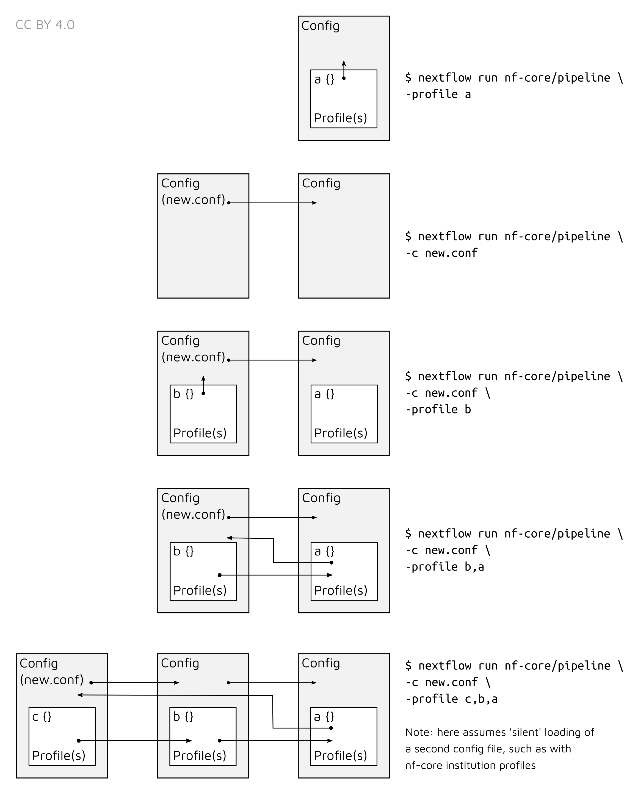

# nf-core/eager: Usage

## :warning: Please read this documentation on the nf-core website: [https://nf-co.re/eager/usage](https://nf-co.re/eager/usage)

> _Documentation of pipeline parameters is generated automatically from the pipeline schema and can no longer be found in markdown files._

## Introduction

## Running the pipeline

### Quick Start

> Before you start you should change into the output directory you wish your
> results to go in. This will guarantee, that when you start the Nextflow job,
> it will place all the log files and 'working' folders in the corresponding
> output directory, (and not wherever else you may have executed the run from)

The typical command for running the pipeline is as follows:

```bash
nextflow run nf-core/eager --input '*_R{1,2}.fastq.gz' --fasta 'some.fasta' -profile standard,docker
```

where the reads are from FASTQ files of the same pairing.

This will launch the pipeline with the `docker` configuration profile. See below
for more information about profiles.

Note that the pipeline will create the following files in your working
directory:

```bash
work            # Directory containing the Nextflow working files
results         # Finished results (configurable, see below)
.nextflow.log   # Log file from Nextflow
                # Other Nextflow hidden files, eg. history of pipeline runs and old logs.
```

To see the the nf-core/eager pipeline help message run: `nextflow run
nf-core/eager --help`

If you want to configure your pipeline interactively using a graphical user
interface, please visit [nf-co.re
launch](https://nf-co.re/launch?pipeline=eager). Select the `eager` pipeline and
the version you intend to run, and follow the on-screen instructions to create a
config for your pipeline run.

### Updating the pipeline

When you run the above command, Nextflow automatically pulls the pipeline code from GitHub and stores it as a cached version. When running the pipeline after this, it will always use the cached version if available - even if the pipeline has been updated since. To make sure that you're running the latest version of the pipeline, make sure that you regularly update the cached version of the pipeline:

```bash
nextflow pull nf-core/eager
```

### Reproducibility

It's a good idea to specify a pipeline version when running the pipeline on your data. This ensures that a specific version of the pipeline code and software are used when you run your pipeline. If you keep using the same tag, you'll be running the same version of the pipeline, even if there have been changes to the code since.

First, go to the [nf-core/eager releases page](https://github.com/nf-core/eager/releases) and find the latest version number - numeric only (eg. `1.3.1`). Then specify this when running the pipeline with `-r` (one hyphen) - eg. `-r 1.3.1`.

This version number will be logged in reports when you run the pipeline, so that
you'll know what you used when you look back in the future.

Additionally, nf-core/eager pipeline releases are named after Swabian German
Cities. The first release V2.0 is named "Kaufbeuren". Future releases are named
after cities named in the [Swabian league of
Cities](https://en.wikipedia.org/wiki/Swabian_League_of_Cities).

### Automatic Resubmission

By default, if a pipeline step fails, nf-core/eager will resubmit the job with
twice the amount of CPU and memory. This will occur two times before failing.

## Core Nextflow arguments

> **NB:** These options are part of Nextflow and use a _single_ hyphen (pipeline
> parameters use a double-hyphen).

### `-profile`

Use this parameter to choose a configuration profile. Profiles can give configuration presets for different compute environments.

Several generic profiles are bundled with the pipeline which instruct the pipeline to use software packaged using different methods (Docker, Singularity, Podman, Shifter, Charliecloud, Conda) - see below.

> We highly recommend the use of Docker or Singularity containers for full pipeline reproducibility, however when this is not possible, Conda is also supported.

The pipeline also dynamically loads configurations from [https://github.com/nf-core/configs](https://github.com/nf-core/configs) when it runs, making multiple config profiles for various institutional clusters available at run time. For more information and to see if your system is available in these configs please see the [nf-core/configs documentation](https://github.com/nf-core/configs#documentation).

Note that multiple profiles can be loaded, for example: `-profile test,docker` - the order of arguments is important!
They are loaded in sequence, so later profiles can overwrite earlier profiles.

If `-profile` is not specified, the pipeline will run locally and expect all software to be installed and available on the `PATH`. This is _not_ recommended.

* `docker`
  * A generic configuration profile to be used with [Docker](https://docker.com/)
  * Pulls software from Docker Hub: [`nfcore/eager`](https://hub.docker.com/r/nfcore/eager/)
* `singularity`
  * A generic configuration profile to be used with [Singularity](https://sylabs.io/docs/)
  * Pulls software from Docker Hub: [`nfcore/eager`](https://hub.docker.com/r/nfcore/eager/)
* `podman`
  * A generic configuration profile to be used with [Podman](https://podman.io/)
  * Pulls software from Docker Hub: [`nfcore/eager`](https://hub.docker.com/r/nfcore/eager/)
* `shifter`
  * A generic configuration profile to be used with [Shifter](https://nersc.gitlab.io/development/shifter/how-to-use/)
  * Pulls software from Docker Hub: [`nfcore/eager`](https://hub.docker.com/r/nfcore/eager/)
* `charliecloud`
  * A generic configuration profile to be used with [Charliecloud](https://hpc.github.io/charliecloud/)
  * Pulls software from Docker Hub: [`nfcore/eager`](https://hub.docker.com/r/nfcore/eager/)
* `conda`
  * Please only use Conda as a last resort i.e. when it's not possible to run the pipeline with Docker, Singularity, Podman, Shifter or Charliecloud.
  * A generic configuration profile to be used with [Conda](https://conda.io/docs/)
  * Pulls most software from [Bioconda](https://bioconda.github.io/)
* `test_tsv
  * A profile with a complete configuration for automated testing
  * Includes links to test data so needs no other parameters

> *Important*: If running nf-core/eager on a cluster - ask your system
> administrator what profile to use.

**Institution Specific Profiles** These are profiles specific to certain **HPC
clusters**, and are centrally maintained at
[nf-core/configs](https://github.com/nf-core/configs). Those listed below are
regular users of nf-core/eager, if you don't see your own institution here check
the [nf-core/configs](https://github.com/nf-core/configs) repository.

* `uzh`
  * A profile for the University of Zurich Research Cloud
  * Loads Singularity and defines appropriate resources for running the
    pipeline.
* `binac`
  * A profile for the BinAC cluster at the University of Tuebingen 0 Loads
    Singularity and defines appropriate resources for running the pipeline
* `shh`
  * A profile for the S/CDAG cluster at the Department of Archaeogenetics of
    the Max Planck Institute for the Science of Human History
  * Loads Singularity and defines appropriate resources for running the pipeline

**Pipeline Specific Institution Profiles** There are also pipeline-specific
institution profiles. I.e., we can also offer a profile which sets special
resource settings to specific steps of the pipeline, which may not apply to all
pipelines. This can be seen at
[nf-core/configs](https://github.com/nf-core/configs) under
[conf/pipelines/eager/](https://github.com/nf-core/configs/tree/master/conf/pipeline/eager).

We currently offer a nf-core/eager specific profile for

* `shh`
  * A profiler for the S/CDAG cluster at the Department of Archaeogenetics of
    the Max Planck Institute for the Science of Human History
  * In addition to the nf-core wide profile, this also sets the MALT resources
    to match our commonly used databases

Further institutions can be added at
[nf-core/configs](https://github.com/nf-core/configs). Please ask the eager
developers to add your institution to the list above, if you add one!

If you are likely to be running `nf-core` pipelines regularly it may be a good idea to request that your custom config file is uploaded to the `nf-core/configs` git repository. Before you do this please can you test that the config file works with your pipeline of choice using the `-c` parameter (see definition above). You can then create a pull request to the `nf-core/configs` repository with the addition of your config file, associated documentation file (see examples in [`nf-core/configs/docs`](https://github.com/nf-core/configs/tree/master/docs)), and amending [`nfcore_custom.config`](https://github.com/nf-core/configs/blob/master/nfcore_custom.config) to include your custom profile.

If you have any questions or issues please send us a message on [Slack](https://nf-co.re/join/slack) on the [`#configs` channel](https://nfcore.slack.com/channels/configs).

### `-resume`

Specify this when restarting a pipeline. Nextflow will used cached results from any pipeline steps where the inputs are the same, continuing from where it got to previously.

You can also supply a run name to resume a specific run: `-resume [run-name]`. Use the `nextflow log` command to show previous run names.

### `-c`

Specify the path to a specific config file (this is a core Nextflow command). See the [nf-core website documentation](https://nf-co.re/usage/configuration) for more information.

#### Custom resource requests

Each step in the pipeline has a default set of requirements for number of CPUs, memory and time. For most of the steps in the pipeline, if the job exits with an error code of `143` (exceeded requested resources) it will automatically resubmit with higher requests (2 x original, then 3 x original). If it still fails after three times then the pipeline is stopped.

Whilst these default requirements will hopefully work for most people with most
data, you may find that you want to customise the compute resources that the
pipeline requests. You can do this by creating a custom config file. For
example, to give the workflow process `star` 32GB of memory, you could use the
following config:

```nextflow
process {
  withName: bwa {
    memory = 32.GB
  }
}
```

To find the exact name of a process you wish to modify the compute resources, check the live-status of a nextflow run displayed on your terminal or check the nextflow error for a line like so: `Error executing process > 'bwa'`. In this case the name to specify in the custom config file is `bwa`.

See the main [Nextflow documentation](https://www.nextflow.io/docs/latest/config.html) for more information.

If you are likely to be running `nf-core` pipelines regularly it may be a good
idea to request that your custom config file is uploaded to the
`nf-core/configs` git repository. Before you do this please can you test that
the config file works with your pipeline of choice using the `-c` parameter (see
definition below). You can then create a pull request to the `nf-core/configs`
repository with the addition of your config file, associated documentation file
(see examples in
[`nf-core/configs/docs`](https://github.com/nf-core/configs/tree/master/docs)),
and amending
[`nfcore_custom.config`](https://github.com/nf-core/configs/blob/master/nfcore_custom.config)
to include your custom profile.

If you have any questions or issues please send us a message on
[Slack](https://nf-co.re/join/slack) on the [`#configs`
channel](https://nfcore.slack.com/channels/configs).

#### `-name`

Name for the pipeline run. If not specified, Nextflow will automatically
generate a random mnemonic.

This is used in the MultiQC report (if not default) and in the summary HTML /
e-mail (always).

**NB:** Single hyphen (core Nextflow option)

### Running in the background

Nextflow handles job submissions and supervises the running jobs. The Nextflow process must run until the pipeline is finished.

The Nextflow `-bg` flag launches Nextflow in the background, detached from your terminal so that the workflow does not stop if you log out of your session. The logs are saved to a file.

Alternatively, you can use `screen` / `tmux` or similar tool to create a detached session which you can log back into at a later time.
Some HPC setups also allow you to run nextflow within a cluster job submitted your job scheduler (from where it submits more jobs).

To create a screen session:

```bash
screen -R nf-core/eager
```

To disconnect, press `ctrl+a` then `d`.

To reconnect, type:

```bash
screen -r nf-core/eager
```

to end the screen session while in it type `exit`.

#### Nextflow memory requirements

In some cases, the Nextflow Java virtual machines can start to request a large amount of memory.
We recommend adding the following line to your environment to limit this (typically in `~/.bashrc` or `~./bash_profile`):

```bash
NXF_OPTS='-Xms1g -Xmx4g'
```

## Input Specifications

There are two possible ways of supplying input sequencing data to nf-core/eager. The most efficient but more simplistic is supplying direct paths (with wildcards) to your FASTQ or BAM files, with each file or pair being considered a single library and each one run independently. TSV input requires creation of an extra file by the user and extra metadata, but allows more powerful lane and library merging.

### Direct Input Method

This method is where you specify with `--input`, the path locations of FASTQ (optionally gzipped) or BAM file(s). This option is mutually exclusive to the [TSV input method](#tsv-input-method), which is used for more complex input configurations such as lane and library merging.

When using the direct method of `--input` you can specify one or multiple samples in one or more directories files. File names **must be unique**, even if in different directories.  

By default, the pipeline _assumes_ you have paired-end data. If you want to run single-end data you must specify [`--single_end`]('#single_end')

For example, for a single set of FASTQs, or multiple paired-end FASTQ files in one directory, you can specify:

```bash
--input 'path/to/data/sample_*_{1,2}.fastq.gz'
```

If you have multiple files in different directories, you can use additional wildcards (`*`) e.g.:

```bash
--input 'path/to/data/*/sample_*_{1,2}.fastq.gz'
```

> :warning: It is not possible to run a mixture of single-end and paired-end files in one run with the paths `--input` method! Please see the [TSV input method](#tsv-input-method) for possibilities.

**Please note** the following requirements:

1. Valid file extensions: `.fastq.gz`, `.fastq`, `.fq.gz`, `.fq`, `.bam`.
2. The path **must** be enclosed in quotes
3. The path must have at least one `*` wildcard character
4. When using the pipeline with **paired end data**, the path must use `{1,2}`
   notation to specify read pairs.
5. Files names must be unique, having files with the same name, but in different directories is _not_ sufficient
   * This can happen when a library has been sequenced across two sequencers on the same lane. Either rename the file, try a symlink with a unique name, or merge the two FASTQ files prior input.
6. Due to limitations of downstream tools (e.g. FastQC), sample IDs may be truncated after the first `.` in the name, Ensure file names are unique prior to this!
7. For input BAM files you should provide a small decoy reference genome with pre-made indices, e.g. the human mtDNA or phiX genome, for the mandatory parameter `--fasta` in order to avoid long computational time for generating the index files of the reference genome, even if you do not actually need a reference genome for any downstream analyses.

### TSV Input Method

Alternatively to the [direct input method](#direct-input-method), you can supply to `--input` a path to a TSV file that contains paths to FASTQ/BAM files and additional metadata. This allows for more complex procedures such as merging of sequencing data across lanes, sequencing runs, sequencing configuration types, and samples.

<p align="center">
  
</p>

> Only different libraries from a single sample that have been BAM trimmed will be merged together. Rescaled or PMD filtered libraries will not be merged prior genotyping as each library _may_ have a different model applied to it and have their own biases (i.e. users may need to play around with settings to get the damage-removal optimal).

The use of the TSV `--input` method is recommended when performing more complex procedures such as lane or library merging. You do not need to specify `--single_end`, `--bam`, `--colour_chemistry`, `-udg_type` etc. when using TSV input - this is defined within the TSV file itself. You can only supply a single TSV per run (i.e. `--input '*.tsv'` will not work).

This TSV should look like the following:

| Sample_Name | Library_ID | Lane | Colour_Chemistry | SeqType | Organism | Strandedness | UDG_Treatment | R1 | R2 | BAM |
|-------------|------------|------|------------------|--------|----------|--------------|---------------|----|----|-----|
| JK2782      | JK2782     | 1    | 4                | PE      | Mammoth  | double       | full          | [https://github.com/nf-core/test-datasets/raw/eager/testdata/Mammoth/fastq/JK2782_TGGCCGATCAACGA_L008_R1_001.fastq.gz.tengrand.fq.gz](https://github.com/nf-core/test-datasets/raw/eager/testdata/Mammoth/fastq/JK2782_TGGCCGATCAACGA_L008_R1_001.fastq.gz.tengrand.fq.gz) | [https://github.com/nf-core/test-datasets/raw/eager/testdata/Mammoth/fastq/JK2782_TGGCCGATCAACGA_L008_R2_001.fastq.gz.tengrand.fq.gz](https://github.com/nf-core/test-datasets/raw/eager/testdata/Mammoth/fastq/JK2782_TGGCCGATCAACGA_L008_R2_001.fastq.gz.tengrand.fq.gz) | NA  |
| JK2802      | JK2802     | 2    | 2                | SE      | Mammoth  | double       | full          | [https://github.com/nf-core/test-datasets/raw/eager/testdata/Mammoth/fastq/JK2802_AGAATAACCTACCA_L008_R1_001.fastq.gz.tengrand.fq.gz](https://github.com/nf-core/test-datasets/raw/eager/testdata/Mammoth/fastq/JK2802_AGAATAACCTACCA_L008_R1_001.fastq.gz.tengrand.fq.gz) | [https://github.com/nf-core/test-datasets/raw/eager/testdata/Mammoth/fastq/JK2802_AGAATAACCTACCA_L008_R2_001.fastq.gz.tengrand.fq.gz](https://github.com/nf-core/test-datasets/raw/eager/testdata/Mammoth/fastq/JK2802_AGAATAACCTACCA_L008_R2_001.fastq.gz.tengrand.fq.gz) | NA  |

A template can be taken from
[here](https://raw.githubusercontent.com/nf-core/test-datasets/eager/reference/TSV_template.tsv).

> :warning: Cells **must not** contain spaces before or after strings, as this will make the TSV unreadable by nextflow. Strings containing spaces should be wrapped in quotes.

When using TSV_input, nf-core/eager will merge FASTQ files of libraries with the same `Library_ID` but different `Lanes` values after adapter clipping (and merging), assuming all other metadata columns are the same. If you have the same `Library_ID` but with different `SeqType`, this will be merged directly after mapping prior BAM filtering. Finally, it will also merge BAM files with the same `Sample_ID` but different `Library_ID` after duplicate removal, but prior to genotyping. Please see caveats to this below.

Column descriptions are as follows:

* **Sample_Name:** A text string containing the name of a given sample of which there can be multiple libraries. All libraries with the same sample name and same SeqType will be merged after deduplication.
* **Library_ID:** A text string containing a given library, which there can be multiple sequencing lanes (with the same SeqType).
* **Lane:** A number indicating which lane the library was sequenced on. Files from the libraries sequenced on different lanes (and different SeqType) will be concatenated after read clipping and merging.
* **Colour Chemistry** A number indicating whether the Illumina sequencer the library was sequenced on was a 2 (e.g. Next/NovaSeq) or 4 (Hi/MiSeq) colour chemistry machine. This informs whether poly-G trimming (if turned on) should be performed.
* **SeqType:** A text string of either 'PE' or 'SE', specifying paired end (with both an R1 [or forward] and R2 [or reverse]) and single end data (only R1 [forward], or BAM). This will affect lane merging if different per library.
* **Organism:** A text string of the organism name of the sample or 'NA'. This currently has no functionality and can be set to 'NA', but will affect lane/library merging if different per library
* **Strandedness:** A text string indicating whether the library type is'single' or 'double'. This will affect lane/library merging if different per library.
* **UDG_Treatment:** A text string indicating whether the library was generated with UDG treatment - either 'full', 'half' or 'none'. Will affect lane/library merging if different per library.
* **R1:** A text string of a file path pointing to a forward or R1 FASTQ file. This can be used with the R2 column. File names **must be unique**, even if they are in different directories.
* **R2:** A text string of a file path pointing to a reverse or R2 FASTQ file, or 'NA' when single end data. This can be used with the R1 column. File names **must be unique**, even if they are in different directories.
* **BAM:** A text string of a file path pointing to a BAM file, or 'NA'. Cannot be specified at the same time as R1 or R2, both of which should be set to 'NA'

For example, the following TSV table:

| Sample_Name | Library_ID | Lane | Colour_Chemistry | SeqType | Organism | Strandedness | UDG_Treatment | R1                                                             | R2                                                             | BAM |
|-------------|------------|------|------------------|---------|----------|--------------|---------------|----------------------------------------------------------------|----------------------------------------------------------------|-----|
| JK2782      | JK2782     | 7    | 4                | PE      | Mammoth  | double       | full          | data/JK2782_TGGCCGATCAACGA_L007_R1_001.fastq.gz.tengrand.fq.gz | data/JK2782_TGGCCGATCAACGA_L007_R2_001.fastq.gz.tengrand.fq.gz | NA  |
| JK2782      | JK2782     | 8    | 4                | PE      | Mammoth  | double       | full          | data/JK2782_TGGCCGATCAACGA_L008_R1_001.fastq.gz.tengrand.fq.gz | data/JK2782_TGGCCGATCAACGA_L008_R2_001.fastq.gz.tengrand.fq.gz | NA  |
| JK2802      | JK2802     | 7    | 4                | PE      | Mammoth  | double       | full          | data/JK2802_AGAATAACCTACCA_L007_R1_001.fastq.gz.tengrand.fq.gz | data/JK2802_AGAATAACCTACCA_L007_R2_001.fastq.gz.tengrand.fq.gz | NA  |
| JK2802      | JK2802     | 8    | 4                | SE      | Mammoth  | double       | full          | data/JK2802_AGAATAACCTACCA_L008_R1_001.fastq.gz.tengrand.fq.gz | NA                                                             | NA  |

will have the following effects:

* After AdapterRemoval, and prior to mapping, FASTQ files from lane 7 and lane 8 _with the same `SeqType`_ (and all other _metadata_ columns) will be concatenated together for each **Library**.
* After mapping, and prior BAM filtering, BAM files with different `SeqType` (but with all other metadata columns the same) will be merged together for each **Library**.
* After duplicate removal, BAM files with different `Library_ID`s but with the same  `Sample_Name` and the same `UDG_Treatment` will be merged together.
* If BAM trimming is turned on, all post-trimming BAMs (i.e. non-UDG and half-UDG ) will be merged with UDG-treated (untreated) BAMs, if they have the same `Sample_Name`.

Note the following important points and limitations for setting up:

* The TSV must use actual tabs (not spaces) between cells.
* *File* names must be unique regardless of file path, due to risk of over-writing (see: [https://github.com/nextflow-io/nextflow/issues/470](https://github.com/nextflow-io/nextflow/issues/470)).
  * If it is 'too late' and you already have duplicate file names, a workaround is to concatenate the FASTQ files together and supply this to a nf-core/eager run. The only downside is that you will not get independent FASTQC results for each file.
* Lane IDs must be unique for each sequencing of each library.
  * If you have a library sequenced e.g. on Lane 8 of two HiSeq runs, you can give a fake lane ID (e.g. 20) for one of the FASTQs, and the libraries will still be processed correctly.
  * This also applies to the SeqType column, i.e. with the example above, if one run is PE and one run is SE, you need to give fake lane IDs to one of the runs as well.
* All _BAM_ files must be specified as `SE` under `SeqType`.
  * You should provide a small decoy reference genome with pre-made indices, e.g. the human mtDNA or phiX genome, for the mandatory parameter `--fasta` in order to avoid long computational time for generating the index files of the reference genome, even if you do not actually need a reference genome for any downstream analyses.
* nf-core/eager will only merge multiple _lanes_ of sequencing runs with the same single-end or paired-end configuration
* Accordingly nf-core/eager will not merge _lanes_ of FASTQs with BAM files (unless you use `--run_convertbam`), as only FASTQ files are lane-merged together.
* Same libraries that are sequenced on different sequencing configurations (i.e single- and paired-end data), will be merged after mapping and will _always_ be considered 'paired-end' during downstream processes
  * **Important** running DeDup in this context is _not_ recommended, as PE and SE data at the same position will _not_ be evaluated as duplicates. Therefore not all duplicates will be removed.
  * When you wish to run PE/SE data together `-dedupper markduplicates` is therefore preferred.
  * An error will be thrown if you try to merge both PE and SE and also supply `--skip_merging`.
  * If you truly want to mix SE data and PE data but using mate-pair info for PE mapping, please run FASTQ preprocessing mapping manually and supply BAM files for downstream processing by nf-core/eager
  * If you _regularly_ want to run the situation above, please leave a feature     request on github.
* DamageProfiler, NuclearContamination, MTtoNucRatio and PreSeq are performed on each unique library separately after deduplication (but prior same-treated library merging).
* nf-core/eager functionality such as `--run_trim_bam` will be applied to only   non-UDG (UDG_Treatment: none) or half-UDG (UDG_Treatment: half) libraries. - Qualimap is run on each sample, after merging of libraries (i.e. your values   will reflect the values of all libraries combined - after being damage trimmed   etc.).
* Genotyping will be typically performed on each `sample` independently, as normally all libraries will have been merged together. However, if you have a   mixture of single-stranded and double-stranded libraries, you will normally need to genotype separately. In this case you **must** give each the SS and DS   libraries _distinct_ `Sample_IDs`; otherwise you will receive a `file  collision` error in steps such as `sexdeterrmine`, and then you will need to   merge these yourself. We will consider changing this behaviour in the future   if there is enough interest.

## Clean up

Once a run has completed, you will have _lots_ of (some very large) intermediate
files in your output directory. These are stored within the directory named
`work`.

After you have verified your run completed correctly and everything in the
module output directories are present as you expect and need, you can perform a
clean-up.

> **Important**: Once clean-up is completed, you will _not_ be able to re-rerun
> the pipeline from an earlier step and you'll have to re-run from scratch.

While in your output directory, firstly verify you're only deleting files stored
in `work/` with the dry run command:

```bash
nextflow clean -n
```

> :warning: some institutional profiles already have clean-up on successful run
> completion turned on by default.

If you're ready, you can then remove the files with

```bash
nextflow clean -f -k
```

This will make your system administrator very happy as you will _halve_ the
hard drive footprint of the run, so be sure to do this!

## Troubleshooting and FAQs

### I get a file name collision error during merging

When using TSV input, nf-core/eager will attempt to merge all `Lanes` of a
`Library_ID`, or all files with the same `Library_ID` or `Sample_ID`. However,
if you have specified the same `Lane` or  `Library_ID` for two sets of FASTQ
files you will likely receive an error such as

```bash
Error executing process > 'library_merge (JK2782)'
Caused by:
  Process `library_merge` input file name collision -- There are multiple input files for each of the following file names: JK2782.mapped_rmdup.bam.csi, JK2782.mapped_rmdup.bam
Tip: you can try to figure out what's wrong by changing to the process work dir and showing the script file named `.command.sh`
Execution cancelled -- Finishing pending tasks before exit
```

In this case: for lane merging errors, you can give 'fake' lane IDs to ensure
they are unique (e.g. if one library was sequenced on Lane 8 of two HiSeq runs,
specify lanes as 8 and 16 for each FASTQ file respectively). For library merging
errors, you must modify your `Library_ID`s accordingly, to make them unique.

### A library or sample is missing in my MultiQC report

In some cases it maybe no output log is produced by a particular tool for MultiQC. Therefore this sample will not be displayed.

Known cases include:

* Qualimap: there will be no MultiQC output if the BAM file is empty. An empty BAM file is produced when no reads map to the reference and causes Qualimap to crash - this is crash is ignored by nf-core/eager (to allow the rest of the pipeline to continue) and will therefore have no log file for that particular sample/library

## Tutorials

### Tutorial - How to investigate a failed run

As with most pipelines, nf-core/eager can sometimes fail either through a
problem with the pipeline itself, but also sometimes through an issue of the
program being run at the given step.

To help try and identify what has caused the error, you can perform the
following steps before reporting the issue:

#### 1a Nextflow reports an 'error executing process' with command error

Firstly, take a moment to read the terminal output that is printed by an
nf-core/eager command.

When reading the following, you can see that the actual _command_ failed. When
you get this error, this would suggest that an actual program used by the
pipeline has failed. This is identifiable when you get an `exit status` and a
`Command error:`, the latter of which is what is reported by the failed program
itself.

```bash
ERROR ~ Error executing process > 'circulargenerator (hg19_complete_500.fasta)'

Caused by:
  Process `circulargenerator (hg19_complete_500.fasta)` terminated with an error exit status (1)

Command executed:

  circulargenerator -e 500 -i hg19_complete.fasta -s MT
  bwa index hg19_complete_500.fasta

Command exit status:
  1

Command output:
  (empty)

Command error:
  Exception in thread "main" java.lang.OutOfMemoryError: Java heap space
        at java.util.Arrays.copyOf(Arrays.java:3332)
        at java.lang.AbstractStringBuilder.ensureCapacityInternal(AbstractStringBuilder.java:124)
        at java.lang.AbstractStringBuilder.append(AbstractStringBuilder.java:448)
        at java.lang.StringBuffer.append(StringBuffer.java:270)
        at CircularGenerator.extendFastA(CircularGenerator.java:155)
        at CircularGenerator.main(CircularGenerator.java:119)

Work dir:
  /projects1/microbiome_calculus/RIII/03-preprocessing/mtCap_preprocessing/work/7f/52f33fdd50ed2593d3d62e7c74e408

Tip: you can replicate the issue by changing to the process work dir and entering the command `bash .command.run`

 -- Check '.nextflow.log' file for details
```

If you find it is a common error try and fix it yourself by changing your
options in your nf-core/eager run - it could be a configuration error on your
part. However in some cases it could be an error in the way we've set up the
process in nf-core/eager.

To further investigate, go to step 2.

#### 1b Nextflow reports an 'error executing process' with no command error

Alternatively, you may get an error with Nextflow itself. The most common one
would be a 'process fails' and it looks like the following.

```bash
Error executing process > 'library_merge (JK2782)'
Caused by:
  Process `library_merge` input file name collision -- There are multiple input files for each of the following file names: JK2782.mapped_rmdup.bam.csi, JK2782.mapped_rmdup.bam
Tip: you can try to figure out what's wrong by changing to the process work dir and showing the script file named `.command.sh`
Execution cancelled -- Finishing pending tasks before exit
```

However in this case, there is no `exit status` or `Command error:` message. In
this case this is a Nextflow issue.

The example above is because a user has specified multiple sequencing runs of
different libraries but with the same library name. In this case Nextflow could
not identify which is the correct file to merge because they have the same name.

This again can also be a user or Nextflow error, but the errors are often more
abstract and less clear how to solve (unless you are familiar with Nextflow).

Try to investigate a bit further and see if you can understand what the error
refers to, but if you cannot - please ask on the #eager channel on the [nf-core
slack](https://nf-co.re/join/slack) or leave a [github
issue](https://github.com/nf-core/eager/issues).

#### 2 Investigating an failed process's `work/` directory

If you haven't found a clear solution to the failed process from the reported
errors, you can next go into the directory where the process was working in,
and investigate the log and error messages that are produced by each command of
the process.

For example, in the error in
[1a](#1a-Nextflow-reports-an-error-executing-process-with-command-error) you can
see the following line

```bash
Work dir:
  /projects1/microbiome_calculus/RIII/03-preprocessing/mtCap_preprocessing/work/7f/52f33fdd50ed2593d3d62e7c74e408
```

> A shortened version of the 'hash' directory ID can also be seen in your
> terminal while the pipeline is running in the square brackets at the beginning
> of each line.

If you change into this with `cd` and run `ls -la` you should see a collection
of normal files, symbolic links (symlinks) and hidden files (indicated with `.`
at the beginning of the file name).

* Symbolic links: are typically input files from previous processes.
* Normal files: are typically successfully completed output files from some of
  some of the commands in the process
* Hidden files are Nextflow generated files and include the submission commands
  as well as log files

When you have an error run, you can firstly check the contents of the output
files to see if they are empty or not (e.g. with `cat` or `zcat`),
interpretation of which will depend on the program thus dependent on the user
knowledge.

Next, you can investigate `.command.err` and `.command.out`, or `.command.log`.
These represent the standard out or error (in the case of `.log`, both combined)
of all the commands/programs in the process - i.e. what would be printed to
screen if you were running the command/program yourself. Again, view these with
e.g. `cat` and see if you can identify the error of the program itself.

Finally, you can also try running the commands _yourself_. You can firstly try
to do this by loading your given nf-core/eager environment (e.g. `singularity
shell /\<path\>/\<to\>/nf-core-eager-X-X-X.img` or `conda activate
nf-core-eager-X.X.X`), then running `bash .command.sh`.

If this doesn't work, this suggests either there is something wrong with the
nf-core/eager environment configuration, _or_ there is still a problem with the
program itself. To confirm the former, try running the command within the
`.command.sh` file (viewable with `cat`) but with locally installed versions of
programs you may already have on your system. If the command still doesn't work,
it is a problem with the program or your specified configuration. If it does
work locally, please report as a [github
issue](https://github.com/nf-core/eager/issues).

If it does, please ask the developer of the tool (although we will endeavour to
help as much as we can via the [nf-core slack](https://nf-co.re/join/slack) in
the #eager channel).

### Tutorial - What are profiles and how to use them

#### Tutorial Profiles - Background

A useful feature of Nextflow is the ability to use configuration *profiles* that
can specify many default parameters and other settings on how to run your
pipeline.

For example, you can use it to set your preferred mapping parameters, or specify
where to keep Docker, Singularity or Conda environments, and which cluster
scheduling system (and queues) your pipeline runs should normally use.

This are defined in `.config` files, and these in-turn can contain different
profiles that can define parameters for different contexts.

For example, a `.config` file could contain two profiles, one for
shallow-sequenced samples that uses only a small number of CPUs and memory e.g.
`small`, and another for deep sequencing data, `deep`, that allows larger
numbers of CPUs and memory. As another example you could define one profile
called `loose` that contains mapping parameters to allow reads with aDNA damage
to map, and then another called `strict` that reduces the likelihood of damaged
DNA to map and cause false positive SNP calls.

Within nf-core, there are two main levels of configs

* Institutional-level profiles: these normally define things like paths to
  common storage, resource maximums, scheduling system
* Pipeline-level profiles: these normally define parameters specifically for a
  pipeline (such as mapping parameters, turning specific modules on or off)

As well as allowing more efficiency and control at cluster or Institutional
levels in terms of memory usage, pipeline-level profiles can also assist in
facilitating reproducible science by giving a way for researchers to 'publish'
their exact pipeline parameters in way other users can automatically re-run the
pipeline with the pipeline parameters used in the original publication but on
their *own* cluster.

To illustrate this, lets say we analysed our data on a HPC called 'blue' for
which an institutional profile already exists, and for our analysis we defined a
profile called 'old_dna'. We will have run our pipeline with the following
command

```bash
nextflow run nf-core/eager -c old_dna_profile.config -profile hpc_blue,old_dna <...>
```

Then our colleague wished to recreate your results. As long as the
`old_dna_profile.config` was published alongside your results, they can run the
same pipeline settings but on their own cluster HPC 'purple'.

```bash
nextflow run nf-core/eager -c old_dna_profile.config -profile hpc_purple,old_dna <...>
```

(where the `old_dna` profile is defined in `old_dna_profile.config`, and
`hpc_purple` is defined on nf-core/configs)

This tutorial will describe how to create and use profiles that can be used by
or from other researchers.

#### Tutorial Profiles - Inheritance Rules

##### Tutorial Profiles - Profiles

An important thing to understand before you start writing your own profile is
understanding 'inheritance' of profiles when specifying multiple profiles, when
using `nextflow run`.

When specifying multiple profiles, parameters defined in the profile in the
first position will be overwritten by those in the second, and everything defined in the
first and second will be overwritten everything in a third.

This can be illustrated as follows.

```bash
              overwrites  overwrites
               ┌──────┐   ┌──────┐
               ▼      │   ▼      │
-profile institution,cluster,my_paper
```

This would be translated as follows.

If your parameters looked like the following

| Parameter       | Resolved Parameters    | institution | cluster  | my_paper |
| ----------------|------------------------|-------------|----------|----------|
| --executor      | singularity            | singularity | \<none\> | \<none\> |
| --max_memory    | 256GB                  | 756GB       | 256GB    | \<none\> |
| --bwa_aln       | 0.1                    | \<none\>    | 0.01     | 0.1      |

(where '\<none\>' is a parameter not defined in a given profile.)

You can see that `my_paper` inherited the `0.1` parameter over the `0.01`
defined in the `cluster` profile.

> :warning: You must always check if parameters are defined in any 'upstream'
> profiles that have been set by profile administrators that you may be unaware
> of. This is make sure there are no unwanted or unreported 'defaults' away from
> original nf-core/eager defaults.

##### Tutorial Profiles - Configuration Files

> :warning: This section is only needed for users that want to set up
> institutional-level profiles. Otherwise please skip to [Writing your own profile](#tutorial-profiles---writing-your-own-profile)

In actuality, a nf-core/eager run already contains many configs and profiles,
and will normally use *multiple* configs profiles in a single run. Multiple
configuration and profiles files can be used, and each new one selected will
inherit all the previous one's parameters, and the parameters in the new one
will then overwrite any that have been changed from the original.

This can be visualised here

<p align="center">
  
</p>

Using the example given in the [background](#tutorial-profiles---background), if
the `hpc_blue` profile has the following pipeline parameters set

```txt
<...>
mapper = 'bwamem'
dedupper = 'markduplicates'
<...>
```

However, the profile `old_dna` has only the following parameter

```txt
<...>
mapper = 'bwaaln'
<...>
```

Then running the pipeline with the profiles in the order of the following run
command:

```bash
nextflow run nf-core/eager -c old_dna_profile.config -profile hpc_blue,old_dna <...>
```

In the background, any parameters in the pipeline's `nextflow.config`
(containing default parameters) will be overwritten by the
`old_dna_profile.config`. In addition, the `old_dna` *profile* will overwrite
any parameters set in the config but outside the profile definition of
`old_dna_profile.config`.

Therefore, the final profile used by your given run would look like:

```txt
<...>
mapper = 'bwaaln'
dedupper = 'markduplicates'
<...>
```

You can see here that `markduplicates` has not changed as originally defined in
the `hpc_blue` profile, but the `mapper` parameter has been changed from
`bwamem` to `bwaaln`, as specified in the `old_dna` profile.

The order of loading of different configuration files can be seen here:

| Loading Order | Configuration File                                                                                              |
| -------------:|:----------------------------------------------------------------------------------------------------------------|
| 1             | `nextflow.config` in your current directory                                                                     |
| 2             | (if using a script for `nextflow run`) a `nextflow.config` in the directory the script is located               |
| 3             | `config` stored in your human directory under `~/.nextflow/`                                                    |
| 4             | `<your_file>.config` if you specify in the `nextflow run` command with `-c`                                     |
| 5             | general nf-core institutional configurations stored at [nf-core/configs](https://github.com/nf-core/configs)    |
| 6             | pipeline-specific nf-core institutional configurations at [nf-core/configs](https://github.com/nf-core/configs) |

This loading order of these `.config` files will not normally affect the
settings you use for the pipeline run itself; `-profiles` are normally more
important. However this is good to keep in mind when you need to debug profiles
if your run does not use the parameters you expect.

> :warning: It is also possible to ignore every configuration file other when
> specifying a custom `.config` file by using `-C` (capital C) instead of `-c`
> (which inherits previously specify parameters)

Another thing that is important to note is that if a specific *profile* is
specified in `nextflow run`, this replaces any 'global' parameter that is
specified within the config file (but outside a profile) itself - **regardless**
of profile order (see above).

For example, see the example adapted from the SHH nf-core/eager
pipeline-specific
[configuration](https://github.com/nf-core/configs/blob/master/conf/pipeline/eager/shh.config).

This pipeline-specific profile is automatically loaded if nf-core/eager detects
we are running eager, and that we specified the profile as `shh`.

```txt
// global 'fallback' parameters
params {
  // Specific nf-core/configs params
  config_profile_contact = 'James Fellows Yates (@jfy133)'
  config_profile_description = 'nf-core/eager SHH profile provided by nf-core/configs'
  
  // default BWA
   bwaalnn = 0.04
   bwaalnl = 32
}

}

// profile specific parameters
profiles {
  pathogen_loose {
    params {
      config_profile_description = 'Pathogen (loose) MPI-SHH profile, provided by nf-core/configs.'
      bwaalnn = 0.01
      bwaalnl = 16
    }
  }
}

```

If you run with `nextflow run -profile shh` to specify to use an
institutional-level nf-core config, the parameters will be read as `--bwaalnn
0.04` and `--bwaalnl 32` as these are the default 'fall back' params as
indicated in the example above.

If you specify as `nextflow run -profile shh,pathogen_loose`, as expected
Nextflow will resolve the two parameters as `0.01` and `16`.

Importantly however, if you specify `-profile pathogen_loose,shh` the
`pathogen_loose` **profile** will **still** take precedence over just the
'global' params.

Equally, a **process**-level defined parameter (within the nf-core/eager code
itself) will take precedence over the fallback parameters in the `config` file.
This is also described in the Nextflow documentation
[here](https://www.nextflow.io/docs/latest/config.html#config-profiles)

This is because selecting a `profile` will always take precedence over the
values specified in a config file, but outside of a profile.

#### Tutorial Profiles - Writing your own profile

We will now provide an example of how to write, use and share a project specific
profile. We will use the example of [Andrades Valtueña et al.
2016](https://doi.org/10.1016/j.cub.2017.10.025).

In it they used the original EAGER (v1) to map DNA from ancient DNA to the
genome of the bacterium **Yersinia pestis**.

Now, we will generate a profile, that, if they were using nf-core/eager they
could share with other researchers.

In the methods they described the following:

> ... reads mapped to **Y. pestis** CO92 reference with BWA aln (-l 16, -n 0.01,
> hereby referred to as non-UDG parameters). Reads with mapping quality scores
> lower than 37 were filtered out. PCR duplicates were removed with
> MarkDuplicates."

Furthermore, in their 'Table 1' they say they used the NCBI **Y. pestis** genome
'NC_003143.1', which can be found on the NCBI FTP server at:
[https://ftp.ncbi.nlm.nih.gov/genomes/all/GCF/000/009/065/GCF_000009065.1_ASM906v1/GCF_000009065.1_ASM906v1_genomic.fna.gz](https://ftp.ncbi.nlm.nih.gov/genomes/all/GCF/000/009/065/GCF_000009065.1_ASM906v1/GCF_000009065.1_ASM906v1_genomic.fna.gz)

To make a profile with these parameters for use with nf-core/eager we first need
to open a text editor, and define a Nextflow 'profile' block.

```txt
profiles {

}

```

Next we need to define the name of the profile. This is what we would write in
`-profile`. Lets call this AndradesValtuena2018.

```txt
profiles {
  AndradesValtuena2018 {

  }
}
```

Now we need to make a `params` 'scope'. This means these are the parameters you
specifically pass to nf-core/eager itself (rather than Nextflow configuration
parameters).

You should generally not add [non-`params`
scopes](https://www.nextflow.io/docs/latest/config.html?highlight=profile#config-scopes)
in profiles for a specific project. This is because these will normally modify
the way the pipeline will run on the computer (rather than just nf-core/eager
itself, e.g. the scheduler/executor or maximum memory available), and thus not
allow other researchers to reproduce your analysis on their own
computer/clusters.

```txt
profiles {
  AndradesValtuena2018 {
    params {

    }
  }
}
```

Now, as a cool little trick, we can use a couple of nf-core specific parameters
that can help you keep track which profile you are using when running the
pipeline. The `config_profile_description` and `config_profile_contact` profiles
are displayed in the console log when running the pipeline. So you can use these
to check if your profile loaded as expected. These are free text boxes so you
can put what you like.

```txt
profiles {
  AndradesValtuena2018 {
    params {
        config_profile_description = 'non-UDG parameters used in Andrades Valtuena et al. 2018 Curr. Bio.'
        config_profile_contact = 'Aida Andrades Valtueña (@aidaanva)'
    }
  }
}
```

Now we can add the specific nf-core/eager parameters that will modify the
mapping and deduplication parameters in nf-core/eager.

```txt
profiles {
  AndradesValtuena2018 {
    params {
        config_profile_description = 'non-UDG parameters used in Andrades Valtuena et al. 2018 Curr. Bio.'
        config_profile_contact = 'Aida Andrades Valtueña (@aidaanva)'
        fasta = 'https://ftp.ncbi.nlm.nih.gov/genomes/all/GCF/000/009/065/GCF_000009065.1_ASM906v1/GCF_000009065.1_ASM906v1_genomic.fna.gz'
        bwaalnn = 0.01
        bwaalnl = 16
        run_bam_filtering = true
        bam_mapping_quality_threshold = 37
        dedupper = 'markduplicates'
    }
  }
}
```

Once filled in, we can save the file as `AndradesValtuena2018.config`. This you
can use yourself, or upload alongside your publication for others to use.

To use the profile you just need to specify the file containing the profile you
wish to use, and then the profile itself.

For example, Aida (Andrades Valtueña) on her cluster `sdag` at the MPI-SHH
(`shh`) in Jena could run the following:

```bash
nextflow run nf-core/eager -c /<path>/<to>/AndradesValtuena2018.config -profile shh,sdag,AndradesValtuena2018 --input '/<path>/<to>/<some_input>/' <...>
```

Then a colleague at a different institution, such as the SciLifeLab, could run
the same profile on the UPPMAX cluster in Uppsala with:

```bash
nextflow run nf-core/eager -c /<path>/<to>/AndradesValtuena2018.config -profile uppmax,AndradesValtuena2018 --input '/<path>/<to>/<some_input>/' <...>
```

And that's all there is to it. Of course you should always check that there are
no other 'default' parameters for your given pipeline are defined in any
pipeline-specific or institutional profiles. This ensures that someone
re-running the pipeline with your settings is as close to the nf-core/eager
defaults as possible, and only settings specific to your given project are used.
If there are 'upstream' defaults, you should explicitly specify these in your
project profile.

### Tutorial - How to set up nf-core/eager for human population genetics

#### Tutorial Human Pop-Gen - Introduction

This tutorial will give a basic example on how to set up nf-core/eager to
perform initial screening of samples in the context of ancient human population
genetics research.

> :warning: this tutorial does not describe how to install and set up
> nf-core/eager For this please see other documentation on the
> [nf-co.re](https://nf-co.re/usage/installation) website.

We will describe how to set up mapping of ancient sequences against the human
reference genome to allow sequencing and library quality-control, estimation of
nuclear contamination, genetic sex determination, and production of random draw
genotypes in eigenstrat format for a specific set of sites, to be used in
further analysis. For this example, I will be using the 1240k SNP set. This SNP
set was first described in [Mathieson et al.
2015](https://www.nature.com/articles/nature16152) and contains various
positions along the genome that have been extensively genotyped in present-day
and ancient populations, and are therefore useful for ancient population genetic
analysis. Capture techniques are often used to enrich DNA libraries for
fragments, that overlap these SNPs, as is being assumed has been performed in
this example.

> :warning: Please be aware that the settings used in this tutorial may not use
> settings nor produce files you would actually use in 'real' analysis. The
> settings are only specified for demonstration purposes. Please consult the
> your colleagues, communities and the literature for optimal parameters.

#### Tutorial Human Pop-Gen - Preparation

Prior setting up the nf-core/eager run, we will need:

1. Raw sequencing data in FASTQ format
2. Reference genome in FASTA format, with associated pre-made `bwa`, `samtools`
   and `picard SequenceDictionary` indices (however note these can be made for
   you with nf-core/eager, but this can make a pipeline run take much longer!)
3. A BED file with the positions of the sites of interest.
4. An eigenstrat formatted `.snp` file for the positions of interest.

We should also ensure we have the very latest version of the nf-core/eager
pipeline so we have all latest bugfixes etc. In this case we will be using
nf-core/eager version 2.2.0. You should always check on the
[nf-core](https://nf-co.re/eager) website whether a newer release has been made
(particularly point releases e.g. 2.2.1).

```bash
nextflow pull nf-core/eager -r 2.2.0
```

It is important to note that if you are planning on running multiple runs of
nf-core/eager for a given project, that the version should be **kept the same**
for all runs to ensure consistency in settings for all of your libraries.

#### Tutorial Human Pop-Gen - Inputs and Outputs

To start, lets make a directory where all your nf-core/eager related files for
this run will go, and change into it.

```bash
mkdir projectX_preprocessing20200727
cd projectX_preprocessing20200727
```

The first part of constructing any nf-core/eager run is specifying a few generic
parameters that will often be common across all runs. This will be which
pipeline, version and _profile_ we will use. We will also specify a unique name
of the run to help us keep track of all the nf-core/eager runs you may be
running.

```bash
nextflow run nf-core/eager \
-r 2.2.0 \
-profile singularity,shh,sdag \
-name 'projectX_preprocessing20200727' \
<...>
```

For the `-profile` parameter, I have indicated that I wish to use Singularity as
my software container environment, and I will use the MPI-SHH institutional
config as listed on
[nf-core/configs](https://github.com/nf-core/configs/blob/master/conf/shh.config),
 using the profile for the 'sdag' cluster. These profiles specify settings
optimised for the specific cluster/institution, such as maximum memory available
or which scheduler queues to submit to. More explanations about configs and
profiles can be seen in the [nf-core
website](https://nf-co.re/usage/configuration) and the [profile
tutorial](#tutorial---what-are-profiles-and-how-to-use-them).

Next we need to specify our input data. nf-core/eager can accept input FASTQs
files in two main ways, either with direct paths to files (with wildcards), or
with a Tab-Separate-Value (TSV) file which contains the paths and extra
metadata. In this example, we will use the TSV method, as to simulate a
realistic use-case, such as receiving paired-end data from an Illumina NextSeq
of double-stranded libraries. Illumina NextSeqs sequence a given library across
four different 'lanes', so for each library you will receive four FASTQ files.
The TSV input method is more useful for this context, as it allows 'merging' of
these lanes after preprocessing prior mapping (whereas direct paths will
consider each pair of FASTQ files as independent libraries/samples).

Our TSV file will look something like the following:

```bash
Sample_Name     Library_ID      Lane    Colour_Chemistry        SeqType Organism        Strandedness    UDG_Treatment   R1      R2      BAM
EGR001  EGR001.B0101.SG1        1       2       PE      homo_sapiens    double  half    ../../02-raw_data/EGR001.B0101.SG1.1/EGR001.B0101.SG1.1_S0_L001_R1_001.fastq.gz ../../02-raw_data/EGR001.B0101.SG1.1/EGR001.B0101.SG1.1_S0_L001_R2_001.fastq.gz NA
EGR001  EGR001.B0101.SG1        2       2       PE      homo_sapiens    double  half    ../../02-raw_data/EGR001.B0101.SG1.1/EGR001.B0101.SG1.1_S0_L002_R1_001.fastq.gz ../../02-raw_data/EGR001.B0101.SG1.1/EGR001.B0101.SG1.1_S0_L002_R2_001.fastq.gz NA
EGR001  EGR001.B0101.SG1        3       2       PE      homo_sapiens    double  half    ../../02-raw_data/EGR001.B0101.SG1.1/EGR001.B0101.SG1.1_S0_L003_R1_001.fastq.gz ../../02-raw_data/EGR001.B0101.SG1.1/EGR001.B0101.SG1.1_S0_L003_R2_001.fastq.gz NA
EGR001  EGR001.B0101.SG1        4       2       PE      homo_sapiens    double  half    ../../02-raw_data/EGR001.B0101.SG1.1/EGR001.B0101.SG1.1_S0_L004_R1_001.fastq.gz ../../02-raw_data/EGR001.B0101.SG1.1/EGR001.B0101.SG1.1_S0_L004_R2_001.fastq.gz NA
EGR001  EGR001.B0101.SG1        5       2       PE      homo_sapiens    double  half    ../../02-raw_data/EGR001.B0101.SG1.2/EGR001.B0101.SG1.2_S0_L001_R1_001.fastq.gz ../../02-raw_data/EGR001.B0101.SG1.2/EGR001.B0101.SG1.2_S0_L001_R2_001.fastq.gz NA
EGR001  EGR001.B0101.SG1        6       2       PE      homo_sapiens    double  half    ../../02-raw_data/EGR001.B0101.SG1.2/EGR001.B0101.SG1.2_S0_L002_R1_001.fastq.gz ../../02-raw_data/EGR001.B0101.SG1.2/EGR001.B0101.SG1.2_S0_L002_R2_001.fastq.gz NA
EGR001  EGR001.B0101.SG1        7       2       PE      homo_sapiens    double  half    ../../02-raw_data/EGR001.B0101.SG1.2/EGR001.B0101.SG1.2_S0_L003_R1_001.fastq.gz ../../02-raw_data/EGR001.B0101.SG1.2/EGR001.B0101.SG1.2_S0_L003_R2_001.fastq.gz NA
EGR002  EGR002.B0201.SG1        8       2       PE      homo_sapiens    double  half    ../../02-raw_data/EGR001.B0101.SG1.2/EGR001.B0101.SG1.2_S0_L004_R1_001.fastq.gz ../../02-raw_data/EGR001.B0101.SG1.2/EGR001.B0101.SG1.2_S0_L004_R2_001.fastq.gz NA
EGR002  EGR002.B0201.SG1        1       2       PE      homo_sapiens    double  half    ../../02-raw_data/EGR002.B0201.SG1.1/EGR002.B0201.SG1.1_S0_L001_R1_001.fastq.gz ../../02-raw_data/EGR002.B0201.SG1.1/EGR002.B0201.SG1.1_S0_L001_R2_001.fastq.gz NA
EGR002  EGR002.B0201.SG1        2       2       PE      homo_sapiens    double  half    ../../02-raw_data/EGR002.B0201.SG1.1/EGR002.B0201.SG1.1_S0_L002_R1_001.fastq.gz ../../02-raw_data/EGR002.B0201.SG1.1/EGR002.B0201.SG1.1_S0_L002_R2_001.fastq.gz NA
EGR002  EGR002.B0201.SG1        3       2       PE      homo_sapiens    double  half    ../../02-raw_data/EGR002.B0201.SG1.1/EGR002.B0201.SG1.1_S0_L003_R1_001.fastq.gz ../../02-raw_data/EGR002.B0201.SG1.1/EGR002.B0201.SG1.1_S0_L003_R2_001.fastq.gz NA
EGR002  EGR002.B0201.SG1        4       2       PE      homo_sapiens    double  half    ../../02-raw_data/EGR002.B0201.SG1.1/EGR002.B0201.SG1.1_S0_L004_R1_001.fastq.gz ../../02-raw_data/EGR002.B0201.SG1.1/EGR002.B0201.SG1.1_S0_L004_R2_001.fastq.gz NA
EGR002  EGR002.B0201.SG1        5       2       PE      homo_sapiens    double  half    ../../02-raw_data/EGR002.B0201.SG1.2/EGR002.B0201.SG1.2_S0_L001_R1_001.fastq.gz ../../02-raw_data/EGR002.B0201.SG1.2/EGR002.B0201.SG1.2_S0_L001_R2_001.fastq.gz NA
EGR002  EGR002.B0201.SG1        6       2       PE      homo_sapiens    double  half    ../../02-raw_data/EGR002.B0201.SG1.2/EGR002.B0201.SG1.2_S0_L002_R1_001.fastq.gz ../../02-raw_data/EGR002.B0201.SG1.2/EGR002.B0201.SG1.2_S0_L002_R2_001.fastq.gz NA
EGR002  EGR002.B0201.SG1        7       2       PE      homo_sapiens    double  half    ../../02-raw_data/EGR002.B0201.SG1.2/EGR002.B0201.SG1.2_S0_L003_R1_001.fastq.gz ../../02-raw_data/EGR002.B0201.SG1.2/EGR002.B0201.SG1.2_S0_L003_R2_001.fastq.gz NA
EGR002  EGR002.B0201.SG1        8       2       PE      homo_sapiens    double  half    ../../02-raw_data/EGR002.B0201.SG1.2/EGR002.B0201.SG1.2_S0_L004_R1_001.fastq.gz ../../02-raw_data/EGR002.B0201.SG1.2/EGR002.B0201.SG1.2_S0_L004_R2_001.fastq.gz NA
```

You can see that we have a single line for each pair of FASTQ files representing
each `Lane`, but the `Sample_Name` and `Library_ID` columns identify and group
them together accordingly. Secondly, as we have NextSeq data, we have specified
we have `2` for `Colour_Chemistry`, which is important for downstream processing
(see below). See the nf-core/eager
parameter documentation above for more specifications on how to set up a
TSV file (e.g. why despite NextSeqs
only having 4 lanes, we go up to 8 in the example above).

Alongside our input TSV file, we will also specify the paths to our reference
FASTA file and the corresponding indices.

```bash
nextflow run nf-core/eager \
-r 2.2.0 \
-profile singularity,shh,sdag \
-name 'projectX_preprocessing20200727' \
--input 'preprocessing20200727.tsv' \
--fasta '../Reference/genome/hs37d5.fa' \
--bwa_index '../Reference/genome/hs37d5/' \
--fasta_index '../Reference/genome/hs37d5.fa.fai' \
--seq_dict '../Reference/genome/hs37d5.dict' \
<...>
```

We specify the paths to each reference genome and it's corresponding tool
specific index. Paths should always be encapsulated in quotes to ensure Nextflow
evaluates them, rather than your shell! Also note that as `bwa` generates
multiple index files, nf-core/eager takes a _directory_ that must contain these
indices instead.

> Note the difference between single and double `-` parameters. The former
> represent Nextflow flags, while the latter are nf-core/eager specific flags.

Finally, we can also specify the output directory and the Nextflow `work/`
directory (which contains 'intermediate' working files and directories).

```bash
nextflow run nf-core/eager \
-r 2.2.0 \
-profile singularity,shh,sdag \
-name 'projectX_preprocessing20200727' \
--input 'preprocessing20200727.tsv' \`
--fasta '../Reference/genome/hs37d5.fa' \
--bwa_index '../Reference/genome/hs37d5/' \
--fasta_index '../Reference/genome/hs37d5.fa.fai' \
--seq_dict '../Reference/genome/hs37d5.dict' \
--outdir './results/' \
-w './work/' \
<...>
```

#### Tutorial Human Pop-Gen - Pipeline Configuration

Now that we have specified the input data, we can start moving onto specifying
settings for each different module we will be running. As mentioned above, we
are pretending to run with NextSeq data, which is generated with a two-colour
imaging technique. What this means is when you have shorter molecules than the
number of cycles of the sequencing chemistry, the sequencer will repeatedly see
'G' calls (no colour) at the last few cycles, and you get long poly-G 'tails' on
your reads. We therefore will turn on the poly-G clipping functionality offered
by [`fastp`](https://github.com/OpenGene/fastp), and any pairs of files
indicated in the TSV file as having `2` in the `Colour_Chemistry` column will be
passed to `fastp`. We will not change the default minimum length of a poly-G
string to be clipped.

```bash
nextflow run nf-core/eager \
-r 2.2.0 \
-profile singularity,shh,sdag \
-name 'projectX_preprocessing20200727' \
--input 'preprocessing20200727.tsv' \
--fasta '../Reference/genome/hs37d5.fa' \
--bwa_index '../Reference/genome/hs37d5/' \
--fasta_index '../Reference/genome/hs37d5.fa.fai' \
--seq_dict '../Reference/genome/hs37d5.dict' \
--outdir './results/' \
-w './work/' \
--complexity_filter_poly_g \
<...>
```

Since our input data is paired-end, we will be using `DeDup` for duplicate
removal, which takes into account both the start and end of a merged read before
flagging it as a duplicate. To ensure this happens works properly we first need
to disable base quality trimming of collapsed reads within Adapter Removal. To
do this, we will provide the option `--preserve5p`. Additionally, Dedup should
only be provided with merged reads, so we will need to provide the option
`--mergedonly` here as well. We can then specify which dedupper we want to use
with `--dedupper`.

```bash
nextflow run nf-core/eager \
-r 2.2.0 \
-profile singularity,shh,sdag \
-name 'projectX_preprocessing20200727' \
--input 'preprocessing20200727.tsv' \
--fasta '../Reference/genome/hs37d5.fa' \
--bwa_index '../Reference/genome/hs37d5/' \
--fasta_index '../Reference/genome/hs37d5.fa.fai' \
--seq_dict '../Reference/genome/hs37d5.dict' \
--outdir './results/' \
-w './work/' \
--complexity_filter_poly_g \
--preserve5p \
--mergedonly \
--dedupper 'dedup' \
<...>
```

We then need to specify the mapping parameters for this run. The default mapping
parameters of nf-core/eager are fine for the purposes of our run. Personally, I
like to set `--bwaalnn` to `0.01`, (down from the default `0.04`) which reduces
the stringency in the number of allowed mismatches between the aligned sequences
and the reference.

```bash
nextflow run nf-core/eager \
-r 2.2.0 \
-profile singularity,shh,sdag \
-name 'projectX_preprocessing20200727' \
--input 'preprocessing20200727.tsv' \
--fasta '../Reference/genome/hs37d5.fa' \
--bwa_index '../Reference/genome/hs37d5/' \
--fasta_index '../Reference/genome/hs37d5.fa.fai' \
--seq_dict '../Reference/genome/hs37d5.dict' \
--outdir './results/' \
-w './work/' \
--complexity_filter_poly_g \
--preserve5p \
--mergedonly \
--dedupper 'dedup' \
--bwaalnn 0.01 \
<...>
```

We may also want to remove ambiguous sequences from our alignments, and also
remove off-target reads to speed up downstream processing (and reduce your
hard-disk footprint). We can do this with the samtools filter module to set a
mapping-quality filter (e.g. with a value of `25` to retain only slightly
ambiguous alignments that might occur from damage), and to indicate to discard
unmapped reads.

```bash
nextflow run nf-core/eager \
-r 2.2.0 \
-profile singularity,shh,sdag \
-name 'projectX_preprocessing20200727' \
--input 'preprocessing20200727.tsv' \
--fasta '../Reference/genome/hs37d5.fa' \
--bwa_index '../Reference/genome/hs37d5/' \
--fasta_index '../Reference/genome/hs37d5.fa.fai' \
--seq_dict '../Reference/genome/hs37d5.dict' \
--outdir './results/' \
-w './work/' \
--complexity_filter_poly_g \
--preserve5p \
--mergedonly \
--dedupper 'dedup' \
--bwaalnn 0.01 \
--run_bam_filtering \
--bam_mapping_quality_threshold 25 \
--bam_unmapped_type 'discard' \
<...>
```

Next, we will set up trimming of the mapped reads to alleviate the effects of DNA
damage during genotyping. To do this we will activate trimming with
`--run_trim_bam`. The libraries in this underwent 'half' UDG treatment. This
will generally restrict all remaining DNA damage to the first 2 base pairs of a
fragment. We will therefore use `--bamutils_clip_half_udg_left` and
`--bamutils_clip_half_udg_right` to trim 2bp on either side of each fragment.

```bash
nextflow run nf-core/eager \
-r 2.2.0 \
-profile singularity,shh,sdag \
-name 'projectX_preprocessing20200727' \
--input 'preprocessing20200727.tsv' \
--fasta '../Reference/genome/hs37d5.fa' \
--bwa_index '../Reference/genome/hs37d5/' \
--fasta_index '../Reference/genome/hs37d5.fa.fai' \
--seq_dict '../Reference/genome/hs37d5.dict' \
--outdir './results/' \
-w './work/' \
--complexity_filter_poly_g \
--preserve5p \
--mergedonly \
--dedupper 'dedup' \
--bwaalnn 0.01 \
--run_bam_filtering \
--bam_mapping_quality_threshold 25 \
--bam_unmapped_type 'discard' \
--run_trim_bam \
--bamutils_clip_half_udg_left 2 \
--bamutils_clip_half_udg_right 2 \
<...>
```

To activate human sex determination (using
[Sex.DetERRmine.py](https://github.com/TCLamnidis/Sex.DetERRmine)) we will
provide the option `--run_sexdeterrmine`. Additionally, we will provide
sexdeterrmine with the BED file of our SNPs of interest using the
`--sexdeterrmine_bedfile` flag. Here I will use the 1240k SNP set as an example.
This will cut down on computational time and also provide us with an
error bar around the relative coverage on the X and Y chromosomes.
If you wish to use the same bedfile to follow along with this tutorial,
you can download the file from [here](https://github.com/nf-core/test-datasets/blob/eager/reference/Human/1240K.pos.list_hs37d5.0based.bed.gz).

```bash
nextflow run nf-core/eager \
-r 2.2.0 \
-profile singularity,shh,sdag \
-name 'projectX_preprocessing20200727' \
--input 'preprocessing20200727.tsv' \
--fasta '../Reference/genome/hs37d5.fa' \
--bwa_index '../Reference/genome/hs37d5/' \
--fasta_index '../Reference/genome/hs37d5.fa.fai' \
--seq_dict '../Reference/genome/hs37d5.dict' \
--outdir './results/' \
-w './work/' \
--complexity_filter_poly_g \
--preserve5p \
--mergedonly \
--dedupper 'dedup' \
--bwaalnn 0.01 \
--run_bam_filtering \
--bam_mapping_quality_threshold 25 \
--bam_unmapped_type 'discard' \
--run_trim_bam \
--bamutils_clip_half_udg_left 2 \
--bamutils_clip_half_udg_right 2 \
--run_sexdeterrmine \
--sexdeterrmine_bedfile '../Reference/genome/1240k.sites.bed' \
<...>
```

Similarly, we will activate nuclear contamination estimation with
`--run_nuclear_contamination`. This process requires us to also specify the
contig name of the X chromosome in the reference genome we are using with
`--contamination_chrom_name`. Here, we are using hs37d5, where the X chromosome
is simply named 'X'.

```bash
nextflow run nf-core/eager \
-r 2.2.0 \
-profile singularity,shh,sdag \
-name 'projectX_preprocessing20200727' \
--input 'preprocessing20200727.tsv' \
--fasta '../Reference/genome/hs37d5.fa' \
--bwa_index '../Reference/genome/hs37d5/' \
--fasta_index '../Reference/genome/hs37d5.fa.fai' \
--seq_dict '../Reference/genome/hs37d5.dict' \
--outdir './results/' \
-w './work/' \
--complexity_filter_poly_g \
--preserve5p \
--mergedonly \
--dedupper 'dedup' \
--bwaalnn 0.01 \
--run_bam_filtering \
--bam_mapping_quality_threshold 25 \
--bam_unmapped_type 'discard' \
--run_trim_bam \
--bamutils_clip_half_udg_left 2 \
--bamutils_clip_half_udg_right 2 \
--run_sexdeterrmine \
--sexdeterrmine_bedfile '../Reference/genome/1240k.sites.bed' \
--run_nuclear_contamination \
--contamination_chrom_name 'X' \
<...>
```

Because nuclear contamination estimates can only be provided for males, it is
possible that we will need to get mitochondrial DNA contamination estimates for
any females in our dataset. This cannot be done within nf-core/eager (v2.2.0)
and we will need to do this manually at a later time. However, mtDNA
contamination estimates have been shown to only be reliable for nuclear
contamination when the ratio of mitochondrial to nuclear reads is low
([Furtwängler et al. 2018](https://doi.org/10.1038/s41598-018-32083-0)). We can
have nf-core/eager calculate that ratio for us with `--run_mtnucratio`, and
providing the name of the mitochondrial DNA contig in our reference genome with
`--mtnucratio_header`. Within hs37d5, the mitochondrial contig is named 'MT'.

```bash
nextflow run nf-core/eager \
-r 2.2.0 \
-profile singularity,shh,sdag \
-name 'projectX_preprocessing20200727' \
--input 'preprocessing20200727.tsv' \
--fasta '../Reference/genome/hs37d5.fa' \
--bwa_index '../Reference/genome/hs37d5/' \
--fasta_index '../Reference/genome/hs37d5.fa.fai' \
--seq_dict '../Reference/genome/hs37d5.dict' \
--outdir './results/' \
-w './work/' \
--complexity_filter_poly_g \
--preserve5p \
--mergedonly \
--dedupper 'dedup' \
--bwaalnn 0.01 \
--run_bam_filtering \
--bam_mapping_quality_threshold 25 \
--bam_unmapped_type 'discard' \
--run_trim_bam \
--bamutils_clip_half_udg_left 2 \
--bamutils_clip_half_udg_right 2 \
--run_sexdeterrmine \
--sexdeterrmine_bedfile '../Reference/genome/1240k.sites.bed' \
--run_nuclear_contamination \
--contamination_chrom_name 'X' \
--run_mtnucratio \
--mtnucratio_header 'MT' \
<...>
```

Finally, we need to specify genotyping parameters. First, we need to activate
genotyping with `--run_genotyping`. It is also important to specify we wish to
use the **trimmed** data for genotyping, to avoid the effects of DNA damage. To
do this, we will specify the `--genotyping_source` as `'trimmed'`. Then we can
specify the genotyping tool to use with `--genotyping_tool`. We will be using
`'pileupCaller'` to produce random draw genotypes in eigenstrat format. For this
process we will need to specify a BED file of the sites of interest (the same as
before) with `--pileupcaller_bedfile`, as well as an eigenstrat formatted `.snp`
file of these sites that is specified with `--pileupcaller_snpfile`.

```bash
nextflow run nf-core/eager \
-r 2.2.0 \
-profile singularity,shh,sdag \
-name 'projectX_preprocessing20200727' \
--input 'preprocessing20200727.tsv' \
--fasta '../Reference/genome/hs37d5.fa' \
--bwa_index '../Reference/genome/hs37d5/' \
--fasta_index '../Reference/genome/hs37d5.fa.fai' \
--seq_dict '../Reference/genome/hs37d5.dict' \
--outdir './results/' \
-w './work/' \
--complexity_filter_poly_g \
--preserve5p \
--mergedonly \
--dedupper 'dedup' \
--bwaalnn 0.01 \
--run_bam_filtering \
--bam_mapping_quality_threshold 25 \
--bam_unmapped_type 'discard' \
--run_trim_bam \
--bamutils_clip_half_udg_left 2 \
--bamutils_clip_half_udg_right 2 \
--run_sexdeterrmine \
--sexdeterrmine_bedfile '../Reference/genome/1240k.sites.bed' \
--run_nuclear_contamination \
--contamination_chrom_name 'X' \
--run_mtnucratio \
--mtnucratio_header 'MT' \
--run_genotyping \
--genotyping_source 'trimmed' \
--genotyping_tool 'pileupcaller' \
--pileupcaller_bedfile '../Reference/genome/1240k.sites.bed' \
--pileupcaller_snpfile '../Datasets/1240k/1240k.snp'
```

With this, we are ready to submit! If running on a remote cluster/server, Make
sure to run this in a `screen` session or similar, so that if you get a `ssh`
signal drop or want to log off, Nextflow will not crash.

#### Tutorial Human Pop-Gen - Results

Assuming the run completed without any crashes (if problems do occur, check
against [#usage](#pipeline-options) that all parameters are as expected, or
check the [FAQ](#troubleshooting-and-faqs)), we can now check our results in
`results/`.

##### Tutorial Human Pop-Gen - MultiQC Report

In here there are many different directories containing different output files.
The first directory to check is the `MultiQC/` directory. You should
find a `multiqc_report.html` file. You will need to view this in a web browser,
so I recommend either mounting your server to your file browser, or downloading
it to your own local machine (PC/Laptop etc.).

Once you've opened this you can go through each section and evaluate all the
results. You will likely want to check these for artefacts (e.g. weird damage
patterns on the human DNA, or weirdly skewed coverage distributions).

For example, I normally look for things like:

General Stats Table:

* Do I see the expected number of raw sequencing reads (summed across each set
  of FASTQ files per library) that was requested for sequencing?
* Does the percentage of trimmed reads look normal for aDNA, and do lengths
  after trimming look short as expected of aDNA?
* Does ClusterFactor or 'Dups' look high (e.g. >2 or >10% respectively)
  suggesting over-amplified or badly preserved samples?
* Do the mapped reads show increased frequency of C>Ts on the 5' end of
  molecules?
* Is the number of SNPs used for nuclear contamination really low for any
  individuals (e.g. < 100)? If so, then the estimates might not be very
  accurate.

FastQC (pre-AdapterRemoval):

* Do I see any very early drop off of sequence quality scores suggesting a
  problematic sequencing run?
* Do I see outlier GC content distributions?
* Do I see high sequence duplication levels?

AdapterRemoval:

* Do I see high numbers of singletons or discarded read pairs?

FastQC (post-AdapterRemoval):

* Do I see improved sequence quality scores along the length of reads?
* Do I see reduced adapter content levels?

Samtools Flagstat (pre/post Filter):

* Do I see outliers, e.g. with unusually high levels of human DNA, (indicative
  of contamination) that require downstream closer assessment? Are your samples
  exceptionally preserved? If not, a value higher than e.g. 50% might require
  your attention.

DeDup/Picard MarkDuplicates:

* Do I see large numbers of duplicates being removed, possibly indicating
  over-amplified or badly preserved samples?

DamageProfiler:

* Do I see evidence of damage on human DNA?
  * High numbers of mapped reads but no damage may indicate significant
    modern contamination.
  * Was the read trimming I specified enough to overcome damage effects?

SexDetERRmine:

* Do the relative coverages on the X and Y chromosome fall within the expected
  areas of the plot?
* Do all individuals have enough data for accurate sex determination?
* Do the proportions of autosomal/X/Y reads make sense? If there is an
  overrepresentation of reads within one bin, is the data enriched for that bin?

> Detailed documentation and descriptions for all MultiQC modules can be seen in
> the the 'Documentation' folder of the results directory or here in the [output
> documentation](output.md)

If you're happy everything looks good in terms of sequencing, we then look at
specific directories to find any files you might want to use for downstream
processing.

Note that when you get back to writing up your publication, all the versions of
the tools can be found under the 'nf-core/eager Software Versions' section of
the MultiQC report. But be careful! All tools in the container are listed, so
you may have to remove some of them that you didn't actually use in the set up.

For example, in this example, we have used: Nextflow, nf-core/eager, FastQC,
AdapterRemoval, fastP, BWA, Samtools, endorS.py, DeDup, Qualimap, PreSeq,
DamageProfiler, bamUtil, sexdeterrmine, angsd, MTNucRatioCalculator,
sequenceTools, and MultiQC.

Citations to all used tools can be seen
[here](https://nf-co.re/eager#tool-references)

##### Tutorial Human Pop-Gen - Files for Downstream Analysis

You will find the eigenstrat dataset containing the random draw genotypes of
your run in the `genotyping/` directory. Genotypes from double stranded
libraries, like the ones in this example, are found in the dataset
`pileupcaller.double.{geno,snp,ind}.txt`, while genotypes for any single
stranded libraries will instead be in `pileupcaller.single.{geno,snp,ind}.txt`.

#### Tutorial Human Pop-Gen - Clean up

Finally, I would recommend cleaning up your `work/` directory of any
intermediate files (if your `-profile` does not already do so). You can do this
by going to above your `results/` and `work/` directory, e.g.

```bash
cd /<path>/<to>/projectX_preprocessing20200727
```

and running

```bash
nextflow clean -f -k
```

#### Tutorial Human Pop-Gen - Summary

In this this tutorial we have described an example on how to set up an
nf-core/eager run to preprocess human aDNA for population genetic studies,
preform some simple quality control checks, and generate random draw genotypes
for downstream analysis of the data. Additionally, we described what to look for
in the run summary report generated by MultiQC and where to find output files
that can be used for downstream analysis.

### Tutorial - How to set up nf-core/eager for metagenomic screening

#### Tutorial Metagenomics - Introduction

The field of archaeogenetics is now expanding out from analysing the genomes of
single organisms but to whole communities of taxa. One particular example is of
human associated microbiomes, as preserved in ancient palaeofaeces (gut) or
dental calculus (oral). This tutorial will give a basic example on how to set up
nf-core/eager to perform initial screening of samples in the context of ancient
microbiome research.

> :warning: this tutorial does not describe how to install and set up
> nf-core/eager For this please see other documentation on the
> [nf-co.re](https://nf-co.re/usage/installation) website.

We will describe how to set up mapping of ancient dental calculus samples
against the human reference genome to allow sequencing and library
quality-control, but additionally perform taxonomic profiling of the off-target
reads from this mapping using MALT, and perform aDNA authentication with HOPS.

> :warning: Please be aware that the settings used in this tutorial may not use
> settings nor produce files you would actually use in 'real' analysis. The
> settings are only specified for demonstration purposes. Please consult the
> your colleagues, communities and the literature for optimal parameters.

#### Tutorial Metagenomics - Preparation

Prior setting up an nf-core/eager run for metagenomic screening, we will need:

1. Raw sequencing data in FASTQ format
2. Reference genome in FASTA format, with associated pre-made `bwa`, `samtools`
   and `picard SequenceDictionary` indices
3. A MALT database of your choice (see [MALT
   manual](https://software-ab.informatik.uni-tuebingen.de/download/malt/manual.pdf)
   for set-up)
4. A list of (NCBI) taxa containing well-known taxa of your microbiome (see
   below)
5. HOPS resources `.map` and `.tre` files (available
   [here](https://github.com/rhuebler/HOPS/tree/external/Resources))

We should also ensure we have the very latest version of the nf-core/eager
pipeline so we have all latest bugfixes etc. In this case we will be using
nf-core/eager version 2.2.0. You should always check on the
[nf-core](https://nf-co.re/eager) website  whether a newer release has been made
(particularly point releases e.g. 2.2.1).

```bash
nextflow pull nf-core/eager -r 2.2.0
```

It is important to note that if you are planning on running multiple runs of
nf-core/eager for a given project, that the version should be **kept the same**
for all runs to ensure consistency in settings for all of your libraries.

#### Tutorial Metagenomics - Inputs and Outputs

To start, lets make a directory where all your nf-core/eager related files for
this run will go, and change into it.

```bash
mkdir projectX_screening20200720
cd projectX_screening20200720
```

The first part of constructing any nf-core/eager run is specifying a few generic
parameters that will often be common across all runs. This will be which
pipeline, version and _profile_ we will use. We will also specify a unique name
of the run to help us keep track of all the nf-core/eager runs you may be
running.

```bash
nextflow run nf-core/eager \
-r 2.2.0 \
-profile singularity,shh,sdag \
-name 'projectX_screening20200720' \
<...>
```

For the `-profile` parameter, I have indicated that I wish to use Singularity as
my software container environment, and I will use the MPI-SHH institutional
config as listed on
[nf-core/configs](https://github.com/nf-core/configs/blob/master/conf/shh.config),
and using the profile for the 'sdag' cluster. These profiles specify settings
optimised for the specific cluster/institution, such as maximum memory available
or which scheduler queues to submit to. More explanations about configs and
profiles can be seen in the [nf-core
website](https://nf-co.re/usage/configuration) and the [profile
tutorial](#tutorial---what-are-profiles-and-how-to-use-them).

Next we need to specify our input data. nf-core/eager can accept input FASTQs
files in two main ways, either with direct paths to files (with wildcards), or
with a Tab-Separate-Value (TSV) file which contains the paths and extra
metadata. In this example, we will use the TSV method, as to simulate a
realistic use-case, such as receiving paired-end data from an Illumina NextSeq
of double-stranded libraries. Illumina NextSeqs sequence a given library across
four different 'lanes', so for each library you will receive four FASTQ files.
The TSV input method is more useful for this context, as it allows 'merging' of
these lanes after preprocessing prior mapping (whereas direct paths will
consider each pair of FASTQ files as independent libraries/samples).

Our TSV file will look something like the following:

```bash
Sample_Name     Library_ID      Lane    Colour_Chemistry        SeqType Organism        Strandedness    UDG_Treatment   R1      R2      BAM
EGR001  EGR001.B0101.SG1        1       2       PE      homo_sapiens    double  half    ../../02-raw_data/EGR001.B0101.SG1.1/EGR001.B0101.SG1.1_S0_L001_R1_001.fastq.gz ../../02-raw_data/EGR001.B0101.SG1.1/EGR001.B0101.SG1.1_S0_L001_R2_001.fastq.gz NA
EGR001  EGR001.B0101.SG1        2       2       PE      homo_sapiens    double  half    ../../02-raw_data/EGR001.B0101.SG1.1/EGR001.B0101.SG1.1_S0_L002_R1_001.fastq.gz ../../02-raw_data/EGR001.B0101.SG1.1/EGR001.B0101.SG1.1_S0_L002_R2_001.fastq.gz NA
EGR001  EGR001.B0101.SG1        3       2       PE      homo_sapiens    double  half    ../../02-raw_data/EGR001.B0101.SG1.1/EGR001.B0101.SG1.1_S0_L003_R1_001.fastq.gz ../../02-raw_data/EGR001.B0101.SG1.1/EGR001.B0101.SG1.1_S0_L003_R2_001.fastq.gz NA
EGR001  EGR001.B0101.SG1        4       2       PE      homo_sapiens    double  half    ../../02-raw_data/EGR001.B0101.SG1.1/EGR001.B0101.SG1.1_S0_L004_R1_001.fastq.gz ../../02-raw_data/EGR001.B0101.SG1.1/EGR001.B0101.SG1.1_S0_L004_R2_001.fastq.gz NA
EGR001  EGR001.B0101.SG1        5       2       PE      homo_sapiens    double  half    ../../02-raw_data/EGR001.B0101.SG1.2/EGR001.B0101.SG1.2_S0_L001_R1_001.fastq.gz ../../02-raw_data/EGR001.B0101.SG1.2/EGR001.B0101.SG1.2_S0_L001_R2_001.fastq.gz NA
EGR001  EGR001.B0101.SG1        6       2       PE      homo_sapiens    double  half    ../../02-raw_data/EGR001.B0101.SG1.2/EGR001.B0101.SG1.2_S0_L002_R1_001.fastq.gz ../../02-raw_data/EGR001.B0101.SG1.2/EGR001.B0101.SG1.2_S0_L002_R2_001.fastq.gz NA
EGR001  EGR001.B0101.SG1        7       2       PE      homo_sapiens    double  half    ../../02-raw_data/EGR001.B0101.SG1.2/EGR001.B0101.SG1.2_S0_L003_R1_001.fastq.gz ../../02-raw_data/EGR001.B0101.SG1.2/EGR001.B0101.SG1.2_S0_L003_R2_001.fastq.gz NA
EGR002  EGR002.B0201.SG1        8       2       PE      homo_sapiens    double  half    ../../02-raw_data/EGR001.B0101.SG1.2/EGR001.B0101.SG1.2_S0_L004_R1_001.fastq.gz ../../02-raw_data/EGR001.B0101.SG1.2/EGR001.B0101.SG1.2_S0_L004_R2_001.fastq.gz NA
EGR002  EGR002.B0201.SG1        1       2       PE      homo_sapiens    double  half    ../../02-raw_data/EGR002.B0201.SG1.1/EGR002.B0201.SG1.1_S0_L001_R1_001.fastq.gz ../../02-raw_data/EGR002.B0201.SG1.1/EGR002.B0201.SG1.1_S0_L001_R2_001.fastq.gz NA
EGR002  EGR002.B0201.SG1        2       2       PE      homo_sapiens    double  half    ../../02-raw_data/EGR002.B0201.SG1.1/EGR002.B0201.SG1.1_S0_L002_R1_001.fastq.gz ../../02-raw_data/EGR002.B0201.SG1.1/EGR002.B0201.SG1.1_S0_L002_R2_001.fastq.gz NA
EGR002  EGR002.B0201.SG1        3       2       PE      homo_sapiens    double  half    ../../02-raw_data/EGR002.B0201.SG1.1/EGR002.B0201.SG1.1_S0_L003_R1_001.fastq.gz ../../02-raw_data/EGR002.B0201.SG1.1/EGR002.B0201.SG1.1_S0_L003_R2_001.fastq.gz NA
EGR002  EGR002.B0201.SG1        4       2       PE      homo_sapiens    double  half    ../../02-raw_data/EGR002.B0201.SG1.1/EGR002.B0201.SG1.1_S0_L004_R1_001.fastq.gz ../../02-raw_data/EGR002.B0201.SG1.1/EGR002.B0201.SG1.1_S0_L004_R2_001.fastq.gz NA
EGR002  EGR002.B0201.SG1        5       2       PE      homo_sapiens    double  half    ../../02-raw_data/EGR002.B0201.SG1.2/EGR002.B0201.SG1.2_S0_L001_R1_001.fastq.gz ../../02-raw_data/EGR002.B0201.SG1.2/EGR002.B0201.SG1.2_S0_L001_R2_001.fastq.gz NA
EGR002  EGR002.B0201.SG1        6       2       PE      homo_sapiens    double  half    ../../02-raw_data/EGR002.B0201.SG1.2/EGR002.B0201.SG1.2_S0_L002_R1_001.fastq.gz ../../02-raw_data/EGR002.B0201.SG1.2/EGR002.B0201.SG1.2_S0_L002_R2_001.fastq.gz NA
EGR002  EGR002.B0201.SG1        7       2       PE      homo_sapiens    double  half    ../../02-raw_data/EGR002.B0201.SG1.2/EGR002.B0201.SG1.2_S0_L003_R1_001.fastq.gz ../../02-raw_data/EGR002.B0201.SG1.2/EGR002.B0201.SG1.2_S0_L003_R2_001.fastq.gz NA
EGR002  EGR002.B0201.SG1        8       2       PE      homo_sapiens    double  half    ../../02-raw_data/EGR002.B0201.SG1.2/EGR002.B0201.SG1.2_S0_L004_R1_001.fastq.gz ../../02-raw_data/EGR002.B0201.SG1.2/EGR002.B0201.SG1.2_S0_L004_R2_001.fastq.gz NA
```

You can see that we have a single line for each pair of FASTQ files representing
each `Lane`, but the `Sample_Name` and `Library_ID` columns identify and group
them together accordingly. Secondly, as we have NextSeq data, we have specified
we have `2` for `Colour_Chemistry`, which is important for downstream processing
(see below). The other columns are less important for this particular context of
metagenomic screening. See the nf-core/eager [usage](#pipeline-options)
documentation for more specifications on how to set up a TSV file (e.g. why
despite NextSeqs only having 4 lanes, we go up to 8 in the example above).

Alongside our input TSV file, we will also specify the paths to our reference
FASTA file and the corresponding indices.

```bash
nextflow run nf-core/eager \
-r 2.2.0 \
-profile singularity,shh,sdag \
-name 'projectX_screening20200720' \
--input 'screening20200720.tsv' \
--fasta '../Reference/genome/GRCh38.fa' \
--bwa_index '../Reference/genome/GRCh38/' \
--fasta_index '../Reference/genome/GRCh38.fa.fai' \
--seq_dict '../Reference/genome/GRCh38.dict' \
<...>
```

We specify the paths to each reference genome and it's corresponding tool
specific index. Paths should always be encapsulated in quotes to ensure Nextflow
evaluates them, rather than your shell! Also note that as `bwa` generates
multiple index files, nf-core/eager takes a _directory_ that must contain these
indices instead.

> Note the difference between single and double `-` parameters. The former
> represent Nextflow flags, while double are nf-core/eager specific flags.

Finally, we can also specify the output directory and the Nextflow `work/`
directory (which contains 'intermediate' working files and directories).

```bash
nextflow run nf-core/eager \
-r 2.2.0 \
-profile singularity,shh,sdag \
-name 'projectX_screening20200720' \
--input 'screening20200720.tsv' \
--fasta '../Reference/genome/GRCh38.fa' \
--bwa_index '../Reference/genome/GRCh38/' \
--fasta_index '../Reference/genome/GRCh38.fa.fai' \
--seq_dict '../Reference/genome/GRCh38.dict' \
--outdir './results/' \
-w './work/' \
<...>
```

#### Tutorial Metagenomics - Pipeline Configuration

Now that we have specified the input data, we can start moving onto specifying
settings for each different module we will be running. As mentioned above, we
are pretending to run with NextSeq data, which is generated with a two-colour
imaging technique. What this means is when you have shorter molecules than the
number of cycles of the sequencing chemistry, the sequencer will repeatedly see
'G' calls (no colour) at the last few cycles, and you get long poly-G 'tails' on
your reads. We therefore will turn on the poly-G clipping functionality offered
by [`fastp`](https://github.com/OpenGene/fastp), and any pairs of files
indicated in the TSV file as having `2` in the `Colour_Chemistry` column will be
passed to `fastp`. We will not change the default minimum length of a poly-G
string to be clipped.

```bash
nextflow run nf-core/eager \
-r 2.2.0 \
-profile singularity,shh,sdag \
-name 'projectX_screening20200720' \
--input 'screening20200720.tsv' \
--fasta '../Reference/genome/GRCh38.fa' \
--bwa_index '../Reference/genome/GRCh38/' \
--fasta_index '../Reference/genome/GRCh38.fa.fai' \
--seq_dict '../Reference/genome/GRCh38.dict' \
--outdir './results/' \
-w './work/' \
--complexity_filter_poly_g \
<...>
```

We will keep the default settings for mapping etc. against the reference genome
as we will only use this for sequencing quality control, however we now need to
specify that we want to run metagenomic screening. To do this we firstly need to
tell nf-core/eager what to do with the off target reads from the mapping.

```bash
nextflow run nf-core/eager \
-r 2.2.0 \
-profile singularity,shh,sdag \
-name 'projectX_screening20200720' \
--input 'screening20200720.tsv' \
--fasta '../Reference/genome/GRCh38.fa' \
--bwa_index '../Reference/genome/GRCh38/' \
--fasta_index '../Reference/genome/GRCh38.fa.fai' \
--seq_dict '../Reference/genome/GRCh38.dict' \
--outdir './results/' \
-w './work/' \
--complexity_filter_poly_g \
--run_bam_filtering \
--bam_unmapped_type 'fastq' \
<...>
```

nf-core/eager will now take all unmapped reads after mapping and convert the BAM
file back to FASTQ, which can be accepted by MALT. But of course, we also then
need to tell nf-core/eager we actually want to run MALT. We will also specify
the location of the [pre-built database](#preparation) and which 'min support'
method we want to use (this specifies the minimum number of alignments is needed
to a particular taxonomic node to be 'kept' in the MALT output files). Otherwise
we will keep all other parameters as default. For example using BlastN mode,
requiring a minimum of 85% identity, requiring at least 0.01% alignments for a
taxon to be saved (as specified with the `--malt_min_support_mode`). More
documentation describing each parameters can be seen in the usage
[documentation](usage.md)

```bash
nextflow run nf-core/eager \
-r 2.2.0 \
-profile singularity,shh,sdag \
-name 'projectX_screening20200720' \
--input 'screening20200720.tsv' \
--fasta '../Reference/genome/GRCh38.fa' \
--bwa_index '../Reference/genome/GRCh38/' \
--fasta_index '../Reference/genome/GRCh38.fa.fai' \
--seq_dict '../Reference/genome/GRCh38.dict' \
--outdir './results/' \
-w './work/' \
--complexity_filter_poly_g \
--run_bam_filtering \
--bam_unmapped_type 'fastq' \
--run_metagenomic_screening \
--metagenomic_tool 'malt' \
--database '../Reference/database/refseq-bac-arch-homo-2018_11' \
--malt_min_support_mode 'percent' \
<...>
```

Finally, to help quickly assess whether we our sample has taxa that are known to
exist in (modern samples of) our expected microbiome, and that these alignments
have indicators of true aDNA, we will run 'maltExtract' of the
[HOPS](https://github.com/rhuebler/HOPS) pipeline.

```bash
nextflow run nf-core/eager \
-r 2.2.0 \
-profile singularity,shh,sdag \
-name 'projectX_screening20200720' \
--input 'screening20200720.tsv' \
--fasta '../Reference/genome/GRCh38.fa' \
--bwa_index '../Reference/genome/GRCh38/' \
--fasta_index '../Reference/genome/GRCh38.fa.fai' \
--seq_dict '../Reference/genome/GRCh38.dict' \
--outdir './results/' \
-w './work/' \
--complexity_filter_poly_g \
--run_bam_filtering \
--bam_unmapped_type 'fastq' \
--run_metagenomic_screening \
--metagenomic_tool 'malt' \
--database '../Reference/database/refseq-bac-arch-homo-2018_11' \
--malt_min_support_mode 'percent' \
--run_maltextract \
--maltextract_taxon_list '../Reference/taxa_list/core_genera-anthropoids_hominids_panhomo-20180131.txt' \
--maltextract_ncbifiles '../Reference/hops' \
--maltextract_destackingoff
```

In the last parameters above we've specified the path to our list of taxa. This
contains something like (for oral microbiomes):

```text
Actinomyces
Streptococcus
Tannerella
Porphyromonas
```

We have also specified the path to the HOPS resources [downloaded
earlier](#preparation), and that I want to turn off 'destacking' (removal of any
read that overlaps the positions of another - something only recommended to keep
on when you have high coverage data).

With this, we are ready to submit! If running on a remote cluster/server, Make
sure to run this in a `screen` session or similar, so that if you get a `ssh`
signal drop or want to log off, Nextflow will not crash.

#### Tutorial Metagenomics - Results

Assuming the run completed without any crashes (if problems do occur, check
against [usage](#pipeline-options) that all parameters are as expected, or check
the [FAQ](#troubleshooting-and-faqs)), we can now check our results in
`results/`.

##### Tutorial Metagenomics - MultiQC Report

In here there are many different directories containing different output files.
The first directory to check is the `MultiQC/` directory. You should
find a `multiqc_report.html` file. You will need to view this in a web browser,
so I recommend either mounting your server to your file browser, or downloading
it to your own local machine (PC/Laptop etc.).

Once you've opened this you can go through each section and evaluate all the
results. You will likely not want to concern yourself too much with anything
after MALT - however you should check these for other artefacts (e.g. weird
damage patterns on the human DNA, or weirdly skewed coverage distributions).

For example, I normally look for things like:

General Stats Table:

* Do I see the expected number of raw sequencing reads (summed across each set
  of FASTQ files per library) that was requested for sequencing?
* Does the percentage of trimmed reads look normal for aDNA, and do lengths
  after trimming look short as expected of aDNA?
* Does ClusterFactor or 'Dups' look high suggesting over-amplified or
  badly preserved samples (e.g. >2 or >10% respectively - however
  given this is on the human reads this is just a rule of thumb and may not
  reflect the quality of the metagenomic profile) ?
* Does the human DNA show increased frequency of C>Ts on the 5' end of
  molecules?

FastQC (pre-AdapterRemoval):

* Do I see any very early drop off of sequence quality scores suggesting
  problematic sequencing run?
* Do I see outlier GC content distributions?
* Do I see high sequence duplication levels?

AdapterRemoval:

* Do I see high numbers of singletons or discarded read pairs?

FastQC (post-AdapterRemoval):

* Do I see improved sequence quality scores along the length of reads?
* Do I see reduced adapter content levels?

MALT:

* Do I have a reasonable level of mappability?
  * Somewhere between 10-30% can be pretty normal for aDNA, whereas e.g. <1%
    requires careful manual assessment
* Do I have a reasonable taxonomic assignment success?
  * You hope to have a large number of the mapped reads (from the mappability
    plot) that also have taxonomic assignment.

Samtools Flagstat (pre/post Filter):

* Do I see outliers, e.g. with unusually high levels of human DNA, (indicative
  of contamination) that require downstream closer assessment?

DeDup/Picard MarkDuplicates:

* Do I see large numbers of duplicates being removed, possibly indicating
  over-amplified or badly preserved samples?

DamageProfiler:

* Do I see evidence of damage on human DNA? Note this is just a
  rule-of-thumb/corroboration of any signals you might find in the metagenomic
  screening and not essential.
  * If you have high numbers of human DNA reads but no damage may indicate
    significant modern contamination.

> Detailed documentation and descriptions for all MultiQC modules can be seen in
> the the 'Documentation' folder of the results directory or here in the [output
> documentation](output.md)

If you're happy everything looks good in terms of sequencing, we then look at
specific directories to find any files you might want to use for downstream
processing.

Note that when you get back to writing up your publication, all the versions of
the tools can be found under the 'nf-core/eager Software Versions' section of
the MultiQC report. Note that all tools in the container are listed, so you may
have to remove some of them that you didn't actually use in the set up.

For example, in the example above, we have used: Nextflow, nf-core/eager,
FastQC, AdapterRemoval, fastP, BWA, Samtools, endorS.py, Picard Markduplicates,
Qualimap, PreSeq, DamageProfiler, MALT, MaltExtract and MultiQC.

Citations to all used tools can be seen
[here](https://nf-co.re/eager#tool-references)

##### Tutorial Metagenomics - Files for Downstream Analysis

If you wanted to look at the output of MALT more closely, such as in the GUI
based tool
[MEGAN6](https://software-ab.informatik.uni-tuebingen.de/download/megan6/welcome.html),
you can find the `.rma6` files that is accepted by MEGAN under
`metagenomic_classification/malt/`. The log file containing the information
printed to screen while MALT is running can also be found in this directory.

As we ran the HOPS pipeline (primarily the MaltExtract tool), we can look in
`MaltExtract/results/` to find all the corresponding output files for the
authentication validation of the metagenomic screening (against the taxa you
specified in your `--maltextract_taxon_list`). First you can check the
`heatmap_overview_Wevid.pdf` summary PDF from HOPS (again you will need to
either mount the server or download), but to get the actual per-sample/taxon
damage patterns etc., you can look in `pdf_candidate_profiles`. In some cases
there maybe valid results that the HOPS 'postprocessing' script doesn't pick up.
In these cases you can go into the `default` directory to find all the raw text
files which you can use to visualise and assess the authentication results
yourself.

Finally, if you want to re-run the taxonomic classification with a new database
or tool, to find the raw `fastq/` files containing only unmapped reads that went
into MALT, you should go into `samtools/filter`. In here you will find files
ending in `unmapped.fastq.gz` for each library.

#### Tutorial Metagenomics - Clean up

Finally, I would recommend cleaning up your `work/` directory of any
intermediate files (if your `-profile` does not already do so). You can do this
by going to above your `results/` and `work/` directory, e.g.

```bash
cd /<path>/<to>/projectX_screening20200720
```

and running

```bash
nextflow clean -f -k
```

#### Tutorial Metagenomics - Summary

In this this tutorial we have described an example on how to set up a
metagenomic screening run of ancient microbiome samples. We have covered how to
set up nf-core/eager to extract off-target reads in a form that can be used for
MALT, and how to additionally run HOPS to authenticate expected taxa to be found
in the human oral microbiome. Finally we have also described what to look for in
the MultiQC run summary report and where to find output files that can be used
for downstream analysis.

### Tutorial - How to set up nf-core/eager for pathogen genomics

#### Tutorial Pathogen Genomics - Introduction

This tutorial will give a basic example on how to set up nf-core/eager to
perform bacterial genome reconstruction from samples in the context of ancient
pathogenomic research.

> :warning: this tutorial does not describe how to install and set-up
> nf-core/eager For this please see other documentation on the
> [nf-co.re](https://nf-co.re/usage/installation) website.

We will describe how to set up mapping ancient pathogen samples against the
reference of a targeted organism genome, to check sequencing and library
quality-control, calculation of depth and breath of coverage, check for damage
profiles, feature-annotation statistics (e.g. for gene presence and absence),
SNP calling, and producing an SNP alignment for its usage in downstream
phylogenetic analysis.

I will use as an example data from [Andrades Valtueña et al
2017](https://doi.org/10.1016/j.cub.2017.10.025), who retrieved Late Neolithic/Bronze
Age _Yersinia pestis_ genomes. This data is **very large shotgun data** and is
not ideal for testing, so running on your own data is recommended as otherwise
running this data will require a lot of computing resources and time. However,
note the same procedure can equally be applied on shallow-shotgun and also
whole-genome enrichment data, so other than the TSV file you can apply this
command explained below.

> :warning: Please be aware that the settings used in this tutorial may not use
> settings nor produce files you would actually use in 'real' analysis. The
> settings are only specified for demonstration purposes. Please consult the
> your colleagues, communities and the literature for optimal parameters.

#### Tutorial Pathogen Genomics - Preparation

Prior setting up the nf-core/eager run, we will need:

1. Raw sequencing data in FASTQ format
2. Reference genome in FASTA format, with associated pre-made `bwa`, `samtools`
   and `picard SequenceDictionary` indices (however note these can be made for
   you with nf-core/eager, but this can make a pipeline run take much longer!)
3. A GFF file of gene sequence annotations (normally supplied with reference
   genomes downloaded from NCBI Genomes, in this context from
   [here](https://www.ncbi.nlm.nih.gov/genome/?term=Yersinia+pestis))
4. [Optional] Previously made VCF GATK 3.5 files (see below for settings), of
   previously published _Y. pestis_ genomes.

We should also ensure we have the very latest version of the nf-core/eager
pipeline so we have all latest bugfixes etc. In this case we will be using
nf-core/eager version 2.2.0. You should always check on the
[nf-core](https://nf-co.re/eager) website  whether a newer release has been made
(particularly point releases e.g. 2.2.1).

```bash
nextflow pull nf-core/eager -r 2.2.0
```

It is important to note that if you are planning on running multiple runs of
nf-core/eager for a given project, that the version should be **kept the same**
for all runs to ensure consistency in settings for all of your libraries.

#### Tutorial Pathogen Genomics - Inputs and Outputs

To start, lets make a directory where all your nf-core/eager related files for
this run will go, and change into it.

```bash
mkdir projectX_preprocessing20200727
cd projectX_preprocessing20200727
```

The first part of constructing any nf-core/eager run is specifying a few generic
parameters that will often be common across all runs. This will be which
pipeline, version and _profile_ we will use. We will also specify a unique name
of the run to help us keep track of all the nf-core/eager runs you may be
running.

```bash
nextflow run nf-core/eager \
-r 2.2.0 \
-profile singularity,shh,sdag \
-name 'projectX_preprocessing20200727' \
<...>
```

For the `-profile` parameter, I have indicated that I wish to use Singularity as
my software container environment, and I will use the MPI-SHH institutional
config as listed on
[nf-core/configs](https://github.com/nf-core/configs/blob/master/conf/shh.config),
and using the profile for the 'sdag' cluster. These profiles specify settings
optimised for the specific cluster/institution, such as maximum memory available
or which scheduler queues to submit to. More explanations about configs and
profiles can be seen in the [nf-core
website](https://nf-co.re/usage/configuration) and the [profile
tutorial](#tutorial---what-are-profiles-and-how-to-use-them).

Next we need to specify our input data. nf-core/eager can accept input FASTQs
files in two main ways, either with direct paths to files (with wildcards), or
with a Tab-Separate-Value (TSV) file which contains the paths and extra
metadata. In this example, we will use the TSV method, as to simulate a
realistic use-case, such as both receiving single-end and paired-end data from
Illumina NextSeq _and_ Illumina HiSeqs of double-stranded libraries. Illumina
NextSeqs sequence a given library across four different 'lanes', so for each
library you will receive four FASTQ files. Sometimes samples will be sequenced
across multiple HiSeq lanes to maintain complexity to improve imaging by of base
calls. The TSV input method is more useful for this context, as it allows
'merging' of these lanes after preprocessing prior mapping (whereas direct paths
will consider each pair of FASTQ files as independent libraries/samples).

```bash
Sample_Name   Library_ID    Lane    Colour_Chemistry    SeqType   Organism    Strandedness    UDG_Treatment   R1    R2    BAM
KunilaII    KunilaII_nonUDG   4   4   PE    Yersinia pestis   double    none    ftp://ftp.sra.ebi.ac.uk/vol1/fastq/ERR211/007/ERR2112547/ERR2112547_1.fastq.gz    ftp://ftp.sra.ebi.ac.uk/vol1/fastq/ERR211/007/ERR2112547/ERR2112547_2.fastq.gz    NA
KunilaII    KunilaII_UDG    4   4   PE    Yersinia pestis   double    full    ftp://ftp.sra.ebi.ac.uk/vol1/fastq/ERR211/008/ERR2112548/ERR2112548_1.fastq.gz    ftp://ftp.sra.ebi.ac.uk/vol1/fastq/ERR211/008/ERR2112548/ERR2112548_2.fastq.gz    NA
6Post   6Post_PE    1   2   PE    Yersinia pestis   double    half    ftp://ftp.sra.ebi.ac.uk/vol1/fastq/ERR211/009/ERR2112549/ERR2112549_1.fastq.gz    ftp://ftp.sra.ebi.ac.uk/vol1/fastq/ERR211/009/ERR2112549/ERR2112549_2.fastq.gz    NA
6Post   6Post_PE    2   2   PE    Yersinia pestis   double    half    ftp://ftp.sra.ebi.ac.uk/vol1/fastq/ERR211/000/ERR2112550/ERR2112550_1.fastq.gz    ftp://ftp.sra.ebi.ac.uk/vol1/fastq/ERR211/000/ERR2112550/ERR2112550_2.fastq.gz    NA
6Post   6Post_PE    3   2   PE    Yersinia pestis   double    half    ftp://ftp.sra.ebi.ac.uk/vol1/fastq/ERR211/001/ERR2112551/ERR2112551_1.fastq.gz    ftp://ftp.sra.ebi.ac.uk/vol1/fastq/ERR211/001/ERR2112551/ERR2112551_2.fastq.gz    NA
6Post   6Post_PE    4   2   PE    Yersinia pestis   double    half    ftp://ftp.sra.ebi.ac.uk/vol1/fastq/ERR211/002/ERR2112552/ERR2112552_1.fastq.gz    ftp://ftp.sra.ebi.ac.uk/vol1/fastq/ERR211/002/ERR2112552/ERR2112552_2.fastq.gz    NA
6Post   6Post_SE    1   4   SE    Yersinia pestis   double    half    ftp://ftp.sra.ebi.ac.uk/vol1/fastq/ERR211/009/ERR2112569/ERR2112569.fastq.gz    NA    NA
6Post   6Post_SE    2   4   SE    Yersinia pestis   double    half    ftp://ftp.sra.ebi.ac.uk/vol1/fastq/ERR211/000/ERR2112570/ERR2112570.fastq.gz    NA    NA
6Post   6Post_SE    3   4   SE    Yersinia pestis   double    half    ftp://ftp.sra.ebi.ac.uk/vol1/fastq/ERR211/001/ERR2112571/ERR2112571.fastq.gz    NA    NA
6Post   6Post_SE    4   4   SE    Yersinia pestis   double    half    ftp://ftp.sra.ebi.ac.uk/vol1/fastq/ERR211/002/ERR2112572/ERR2112572.fastq.gz    NA    NA
6Post   6Post_SE    8   4   SE    Yersinia pestis   double    half    ftp://ftp.sra.ebi.ac.uk/vol1/fastq/ERR211/003/ERR2112573/ERR2112573.fastq.gz    NA    NA
```

> Note we also have a mixture of non-UDG and half-UDG treated libraries.

You can see that we have a single line for each set of FASTQ files representing
each `Lane`, but the `Sample_Name` and `Library_ID` columns identify and group
them together accordingly. Secondly, as we have NextSeq data, we have specified
we have `2` for `Colour_Chemistry` vs `4` for HiSeq; something that is important
for downstream processing (see below). See the nf-core/eager
parameter documentation above for more specifications on how to set up a TSV
file (e.g. why despite NextSeqs only having 4 lanes, we can also go up to 8 or
more when having a sample sequenced on two NextSeq runs).

Alongside our input TSV file, we will also specify the paths to our reference
FASTA file and the corresponding indices.

```bash
nextflow run nf-core/eager \
-r 2.2.0 \
-profile singularity,shh,sdag \
-name 'projectX_preprocessing20200727' \
--input 'preprocessing20200727.tsv' \
--fasta '../Reference/genome/Yersinia_pestis_C092_GCF_000009065.1_ASM906v1.fa' \
--bwa_index '../Reference/genome/' \
--fasta_index '../Reference/genome/Yersinia_pestis_C092_GCF_000009065.1_ASM906v1.fa.fai' \
--seq_dict '../Reference/genome/Yersinia_pestis_C092_GCF_000009065.1_ASM906v1.fa.dict' \
<...>
```

We specify the paths to each reference genome and it's corresponding tool
specific index. Paths should always be encapsulated in quotes to ensure Nextflow
evaluates them, rather than your shell! Also note that as `bwa` generates
multiple index files, nf-core/eager takes a _directory_ that must contain these
indices instead.

> Note the difference between single and double `-` parameters. The former
> represent Nextflow flags, while the latter are nf-core/eager specific flags.

Finally, we can also specify the output directory and the Nextflow `work/`
directory (which contains 'intermediate' working files and directories).

```bash
nextflow run nf-core/eager \
-r 2.2.0 \
-profile singularity,shh,sdag \
-name 'projectX_preprocessing20200727' \
--input 'preprocessing20200727.tsv' \
--fasta '../Reference/genome/Yersinia_pestis_C092_GCF_000009065.1_ASM906v1.fa' \
--bwa_index '../Reference/genome/' \
--fasta_index '../Reference/genome/Yersinia_pestis_C092_GCF_000009065.1_ASM906v1.fa.fai' \
--seq_dict '../Reference/genome/Yersinia_pestis_C092_GCF_000009065.1_ASM906v1.fa.dict' \
--outdir './results/' \
-w './work/' \
<...>
```

#### Tutorial Pathogen Genomics - Pipeline Configuration

Now that we have specified the input data, we can start moving onto specifying
settings for each different module we will be running. As mentioned above, some
of our samples were generated as NextSeq data, which is generated with a
two-colour imaging technique. What this means is when you have shorter molecules
than the number of cycles of the sequencing chemistry, the sequencer will
repeatedly see 'G' calls (no colour) at the last few cycles, and you get long
poly-G 'tails' on your reads. We therefore will turn on the poly-G clipping
functionality offered by [`fastp`](https://github.com/OpenGene/fastp), and any
pairs of files indicated in the TSV file as having `2` in the `Colour_Chemistry`
column will be passed to `fastp` (the HiSeq data will not). We will not change
the default minimum length of a poly-G string to be clipped.

```bash
nextflow run nf-core/eager \
-r 2.2.0 \
-profile singularity,shh,sdag \
-name 'projectX_preprocessing20200727' \
--input 'preprocessing20200727.tsv' \
--fasta '../Reference/genome/Yersinia_pestis_C092_GCF_000009065.1_ASM906v1.fa' \
--bwa_index '../Reference/genome/' \
--fasta_index '../Reference/genome/Yersinia_pestis_C092_GCF_000009065.1_ASM906v1.fa.fai' \
--seq_dict '../Reference/genome/Yersinia_pestis_C092_GCF_000009065.1_ASM906v1.fa.dict' \
--outdir './results/' \
-w './work/' \
--complexity_filter_poly_g \
<...>
```

We then need to specify the mapping parameters for this run. Typically, to
account for damage of very old aDNA libraries and also sometimes for
evolutionary divergence of the ancient genome to the modern reference, we should
relax the mapping thresholds that specify how many mismatches a read can have
from the reference to be considered 'mapped'. We will also speed up the seeding
step of the seed-and-extend approach by specifying the length of the seed. We
will do this with `--bwaalnn` and `--bwaalnl` respectively.

```bash
nextflow run nf-core/eager \
-r 2.2.0 \
-profile singularity,shh,sdag \
-name 'projectX_preprocessing20200727' \
--input 'preprocessing20200727.tsv' \
--fasta '../Reference/genome/Yersinia_pestis_C092_GCF_000009065.1_ASM906v1.fa' \
--bwa_index '../Reference/genome/' \
--fasta_index '../Reference/genome/Yersinia_pestis_C092_GCF_000009065.1_ASM906v1.fa.fai' \
--seq_dict '../Reference/genome/Yersinia_pestis_C092_GCF_000009065.1_ASM906v1.fa.dict' \
--outdir './results/' \
-w './work/' \
--complexity_filter_poly_g \
--bwaalnn 0.01 \
--bwaalnl 16 \
<...>
```

As we are also interested at checking for gene presence/absence (see below), we
will ensure no mapping quality filter is applied (to account for gene
duplication that may cause a read to map equally to to places) by setting the
threshold to 0. In addition, we will discard unmapped reads to reduce our
hard-drive footprint.

```bash
nextflow run nf-core/eager \
-r 2.2.0 \
-profile singularity,shh,sdag \
-name 'projectX_preprocessing20200727' \
--input 'preprocessing20200727.tsv' \
--fasta '../Reference/genome/Yersinia_pestis_C092_GCF_000009065.1_ASM906v1.fa' \
--bwa_index '../Reference/genome/' \
--fasta_index '../Reference/genome/Yersinia_pestis_C092_GCF_000009065.1_ASM906v1.fa.fai' \
--seq_dict '../Reference/genome/Yersinia_pestis_C092_GCF_000009065.1_ASM906v1.fa.dict' \
--outdir './results/' \
-w './work/' \
--complexity_filter_poly_g \
--bwaalnn 0.01 \
--bwaalnl 16 \
--run_bam_filtering \
--bam_mapping_quality_threshold 0 \
--bam_unmapped_type 'discard' \
<...>
```

While some of our input data is paired-end, we will keep with the default of
Picard's MarkDuplicates'for duplicate removal, as DeDup takes into account
both the start and end of a _merged_ read before flagging it as a duplicate -
something that isn't valid for a single-end read (where the true end of the
molecule might not have been sequenced). We can then specify which dedupper we
want to use with `--dedupper`. While we are using the default (which does not
need to be directly specified), we will put it explicitly in our command for
clarity.

```bash
nextflow run nf-core/eager \
-r 2.2.0 \
-profile singularity,shh,sdag \
-name 'projectX_preprocessing20200727' \
--input 'preprocessing20200727.tsv' \
--fasta '../Reference/genome/Yersinia_pestis_C092_GCF_000009065.1_ASM906v1.fa' \
--bwa_index '../Reference/genome/' \
--fasta_index '../Reference/genome/Yersinia_pestis_C092_GCF_000009065.1_ASM906v1.fa.fai' \
--seq_dict '../Reference/genome/Yersinia_pestis_C092_GCF_000009065.1_ASM906v1.fa.dict' \
--outdir './results/' \
-w './work/' \
--complexity_filter_poly_g \
--bwaalnn 0.01 \
--bwaalnl 16 \
--run_bam_filtering \
--bam_mapping_quality_threshold 0 \
--bam_unmapped_type 'discard' \
--dedupper 'markduplicates' \
<...>
```

Alongside making a SNP table for downstream phylogenetic analysis (we will get
to this in a bit), you may be interested in generating some summary statistics
of annotated parts of your reference genome, e.g. to see whether certain
virulence factors are present or absent. nf-core/eager offers some basic
statistics (percent and and depth coverage) of these via Bedtools. We will
therefore turn on this module and specify the GFF file we downloaded alongside
our reference fasta. Note that this GFF file has a _lot_ of redundant data, so
often a custom BED file with just genes of interest is recommended. Furthermore

```bash
nextflow run nf-core/eager \
-r 2.2.0 \
-profile singularity,shh,sdag \
-name 'projectX_preprocessing20200727' \
--input 'preprocessing20200727.tsv' \
--fasta '../Reference/genome/Yersinia_pestis_C092_GCF_000009065.1_ASM906v1.fa' \
--bwa_index '../Reference/genome/' \
--fasta_index '../Reference/genome/Yersinia_pestis_C092_GCF_000009065.1_ASM906v1.fa.fai' \
--seq_dict '../Reference/genome/Yersinia_pestis_C092_GCF_000009065.1_ASM906v1.fa.dict' \
--outdir './results/' \
-w './work/' \
--complexity_filter_poly_g \
--bwaalnn 0.01 \
--bwaalnl 16 \
--run_bam_filtering \
--bam_mapping_quality_threshold 0 \
--bam_unmapped_type 'discard' \
--dedupper 'markduplicates' \
--run_bedtools_coverage \
--anno_file '../Reference/genome/Yersinia_pestis_C092_GCF_000009065.1_ASM906v1.gff'
<...>
```

Next, we will set up trimming of the mapped reads to alleviate the effects of
DNA damage during genotyping. To do this we will activate trimming with
`--run_trim_bam`. The libraries in this example underwent either no or
'half'-UDG treatment. The latter will generally restrict all remaining DNA
damage to the first 2 base pairs of a fragment. We will therefore use
`--bamutils_clip_half_udg_left` and `--bamutils_clip_half_udg_right` to trim 2
bp on either side of each fragment. For the non-UDG treated libraries we can
trim a little more to remove most damage with the `--bamutils_clip_none_udg_<*>`
variants of the flag. Note that there is a tendency in ancient pathogenomics to
trim damage _prior_ mapping, as it allows mapping with stricter parameters to
improve removal of reads deriving from potential evolutionary diverged
contaminants (this can be done nf-core/eager with the Bowtie2 aligner), however
we do BAM trimming instead here as another demonstration of functionality.

```bash
nextflow run nf-core/eager \
-r 2.2.0 \
-profile singularity,shh,sdag \
-name 'projectX_preprocessing20200727' \
--input 'preprocessing20200727.tsv' \
--fasta '../Reference/genome/Yersinia_pestis_C092_GCF_000009065.1_ASM906v1.fa' \
--bwa_index '../Reference/genome/' \
--fasta_index '../Reference/genome/Yersinia_pestis_C092_GCF_000009065.1_ASM906v1.fa.fai' \
--seq_dict '../Reference/genome/Yersinia_pestis_C092_GCF_000009065.1_ASM906v1.fa.dict' \
--outdir './results/' \
-w './work/' \
--complexity_filter_poly_g \
--bwaalnn 0.01 \
--bwaalnl 16 \
--run_bam_filtering \
--bam_mapping_quality_threshold 0 \
--bam_unmapped_type 'discard' \
--dedupper 'markduplicates' \
--run_bedtools_coverage \
--anno_file '../Reference/genome/Yersinia_pestis_C092_GCF_000009065.1_ASM906v1.gff'
--run_trim_bam \
--bamutils_clip_half_udg_left 2 \
--bamutils_clip_half_udg_right 2 \
--bamutils_clip_none_udg_left 3 \
--bamutils_clip_none_udg_right 3 \
<...>
```

Here we will use MultiVCFAnalyzer for the generation of our SNP table. A
MultiVCFAnalyzer SNP table allows downstream assessment of the level of
multi-allelic positions, something not expected when dealing with a single
ploidy organism and thus may reflect cross-mapping from multiple-strains,
environmental relatives or other contaminants.

For this we need to run genotyping, but specifically with GATK UnifiedGenotyper
3.5 (as MultiVCFAnalyzer requires this particular format of VCF files). We will
therefore turn on Genotyping, and
check ploidy is set 2 so 'heterozygous' positions can be reported. We will also
need to specify that we want to use the trimmed bams from the previous step.

```bash
nextflow run nf-core/eager \
-r 2.2.0 \
-profile singularity,shh,sdag \
-name 'projectX_preprocessing20200727' \
--input 'preprocessing20200727.tsv' \
--fasta '../Reference/genome/Yersinia_pestis_C092_GCF_000009065.1_ASM906v1.fa' \
--bwa_index '../Reference/genome/' \
--fasta_index '../Reference/genome/Yersinia_pestis_C092_GCF_000009065.1_ASM906v1.fa.fai' \
--seq_dict '../Reference/genome/Yersinia_pestis_C092_GCF_000009065.1_ASM906v1.fa.dict' \
--outdir './results/' \
-w './work/' \
--complexity_filter_poly_g \
--bwaalnn 0.01 \
--bwaalnl 16 \
--run_bam_filtering \
--bam_mapping_quality_threshold 0 \
--bam_unmapped_type 'discard' \
--dedupper 'markduplicates' \
--run_trim_bam \
--bamutils_clip_half_udg_left 2 \
--bamutils_clip_half_udg_right 2 \
--bamutils_clip_none_udg_left 3 \
--bamutils_clip_none_udg_right 3 \
--run_bedtools_coverage \
--anno_file '../Reference/genome/Yersinia_pestis_C092_GCF_000009065.1_ASM906v1.gff' \
--run_genotyping \
--genotyping_tool 'ug' \
--genotyping_source 'trimmed' \
--gatk_ploidy 2 \
--gatk_ug_mode 'EMIT_ALL_SITES' \
--gatk_ug_genotype_model 'SNP' \
<...>
```

Finally we can set up MultiVCFAnalyzer itself. First we want to make sure we
specified that we want to report the frequency of the given called allele at
each position so we can assess cross mapping. Then, often with ancient
pathogens, such as _Y. pestis_, we also want to include to the SNP table
comparative data from previously published and ancient genomes. For this we
specify additional VCF files that have been generated in previous runs with the
same settings and reference genome. We can do this as follows.

```bash
nextflow run nf-core/eager \
-r 2.2.0 \
-profile singularity,shh,sdag \
-name 'projectX_preprocessing20200727' \
--input 'preprocessing20200727.tsv' \
--fasta '../Reference/genome/Yersinia_pestis_C092_GCF_000009065.1_ASM906v1.fa' \
--bwa_index '../Reference/genome/' \
--fasta_index '../Reference/genome/Yersinia_pestis_C092_GCF_000009065.1_ASM906v1.fa.fai' \
--seq_dict '../Reference/genome/Yersinia_pestis_C092_GCF_000009065.1_ASM906v1.fa.dict' \
--outdir './results/' \
-w './work/' \
--complexity_filter_poly_g \
--bwaalnn 0.01 \
--bwaalnl 16 \
--run_bam_filtering \
--bam_mapping_quality_threshold 0 \
--bam_unmapped_type 'discard' \
--dedupper 'markduplicates' \
--run_trim_bam \
--bamutils_clip_half_udg_left 2 \
--bamutils_clip_half_udg_right 2 \
--bamutils_clip_none_udg_left 3 \
--bamutils_clip_none_udg_right 3 \
--run_bedtools_coverage \
--anno_file '../Reference/genome/Yersinia_pestis_C092_GCF_000009065.1_ASM906v1.gff' \
--run_genotyping \
--genotyping_tool 'ug' \
--genotyping_source 'trimmed' \
--gatk_ploidy 2 \
--gatk_ug_mode 'EMIT_ALL_SITES' \
--gatk_ug_genotype_model 'SNP' \
--run_multivcfanalyzer \
--write_allele_frequencies \
--min_base_coverage 5 \
--min_allele_freq_hom 0.9 \
--min_allele_freq_het 0.1 \
--additional_vcf_files '../vcfs/*.vcf.gz'
```

For the two `min_allele_freq` parameters we specify that anything above 90%
frequency is considered 'homozygous', and anything above 10% (but below 90%) is
considered an ambiguous call and the frequency will be reported. Note that you
would not normally use this SNP table with these parameters for downstream
phylogenetic analysis, as the table will include ambiguous IUPAC codes, making
it only useful for fine-comb checking of multi-allelic positions. Instead, set
both parameters to the same value (e.g. 0.8) and use that table for downstream
phylogenetic analysis.

With this, we are ready to submit! If running on a remote cluster/server, Make
sure to run this in a `screen` session or similar, so that if you get a `ssh`
signal drop or want to log off, Nextflow will not crash.

#### Tutorial Pathogen Genomics - Results

Assuming the run completed without any crashes (if problems do occur, check
against [#usage](#pipeline-options) that all parameters are as expected, or
check the [FAQ](#troubleshooting-and-faqs)), we can now check our results in
`results/`.

##### Tutorial Pathogen Genomics - MultiQC Report

In here there are many different directories containing different output files.
The first directory to check is the `MultiQC/` directory. You should
find a `multiqc_report.html` file. You will need to view this in a web browser,
so I recommend either mounting your server to your file browser, or downloading
it to your own local machine (PC/Laptop etc.).

Once you've opened this you can go through each section and evaluate all the
results. For example, I normally look for things like:

General Stats Table:

* Do I see the expected number of raw sequencing reads (summed across each set
  of FASTQ files per library) that was requested for sequencing?
* Does the percentage of trimmed reads look normal for aDNA, and do lengths
  after trimming look short as expected of aDNA?
* Does the Endogenous DNA (%) columns look reasonable (high enough to indicate
  you have received enough coverage for downstream, and/or do you lose an
  unusually high reads after filtering )
* Does ClusterFactor or '% Dups' look high (e.g. >2 or >10% respectively -  high
  values suggesting over-amplified or badly preserved samples i.e. low
  complexity; note that genome-enrichment libraries may by their nature look
  higher).
* Do you see an increased frequency of C>Ts on the 5' end of molecules in the
  mapped reads?
* Do median read lengths look relatively low (normally <= 100 bp) indicating
  typically fragmented aDNA?
* Does the % coverage decrease relatively gradually at each depth coverage, and
  does not drop extremely drastically
* Does the Median coverage and percent >3x (or whatever you set) show sufficient
  coverage for reliable SNP calls and that a good proportion of the genome is
  covered indicating you have the right reference genome?
* Do you see a high proportion of % Hets, indicating many multi-allelic sites
  (and possibly presence of cross-mapping from other species, that may lead to
  false positive or less confident SNP calls)?

FastQC (pre-AdapterRemoval):

* Do I see any very early drop off of sequence quality scores suggesting
  problematic sequencing run?
* Do I see outlier GC content distributions?
* Do I see high sequence duplication levels?

AdapterRemoval:

* Do I see high numbers of singletons or discarded read pairs?

FastQC (post-AdapterRemoval):

* Do I see improved sequence quality scores along the length of reads?
* Do I see reduced adapter content levels?

Samtools Flagstat (pre/post Filter):

* Do I see outliers, e.g. with unusually low levels of mapped reads, (indicative
  of badly preserved samples) that require downstream closer assessment?

DeDup/Picard MarkDuplicates:

* Do I see large numbers of duplicates being removed, possibly indicating
  over-amplified or badly preserved samples?

PreSeq:

* Do I see a large drop off of a sample's curve away from the theoretical
  complexity? If so, this may indicate it's not worth performing deeper
  sequencing as you will get few unique reads (vs. duplicates that are not any
  more informative than the reads you've already sequenced)

DamageProfiler:

* Do I see evidence of damage on the microbial DNA (i.e. a % C>T of more than ~5% in
  the first few nucleotide positions?) ? If not, possibly your mapped
  reads are deriving from modern contamination.

QualiMap:

* Do you see a peak of coverage (X) at a good level, e.g. >= 3x, indicating
  sufficient coverage for reliable SNP calls?

MultiVCFAnalyzer:

* Do I have a good number of called SNPs that suggest the samples have genomes
  with sufficient nucleotide diversity to inform phylogenetic analysis?
* Do you have a large number of discarded SNP calls?
* Are the % Hets very high indicating possible cross-mapping from off-target
  organisms that may confounding variant calling?

> Detailed documentation and descriptions for all MultiQC modules can be seen in
> the the 'Documentation' folder of the results directory or here in the [output
> documentation](output.md)

If you're happy everything looks good in terms of sequencing, we then look at
specific directories to find any files you might want to use for downstream
processing.

Note that when you get back to writing up your publication, all the versions of
the tools can be found under the 'nf-core/eager Software Versions' section of
the MultiQC report. Note that all tools in the container are listed, so you may
have to remove some of them that you didn't actually use in the set up.

For example, in the example above, we have used: Nextflow, nf-core/eager,
FastQC, AdapterRemoval, fastP, BWA, Samtools, endorS.py, Picard Markduplicates,
Bedtools, Qualimap, PreSeq, DamageProfiler, MultiVCFAnalyzer and MultiQC.

Citations to all used tools can be seen
[here](https://nf-co.re/eager#tool-references)

##### Tutorial Pathogen Genomics - Files for Downstream Analysis

You will find the most relevant output files in your `results/` directory. Each
directory generally corresponds to a specific step or tool of the pipeline. Most
importantly you should look in `deduplication` for your de-duplicated BAM files
(e.g. for viewing in IGV), bedtools for depth (X) and breadth (%) coverages of
annotations of your reference (e.g. genes), `multivcfanalyzer` for final SNP
tables etc that can be used for downstream phylogenetic applications.

#### Tutorial Pathogen Genomics - Clean up

Finally, I would recommend cleaning up your `work/` directory of any
intermediate files (if your `-profile` does not already do so). You can do this
by going to above your `results/` and `work/` directory, e.g.

```bash
cd /<path>/<to>/projectX_preprocessing20200727
```

and running

```bash
nextflow clean -f -k
```

#### Tutorial Pathogen Genomics - Summary

In this this tutorial we have described an example on how to set up an
nf-core/eager run to process microbial aDNA for a relatively standard pathogen
genomics study for phylogenetics and basic functional screening. This includes
preform some simple quality control checks, mapping, genotyping, and SNP table
generation for downstream analysis of the data. Additionally, we described what
to look for in the run summary report generated by MultiQC and where to find
output files that can be used for downstream analysis.
